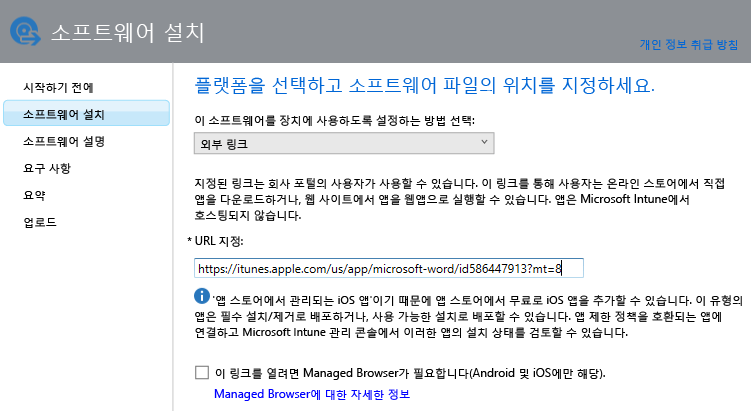

# Intune に登録されたデバイスのアプリを追加する

アプリを展開または管理する前に、Microsoft Intune に追加する必要があります。 このトピックでは、登録デバイスのアプリを追加する方法について説明します。

> [!IMPORTANT]
> このトピックの情報は、登録されているデバイスと登録されている Windows PC に展開するアプリを追加する際に役立ちます。 Intune クライアント ソフトウェアで管理する Windows PC のアプリを追加する場合は、「[Microsoft Intune で Windows PC のアプリを追加する](add-apps-for-windows-pcs-in-microsoft-intune.md)」を参照してください。

## アプリを追加する
次の手順に従って、Intune ソフトウェア パブリッシャーでアプリのプロパティを構成し、該当する場合はクラウド ストレージ領域にアップロードします。

1.  [Microsoft Intune 管理コンソール](https://manage.microsoft.com)で、**[アプリ]** &gt; **[アプリの追加]** の順に選択し、Intune ソフトウェア パブリッシャーを開始します。

    > [!TIP]
    > Intune Software Publisher を開始する前に、場合によっては、Intune のユーザー名とパスワードを入力する必要があります。

2.  ソフトウェア パブリッシャーの **[ソフトウェア セットアップ]** ページで、**[このソフトウェアをデバイスに配布する方法]** に、以下のいずれかのオプションを選択します。
    - アプリの拡張子が **.msi** または **.exe** の場合は、**[ソフトウェアのインストーラー]** を選択し、以下のオプションを設定します。
        - **ソフトウェアのインストーラー ファイルの種類** - 展開するソフトウェアの種類を示します。 たとえば、iOS アプリをインストールする場合、**App Package for iOS (&#42;.ipa ファイル)** を選択します。
        - **ソフトウェア セットアップ ファイルの場所の指定** - インストール ファイルの場所を入力するか、**[参照]** を選択して一覧から場所を選択します。
        - **追加のファイルおよび同じフォルダーのサブフォルダーを含める** - ファイルの種類が **Windows インストーラー**の場合のみ。 Windows インストーラーを使用する一部のソフトウェアは、通常、インストール ファイルと同じフォルダーにあるサポート ファイルを必要とします。 これらのファイルも展開する場合、このオプションを選択します。 このインストールの種類では、クラウド ストレージ領域がいくらか使用されます。

  -   アプリ ストアへのリンクを指定して作成するアプリの場合は、**[外部リンク]** を選択し、以下のオプションを設定します。

        - **URL を指定する** - 次のいずれかの URL を指定します。
            - 展開するアプリのアプリ ストア URL。 たとえば、Android 向けの Microsoft リモート デスクトップ アプリを展開する場合は、「**https://play.google.com/store/apps/details?id=com.microsoft.rdc.android**」と指定します。 アプリの URL を確認するには、検索エンジンを利用し、アプリが含まれるストア ページを探します。 たとえば、リモート デスクトップ アプリを検索するには、「**Microsoft Remote Desktop Android**」を検索します。
            - Web サイト。 このサイトへのショートカット アイコンが Intune によってデバイスに展開されます (Web クリップと呼ばれます)。
            - Web 上のアプリ。 このアプリへのショートカット アイコンが Intune によってデバイスに展開されます。
        - **このリンクを開くには Managed Browser が必要です (Android および iOS のみ)** - Web サイトまたは Web アプリへのリンクをユーザーに展開すると、ユーザーはデバイスにインストールする必要がある Intune Managed Browser でのみリンクを開くことができるようになります。 Managed Browser の詳細については、「[Microsoft Intune と Managed Browser のポリシーを使用したインターネット アクセスの管理](manage-internet-access-using-managed-browser-policies.md)」を参照してください。 このインストールの種類では、クラウド ストレージ領域を使用しません。

  -   MAM ポリシーで管理する iTunes ストアの無料アプリの場合は、**[アプリ ストアの管理されている iOS アプリ]** を選択し、以下のオプションを設定します。

        - **URL を指定する** - 展開するアプリのアプリ ストア URL を入力します。 たとえば、iOS 向けの Microsoft ワーク フォルダー アプリを展開する場合、「**https://itunes.apple.com/us/app/work-folders/id950878067?mt=8**」と指定します。 このインストールの種類では、クラウド ストレージ領域を使用しません。

        たとえば、Microsoft Word アプリを iTunes ストアからデバイスに展開する場合は、次のようになります。
        
        

3.  **[ソフトウェアの説明]** ページで、次を構成します。

    > [!TIP]
    > 使用するインストーラーの種類にもよりますが、これらの値の一部は自動的に入力されることもあれば、表示されないこともあります。

    - **発行元** - アプリの発行元の名前を入力します。
    - **名前** - アプリの名前を入力します。この名前は会社のポータルに表示されます。 使用するアプリ名はすべて一意にします。 同じアプリ名が 2 つ存在する場合、会社のポータルではそのいずれかのみがユーザーに表示されます。
    - **説明** - アプリの説明を入力します。 これは会社のポータルでユーザーに表示されます。
    - **ソフトウェア情報の URL** - **[ソフトウェアのインストーラー]** を選択した場合にのみ使用できます。 このアプリに関する情報が含まれる Web サイトの URL を入力することもできます。 この URL は会社のポータルでユーザーに表示されます。
    - **プライバシー URL** - **[ソフトウェアのインストーラー]** を選択した場合にのみ使用できます。 このアプリのプライバシー情報が含まれる Web サイトの URL を入力することもできます。 この URL は会社のポータルでユーザーに表示されます。
    - **カテゴリ** - (省略可能) いずれかの組み込みアプリ カテゴリを選択します。 会社のポータルを閲覧するとき、ユーザーにとってアプリを探すのが簡単になります。
    - **このアプリケーションを会社ポータルでおすすめアプリケーションとして強調表示する** - ユーザーがアプリを探す際に、会社のポータルのメイン ページでアプリを目立つように表示します。
    - **アイコン** - (省略可能) アプリに関連付けるアイコンをアップロードします。 ユーザーが会社のポータルを参照するとき、アプリにこのアイコンが表示されます。

        この例では、iOS 用の Microsoft Word アプリの説明を構成しています。

        ![[ソフトウェアの説明] の例](./media/ios-software-description.png)

4.  **[要件]** ページで、アプリをデバイスにインストールする前に満たす必要がある要件を選択します。 たとえば、iOS のアプリ パッケージに対して、必要な iOS の最小バージョンと、iPhone や iPad など、デバイスの種類を選択できます。

    > [!TIP]
    > アプリの種類によっては **[要件]** ページは表示されません。

5.  **Windows インストーラー** ファイルの種類を選択すると、ウィザード ページがさらに表示されます。 このファイルの種類は、Intune に登録され、Windows 10 以降を実行している PC にソフトウェアを展開するときに使用されます。

6.  **[概要]** ページで、指定した情報を確認します。 準備ができたら、**[アップロード]** を選択します。

7.  **[閉じる]** を選択して完了します。

アプリは **[アプリ]** ワークスペースの **[アプリ]** ノードに表示されます。

## 例

### Windows 10 デバイスへの MSI アプリケーションの展開
この 4 分間のビデオでは、Windows 10 を実行している登録済みのデバイスに Microsoft インストーラー (msi) アプリケーションを展開する方法について説明します。  

<iframe src="https://channel9.msdn.com/Series/How-to-Control-the-Uncontrolled/6--How-to-Deploy-MSI-Applications-to-Windows-10-Using-Intune-and-Mobile-Device-Management-MDM/player" width="640" height="360" allowFullScreen frameBorder="0"></iframe>

## 次のステップ

アプリを作成したら、次はアプリを展開します。 詳細については、「[Deploy apps in Microsoft Intune](deploy-apps.md)」 (Microsoft Intune でアプリを展開する) を参照してください。

<!--HONumber=Jul16_HO2-->

