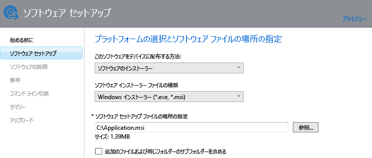

# Microsoft Intune で Windows PC のアプリを追加する

このトピックでは、アプリを展開する前に、それらのアプリを Intune に追加する方法について説明します。

> [!IMPORTANT]
> このトピックの情報は、Intune PC クライアント ソフトウェアで管理する Windows PC のアプリを追加する際に役立ちます。 登録済みの Windows PC やその他のモバイル デバイスにアプリを追加する場合は、「[Microsoft Intune でモバイル デバイスのアプリを追加する](add-apps-for-mobile-devices-in-microsoft-intune.md)」を参照してください。

## アプリを追加する
次の手順に従って、Intune ソフトウェア パブリッシャーでアプリのプロパティを構成し、クラウド ストレージ領域にアップロードします。

1.  [Microsoft Intune 管理コンソール](https://manage.microsoft.com)で、**[アプリ]** &gt; **[アプリの追加]** の順に選択し、Intune ソフトウェア パブリッシャーを開始します。

    > [!TIP]
    > Intune Software Publisher を開始する前に、場合によっては、Intune のユーザー名とパスワードを入力する必要があります。

2.  Intune ソフトウェア パブリッシャーの **[ソフトウェア セットアップ]** ページで、次を構成します。

    **このソフトウェアをデバイスに配布する方法** - **[ソフトウェア インストーラー]** を選択し、次を指定します。

    - **ソフトウェアのインストーラー ファイルの種類** - 展開するソフトウェアの種類を示します。 Windows PC の場合、**[Windows インストーラー]** を選択します。
    - **ソフトウェア セットアップ ファイルの場所の指定** - インストール ファイルの場所を入力するか、**[参照]** を選択して一覧から場所を選択します。
    - **追加のファイルおよび同じフォルダーのサブフォルダーを含める** - Windows インストーラーを使用する一部のソフトウェアは、通常、インストール ファイルと同じフォルダーにあるサポート ファイルを必要とします。 これらのサポート ファイルも展開する場合、このオプションを選択します。

    たとえば、Intune に Application.msi という名前のアプリを発行する場合は、次のようになります。

   このインストールの種類では、クラウド ストレージ領域がいくらか使用されます。

3.  **[ソフトウェアの説明]** ページで、次を構成します。

    使用するインストーラー ファイルにもよりますが、これらの値の一部は自動的に入力されることもあれば、表示されないこともあります。

    - **発行元** - アプリの発行元の名前を入力します。
    - **名前** - アプリの名前を入力します。この名前は会社のポータルに表示されます。  使用するアプリ名はすべて一意にします。 同じアプリ名が 2 つ存在する場合、会社のポータルではそのいずれかのみがユーザーに表示されます。
    - **説明** - アプリの説明を入力します。 これは会社のポータルでユーザーに表示されます。
    - **ソフトウェア情報の URL** - (省略可能) このアプリに関する情報が含まれる Web サイトの URL を入力します。 この URL は会社のポータルでユーザーに表示されます。
    - **プライバシー URL** - (省略可能) このアプリのプライバシー情報が含まれる Web サイトの URL を入力します。 この URL は会社のポータルでユーザーに表示されます。
    - **カテゴリ** - (省略可能) いずれかの組み込みアプリ カテゴリを選択します。 会社のポータルを閲覧するとき、ユーザーにとってアプリを探すのが簡単になります。
    - **アイコン** - (省略可能) アプリに関連付けるアイコンをアップロードします。 ユーザーが会社のポータルを参照するとき、アプリにこのアイコンが表示されます。

4.  **[要件]** ページで、アプリをデバイスにインストールする前に満たす必要がある要件を次から選択します。 **[アーキテクチャ]** では、32 ビット、64 ビット、または両方のオペレーティング システムにアプリをインストールできるかどうかを選択します。**[オペレーティング システム]** では、このアプリをインストール可能な最小のオペレーティング システムを選択します。

5.  **[検出規則]** ページで、構成しているアプリが PC に既にインストールされているかどうかを検出する規則を構成できます。あるいは、既定の検出規則を利用し、前にインストールされたバージョンのアプリを自動的に上書きできます。 このオプションは、Windows インストーラー (.exe ファイルのみ) 用です。
6.  
    構成可能な規則は次のようになります。
    - **ファイルが存在します** - 検出するファイルのパスを指定します。 PC の **%ProgramFiles%** を検索するか (**Program Files**\*&lt;path&gt;* と **Program Files (x86)**\*&lt;path&gt;* が検索されます)、または **%SystemDrive%** を検索します (PC のルート ドライブ、通常は C: から検索します)。
    - **MSI 製品コードが存在しています** - **[参照]** を選択し、検索する Windows インストーラー (msi) ファイルを選択します。 
    - **レジストリ キーが存在しています** - **HKEY_LOCAL_MACHINE\** で始まるレジストリ キーを指定します。 32 ビットと 64 ビットの両方のレジストリ パスが検索されます。 指定したキーがいずれかの場所に存在する場合、検出規則が満たされます。

    構成した規則のいずれかをアプリが満たすと、それはインストールされません。

7.  **Windows インストーラー** ファイルの種類のみ (msi と exe): **[コマンド ライン引数]** ページで、インストーラーの任意のコマンドライン引数を指定するかどうかを選択します。 たとえば、一部のインストーラーでは、引数 **/q** がサポートされ、ユーザーの介入なしにサイレント インストールを実行します。

8.  **Windows インストーラー** ファイルの種類のみ (exe のみ): **[リターン コード]** ページで、アプリが管理対象 Windows PC にインストールされるときに Intune で解釈される新しいエラー コードを追加できます。
    既定では、Intune は業界標準のリターン コードを使用して、アプリ パッケージが正常にインストールされたかどうかを示します (**0** - 成功。**3010** - 成功 (再起動が必要))。 この一覧に独自のリターン コードを追加することもできます。 リターン コードの一覧を指定し、アプリ インストールで一覧にないコードが返された場合、それはエラーとして解釈されます。

9.  **[概要]** ページで、指定した情報を確認します。 準備ができたら、**[アップロード]** を選択します。

10. **[閉じる]** を選択して完了します。

アプリは **[アプリ]** ワークスペースの **[アプリ]** ノードに表示されます。

## 次のステップ

アプリを作成したら、次はアプリを展開します。 詳細については、「[Deploy apps in Microsoft Intune](deploy-apps.md)」 (Microsoft Intune でアプリを展開する) を参照してください。

<!--HONumber=Jun16_HO4-->

