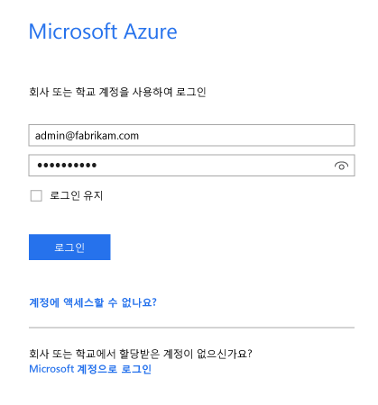
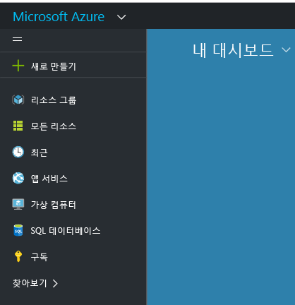
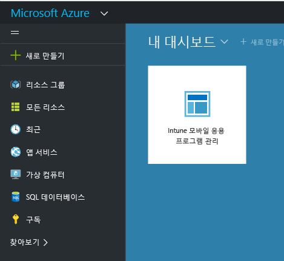

# Azure ポータルの Microsoft Intune MAM ポリシー対応
## Azure ポータルへのアクセス
**Azure ポータル**では、モバイル アプリ管理ポリシーを作成して管理できます。

Azure ポータルでは、次の MAM ポリシーの作成をサポートしています。
- **Intune で登録および管理されている**デバイスで実行中のアプリ
- どの MDM ソリューションにも**登録していない**デバイスで実行中のアプリ
- **サード パーティの MDM ソリューションに登録済み**のデバイスで実行中のアプリ

現在 **Intune 管理コンソール**を使用してデバイスを管理している場合は、Intune に登録済みのデバイスのアプリをサポートする MAM ポリシーを [Intune 管理コンソール](configure-and-deploy-mobile-application-management-policies-in-the-microsoft-intune-console.md)を使用して作成できます。
>[!IMPORTANT]
> Intune 管理コンソールでは、MAM ポリシー設定の一部が表示されない可能性があります。 Azure ポータルは MAM ポリシーを作成するための新しい管理コンソールです。Intune 管理コンソールと Azure ポータルの両方で MAM ポリシーを作成した場合、Azure ポータルのポリシーがアプリに適用され、ユーザーに展開されます。

## Azure ポータルにログインし、スタート ページをカスタマイズする

1.  [Azure ポータル](https://portal.azure.com)に移動し、[!INCLUDE[wit_nextref](../includes/wit_nextref_md.md)] 資格情報でサインインします。

    

2.  正常にサインインすると、**ダッシュボード**が開きます。 **ダッシュボード** ページには、既定のタイルのセットが用意されています。これらのタイルを削除したり新しいタイルを追加したりして、ページをカスタマイズできます。

    

3.  **[参照]** メニューで、**[Intune]** を探します。![[Intune] が強調表示されている [参照] メニューのスクリーンショット](../media/AppManagement/AzurePortal_MAM_Browse_Intune.png)

4.  **[Intune]、[Intune モバイル アプリケーション管理]、[設定]** の順にクリックします。

    ![[Intune モバイル アプリケーション管理] ブレードのスクリーンショット](../media/AppManagement/AzurePortal_MAM_Mainblade.png)

    > [!TIP]
    > ブレードを **[開始]** ページにピン留めするには、ブレードの **[ピン留め]** オプションを使用できます。   **[Intune モバイル アプリケーション管理ブレード]**のピン アイコンをクリックして、これを **[開始]** ページにピン留めします。

    ![ピン アイコンが強調表示されている [Intune モバイル アプリケーション管理] ブレードのスクリーンショット](../media/AppManagement/AzurePortal_MAM_PinBladeAction.png)

    
## 次のステップ
[Get ready to configure mobile app management policies (モバイル アプリ管理ポリシーの展開)](get-ready-to-configure-mobile-app-management-policies-with-microsoft-intune.md)

<!--HONumber=Jun16_HO4-->

