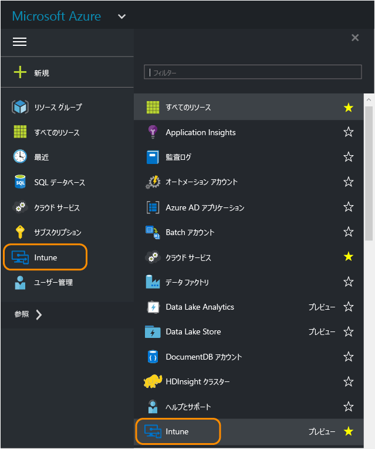
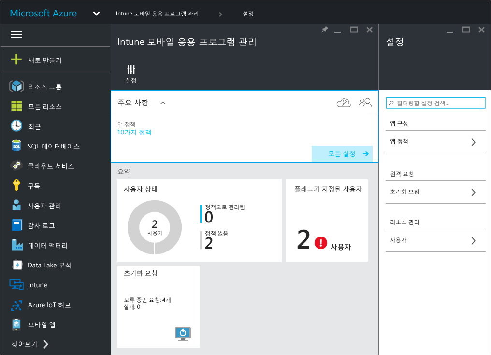
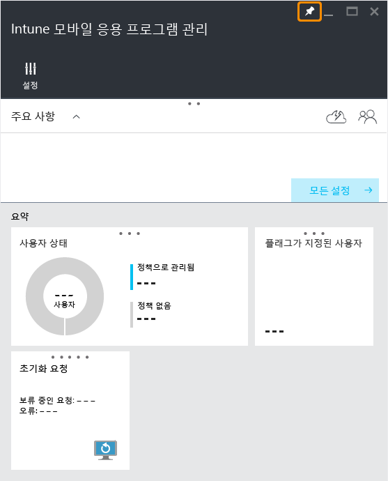

# Microsoft Intune MAM 정책용 Azure 포털
## Azure 포털에 액세스
**Azure 포털**을 사용하면 모바일 앱 관리 정책을 만들고 관리할 수 있습니다.

Azure 포털은 다음의 경우 MAM 정책을 만들도록 지원합니다.
- 장치에서 실행되는 앱 중에서 **Intune에서 등록하고 관리하는** 앱.
- 장치에서 실행되는 앱을 모든 MDM 솔루션에 **등록하지 않음**.
- 장치에서 실행되는 앱 중에서 **타사 MDM 솔루션에 등록된 앱**.

>[!IMPORTANT]

> 현재 [Intune 관리 콘솔](configure-and-deploy-mobile-application-management-policies-in-the-microsoft-intune-console.md)을 사용하여 장치를 관리하는 경우 Intune 관리 콘솔을 사용하여 Intune에 등록된 장치의 앱을 지원하는 MAM 정책을 만들 수 있습니다.

> Intune 관리 콘솔에서 모든 MAM 정책 설정이 나타나지 않을 수 있습니다. Azure 포털은 MAM 정책을 만들 수 있는 새로운 관리 콘솔입니다. Intune 관리 콘솔과 Azure 포털 모두에서 MAM 정책을 만드는 경우 Azure 포털의 정책이 앱에 적용되며 사용자에게 배포됩니다.

## Azure 포털에 로그인하고 시작 페이지를 사용자 지정합니다.

1.  [Azure 포털](https://portal.azure.com)로 이동한 다음 [!INCLUDE[wit_nextref](../includes/wit_nextref_md.md)] 자격 증명을 사용하여 로그인합니다.

    

2.  성공적으로 로그인하면 **대시보드**가 표시됩니다. **대시보드** 페이지에는 페이지를 사용자 지정하기 위해 제거하고 새로 추가할 수 있는 기본 타일 집합이 제공됩니다.

    

3.  **찾아보기** 메뉴에서 **Intune**을 찾습니다.

4.  **Intune > Intune 모바일 응용 프로그램 관리 > 설정**을 클릭합니다.

    

    > [!TIP]
    >  **시작** 페이지에 블레이드를 고정하려면 블레이드의 **고정** 옵션을 사용합니다.   **Intune 모바일 응용 프로그램 관리 블레이드**의 고정 아이콘을 클릭하여 **시작** 페이지에 고정합니다.

    

    
## 다음 단계
[모바일 앱 관리 정책 구성 준비](get-ready-to-configure-mobile-app-management-policies-with-microsoft-intune.md)

<!--HONumber=Jul16_HO3-->

