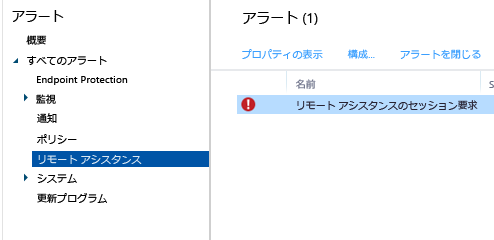

# Microsoft Intune コンピューター クライアントを使用した一般的な Windows PC 管理タスク
このトピックのタスクを参照して、Intune PC クライアント ソフトウェアを実行するコンピューターを管理する方法を確認してください。 まだクライアントをコンピューターにインストールしていない場合は、「[Microsoft Intune を使用して Windows PC クライアントをインストールする](install-the-windows-pc-client-with-microsoft-intune.md)」を参照してください。

## ポリシーを使用して PC 管理を簡略化する
### Windows ファイアウォールの管理
ポリシーを使用すると、管理対象コンピューターの Windows ファイアウォール設定の管理が簡単になります。 詳細については、「[Microsoft Intune で Windows ファイアウォール ポリシーを使用して Windows PC を保護する](help-protect-windows-pcs-using-windows-firewall-policies-in-microsoft-intune.md)」を参照してください。

### Microsoft Intune Center の管理
Microsoft Intune Center を使用してユーザーは次の操作を実行できます。

-   ポータル サイトからアプリケーションを取得する。

-   更新プログラムを確認する。

-   Microsoft Intune Endpoint Protection を管理する。

-  リモート アシスタンスを要求する。

Microsoft Intune Center は、管理されているすべてコンピューターにインストールされます。 Intune ポリシーで次の設定を構成でき、各設定は Microsoft Intune Center でユーザーに表示されます。

|ポリシー設定|説明|
|------------------|--------------------|
|**名前**|コンピューターを管理する管理者の名前。  最大文字数:40 字|
|**電話番号**|コンピューターを管理する管理者の電話番号。  最大文字数:20 字|
|**電子メール アドレス**|コンピューターを管理する管理者の電子メール アドレス。  最大文字数:40 字|
|**Web サイト名**|ユーザー向けのサポート Web サイトの名前。  最大文字数:40 字|
|**Web サイトの URL**|サポート Web サイトの URL。  最大文字数:150 字|
|**注**|ユーザーに表示されるメモ。  最大文字数:120 字|

### ソフトウェア更新設定の管理
ポリシーを使用して、管理対象コンピューターが Microsoft やサード パーティのソフトウェアの更新プログラムをチェックしたり、ダウンロードするときに使用する設定を構成します。 詳細については、「[Microsoft Intune でソフトウェア更新プログラムを使用して Windows PC を最新の状態に保つ](keep-windows-pcs-up-to-date-with-software-updates-in-microsoft-intune.md)」を参照してください。

### Endpoint Protection 設定の管理
ポリシーを使用して、Endpoint Protection の設定を構成し、管理対象コンピューターに展開します。 これには、スキャンのスケジュール、マルウェアを検出したときの操作などが含まれます。 詳細については、「[Microsoft Intune の Endpoint Protection を使用して Windows PC を保護する](help-secure-windows-pcs-with-endpoint-protection-for-microsoft-intune.md)」を参照してください。

## ハードウェアとソフトウェアのインベントリを表示する
Intune は、管理されたコンピューターのハードウェアおよびソフトウェアに関する詳細情報を収集します。 以下の手順を参照して、次の項目を作成する方法を確認してください:

-   コンピューターのハードウェア性能に関する情報を一覧にしたレポート。

-   各コンピューターにインストールされているソフトウェアを一覧にしたレポート。

-   コンピューターのインベントリを更新して、レポートのデータを最新の状態に保つ方法。

### コンピューターに関する情報を表示するには

1.  [Microsoft Intune 管理コンソール](https://manage.microsoft.com/)で、**[レポート]** &gt; **[コンピューター インベントリ レポート]** を選択します。

2.   **[新しいレポートの作成]** ページで、既定値をそのまま使用するか、カスタマイズして、レポートで返される結果をフィルター処理します。 たとえば、Windows 8.1 を実行するコンピューターだけをレポートに表示するように選択できます。

3.  **[レポートの表示]** を選択すると、**[コンピューター インベントリ レポート]** が新しいウィンドウで開きます。

    レポートは、列見出し (**[名前]**、**[シャーシの種類]**、**[製造元]** など) を選択して並べ替えることができます。

### コンピューターにインストールされているソフトウェアを表示するには

1.  [Microsoft Intune 管理コンソール](https://manage.microsoft.com/)で、**[レポート]** &gt; **[検出されたソフトウェアのレポート]** を選択します。

2.   **[新しいレポートの作成]** ページで、既定値をそのまま使用するか、カスタマイズして、レポートで返される結果をフィルター処理します。 たとえば、Microsoft が発行したソフトウェアだけをレポートに表示するように選択できます。

3.  **[レポートの表示]** を選択すると、**[検出されたソフトウェアのレポート]** が新しいウィンドウで開きます。

    レポートは、列見出し (**[名前]**、**[発行元]**、**[カテゴリ]** など) を選択して並べ替えることができます。 一覧の項目に付いている矢印を選択すると、一覧が展開して、更新プログラムの詳細 (更新プログラムがインストールされているコンピューターなど) が表示されます。

### コンピューターのインベントリを更新して最新の状態に保つには

1.  [Microsoft Intune 管理コンソール](https://manage.microsoft.com/)で、**[グループ]** &gt; **[すべてのデバイス]** (または、インベントリを更新するコンピューターが含まれる別のグループ) を選択します。

2.  コンピューターを 1 台選択するか、 **Ctrl** キーを押しながら複数選択します。

3.  タスク バーで、**[リモート タスク]** &gt; **[インベントリの更新]** を選択します。

4.  タスクの状態を表示するには、ページの右下隅にある **[リモート タスク]** を選択します。

    **[タスクの状態]** ダイアログ ボックスが開き、現在のリモート タスク、タスクの状態、デバイス名、発生したエラーと、該当する場合は、トラブルシューティング情報へのリンクが表示されます。

## Windows PC をリモートで再起動する

1.  [Microsoft Intune 管理コンソール](https://manage.microsoft.com/)で、**[グループ]** &gt; **[すべてのデバイス]** (または、再起動するコンピューターが含まれる別のグループ) を選択します。

2.  1 つまたは複数のコンピューターを選択し、**[リモート タスク]** &gt; **[コンピューターの再起動]** を選択します。

3.  タスクの状態を表示するには、ページの右下隅にある **[リモート タスク]** を選択します。

4.  **[タスクの状態]** ダイアログ ボックスで、現在のリモート タスク、タスクの状態、デバイス名、発生したエラーを確認します。

## コンピューターをインベントリから削除する

1.  [Microsoft Intune 管理コンソール](https://manage.microsoft.com/)で、**[グループ]** &gt; **[すべてのデバイス]** (または、削除するコンピューターが含まれる別のグループ) を選択します。

2.  削除するデバイスを選択し、**[インベントリからの削除/ワイプ]** を選択します。

コンピューターを Intune に再登録する場合は、「[Microsoft Intune を使用して Windows PC クライアントをインストールする](install-the-windows-pc-client-with-microsoft-intune.md)」の情報を参照して、そのコンピューターにクライアント ソフトウェアを再度インストールしてください。

コンピューターが Intune に接続できない場合、**[ダッシュボード]** ワークスペースにメッセージが表示されます。

コンピューターを削除した場合:

-   コンピューターは Intune の管理とインベントリから削除され、そのコンピューターに関連付けられていたライセンスは再利用できます。 削除/ワイプを行うと、コンピューターからは Intune ソフトウェア クライアントは削除されますが、アプリまたはデータは削除されません。

-   そのコンピューターの状態は、Intune コンソールに表示されなくなります。

-   Intune によって、コンピューターからクライアント ソフトウェアが削除されます。 コンピューターが Intune サービスに接続していない場合、クライアント ソフトウェアは、次に接続したときに削除されます。

-   コンピューターから Microsoft Intune Endpoint Protection が削除されます。 コンピューターに他のエンドポイント保護アプリケーションがインストールされ、無効になっている場合は、Microsoft Intune Endpoint Protection が削除された後で、そのアプリケーションを再び有効にして、コンピューターを保護できます。

-   すべてのポリシーがコンピューターから削除され、ポリシーによって設定された値は変更されます。

-   コンピューターは、ソフトウェアの更新プログラムや、マルウェアの定義の更新を Intune サービスから受信しなくなります。

-   コンピューターがどのように構成されているかによって異なりますが、Windows Server Update Services、Windows Update、または Microsoft Update を使用して、引き続き更新プログラムを受信できます。

    > [!IMPORTANT]
    > クライアント ソフトウェアがグループ ポリシー オブジェクト (GPO) を使用してインストールされている場合、ソフトウェアが再インストールされることを防ぐため、クライアント ソフトウェアを削除する前に、グループ ポリシー オブジェクト (GPO) を削除する必要があります。

    クライアントのアンインストールに失敗する場合は、「[Endpoint Protection に関するトラブルシューティング](/intune/troubleshoot/troubleshoot-endpoint-protection-in-microsoft-intune)」で詳細を確認してください。

## ユーザー デバイスの関連付けを管理する
ユーザーにソフトウェアを展開する前に、ユーザーをコンピューターに関連付ける必要があります。 1 人のユーザーを複数のコンピューターに関連付けることができますが、1 台のコンピューターに関連付けられるユーザーは 1 人だけです。 ユーザーは、ポータル サイトを使用して Intune で登録したすべてのコンピューターに自動的に関連付けられます。

### コンピューターにユーザーを関連付けるには

1.  [Microsoft Intune 管理コンソール](https://manage.microsoft.com/)で、**[グループ]** &gt; **[すべてのデバイス]** (または、ユーザーに関連付けるコンピューターが含まれる別のグループ) を選択します。

2.  ユーザーを関連付けるコンピューターを選択して、**[ユーザーの関連付け]** を選択します。

    **[ユーザーの関連付け]** ダイアログ ボックスには、関連付けることができるユーザーの表示名とユーザー ID、および現在関連付けられているコンピューターの台数が表示されます。 選択したコンピューターに既にユーザーが関連付けられている場合は、そのユーザーの名前とユーザー ID が **[現在のユーザー]**の下に表示されます。 コンピューターがどのユーザーにも関連付けられていない場合、 **[現在のユーザー]** の下に **"ユーザーなし"**と表示されます。

3.  以下のいずれかを実行します。

    -   コンピューターと現在のユーザーの関連付けをそのままにするには、**[キャンセル]** を選択します。

    -   現在のユーザーとの関連付けを削除する (存在する場合) には、**[リンクの削除]** &gt; **[OK]** を選択します。

    -   コンピューターを新しいユーザーに関連付けるには、 **[すべてのユーザー]** の一覧からユーザーを選択します。 選択したユーザーのデータが正しいことを確認して、**[OK]** を選択します。

> [!TIP]
> エンド ユーザーが各自のコンピューターに関連付けをするのを抑制する場合は、**Microsoft Intune エージェントの設定**ポリシーの **[ユーザーによる各自のコンピューターへの関連付けを制限する]** オプションを有効にします。

## Intune クライアント ソフトウェアを使用する Windows PC のリモート アシスタンスの要求と提供

Microsoft Intune では [TeamViewer](https://www.teamviewer.com) ソフトウェアを利用し、Intune クライアント ソフトウェアを実行する PC のユーザーがリモート アシスタンス ヘルプを受けられるようにします。 ユーザーが Microsoft Intune Center のヘルプを要求すると、通知が届きます。要求を承諾し、アシスタンスを提供できます。
この機能は Intune の既存の Windows リモート アシスタンス機能に換わるものです。

### アップグレードを開始する前に

リモート アシスタンス要求の確立または応答を開始する前に、次の前提条件が満たされていることを確認する必要があります。

- TeamViewer Web サイトにログインするために、[TeamViewer アカウントにサインアップ](https://login.teamviewer.com/LogOn#register)している必要があります。
- 管理する Windows PC を [Windows PC クライアントで管理](manage-windows-pcs-with-microsoft-intune.md)する必要があります。
- Intune でサポートされているすべての Windows PC オペレーティング システムを管理できます。

### TeamViewer Connector を構成する

1. [Microsoft Intune 管理コンソール](https://manage.microsoft.com)で、**[管理者]** を選択します。
2. **[管理者]** ワークスペースで、**[TeamViewer]** を選択します。
3. **[TeamViewer]** ページの **[TeamViewer Connector]** で、**[有効化]** を選択します。
4. **[TeamViewer の有効化]** ダイアログ ボックスで、ライセンス条項を **[承諾]** します。 TeamViewer ライセンスをまだ所有していない場合、**[TeamViewer ライセンスの購入]** を選択します。
5. TeamViewer ブラウザー ウィンドウが開いたら、TeamViewer 資格情報でサイトにサインインします。
6. TeamViewer サイトで、Intune で TeamViewer に接続するためのオプションを読み、承諾します。
7. Intune コンソールで、**[TeamViewer Connector]** アイテムに **[有効]** が表示されていることを確認します。

### リモート アシスタンス要求を登録する (エンド ユーザー)

1. クライアント Windows PC で、**[Microsoft Intune Center]** を開きます。
2. **[リモート アシスタンス]** で、**[リモート アシスタンスの要求]** を選択します。
3. 要求を承認すると (下図参照)、クライアントで TeamViewer が開きます。 Web ブラウザーが TeamViewer アプリケーションを開こうとしているというメッセージが表示されたら、ユーザーはそれを承諾する必要があります。
4. ユーザーには、管理者がユーザーの PC を操作してよいのか尋ねるメッセージが表示されます。 続行するには、ユーザーはメッセージを承諾する必要があります。
5. リモート アシスタンス セッション中、管理者が接続されていることを示すウィンドウがユーザーに表示されます。 ユーザーがこのウィンドウを閉じると、リモート セッションが終了します。

### リモート アシスタンス要求に応答する

1. ユーザーがリモート アシスタンス要求を送信すると、**[アラート]** ワークスペースの **[管理]**  >  **[リモート アシスタンス]** に要求が表示されます。 たとえば、
> 

 未応答のまま 4 時間以上経過すると、要求は削除されます。
2. 要求を承諾するには、**[要求を承認してリモート アシスタンスを開始する]** を選択します。
3. **[リモート アシスタンスの新しい要求が保留中]** ダイアログ ボックスで、**[リモート アシスタンスの要求を受け入れる]** を選択します。 まだインストールされていない場合、TeamViewer はコンピューターに必要なアプリをインストールします。
4. TeamViewer は、管理者がエンド ユーザーの PC を操作することをエンド ユーザーに通知します。 ユーザーがこの要求を承諾すると、TeamViewer ウィンドウが開き、管理者は PC を操作できます。

リモート アシスタンス セッション中、リモート PC を操作するためのあらゆる TeamViewer コマンドを使用できます。 コマンドの詳細については、TeamViewer Web サイトから [[リモート コントロールのマニュアル]](http://www.teamviewer.com/en/support/documents/) をダウンロードしてください。

### リモート アシスタンス セッションを閉じる

**[TeamViewer]** ウィンドウの **[アクション]** メニューから **[セッションの終了]** を選択します。

<!--HONumber=Aug16_HO1-->

