---
# required metadata

title: MAM 정책 만들기 및 배포 | Microsoft Intune
description:
keywords:
author: karthikaraman
manager: jeffgilb
ms.date: 04/28/2016
ms.topic: article
ms.prod:
ms.service: microsoft-intune
ms.technology:
ms.assetid: c1b9a343-1737-4a65-a9c6-aca48acad11c

# optional metadata

#ROBOTS:
#audience:
#ms.devlang:
ms.reviewer: joglocke
ms.suite: ems
#ms.tgt_pltfrm:
#ms.custom:

---

# Microsoft Intune으로 모바일 앱 관리 정책 만들기 및 배포
MAM(모바일 앱 관리) 정책은 Intune에서 관리하거나 관리하지 않을 수 있는 장치에서 실행되는 앱에 적용할 수 있습니다. MAM 정책이 작동하는 방법 및 Intune MAM 정책에서 지원하는 시나리오의 자세한 설명은 [모바일 앱 관리 정책을 사용하여 앱 데이터 보호](protect-app-data-using-mobile-app-management-policies-with-microsoft-intune.md) 항목을 참고합니다.

이 항목에서는 **Azure 포털**에서 MAM 정책을 만드는 과정을 설명합니다. Azure 포털은 MAM 정책을 만들 수 있는 새로운 관리 콘솔입니다. 이 포털을 사용하여 MAM 정책을 만드는 것이 좋습니다. Azure 포털에서는 다음 MAM 시나리오를 지원합니다.
- Intune에서 등록된 장치
- 타사 MDM 솔루션에서 관리되는 장치
- MDM 솔루션(BYOD)에서 관리되지 않는 장치

현재 **Intune 관리 콘솔**을 사용하여 장치를 관리하는 경우 [Intune 관리 콘솔](configure-and-deploy-mobile-application-management-policies-in-the-microsoft-intune-console.md)을 사용하여 Intune에 등록된 장치의 앱을 지원하는 MAM 정책을 만들 수 있습니다.
>[!IMPORTANT]
> Intune 관리 콘솔에서 모든 MAM 정책 설정이 나타나지 않을 수 있습니다. Azure 포털은 MAM 정책을 만들기 위한 새 관리 콘솔입니다. Intune 관리 콘솔과 Azure 포털 둘 다에서 MAM 정책을 만들 경우 Azure 포털의 정책이 앱에 적용되며 사용자에게 배포됩니다.

Android 및 iOS 플랫폼에 지원되는 정책 설정의 목록을 보려면 다음 중 하나를 선택합니다.

> [!div class="op_single_selector"]
- [iOS 정책](ios-mam-policy-settings.md)
- [Android 정책](android-mam-policy-settings.md)

##  MAM 정책 만들기
MAM 정책을 만들기 전에 [필수 구성 요소 및 지원](get-ready-to-configure-mobile-app-management-policies-with-microsoft-intune.md) 정보를 검토합니다.
1.  **Intune 모바일 응용 프로그램 관리 &gt; 설정**을 선택하여 **설정** 블레이드를 엽니다.

    

    > [!TIP] 처음으로 Azure 포털을 사용하는 경우 먼저 [Azure portal for Microsoft Intune MAM policies](azure-portal-for-microsoft-intune-mam-policies.md)(Microsoft Intune MAM 정책용 Azure 포털) 항목을 읽어 포털에 대해 알아보세요.

2.  **설정** 블레이드에서 **앱 정책**을 선택합니다.   **앱 정책** 블레이드가 열리며, 여기서 새 정책을 만들고 기존 정책을 편집합니다.

    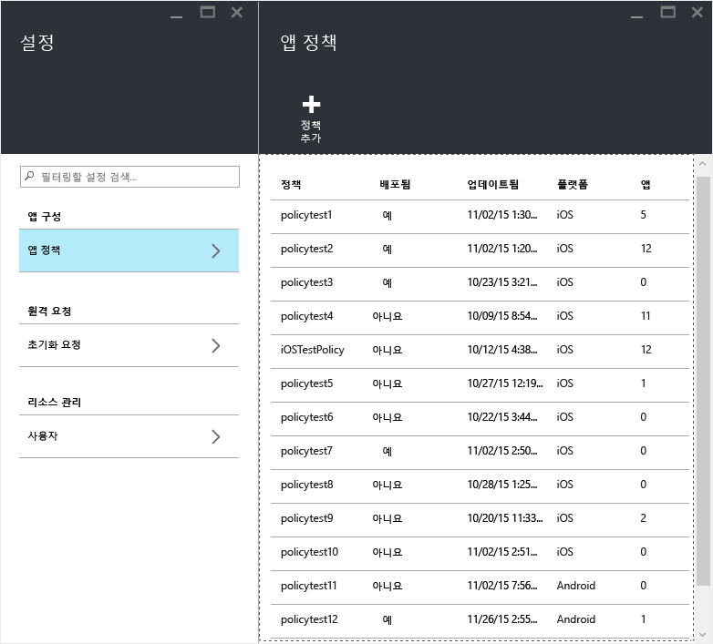

3.  **정책 추가**를 선택합니다.

    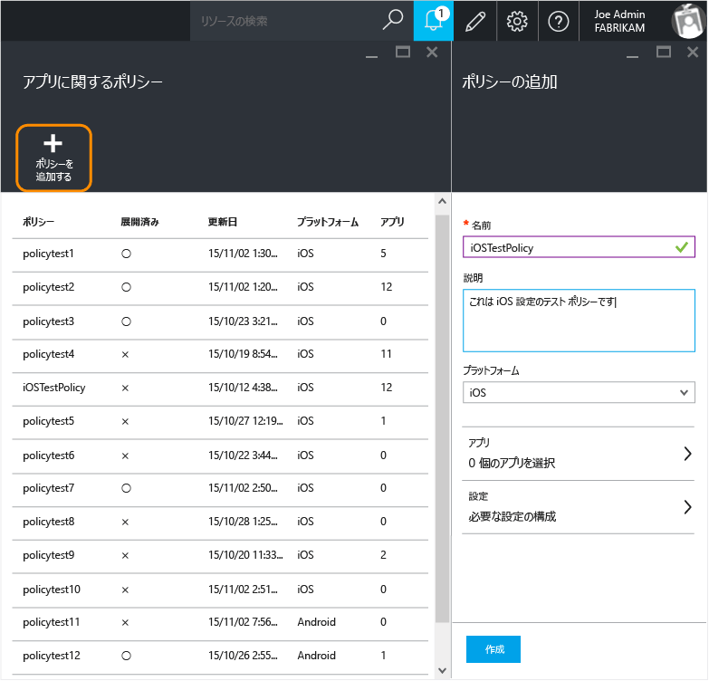

4.  정책의 이름을 입력하고, 간략한 설명을 추가한 다음 플랫폼 형식을 선택하여 iOS 또는 Android에 대한 정책을 만듭니다.  각 플랫폼에 대해 여러 개의 정책을 만들 수 있습니다.

    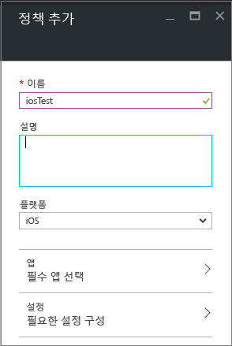

5.  **앱**을 선택하여 **앱 블레이드**를 열면 사용할 수 있는 앱 목록이 표시됩니다. 만들고 있는 정책과 연결할 앱을 목록에서 하나 이상 선택할 수 있습니다. 앱을 선택한 후 **앱** 블레이드 맨 아래에 있는 **선택** 단추를 선택하여 선택 내용을 저장합니다.

    > [!IMPORTANT] 정책을 만들려면 앱을 하나 이상 선택해야 합니다.

6.  **정책 추가 블레이드**에서 **필요한 설정 구성** 을 선택하여 정책 설정 블레이드를 엽니다.

    **데이터 재배치** 및 **액세스**라는 두 범주의 정책 설정이 있습니다.  데이터 재배치 정책은 앱 내부 및 외부로 데이터 이동에 적용할 수 있는 반면, 액세스 정책은 최종 사용자가 회사 컨텍스트에서 앱에 액세스하는 방법을 결정합니다.
    정책 설정에는 기본값이 있습니다.  이 기본값이 요구 사항을 충족하는 경우에는 변경할 필요가 없습니다.

    > [!TIP]
    > 이러한 정책 설정은 회사 컨텍스트에서 앱을 사용하는 경우에만 적용됩니다.  최종 사용자가 앱을 사용하여 개인 작업을 수행하는 경우에는 이러한 정책의 영향을 받지 않습니다.

    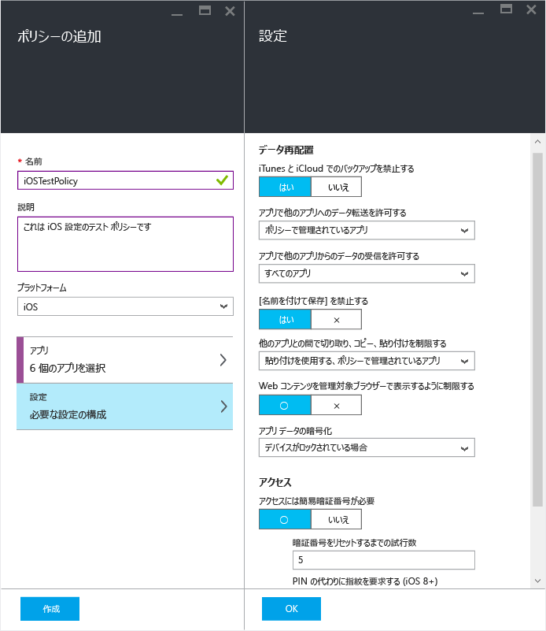

7.  **확인**을 선택하여 이 구성을 저장합니다.  이제 **정책 추가** 블레이드로 돌아왔습니다. **만들기**를 클릭하여 정책을 만들고 설정을 저장합니다.

    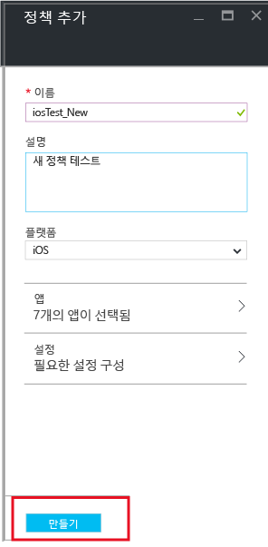

    

이전 절차에서 설명한 대로 정책 만들기를 완료하면 사용자에게 배포되지 않습니다.  정책을 배포하려면 아래 설명된 단계를 따르세요.

> [!IMPORTANT]
> Azure 포털을 사용하여 Intune 관리 콘솔 및 MAM 정책을 사용하는 앱에 대한 MAM 정책을 만들 경우 Azure 포털을 사용하여 만든 정책이 우선적으로 적용됩니다. 그러나 Intune 또는 Configuration Manager 콘솔의 보고 기능이 Azure 포털에서 만든 정책 설정을 보고합니다. 예를 들면 다음과 같습니다.
>
> -   Intune 관리 콘솔을 통해 앱에서 복사를 차단하는 모바일 응용 프로그램 관리 정책을 만들었습니다.
> -   Azure 콘솔을 통해 앱에서 복사를 허용하는 모바일 앱 관리 정책을 만들었습니다.
> -   두 정책을 모두 동일한 앱에 연결합니다.
> -   결과적으로 Azure 콘솔에서 만든 정책이 우선 적용되어 복사가 허용됩니다.
> -   그러나 Intune 콘솔의 상태 및 보고서에 복사가 차단되었다고 잘못 표시됩니다.

## 사용자에게 정책 배포

1.  **정책** 블레이드에서  **사용자 그룹**을 선택하면 **사용자 그룹** 블레이드가 열립니다. **사용자 그룹** 블레이드에서 **사용자 그룹 추가**를 선택하여 **사용자 그룹 추가** 블레이드를 엽니다.

    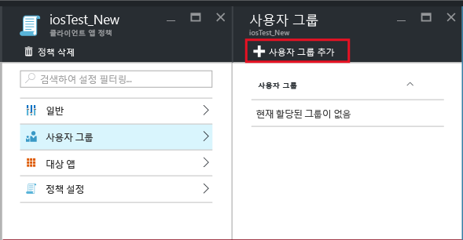

2.  사용자 그룹 목록이 **사용자 그룹 추가** 블레이드에 표시됩니다. 이는 **Azure Active Directory**에 있는 모든 보안 그룹의 목록입니다.  이 정책을 적용할 사용자 그룹을 선택하고 **선택**을 선택할 수 있습니다. **선택**을 선택하면 정책이 사용자에게 배포됩니다.

    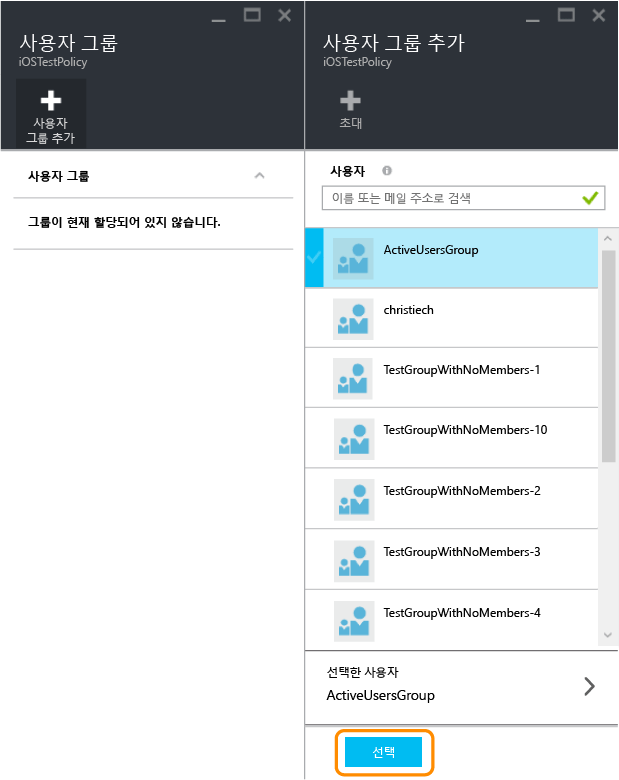

    이제 정책을 만들고 사용자에게 배포했습니다.

[!INCLUDE[wit_nextref](../includes/wit_nextref_md.md)] 라이선스가 할당된 사용자만 정책에 의해 영향을 받습니다.  선택한 보안 그룹에서 [!INCLUDE[wit_nextref](../includes/wit_nextref_md.md)] 라이선스가 할당되지 않은 사용자는 영향을 받지 않습니다.

Configuration Manager와 함께 Intune을 사용하여 iOS 및 Android 장치를 관리하는 경우 선택한 그룹에 바로 포함된 사용자에만 정책이 적용됩니다.  선택한 그룹 내에 중첩된 자식 그룹의 멤버는 영향을 받지 않습니다.

최종 사용자는 앱 스토어 또는 Google Play에서 앱을 다운로드할 수 있습니다. 장치에서 MAM으로 회사 데이터를 보호하는 방법의 자세한 연습은 [MAM를 사용하는 앱이 있는 최종 사용자 환경](end-user-experience-for-mam-enabled-apps-with-microsoft-intune.md) 항목을 참조하세요.

##  기존 정책 변경
기존 정책을 편집할 수 있으며 대상으로 지정된 사용자에게 적용할 수 있습니다. 그러나 기존 정책을 변경하는 경우 앱에 이미 로그인한 사용자에게는 8시간 동안 변경 내용이 표시되지 않습니다.

변경 사항의 결과를 즉시 확인하려면 최종 사용자가 앱에서 로그아웃하고 다시 로그인해야 합니다.

### 정책과 연결된 앱 목록을 변경하려면

1.  **앱 정책** 블레이드에서 변경할 정책을 선택합니다. 방금 선택한 정책과 관련된 블레이드가 열립니다.

    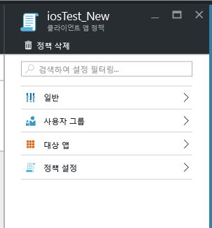

2.  정책 블레이드에서 **대상 앱**을 선택하여 앱 목록을 엽니다.

3.  목록에서 앱을 제거하거나 추가하고 **저장 아이콘**을 선택하여 변경 내용을 저장합니다.

### 사용자 그룹 목록을 변경하려면

1.  **앱 정책** 블레이드에서 변경할 정책을 선택합니다. 선택한 정책과 관련된 블레이드가 열립니다.

2.  정책 블레이드에서 **사용자 그룹**을 선택하여 이 정책이 있는 현재 사용자 그룹 목록을 보여 주는 **사용자 그룹** 블레이드를 엽니다.

3.  정책에 **새 사용자 그룹을 추가**하려면 **사용자 그룹 추가**를 선택하고 사용자 그룹을 선택합니다. **선택**을 선택하여 선택한 그룹에 정책을 배포합니다.

    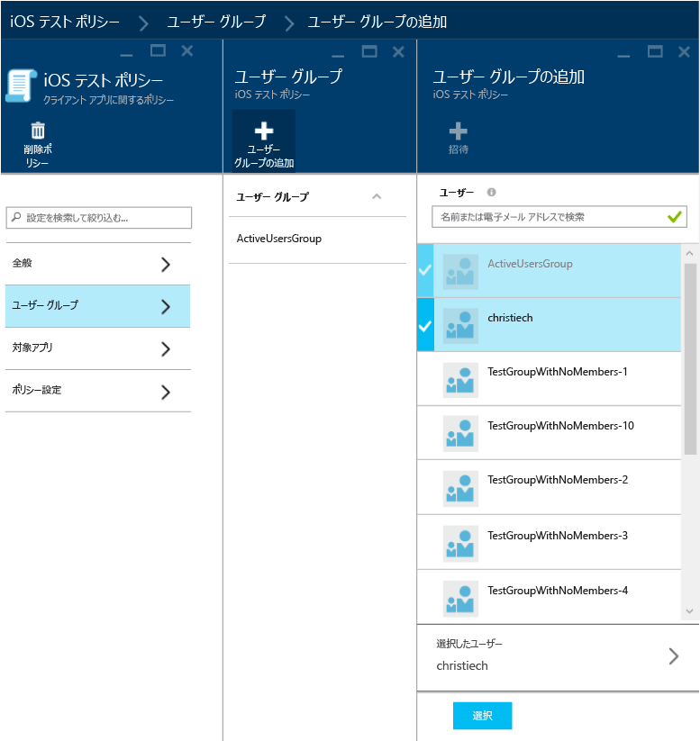

4.  **사용자 그룹을 삭제**하려면 제거할 사용자 그룹을 강조 표시하고 줄임표(…), **삭제**를 차례로 클릭하여 사용자 그룹을 제거합니다.

    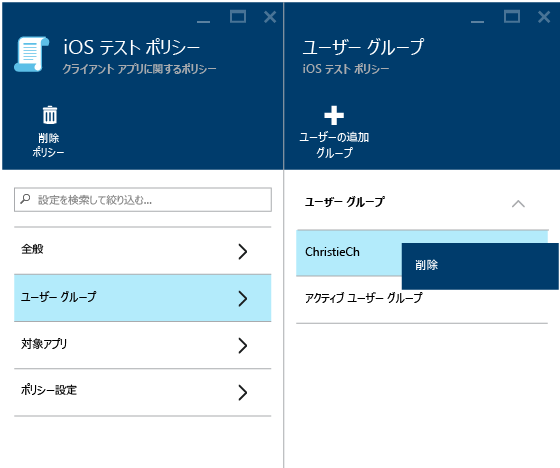

### 정책 설정을 변경하려면

1.  **앱 정책** 블레이드에서 변경할 정책을 선택합니다. 방금 선택한 정책과 관련된 블레이드가 열립니다.

    

2.  **정책 설정**을 선택하여 **정책 설정** 블레이드를 엽니다.

3.  설정을 변경하고 **저장 아이콘**을 선택하여 변경 내용을 저장합니다.

    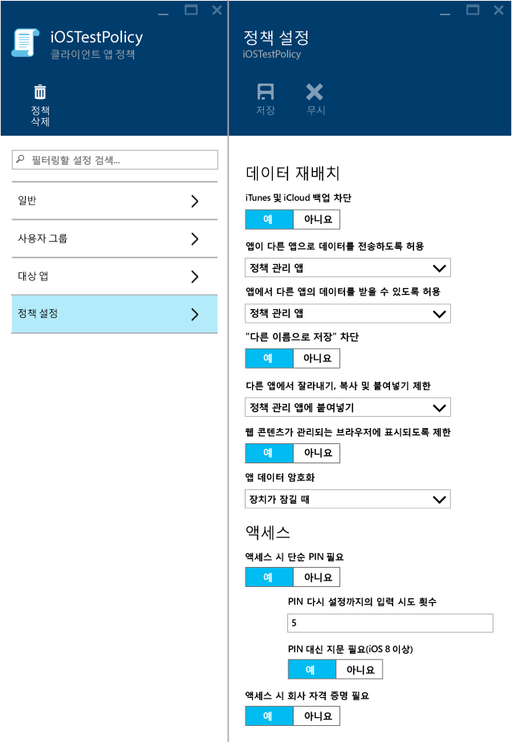

## 정책 설정
iOS 및 Android에 대한 정책 설정의 전체 목록을 보려면 다음 중 하나를 선택합니다.

> [!div class="op_single_selector"]
  - [iOS 정책](ios-mam-policy-settings.md)
  - [Android 정책](android-mam-policy-settings.md)

## 다음 단계
[규정 준수 및 사용자 상태 모니터링](monitor-mobile-app-management-policies-with-microsoft-intune.md)

### 참고 항목
[MAM을 사용한 앱에 대한 최종 사용자 환경](end-user-experience-for-mam-enabled-apps-with-microsoft-intune.md)

<!--HONumber=Jun16_HO2-->

