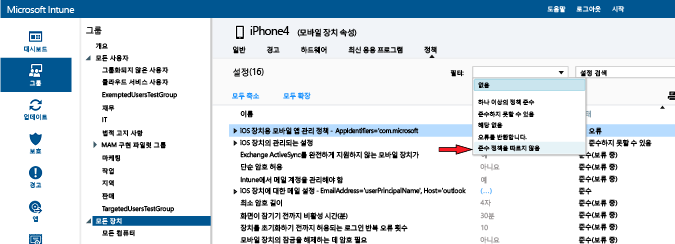

# Microsoft Intune でデバイスのコンプライアンス ポリシーを展開して監視する
## コンプライアンス ポリシーの展開
[こちらの手順で作成した](create-a-device-compliance-policy-in-microsoft-intune.md)コンプライアンス ポリシーを、組織内のユーザーの 1 つ以上のグループに展開します。 コンプライアンス ポリシーがユーザーに展開されると、ユーザーのデバイスのコンプライアンスがチェックされます。

1.  **[ポリシー]** ワークスペースで、展開するポリシーを選び、**[展開の管理]** を選びます。
![上部に [展開の管理] メニュー オプションが表示されているコンプライアンス ポリシー ページのスクリーンショット](./media/intune-sa-3c-deploy-compliance-policy2.png)

2.  **[展開の管理]** ダイアログ ボックスで、ポリシーを展開するユーザー グループを 1 つまたは複数選び、**[追加]、[OK]** の順に選択します。
![[展開の管理] ダイアログ ボックスのスクリーンショット](./media/intune-sa-3d-deploy-compliance-policy3-Manage.png) コンプライアンス ポリシーは、ユーザーに展開できます。 既に作成され、Intune と同期している Active Directory グループを使用するか、これらのグループを Intune コンソールで手動で作成します。 ポリシーを展開する方法の詳細については、「[構成ポリシーを展開する](manage-settings-and-features-on-your-devices-with-microsoft-intune-policies.md)」を参照してください。

**[ポリシー]** ワークスペースの **[概要]** ページに表示されるステータスの概要とアラートを使用すると、注意が必要なポリシーの問題を識別できます。 ステータスの概要は **[ダッシュボード]** ワークスペースにも表示されます。

> [!IMPORTANT]
> コンプライアンス ポリシーを展開していない状態で、Exchange 条件付きアクセス ポリシーを有効にすると、すべての対象デバイスによるアクセスが許可されます。

## Intune のポリシー競合の解決方法
複数の Intune ポリシーを 1 つのデバイスに適用すると、ポリシーの競合が発生する可能性があります。 ポリシーの設定が重複した場合、Intune では次の規則を使用して競合を解決します。

-   Intune の構成ポリシーと準拠ポリシーの設定が競合している場合は、構成ポリシーの設定の方が安全性が高くても、構成ポリシーの設定よりも準拠ポリシーの設定が優先されます。

-   複数の準拠ポリシーを展開した場合は、その中で最も安全なポリシーが使用されます。

## コンプライアンス ポリシーの監視

#### コンプライアンス ポリシーに準拠していないデバイスを表示するには

1.  [Microsoft Intune の管理コンソール](https://manage.microsoft.com)で、**[グループ] > [すべてのデバイス]** を選びます。

2.  デバイスの一覧内のデバイスの名前をダブルクリックします。

3.  **[ポリシー]** タブを選び、そのデバイスのポリシーの一覧を表示します。

4.  **[フィルター]** ドロップダウン リストから **[コンプライアンス ポリシーに準拠しない]** を選びます。

#### 正常性構成証明書レポートを表示するには

1.  [Microsoft Intune の管理コンソール](https://manage.microsoft.com)で、**[レポート]** を選びます。

2.  **[正常性構成証明書レポート - レポートの新規作成]** ページに、Intune によって収集されたすべての Windows 10 正常性構成証明書データを含むレポートが表示されます。 フィルターを使用して、データのサブセットを含むレポートを作成することもできます。 フィルターは、デバイスの種類、オペレーティング システムの種類、またはデータ ポイントのサブセットのみに基づいて設定できます。

## 次のステップ
条件付きアクセス ポリシーと共にコンプライアンス ポリシーを使用して、組織内のサービスへのアクセスを制御できるようになりました。

[電子メールと O365 サービスへのアクセスを制限する](restrict-access-to-email-and-o365-services-with-microsoft-intune.md)

### 関連項目
[Intune でのデバイス コンプライアンス ポリシーの概要](introduction-to-device-compliance-policies-in-microsoft-intune.md)

<!--HONumber=Aug16_HO3-->

