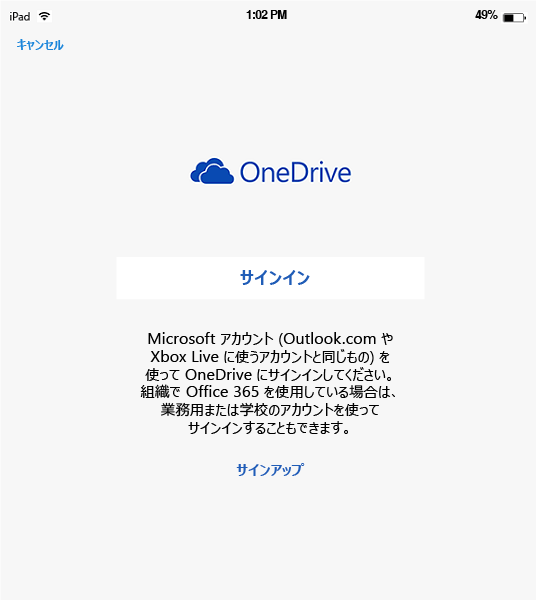
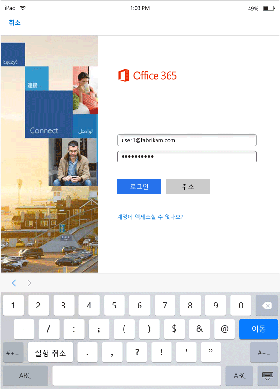
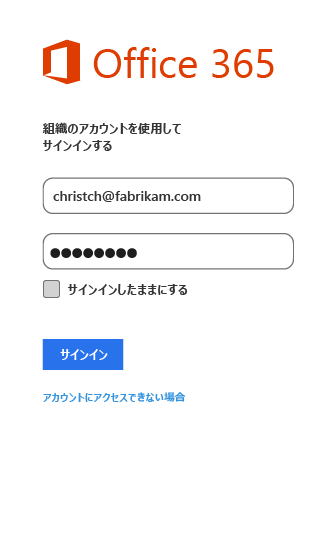

# MAM 対応アプリでのエンド ユーザー エクスペリエンス
モバイル アプリケーション管理 (MAM) ポリシーは、アプリが作業コンテキストで使用されている場合にのみ適用されます。  次のシナリオを参照して、管理対象アプリがどのように機能するかを理解してください。
##  iOS デバイスでの OneDrive へのアクセス

1.  **OneDrive** アプリを起動し、サインイン ページを開きます。

    

    > [!NOTE]
    > 個人用デバイスの場合は、通常、エンドユーザーがアプリをダウンロードします。  デバイスが MDM ソリューションで管理されている場合は、管理者がアプリをデバイスに展開できます。

2.  自分の作業アカウントのユーザー名を入力します。 **O365 認証** ページにリダイレクトされたら、作業用の資格情報を入力します。

    

3.  Azure AD によって資格情報が正常に認証されると、MAM ポリシーが適用され、 **OneDrive** アプリを再起動するように求められます。
  >[注!] [再起動が必要] ダイアログ ボックスは、Intune に登録されていないデバイスにのみ表示されます。

    

4.  **OneDrive** アプリを再起動すると、MAM ポリシーがオンになった状態でアプリが起動します。 次に、アプリの **暗証番号 (PIN)** を設定するように求められます。 (ポリシーの構成がそうなっている場合)

    

5.  暗証番号 (PIN) を設定して確認すると、 **OneDrive for Business**上のファイルにアクセスできるようになります。

    

    > [!NOTE]
    > [!NOTE] 展開済みのポリシーを変更すると、次回アプリを開いたときにその変更が適用されます。

##  Android デバイスでの OneDrive へのアクセス

1.  OneDrive アプリを起動し、サインイン ページを開きます。

    > [!NOTE]
    > 個人用デバイスの場合は、通常、エンドユーザーがアプリをダウンロードします。  デバイスが MDM ソリューションで管理されている場合は、管理者がアプリをデバイスに展開できます。

2.  自分の作業アカウントのユーザー名を入力します。 **O365 認証** ページにリダイレクトされたら、作業用の資格情報を入力します。

    

3.  **Azure AD**によって資格情報が正常に認証されると、まだ会社のポータル アプリがデバイスにインストールされていない場合はインストールするよう指示するメッセージが表示されます。  **[アプリの入手]** をタップして続行します。

>[!NOTE]
>Android デバイス上の MAM ポリシーに関連付けられたすべてのアプリでポータル サイト アプリが必要です。 Intune に登録されていないデバイスでは、このアプリをデバイスにインストールする必要がありますが、アプリの起動もサインインも実行する必要はありません。  

  

4.  **Google Play** ストアが開かれるので、そこから **会社のポータル** アプリをダウンロードしてインストールします。

    会社のポータル アプリを使うと、データを安全に保護できます。

    

5.  インストールが完了したら、**[承認]** を選択して使用条件を承認します。

6.  **OneDrive** アプリが自動的に起動します。

7.  ポリシー設定で **OneDrive**アプリへのアクセスに暗証番号 (PIN) が必要な設定になっている場合は、次回 OneDrive を開くと、 **暗証番号 (PIN)** を設定するプロンプトが表示されます。

    

8.  暗証番号 (PIN) が設定されて確認されると、アプリのポリシーで管理されるようになった **OneDrive**を継続して使用できます。

##  複数の ID を使用するアプリのサポート
このシナリオの例として Microsoft Word を使用します。

1.  デバイスで **Word** アプリを開きます。 以下の手順では、iOS デバイスを使用して説明します。

2.  **[新規作成]** をタップして、新しい Word 文書を作成します。

    ![画面の下部に [新規] メニュー オプションが表示されている iOS デバイスのスクリーンショット](../media/AppManagement/iOS_WordCreateNewDoc.png)

3.  自由に文を入力します。  このドキュメントを保存しようとすると、作成したドキュメントを保存するためのオプションとして、個人用の場所と作業用の場所の両方が表示されます。  この段階では、作業用/個人用コンテキストがまだ確立していないため、アプリのポリシーはまだ適用されていません。

4.  ドキュメントを作業用の OneDrive の場所に保存します。 これで、このドキュメントは会社のデータとしてタグ付けされ、ポリシーの制限が適用されます。

    

5.  作業用の場所に保存したドキュメントを開きます。  テキストをコピーし、個人の**Facebook** アカウントを開いて、コピーしたテキストを貼り付けてみてください。  新しい Facebook の投稿にコンテンツを貼り付けることはできないはずです。 [貼り付け] オプションは灰色表示になっていませんが、 **[貼り付け]**キーを押しても何も起きません。

    

    

6.  次に、手順 2 と手順 3 を繰り返して別のドキュメントを新しく作成し、文を入力します。今度は、作業用の場所ではなく、**[OneDrive - 個人用]** のような個人用の場所に保存します。

    

7.  個人用に保存されたドキュメントを開きます。  テキストをコピーし、 **Facebook** アプリを開いて、コピーしたテキストを貼り付けてみてください。 Facebook の投稿にコンテンツを貼り付けることができるはずです。

    

##  ユーザー アカウントの管理

Intune では、MAM ポリシーをデバイスごとに 1 つのユーザー アカウントのみに展開することをサポートします。 デバイスに複数の作業アカウントがあっても、1 つの作業アカウントのみが MAM ポリシーによって管理されます。

2 つ目のユーザーがデバイスでブロックされるかどうかは、使用中のアプリによって決まります。 ただし、どの場合でも、ポリシーの影響を受けるのは、MAM ポリシーが適用される最初のユーザーだけです。

MAM ポリシーを展開する前にデバイスに複数の既存のユーザー アカウントがある場合は、MAM ポリシーが展開される最初のアカウントが Intune MAM ポリシーによって管理されます。

**Microsoft Word**、**Excel**、および **PowerPoint** では、2 つ目のユーザー アカウントがブロックされることはありませんが、2 つ目のユーザー アカウントが MAM ポリシーの影響を受けることはありません。  

**OneDrive アプリと Outlook アプリ**では、作業アカウントは 1 つだけ使用できます。  作業アカウントを複数追加しようとしても、これらのアプリでブロックされます。  ただし、デバイス上のユーザーを削除して、別のユーザーを追加することはできます。

次のサンプル シナリオを読んで、複数のユーザー アカウントがどのように処理されるかを深く理解してください。

ユーザー A は、**会社 X** と会社 **会社 Y** という 2 つの会社で働いています。ユーザー A は各会社の作業アカウントを持っており、どちらの会社も Intune を使用してMAM ポリシーを展開しています。 **会社 X** は、**会社 Y** の**前に** MAM ポリシーを展開しています。MAM ポリシーは、**会社 X** に関連付けられた MAM ポリシーに適用され、会社 Y に関連付けられたアカウントには適用されません。会社 Y に関連付けられたユーザー アカウントを MAM ポリシーで管理する場合は、会社 X に関連付けられたユーザー アカウントを削除する必要があります。
### 2 つ目のアカウントの追加
#### iOS
iOS デバイスを使用している場合は、同じデバイスに 2 つ目の作業アカウントを追加しようとすると、ブロック メッセージが表示されることがあります。  既存のアカウントを削除して新しいアカウントを追加するオプションも表示されます。 この場合、**[はい]** を選択します。

![ブロック メッセージと、[はい] と [いいえ] オプショを表示しているダイアログ ボックスのスクリーンショット](../media/AppManagement/iOS_SwitchUser.PNG)
####  Android
Android デバイスを使用している場合は、既存のアカウントを削除して新しいアカウントを追加する手順を示すブロック メッセージが表示されることがあります。  Android デバイスで既存のアカウントを削除するには、**[設定] &gt; [全般] &gt; [アプリケーション マネージャー] &gt; [会社のポータル] の順に選択し、[データのクリア] を選びます**。

##  Rights Management 共有アプリを使用したメディア ファイルの表示
Android デバイスで会社の AV、PDF、および画像ファイルを表示するには、[Microsoft Rights Management (RMS) 共有アプリ](https://play.google.com/store/apps/details?id=com.microsoft.ipviewer)を使用します。

このアプリは、Google Play ストアからダウンロードします。  アプリをデバイスにインストールした後、アプリを起動し、会社の資格情報で認証します。 これで、他のポリシー管理対象アプリから保護されていないファイルと保護されているファイルを表示できます。

次のファイルの種類がサポートされます。

* **音声:** AAC LC、HE-AACv1 (AAC+)、HE-AACv2 (Enhanced AAC+)、AAC ELD (Enhanced Low Delay AAC)、AMR-NB、AMR-WB、FLAC、MP3、MIDI、Vorbis、PCM/WAVE。
* **ビデオ:** H.263、H.264 AVC、MPEG-4 SP、VP8。
* **画像:** jpg、pjpg、png、ppng、bmp、pbmp、gif、pgif、jpeg、pjpeg。
* PDF、PPDF

------------
|**pfile**|**text**|
|----|----|
|pfile は、保護するファイル向けの汎用的な "ラッパー" 形式です。暗号化されたコンテンツと RMS ライセンスをカプセル化し、任意のファイルの種類を保護できます。|XML、CSV などのテキスト ファイルは、保護されているときでもアプリで開いて表示できます。 ファイルの種類: txt、ptxt、csv、pcsv、log、plog、xml、pxml。|
---------------
**Intune で登録されていない Android デバイス**

RMS 共有アプリを使用して Intune により管理されているその他のアプリからファイルを表示するには、事前に RMS アプリを起動し、仕事用アカウントで認証しておく必要があります。  ログインすると、**RMS ライセンスを持っていない場合にのみ**、次のメッセージが表示されます。

**認証成功 – 会社のファイルを確認できるようになりましたが、ユーザーがファイルを保護できるように組織はセットアップされていません。 詳細については、IT 管理者に問い合わせてください。**

この場合、ユーザーが RMS 共有アプリを使用して会社のファイルを表示する操作は阻止されません。 Intune によって管理されているその他のアプリから引き続き会社のファイルを開いて閲覧しすることができ、まだ MAM ポリシーが適用されます。  このメッセージが示す内容は、RMS 共有アプリによって提供されている保護機能を追加することができないということです。  ファイルに対して保護を追加するには RMS ライセンスを取得する必要があります。 RMS ファイル保護機能の詳細については、「[Protect a file on a device](https://docs.microsoft.com/en-us/rights-management/rms-client/sharing-app-protect-in-place)」 (デバイス上のファイルを保護する) と「[Protect a file that you share by email](https://docs.microsoft.com/en-us/rights-management/rms-client/sharing-app-protect-by-email)」 (電子メールで共有するファイルを保護する) を参照してください。

### 関連項目
[Microsoft Intune でのモバイル アプリ管理ポリシーの作成および展開](create-and-deploy-mobile-app-management-policies-with-microsoft-intune.md)

<!--HONumber=Jul16_HO2-->

