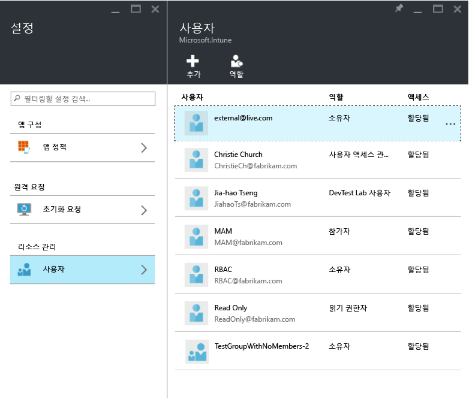

---
# required metadata

title: 모바일 앱 관리 정책 구성 준비 | Microsoft Intune
description:
keywords:
author: karthikaraman
manager: jeffgilb
ms.date: 04/28/2016
ms.topic: article
ms.prod:
ms.service: microsoft-intune
ms.technology:
ms.assetid: 7e6a85e7-e007-41b6-9034-64d77f547b87

# optional metadata

#ROBOTS:
#audience:
#ms.devlang:
ms.reviewer: jeffgilb
ms.suite: ems
#ms.tgt_pltfrm:
#ms.custom:

---

# Microsoft Intune을 사용하여 모바일 앱 관리 정책 구성 준비
이 항목에서는 Azure 포털에서 MAM(모바일 앱 관리 정책)을 만들기 전에 수행해야 하는 사항을 설명합니다.

Azure 포털은 MAM 정책을 만들 수 있는 새로운 관리 콘솔입니다. 이 포털을 사용하여 MAM 정책을 만드는 것이 좋습니다. Azure 포털에서는 다음 MAM 시나리오를 지원합니다.
- Intune에서 등록된 장치
- 타사 MDM 솔루션에서 관리되는 장치
- MDM 솔루션(BYOD)에서 관리되지 않는 장치

Azure 포털을 처음 사용하는 경우 대략적인 개요를 파악하려면 [Microsoft Intune MAM 정책용 Azure 포털](azure-portal-for-microsoft-intune-mam-policies.md) 항목을 읽어보세요.

현재 **Intune 관리 콘솔**을 사용하여 장치를 관리하는 경우 **Intune 관리 콘솔**을 사용하여 Intune에 등록된 장치의 앱을 지원하는 MAM 정책 사용을 만들 수 있지만, Intune에 등록된 장치에도 Azure 포털을 사용하는 것이 좋습니다. Intune 관리 콘솔을 사용하여 MAM 정책을 만드는 방법에 대한 자세한 내용은 [여기](configure-and-deploy-mobile-application-management-policies-in-the-microsoft-intune-console.md)를 참조하세요.

>[!IMPORTANT]
> Intune 관리 콘솔에서 모든 MAM 정책 설정이 나타나지 않을 수 있습니다. Intune 관리 콘솔과 Azure 포털 둘 다에서 MAM 정책을 만들 경우 Azure 포털의 정책이 앱에 적용되며 사용자에게 배포됩니다.

##  지원되는 플랫폼
- iOS 8.1 이상

- Android 4 이상

##  지원되는 앱
* **Microsoft 앱:** 이러한 앱은 Intune 앱 SDK가 기본 제공되며 MAM 정책을 적용하기 전에 추가 처리가 필요하지 않습니다.
지원되는 Microsoft 앱의 전체 목록을 보려면 Microsoft Intune 응용 프로그램 파트너 페이지의 [Microsoft Intune 모바일 응용 프로그램 갤러리](https://www.microsoft.com/en-us/server-cloud/products/microsoft-intune/partners.aspx)로 이동합니다. 앱을 클릭하여 지원되는 시나리오, 플랫폼 및 앱에서 다중 ID를 지원하는지 여부를 확인합니다.
* 사내에서 빌드된 **LOB(기간 업무) 앱:** MAM 정책을 적용하려면 먼저 Intune 앱 SDK를 포함하도록 앱을 준비해야 합니다.

  * Intune에서 관리하는 장치의 경우 [Decide how to prepare apps for MAM](decide-how-to-prepare-apps-for-mobile-application-management-with-microsoft-intune.md)(MAM용 앱을 준비하는 방법 결정) 항목을 참조하세요.
  * 직원 소유 장치와 같이 관리되지 않는 장치 또는 타사 모바일 장치 관리 솔루션으로 관리되는 장치의 경우 [Protect line of business apps and data on devices not enrolled in Intune](protect-line-of-business-apps-and-data-on-devices-not-enrolled-in-microsoft-intune.md)(Intune에 등록되지 않은 장치의 LOB(기간 업무) 앱 및 데이터 보호) 항목을 참조하세요.

MAM 정책을 구성하기 **전에** 다음이 필요합니다.

-   **Microsoft Intune에 대한 구독**.    최종 사용자가 MAM 정책을 사용하여 앱을 가져오려면 [!INCLUDE[wit_nextref](../includes/wit_nextref_md.md)] 라이선스가 필요합니다.

-   **Office 365(O365)** 구독은 다음에 필요합니다.
  - 다중 ID 지원을 사용하여 앱에 MAM 정책 적용하기.
  - SharePoint Online 및 Exchange Online 작업 계정 만들기. Exchange 온-프레미스 및 SharePoint 온-프레미스는 지원되지 않습니다.
-    **비즈니스용 Skype Online**에 대해 **최신 인증을 사용하도록 설정**합니다. Microsoft Connect에 로그인하고 최신 인증 프로그램에 등록되도록 [이 양식](https://connect.microsoft.com/office/Survey/NominationSurvey.aspx?SurveyID=17299&ProgramID=8715)을 작성합니다.

- 사용자를 만들기 위한 **Azure AD(Azure Active Directory)**. Azure AD는 최종 사용자가 앱을 시작하고 작업 자격 증명을 입력할 때 사용자를 인증합니다.

    > [!NOTE] [!INCLUDE[wit_nextref](../includes/wit_nextref_md.md)] 콘솔을 사용하여 사용자를 설정하는 경우 MAM 정책 구성은 향후 Azure 포털로 이동하며, 이 포털을 사용하려면 Office 365 포털을 통해 Azure AD 사용자 그룹을 설정해야 한다는 점에 유의하세요.

## 사용자를 만들고 Microsoft Intune 라이선스를 할당합니다.

1. Intune 구독이 필요합니다. 현재 [!INCLUDE[wit_nextref](../includes/wit_nextref_md.md)]을(를) 사용하여 장치를 관리하는 경우 [!INCLUDE[wit_nextref](../includes/wit_nextref_md.md)] 구독이 이미 있습니다.  또한 EMS 라이선스를 구입한 경우에도 [!INCLUDE[wit_nextref](../includes/wit_nextref_md.md)] 구독이 있습니다. [!INCLUDE[wit_nextref](../includes/wit_nextref_md.md)]을 사용하여 MAM 기능을 확인하려는 경우 [여기](http://www.microsoft.com/en-us/server-cloud/products/microsoft-intune/)서 평가판 계정을 얻을 수 있습니다.

    [!INCLUDE[wit_nextref](../includes/wit_nextref_md.md)] 구독이 있는지 확인하려면 Office 포털에서 결제 페이지로 이동합니다.  구독 아래에 [!INCLUDE[wit_nextref](../includes/wit_nextref_md.md)]이 **활성**으로 표시되어야 합니다.

2.  관리자 자격 증명을 사용하여 [Office 포털](http://portal.office.com)에 로그인합니다.

3.  **활성 사용자** 페이지로 이동하여 사용자를 추가하고 [!INCLUDE[wit_nextref](../includes/wit_nextref_md.md)] 라이선스를 할당합니다.

    

4.  사용자가 Office 포털, Azure AD 포털 및 Azure 포털에 액세스할 수 있게 하려면 사용자에게 **전역 관리자 역할**을 할당합니다.

    

5.  MAM 정책이 Azure Active Directory의 사용자 그룹에 배포됩니다. MAM 정책에 사용하려는 사용자 그룹을 만들려면 **Office 포털**의 **그룹** 페이지로 이동한 다음 **+** 아이콘을 클릭하여 새 보안 그룹을 만듭니다.  이름 및 설명을 입력하고 **만들기**를 클릭합니다. 그룹이 생성되면 새로 만든 보안 그룹에서 **멤버 편집**을 클릭하여 그룹에 사용자를 추가할 수 있습니다. Azure Active Directory에서 보안 그룹이 생성됩니다.

    

다음 표에서는 관리 사용자에게 할당할 수 있는 역할 및 사용 권한을 보여 줍니다.

|||
|--|----|
|**역할**|**사용 권한**|
|전역 관리자(O365 포털)|O365 포털 및 Azure AD 포털에 대한 액세스  Azure Preview 포털에 대한 액세스(역할 관리 및 모바일 앱 관리 작업 둘 다를 수행할 수 있음).|
|소유자 역할(Azure 포털)|Azure Preview 포털에 대한 액세스(역할 관리 및 모바일 앱 관리 작업 둘 다를 수행할 수 있음).|
|참가자 역할(Azure 포털)|Azure 포털에 대한 액세스(모바일 앱 관리 작업만 수행할 수 있음).|

## 사용자에게 참가자 역할 할당

**전역 관리자**는 [Azure 포털](https://portal.azure.com)에 액세스할 수 있습니다.  다른 관리 사용자가 정책을 구성 하 고 다른 모바일 앱 관리 작업을 수행할 수 있게 하려는 경우 아래에 설명된 대로 사용자에게 **참가자 역할**을 할당할 수 있습니다.

1.  **설정** 블레이드의 **리소스 관리** 섹션에서 **사용자**를 클릭합니다.

    

2.  **추가**를 클릭하여 **액세스 추가** 블레이드를 엽니다.

3.   **역할 선택**, **참가자 역할**을 차례로 클릭합니다.

    

4.  역할을 선택한 후 **사용자 추가**를 클릭하고 사용자 이름 또는 메일 주소로 사용자를 검색합니다. 이 목록에 표시되는 사용자는 Office 포털을 사용하여 Azure AD에서 이전에 만든 처음 1000명의 사용자입니다. **액세스 추가** 블레이드에서 **확인**을 클릭하여 저장하고 사용자에게 역할을 할당합니다.

    

    > [!IMPORTANT] [!INCLUDE[wit_nextref](../includes/wit_nextref_md.md)] 라이선스가 할당되지 않은 사용자를 선택하면 포털에 액세스할 수 없습니다.

## 다음 단계
[Microsoft Intune으로 모바일 앱 관리 정책 만들기 및 배포](create-and-deploy-mobile-app-management-policies-with-microsoft-intune.md)

<!--HONumber=May16_HO3-->

