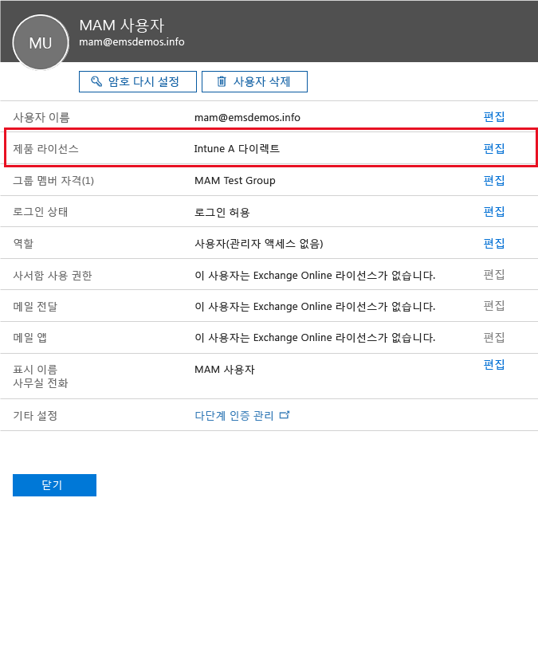
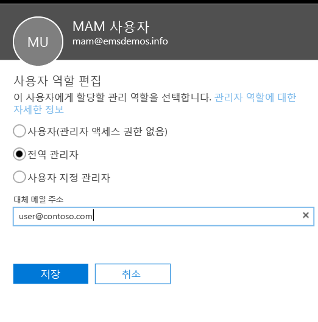
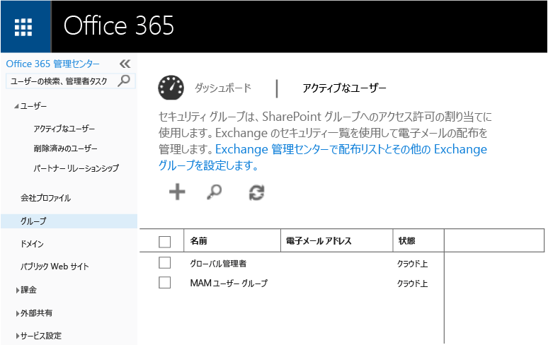
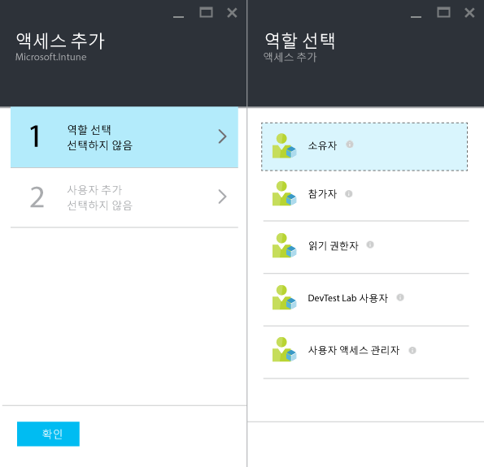

# Microsoft Intune でのモバイル アプリ管理ポリシーの作成および展開
このトピックでは、Azure ポータルでモバイル アプリ管理 (MAM) ポリシーを作成する前に必要な作業を説明します。

Azure ポータルは MAM ポリシーを作成するための新しい管理コンソールです。 このポータルを使用して、MAM ポリシーを作成することをお勧めします。 Azure ポータルでは、次の MAM シナリオをサポートします。
- Intune に登録されたデバイス
- サードパーティの MDM ソリューションで管理されるデバイス
- MDM ソリューションで管理されないデバイス (BYOD)

初めて Azure ポータルを使用する場合は、「[Azure portal for Microsoft Intune MAM policies (Microsoft Intune MAM ポリシーの Azure ポータル)](azure-portal-for-microsoft-intune-mam-policies.md)」トピックで概要を確認してください。

>[!IMPORTANT]

> 現在 Intune 管理コンソールを使用してデバイスを管理している場合は、Intune に登録済みのデバイスのアプリをサポートする MAM ポリシーを Intune 管理コンソールを使用して作成できます。 ただし、Intune で登録されているデバイスであっても、Azure ポータルを使用することをお勧めします。 Intune 管理コンソールを使用して MAM ポリシーを作成する方法については、「[Microsoft Intune コンソールでモバイル アプリケーション管理ポリシーを構成して展開する](configure-and-deploy-mobile-application-management-policies-in-the-microsoft-intune-console.md)」を参照してください。

> Intune 管理コンソールでは、MAM ポリシー設定の一部が表示されない可能性があります。 Intune 管理コンソールと Azure ポータルの両方で MAM ポリシーを作成した場合、Azure ポータルのポリシーがアプリに適用され、ユーザーに展開されます。
> Intune 管理コンソールで作成した MAM ポリシーを Azure ポータルにインポートすることはできません。  Azure ポータルで MAM ポリシーを作成し直す必要があります。

##  サポートされているプラットフォーム
- iOS 8.1 以降

- Android 4 以降

Windows デバイスは現在サポートされていません。
##  サポートされているアプリ
* **Microsoft アプリ:** これらのアプリには Intune アプリ SDK が組み込まれているので、MAM ポリシーを適用する前に必要な処理はありません。
サポートされている Microsoft アプリの完全な一覧については、Microsoft Intune アプリケーション パートナー ページの [Microsoft Intune モバイル アプリケーション ギャラリー](https://www.microsoft.com/en-us/server-cloud/products/microsoft-intune/partners.aspx)を参照してください。 アプリをクリックし、サポートされるシナリオ、プラットフォーム、アプリのマルチ ID 対応について確認してください。
* **社内で構築した基幹業務アプリ:** MAM ポリシーを適用する前に、Intune アプリ SDK を含めるようにアプリを準備する必要があります。

  * Intune で管理されているデバイスについては、「[Decide how to prepare apps for MAM](decide-how-to-prepare-apps-for-mobile-application-management-with-microsoft-intune.md)」 (MAM 用にアプリを準備する方法を決める) を参照してください。
  * 従業員が所有するデバイスなど管理対象ではないデバイスや、サードパーティのモバイル デバイス管理ソリューションで管理されているデバイスの場合は、「[Microsoft Intune に登録されていないデバイスの基幹業務アプリとデータを保護する](protect-line-of-business-apps-and-data-on-devices-not-enrolled-in-microsoft-intune.md)」を参照してください。

MAM ポリシーを構成する*前提条件*として、以下のものが必要です。

-   Microsoft Intune サブスクリプション。    MAM ポリシーが適用されているアプリを入手するには、[!INCLUDE[wit_nextref](../includes/wit_nextref_md.md)] ライセンスが必要です。

-   Office 365 サブスクリプション。これは、以下で必要となります。
  - 複数の ID をサポートするアプリに MAM ポリシーを適用する。
  - SharePoint Online および Exchange Online 作業アカウントを作成する。 Exchange On-Premises と SharePoint On-Premises はサポートされていません。
-   Skype for Business Online の先進認証の設定。 詳細については、「[Enable modern authentication](http://social.technet.microsoft.com/wiki/contents/articles/34339.skype-for-business-online-enable-your-tenant-for-modern-authentication.aspx)」 (先進認証の有効化) をご覧ください。

- ユーザーを作成するための Azure Active Directory (Azure AD)。 Azure AD では、ユーザーがアプリを開いて作業用の資格情報を入力するときに、ユーザーを認証します。

    > [!NOTE]
    > [!INCLUDE[wit_nextref](../includes/wit_nextref_md.md)] コンソールでユーザーを設定する場合、MAM ポリシーの構成が Azure ポータルに移動することに注意してください。 このポータルを使用するには、Office 365 ポータルを使用して Azure AD ユーザーのグループを設定する必要があります。

## ユーザーの作成と Microsoft Intune ライセンスの割り当て

1. Intune サブスクリプションがあることを確認します。 デバイスを管理するために現在 [!INCLUDE[wit_nextref](../includes/wit_nextref_md.md)] を使用している場合、既に [!INCLUDE[wit_nextref](../includes/wit_nextref_md.md)] サブスクリプションを所有していることになります。  Enterprise Mobility Suite (EMS) ライセンスを購入している場合も、[!INCLUDE[wit_nextref](../includes/wit_nextref_md.md)] サブスクリプションを所有しています。 MAM 機能を調べるために [!INCLUDE[wit_nextref](../includes/wit_nextref_md.md)] を試してみる場合は、試用アカウントを [Microsoft Intune Web ページ](http://www.microsoft.com/en-us/server-cloud/products/microsoft-intune/)から取得できます。

    自分が [!INCLUDE[wit_nextref](../includes/wit_nextref_md.md)] サブスクリプションを所有しているかどうかを確認するには、**課金情報**のページをご覧ください。  サブスクリプションで、[!INCLUDE[wit_nextref](../includes/wit_nextref_md.md)] が "**Active**" になっているはずです。

2.  管理者資格情報で [Office ポータル](http://portal.office.com)にサインインします。

3.  **[アクティブなユーザー]** ページに移動し、ユーザーを追加して、[!INCLUDE[wit_nextref](../includes/wit_nextref_md.md)] ライセンスを割り当てます。

    ![Office ポータルの [アクティブなユーザー] ページ](../media/AppManagement/OfficePortal_AddUsers.png)

    

4.  ユーザーが Office ポータル、Azure AD ポータル、Azure ポータルにアクセスできるようにするには、**全体管理者ロール**をユーザーに割り当てます。

    

5.  MAM ポリシーは、Azure Active Directory のユーザー グループに展開されます。 MAM ポリシー用にユーザー グループを作成するには、Office ポータルの **[グループ]** ページに移動して、上部のメニューの **[グループの追加] オプション**を選択して新しいセキュリティ グループを作成します。  名前と説明を入力し、**[作成]** をクリックします。 グループを作成したら、**[メンバーの編集]** をクリックしてグループにユーザーを追加できます。 セキュリティ グループは Azure Active Directory 内に作成されます。

    

次の表に、管理ユーザーに対して割り当てることができるロールとアクセス許可の一覧を示します。

|||
|--|----|
|**ロール**|**アクセス許可**|
|全体管理者 (Office 365 ポータル)|Office 365 ポータルと Azure AD ポータルへのアクセス。  Azure ポータルへのアクセス (ロール管理タスクとモバイル アプリ管理タスクの両方が可能)。|
|所有者 (Azure ポータル)|Azure ポータルへのアクセス (ロール管理タスクとモバイル アプリ管理タスクの両方が可能)。|
|共同作成者 (Azure ポータル)|Azure ポータルへのアクセス (モバイル アプリ管理タスクのみ実行可能)。|

## ユーザーへの共同作成者ロールの割り当て

全体管理者には [Azure ポータル](https://portal.azure.com)へのアクセス権があります。  その他の管理ユーザーもポリシーを構成して他のモバイル アプリ管理タスクを実行できるようにする場合は、ユーザーに共同作成者ロールを割り当てることができます。

1.  **[設定]** ブレードの **[リソース管理]** セクションで、**[ユーザー]** をクリックします。

    ![Azure ポータルの [ユーザー] ブレード](../media/AppManagement/AzurePortal_MAM_AddUsers.png)

2.  **[追加]** をクリックして **[アクセスの追加]** ブレードを開きます。

3.  **[ロールの選択]**、**[共同作成者]** の順にクリックします。

    

4.  **[ユーザーの追加]** をクリックして、名前または電子メール アドレスでユーザーを検索します。 この一覧に表示されるユーザーは、Office ポータルを使用して Azure AD で以前に作成した最初の 1000 ユーザーです。 **[アクセスの追加]** ブレードで **[OK]** をクリックし、ロールを保存し、これをユーザーに割り当てます。

    ![Azure ポータルの [ユーザーの追加] ブレード](../media/AppManagement/AzurePortal_MAM_AddusertoRole.png)

    > [!IMPORTANT]
    > [!INCLUDE[wit_nextref](../includes/wit_nextref_md.md)] ライセンスが割り当てられていないユーザーを選んだ場合、そのユーザーはポータルにアクセスできません。

## 次のステップ
[Microsoft Intune でのモバイル アプリ管理ポリシーの作成および展開](create-and-deploy-mobile-app-management-policies-with-microsoft-intune.md)

<!--HONumber=Aug16_HO1-->

