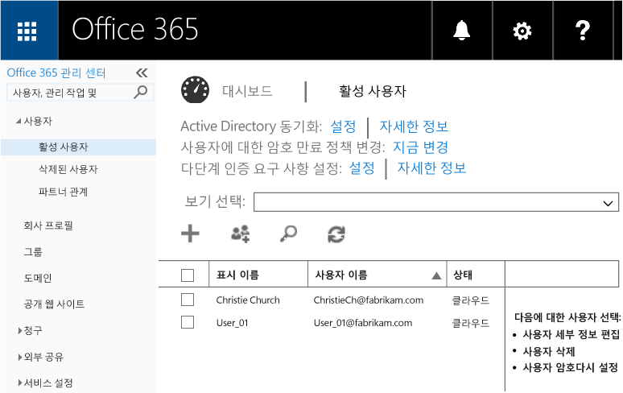

# Microsoft Intune でのモバイル アプリ管理ポリシーの作成および展開
このトピックでは、Azure ポータルでモバイル アプリ管理ポリシー (MAM) を作成する前に必要な作業を説明します。

Azure ポータルは MAM ポリシーを作成するための新しい管理コンソールです。このポータルを使用して、MAM ポリシーを作成することをお勧めします。 Azure ポータルでは、次の MAM シナリオをサポートします。
- Intune に登録されたデバイス
- サードパーティの MDM ソリューションで管理されるデバイス
- MDM ソリューション (BYOD) で管理されないデバイス

初めて Azure ポータルを使用する場合は、「[Azure portal for Microsoft Intune MAM policies (Microsoft Intune MAM ポリシーの Azure ポータル)](azure-portal-for-microsoft-intune-mam-policies.md)」トピックで概要を確認してください。

デバイスの管理に **Intune 管理コンソール**を使用している場合、**Intune 管理コンソール**を使用して Intune に登録したデバイスのアプリをサポートする MAM ポリシーを作成できますが、Intune に登録されているデバイスでも Azure ポータルを使用することをお勧めします。 Intune 管理コンソールを使用して MAM ポリシーを作成する手順については、[ここ](configure-and-deploy-mobile-application-management-policies-in-the-microsoft-intune-console.md)を参照してください。

Intune 管理コンソールで作成した MAM ポリシーを Azure ポータルにインポートすることはできません。  Azure ポータルで MAM ポリシーを作成し直す必要があります。

>[!IMPORTANT]
> Intune 管理コンソールでは、MAM ポリシー設定の一部が表示されない可能性があります。 Intune 管理コンソールと Azure ポータルの両方で MAM ポリシーを作成した場合、Azure ポータルのポリシーがアプリに適用され、ユーザーに展開されます。

##  サポートされているプラットフォーム
- iOS 8.1 以降

- Android 4 以降

Windows デバイスは現在サポートされていません。
##  サポートされているアプリ
* **Microsoft アプリ:** これらのアプリには Intune アプリ SDK が組み込まれているので、MAM ポリシーを適用する前に必要な処理はありません。
サポートされている Microsoft アプリの完全な一覧については、Microsoft Intune アプリケーション パートナー ページの [Microsoft Intune モバイル アプリケーション ギャラリー](https://www.microsoft.com/en-us/server-cloud/products/microsoft-intune/partners.aspx)を参照してください。 アプリをクリックし、サポートされるシナリオ、プラットフォーム、アプリのマルチ ID 対応を確認してください。
* 社内で構築した**基幹業務アプリ:** MAM ポリシーを適用する前に、Intune アプリ SDK を含めるようにアプリを準備する必要があります。

  * Intune で管理されているデバイスについては、「[Decide how to prepare apps for MAM](decide-how-to-prepare-apps-for-mobile-application-management-with-microsoft-intune.md)」 (MAM 用にアプリを準備する方法を決める) を参照してください。
  * 従業員が所有するデバイスなど管理対象ではないデバイスや、サードパーティのモバイル デバイス管理ソリューションで管理されているデバイスの場合は、「[Microsoft Intune に登録されていないデバイスの基幹業務アプリとデータを保護する](protect-line-of-business-apps-and-data-on-devices-not-enrolled-in-microsoft-intune.md)」を参照してください。

MAM ポリシーを構成する**前提条件**として、以下のものが必要です。

-   **Microsoft Intune サブスクリプション**。    アプリに MAM ポリシーを使用するには、エンドユーザーに [!INCLUDE[wit_nextref](../includes/wit_nextref_md.md)] ライセンスが必要です。

-   **Office 365 (O365)** サブスクリプション。これは、以下で必要となります。
  - 複数の ID をサポートするアプリに MAM ポリシーを適用する。
  - SharePoint Online および Exchange Online 作業アカウントを作成する。 Exchange On-Premises と SharePoint On-Premises はサポートされていません。
-    **Skype for Business Online** で[先進認証を有効にします](http://social.technet.microsoft.com/wiki/contents/articles/34339.skype-for-business-online-enable-your-tenant-for-modern-authentication.aspx.md)。

- ユーザーを作成するための **Azure Active Directory (Azure AD)**。 エンドユーザーがアプリを起動して作業用の資格情報を入力すると、Azure AD がユーザーを認証します。

    > [!NOTE][!INCLUDE[wit_nextref](../includes/wit_nextref_md.md)] コンソールを使用してユーザーを設定する場合、今後、MAM ポリシー構成は Azure ポータルに移行していき、このポータルを使用するには、Office 365 ポータルを使用して Azure AD ユーザー グループを設定する必要があることにご注意ください。

## ユーザーの作成と Microsoft Intune ライセンスの割り当て

1. Intune サブスクリプションが必要です。デバイスを管理するために現在 [!INCLUDE[wit_nextref](../includes/wit_nextref_md.md)] を使用している場合、[!INCLUDE[wit_nextref](../includes/wit_nextref_md.md)] サブスクリプションを既に所有しています。  EMS ライセンスを購入している場合も、[!INCLUDE[wit_nextref](../includes/wit_nextref_md.md)] サブスクリプションを所有しています。 MAM 機能を調べるために [!INCLUDE[wit_nextref](../includes/wit_nextref_md.md)] を試してみる場合は、試用アカウントを[ここ](http://www.microsoft.com/en-us/server-cloud/products/microsoft-intune/)から取得できます。

    自分が [!INCLUDE[wit_nextref](../includes/wit_nextref_md.md)] サブスクリプションを所有しているかどうかを確認するには、課金情報のページをご覧ください。  サブスクリプションの下で、[!INCLUDE[wit_nextref](../includes/wit_nextref_md.md)] が "**Active**" になっているはずです。

2.  管理者資格情報で   [Office ポータル](http://portal.office.com) にサインインします。

3.  **[アクティブなユーザー]** ページに移動し、ユーザーを追加して、[!INCLUDE[wit_nextref](../includes/wit_nextref_md.md)] ライセンスを割り当てます。

    

4.  ユーザーが Office ポータル、Azure AD ポータル、Azure ポータルにアクセスできるようにするには、**全体管理者ロール**をユーザーに割り当てます。

    ![[アクティブなユーザー] ページを示す Office ポータルのスクリーンショット ](../media/AppManagement/OfficePortal_AddRoletoUser.png)

5.  MAM ポリシーは、Azure Active Directory のユーザー グループに展開されます。 MAM ポリシー用に使用するユーザー グループを作成するには、**Office ポータル**の **[グループ]** ページに移動して、"**+**" アイコンをクリックして新しいセキュリティ グループを作成します。  名前と説明を入力し、 **[作成]**をクリックします。 グループを作成したら、新しく作成したセキュリティ グループにある **[メンバーの編集]** をクリックしてグループにユーザーを追加できます。 セキュリティ グループは Azure Active Directory 内に作成されます。

    ![ユーザー ロールを編集するページの [グローバル管理者] ロールの選択内容を示すページのスクリーンショット](../media/AppManagement/OfficePortal_CreateGroups.png)

次の表に、管理ユーザーに対して割り当てることができるロールとアクセス許可の一覧を示します。

|||
|--|----|
|**ロール**|**アクセス許可**|
|全体管理者 (O365 ポータル)|O365 ポータルと Azure AD ポータルへのアクセス  Azure ポータルへのアクセス (ロール管理タスクとモバイル アプリ管理タスクの両方が可能)。|
|所有者ロール (Azure ポータル)|Azure ポータルへのアクセス (ロール管理タスクとモバイル アプリ管理タスクの両方が可能)。|
|共同作成者ロール (Azure ポータル)|Azure ポータルへのアクセス (モバイル アプリ管理タスクのみ可能)。|

## ユーザーへの共同作成者ロールの割り当て

**全体管理者** には [Azure ポータル](https://portal.azure.com)へのアクセス権があります。  その他の管理ユーザーもポリシーを構成して他のモバイル アプリ管理タスクを実行できるようにする場合は、次に示す方法で、ユーザーに **共同作成者ロール** を割り当てることができます。

1.  **[設定]** ブレードの **[リソース管理]** セクションで、**[ユーザー]** をクリックします。

    ![Azure ポータルの [ユーザー] ブレードのスクリーンショット](../media/AppManagement/AzurePortal_MAM_AddUsers.png)

2.  **[追加]** をクリックして **[アクセスの追加]** ブレードを開きます。

3.   **[ロールの選択]**、 **[共同作成者ロール]**の順にクリックします。

    ![Azure ポータルの [ロールの選択] ブレードのスクリーンショット](../media/AppManagement/AzurePortal_MAM_AddRole.png)

4.  ロールを選んだら、 **[ユーザーの追加]**をクリックし、ユーザー名かメール アドレスでユーザーを検索します。 この一覧に表示されるユーザーは、Office ポータルを使用して Azure AD で以前に作成した最初の 1000 ユーザーです。 **[アクセスの追加]** ブレードで **[OK]** をクリックし、ロールを保存し、これをユーザーに割り当てます。

    ![Azure ポータルの [ユーザーの追加] ブレードのスクリーンショット](../media/AppManagement/AzurePortal_MAM_AddusertoRole.png)

    > [!IMPORTANT][!INCLUDE[wit_nextref](../includes/wit_nextref_md.md)] ライセンスが割り当てられていないユーザーを選んだ場合、そのユーザーはポータルにアクセスできません。

## 次のステップ
[Microsoft Intune でのモバイル アプリ管理ポリシーの作成および展開](create-and-deploy-mobile-app-management-policies-with-microsoft-intune.md)

<!--HONumber=Jun16_HO4-->

