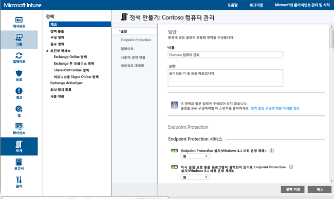
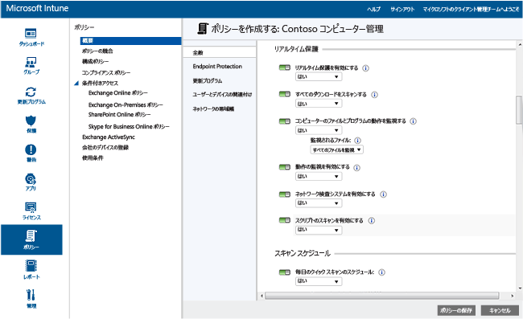
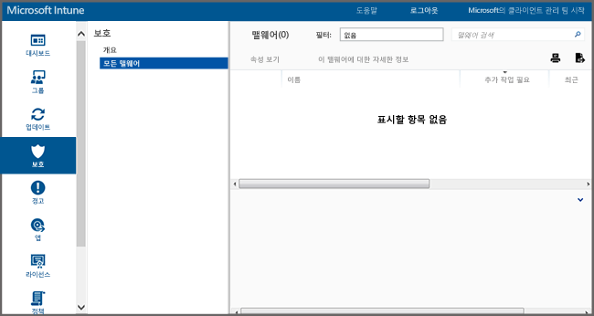

# Microsoft Intune の Endpoint Protection を使用して Windows PC を保護する
Microsoft Intune を使用すると、管理されたコンピューターをさまざまな方法で保護することができます。たとえば、Endpoint Protection では、マルウェアの脅威に対するリアルタイムの保護を行い、マルウェア定義を最新の状態に保ち、自動的にコンピューターをスキャンします。 また、Endpoint Protection は、マルウェアの攻撃の管理と監視に役立つツールも提供します。

まだ Intune クライアントをコンピューターにインストールしていない場合は、「[Microsoft Intune を使用して Windows PC クライアントをインストールする](install-the-windows-pc-client-with-microsoft-intune.md)」を参照してください。

Endpoint Protection を構成、展開、監視するときに、次のセクションの情報をお役立てください。

## Endpoint Protection を使用するタイミングの選択
IT 管理者として最も優先度が高い事項の 1 つは、管理するコンピューターをマルウェアやウイルスのない状態に保つことです。 Intune を Windows PC に展開する前に、次のオプションのいずれかを選択し、関連するポリシー設定を構成して、コンピューターを保護する方法を決定する必要があります。

|目的:|Endpoint Protection のポリシー設定|説明|
|--------------|---------------------------------------|--------------------|
|サード パーティ製エンドポイント保護アプリケーションがインストールされていない場合のみ Microsoft Intune Endpoint Protection を使用します。  サード パーティ製エンドポイント保護アプリケーションがインストールされていないすべてのコンピューターで Microsoft Intune Endpoint Protection を使用できます。|[Endpoint Protection のインストール] = **はい**  [Endpoint Protection を有効にする] = **はい**  [サード パーティ製エンドポイント保護アプリケーションがインストールされている場合でも Endpoint Protection をインストールする] = **いいえ**|サード パーティ製エンドポイント保護アプリケーションが検出された場合、Microsoft Intune Endpoint Protection はインストールされません。既にインストール済みの場合はアンインストールされます。|
|サード パーティ製エンドポイント保護アプリケーションがインストールされている場合でも Microsoft Intune Endpoint Protection を使用します。  この方法では、Microsoft Intune Endpoint Protection とサード パーティ製エンドポイント保護アプリケーションを同時に実行します。 この構成は、パフォーマンスの問題が発生する可能性があるため、推奨されません。|[Endpoint Protection のインストール] = **はい**  [Endpoint Protection を有効にする] = **はい**  [サード パーティ製エンドポイント保護アプリケーションがインストールされている場合でも Endpoint Protection をインストールする] = **はい**|次の場合に使用します。  - Microsoft Intune Endpoint Protection を使用するように切り替える必要がある場合 - Microsoft Intune Endpoint Protection を使用する新しいクライアントを展開する場合 - Microsoft Intune Endpoint Protection を使用するクライアントをアップグレードする場合|
|Microsoft Intune Endpoint Protection なしで Intune を使用します。 代わりに、サード パーティ製のエンドポイント保護アプリケーションを使用します。|[Endpoint Protection のインストール] = **いいえ**|サード パーティ製のエンドポイント保護アプリケーションを使用しない場合、組織のコンピューターがマルウェアまたはその他の攻撃にさらされる可能性があるため、この構成は推奨されません。  Microsoft Intune Endpoint Protection はインストールされず、以前にインストール済みの場合は、アンインストールされます。|
現在のエンドポイント保護アプリケーションから Microsoft Intune Endpoint Protection に切り替えるには、次の手順を実行します。

1.  現在のエンドポイント保護アプリケーションを実行しながら、Intune クライアント ソフトウェアをコンピューターに展開します。

2.  Microsoft Intune Endpoint Protection がインストールされ、クライアント コンピューターを保護していることを確認します。

3.  次の方法で、サード パーティ製エンドポイント保護ソフトウェアを削除します。

    -   Intune のソフトウェア配布を使用して、サード パーティのエンドポイント保護アプリケーションの製造元が提供するソフトウェア削除ツールを展開します。 詳細については、「[Deploy apps in Microsoft Intune](deploy-apps.md)」 (Microsoft Intune でアプリを展開する) を参照してください。

    -   サード パーティ製エンドポイント保護アプリケーションを手動で削除します。

> [!NOTE]
> Intune は、サード パーティ製エンドポイント保護アプリケーションを自動的にアンインストールしません。

## Microsoft Intune Endpoint Protection を構成する方法
Microsoft Intune の Endpoint Protection を構成するには、次の手順に従います。

1.  [Microsoft Intune 管理コンソール](https://manage.microsoft.com/)で、**[ポリシー]** > **[ポリシーの追加]** をクリックします。

2.  **[コンピューターの管理]** を展開し、**[Microsoft Intune エージェントの設定]** を選択します。 **[カスタム ポリシーの作成と展開]** を選択して Endpoint Protection 設定のポリシーを指定してから、**[ポリシーを作成する]** ぼ弾をクリックします。 推奨される設定を使用することも、設定をカスタマイズすることもできます。 ポリシーの作成および展開方法の詳細については、「[Microsoft Intune コンピューター クライアントを使用した一般的な Windows PC 管理タスク](common-windows-pc-management-tasks-with-the-microsoft-intune-computer-client.md)」を参照してください。

  

展開された Endpoint Protection ポリシーは、**[ポリシー]** ワークスペースの **[すべてのポリシー]** ページで見ることができます。

## Endpoint Protection サービスの設定

|ポリシー設定|説明|
|------------------|--------------------|
|**Endpoint Protection をインストールする**|管理対象コンピューターに Endpoint Protection をインストールするには、**[はい]** に設定します。 インストール中にサードパーティのエンドポイント保護アプリケーションが検出されると、**[サード パーティ製エンドポイント保護アプリケーションがインストールされている場合でも Endpoint Protection をインストールする]** が **[はい]** に設定されていない場合、Endpoint Protection はインストールされません。 **注:** 既定で、Intune Endpoint Protection は管理されたコンピューターにインストールされます。 Endpoint Protection を管理されたコンピューターにインストールしない場合は、このポリシーを **[いいえ]** に明示的に設定する必要があります。 Endpoint Protection を以前にインストールしている場合、ポリシーを **[いいえ]** に更新すると、Endpoint Protection クライアントがアンインストールされます。 推奨値: **[はい]**|
|**サード パーティ製エンドポイント保護アプリケーションがインストールされている場合でも Endpoint Protection をインストールする**|サード パーティ製エンドポイント保護アプリケーションが検出された場合でも Microsoft Intune Endpoint Protection をインストールするには **[はい]** に設定します。  推奨値: **[はい]**|
|**Endpoint Protection を有効にする**|Endpoint Protection クライアントを持つコンピューター上の Microsoft Intune Endpoint Protection を有効にするには、**[はい]** に設定します。  **[いいえ]** に設定し、Microsoft Intune Endpoint Protection がインストールされている場合、Endpoint Protection クライアントのユーザー インターフェイスはユーザーに表示されず、すべての保護機能は無効になります。  推奨値: **[はい]**|
|**クライアント UI を無効にする**|Microsoft Intune Endpoint Protection クライアントのユーザー インターフェイスをユーザーに対して非表示にするには、**[はい]** に設定します (設定を適用するには、クライアント コンピューターを再起動する必要があります)。  推奨値: **[いいえ]**|
|**サード パーティ製エンドポイント保護アプリケーションがインストールされている場合でも Endpoint Protection をインストールする**|サード パーティ製エンドポイント保護アプリケーションが検出された場合でも Microsoft Intune Endpoint Protection を強制的にインストールするには **[はい]** に設定します。  推奨値: **[いいえ]**|
|**マルウェアを駆除する前にシステムの復元ポイントを作成する**|マルウェアを駆除する前に、Windows システムの復元ポイントを作成するには、**[はい]** に設定します。  推奨値: **[はい]**|
|**解決されたマルウェアを追跡する (日数)**|以前に感染したコンピューターを手動で確認できるように、指定した期間、解決したマルウェアを Endpoint Protection で追跡できるようにします。  0 ～ 30 日の値を指定できます。  推奨値: **[7 日間]**|
**[Endpoint Protection のインストール]** と **[Endpoint Protection を有効にする]** のポリシー値を **[はい]** に設定し、**[サード パーティ製エンドポイント保護アプリケーションがインストールされている場合でも Endpoint Protection をインストールする]** のポリシー値を **[いいえ]** に設定している場合、Microsoft Intune Endpoint Protection は、別のエンドポイント保護アプリケーションがインストールされていることを検出して、インストールされません。既に存在する場合、アンインストールされます (ただし、Microsoft Intune Endpoint Protection は、Intune に、他のエンドポイント保護アプリケーションのヘルスをレポートします)。

  リアルタイム保護では、ウイルスやスパイウェアなどの潜在的な脅威が PC 上でインストールまたは実行を試みると Microsoft Security Essentials がアラートを通知します。 これが発生すると、タスク バーの右端の通知領域にメッセージが直ちに表示されます。

### リアルタイム保護設定

|ポリシー設定|説明|
|------------------|--------------------|
|**リアルタイム保護を有効にする**|アクセスされるすべてのファイルとアプリケーションの監視とスキャンを有効にします。 また、クライアント コンピューターで悪意のあるファイルやアプリケーションが実行される前にこれらをブロックします。  推奨値: **[はい]**|
|**すべてのダウンロードをスキャンする**|インターネットからコンピューターにダウンロードされた、すべてのファイルと添付ファイルのスキャンを有効にします。  推奨値: **[はい]**|
|**コンピューターのファイルとプログラムの動作を監視する**|受信ファイルと送信ファイル、コンピューターのプログラムの動作の監視を有効にします。 この設定では、Endpoint Protection は、ファイルとプログラムの実行が開始されるタイミングを監視し、これらのファイルとプログラムが実行する操作、または、これらのファイルとプログラムに対して実行される操作について、アラートを通知します。  推奨値: **[はい]**|
|**監視されるファイル**|[ **コンピューターのファイルとプログラムの動作を監視する** ] が有効になっている場合、この設定を使用して、受信ファイルのみ、送信ファイルのみ、または、すべてのファイルのいずれかを選択して監視できます。  推奨値: **すべてのファイルを監視**|
|**動作の監視を有効にする**|クライアント コンピューターの疑わしいアクティビティの特定のパターンを Microsoft Intune Endpoint Protection でチェックできます。  推奨値: **[はい]**|
|**ネットワーク検査システムを有効にする**|クライアント コンピューターで、ネットワーク検査システム (NIS) を有効にします。 NIS は、 [Microsoft マルウェア対応センター](http://go.microsoft.com/fwlink/?LinkId=234249) にある既知の脆弱性の署名を使用して、悪意のあるネットワーク トラフィックを検出してブロックします。  推奨値: **[はい]**|

  

### スキャン スケジュールの設定

|ポリシー設定|説明|
|------------------|--------------------|
|**毎日のクイック スキャンのスケジュール**|コンピューターにある、頻繁に使用するファイルと重要なシステム ファイルの両方を、毎日クイック スキャンするスケジュールを設定できます。 このクイック スキャンは、パフォーマンスにほとんど影響しません。  推奨値: **[はい]**|
|**2 回続けてクイック スキャンが実行されなかった場合にクイック スキャンを実行する**|スケジュールされたクイック スキャンが 2 回続けて実行されなかった場合に、Endpoint Protection で、自動的にコンピューターでクイック スキャンを実行するように構成します。  推奨値: **[はい]**|
|**フル スキャンのスケジュール**|コンピューターのローカル ハードディスクのすべてのファイルとリソースをフル スキャンするように構成します。 スキャンされるファイルとリソースの数にもよりますが、このスキャンには時間がかかり、コンピューターのパフォーマンスが低下することがあります。  推奨値: **[いいえ]**|
|**2 回続けてフル スキャンが実行されなかった場合にフル スキャンを実行する**|スケジュールされたフル スキャンが 2 回続けて実行されなかった場合に、Endpoint Protection で、自動的にコンピューターでフル スキャンを実行するように構成します。  推奨値:未構成|

### スキャン オプションの設定

|ポリシー設定|説明|
|------------------|--------------------|
|**Endpoint Protection をインストール後にフル スキャンを実行する**|Endpoint Protection をコンピューターにインストールした後で、自動的にフル システム スキャンを実行するように構成します。 このスキャンは、ユーザーの生産性への影響を最小限に抑えるためにコンピューターがアイドル状態のときにのみ実行されます。  推奨値: **[はい]**|
|**マルウェア除去後に必要に応じてフル スキャンを自動的に実行する**|**[はい]** に設定すると、マルウェアの削除後に、その他のファイルが影響を受けていないことを確認するため、Endpoint Protection で自動的にコンピューターでフル システム スキャンを実行します。  推奨値: **[はい]**|
|**コンピューターがアイドル状態のときだけスケジュールされたスキャンを開始する**|[ **はい** ] に設定すると、コンピューターが使用中のときは、スケジュール済みのスキャンが実行されないようにして、ユーザーの操作が邪魔されないようにできます。  推奨値: **[はい]**|
|**スキャンを開始する前に、最新のマルウェア定義があるかどうかを確認する**|**[はい]** に設定すると、コンピューターのスキャンを開始する前に、Endpoint Protection で最新のマルウェア定義を自動的に確認します。  推奨値: **[はい]**|
|**アーカイブ ファイルをスキャンする**|**[はい]** に設定すると、Endpoint Protection が、コンピューターのアーカイブ ファイル (.zip ファイル、.cab ファイルなど) に対するマルウェアをスキャンするように構成されます。  推奨値: **[いいえ]**|
|**電子メール メッセージをスキャンする**|**[はい]** に設定すると、コンピューターが電子メール メッセージを受信したときにそのメッセージをスキャンするように Endpoint Protection を構成します。  推奨値: **[はい]**|
|**ネットワークの共有フォルダーから開いたファイルをスキャンする**|**[はい]** に設定すると、Endpoint Protection で、ネットワーク上の共有フォルダーから開かれたファイルをスキャンするように構成します。 一般的に、これらは、UNC パスを使用してアクセスされたファイルです。 この機能を有効にすると、読み取りアクセスしかないユーザーが、マルウェアを削除できないという問題が発生することがあります。  推奨値: **[いいえ]**|
|**マップされたネットワーク ドライブをスキャンする**|**[はい]** に設定すると、マップされたネットワーク ドライブ上のファイルをスキャンするように Endpoint Protection が構成されます。 この機能を有効にすると、読み取りアクセスしかないユーザーが、マルウェアを削除できないという問題が発生することがあります。  推奨値: **[いいえ]**|
|**リムーバブル ドライブをスキャンする**|**[はい]** に設定すると、Endpoint Protection で、フル スキャンの実行時にリムーバブル ドライブに含まれているマルウェアと望ましくないソフトウェアをスキャンするように構成します。  推奨値: **[はい]**|
|**スキャン中の CPU 使用率の制限**|コンピューターでスケジュールされたスキャンの実行中に使用できる、CPU の最大使用率を構成します。 この値は、1 ～ 100% に構成できます。  推奨値: **50%**|

### 既定の操作の設定

**[次のアラート レベルのマルウェアに対する Endpoint Protection の処置を選択する]** 設定では、さまざまなアラート レベルのマルウェアが検出されたときに Endpoint Protection で実行される既定のアクションが指定されます。 各アラート レベルに対して、マルウェアの削除、検疫、または、Microsoft の推奨操作の実行を指定できます。 推奨値: **[推奨される操作]**。Endpoint Protection で操作を指定できるようになります。   

### 除外ファイルおよびフォルダーの設定

**[スキャンまたはリアルタイム保護から除外するファイルとフォルダー]** 設定を使用すると、スキャンの実行時またはリアルタイム保護のコンピューターでの使用時に特定のファイルまたはフォルダーを除外できます。

### 除外プロセスの設定

**[スキャンまたはリアルタイム保護から除外するプロセス]** 設定では、スキャンの実行時、またはリアルタイム保護から特定のプロセスを除外できます。 拡張子 **.exe**、**.com**、または **.scr** のファイルのみを除外できます。

### 除外ファイルの種類の設定

**[スキャンまたはリアルタイム保護から除外するファイルの拡張子]** 設定を使用すると、スキャンの実行時またはリアルタイム保護をコンピューターで使用するときに、特定のファイル名拡張子を除外できます。

### Microsoft Active Protection Service の設定
Microsoft Active Protection Service は、潜在的な脅威の対処方法についてさまざまな情報が交換、掲載されているオンライン コミュニティです。 このコミュニティは、マルウェアの新たな感染が広がらないようにする際にも役立ちます。 **Microsoft Active Protection Service に参加する**には、**[はい]** を選択し、**メンバーシップ レベル**を指定します。
  - **基本** - 検出されたマルウェアに関する基本情報を Microsoft に送信します。 基本情報には、ソフトウェアの発信元、ユーザーが実行する処置、Endpoint Protection によって自動的に実行される処置、処置の実行結果などが含まれます。
  - **詳細** - マルウェア、スパイウェア、望ましくない可能性のあるソフトウェアの詳細情報を Microsoft に送信します。 詳細情報には、ソフトウェアの場所、ファイル名、ソフトウェアの動作、感染したコンピューターへの影響などが含まれます。

**Microsoft Active Protection Service のレポートに基づいて動的な定義を受信する**こともできます。

## Endpoint Protection の管理タスク
次のタスクは、Endpoint Protection を実行する管理対象コンピューターのさまざまな管理タスクの実行に役立ちます。
 - マルウェア定義の更新
  - Intune コンソール - **[グループ]** ワークスペースから、更新するコンピューターを選択します。 **[リモート タスク]** &gt; **[マルウェア定義の更新]** の順にクリックします。
  - 管理されたコンピューター - Windows 通知領域から Endpoint Protection クライアント ソフトウェアを起動します。  **[更新]** タブをクリックして、 **[更新]**をクリックします。
 - マルウェア スキャンの実行
  - Intune コンソール - **[グループ]** ワークスペースから、スキャンするコンピューターを選択します。  **[マルウェアのフル スキャンの実行]** または **[マルウェアのクイック スキャンの実行]**をクリックします。
  - 管理されたコンピューター - Windows 通知領域から Endpoint Protection クライアント ソフトウェアを起動します。  **[クイック]**、 **[フル]**、または **[カスタム]**を選択し、 **[今すぐスキャン]**をクリックします。

リモート タスクの状態を表示するには、Intune コンソールの右下隅にある **[リモート タスク]** リンクをクリックします。 **[リモート タスクの状態]** ダイアログ ボックスが開き、現在のリモート タスク、タスクの状態、デバイス名、発生したエラー、および該当する場合はトラブルシューティング情報へのリンクが表示されます。

## エンドポイント保護の監視
コンピューターのマルウェアの状態を監視するには、 **Microsoft Intune 管理コンソール** の [[保護]](https://manage.microsoft.com/)ワークスペースを使用します。 このワークスペースには次の 2 つのページがあります。
 - **保護の概要** - 重要な問題のリンクが表示されます。リンクをクリックすると詳細情報が表示されます。 表示される問題には次のようなものがあります。
  - **n 個のマルウェア インスタンスのフォローアップが必要です** - このリンクをクリックすると、マルウェア問題の一覧と、問題を解決するために必要な対応策が表示されます。 この一覧をドリルインすると、影響を受けているコンピューターが分かります。
  - **n 台のコンピューターにフォローアップが必要なマルウェアがあります** - このリンクをクリックすると、マルウェア問題が解決していないすべてのコンピューター、問題を解決するために必要な対応策が表示されます。
  - **保護されていないデバイス** - このリンクをクリックすると、ソフトウェアがインストールされていないか、エラーが原因で、エンドポイント保護ソフトウェアで保護されていないコンピューターが表示されます。 コンピューターを選択すると、詳細情報が表示されます。
  - **別のエンドポイント保護アプリケーションが実行されているデバイス** - このリンクをクリックすると、サードパーティ製のエンドポイント保護アプリケーションを実行しているコンピューターが表示されます。
 - **すべてのマルウェア** - コンピューターで検出されたすべてのアクティブなマルウェアの一覧が表示されます。 この一覧を詳しく確認すると、各マルウェアの影響を受けているコンピューターが分かります。また、次のいずれかのタスクを選択することができます。
  - **プロパティの表示** - 選択したマルウェアの詳細情報ページが開きます。
  - **このマルウェアの詳細** - Microsoft マルウェア プロテクション センターに掲載されているマルウェアの詳細情報のトピックが開きます。

> [!IMPORTANT]
> クライアントをインストールして少なくとも 1 つのコンピューター クライアントを管理するまで、**[保護]** ワークスペースは、管理コンソールに表示されません。

  

### コンピューター上のマルウェアに対する [最近の検出パス] を表示する方法
Intune では、デバイスで検出されたマルウェアのインスタンスのパスを最新 10 件まで表示できます。 **[最近の検出パス]** は、既定では無効になっています。 この表示を有効にするには、次の手順を実行します。

1.  [Microsoft Intune 管理コンソール](https://manage.microsoft.com/)で、**[グループ]** > **[すべてのデバイス]** に移動します。 **[マルウェア]**。

2.  列見出しを右クリックします。 表示可能な列のリストが表示されます。

3.  リスト内の **[最近の検出パス]** チェック ボックスをオンにします。 **[最近の検出パス]** 列が現れ、デバイスで監視された最新 10 件までのマルウェア インスタンスが表示されます。

## コンピューターでのマルウェア スキャンの実行またはマルウェア定義の更新
Intune では、Intune クライアントがインストールされているリモートの管理対象 PC で Endpoint Protection または Windows Defender を使用して、フル マルウェア スキャンまたはクイック マルウェア スキャンを実行できます。

1. [Microsoft Intune 管理コンソール](https://manage.microsoft.com/)で、**[グループ]** > **[概要]** > **[すべてのデバイス]** > **[すべてのコンピューター]** に移動し、対象のコンピューターを選択します。

2. **[リモート タスク]** ドロップダウン リストをクリックし、タスクを選択します。 リモート コンピューターで実行するタスク。

## さらにヘルプが必要な場合
さらにヘルプやサポートが必要な場合は、「[Microsoft Intune におけるエンドポイント保護のトラブルシューティング](/intune/troubleshoot/troubleshoot-endpoint-protection-in-microsoft-intune)」を参照してください。

### 関連項目
[Windows PC を保護するためのポリシー](policies-to-protect-windows-pcs-in-microsoft-intune.md)

<!--HONumber=Jul16_HO4-->

