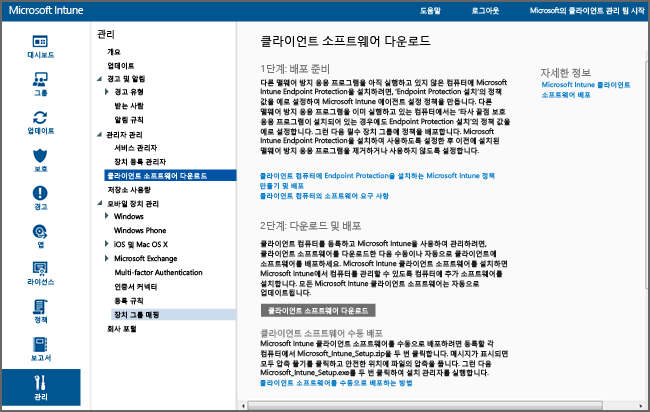

# Microsoft Intune を使用して Windows PC クライアントをインストールする
このガイドは、Microsoft Intune クライアント ソフトウェアによって、Windows PC を管理させる場合に役立ちます。

## 開始する前に
Intune クライアント ソフトウェアのインストールを開始する前に、「[Resolve GPO and Microsoft Intune policy conflicts (GPO と Microsoft Intune ポリシーの競合を解決する)](resolve-gpo-and-microsoft-intune-policy-conflicts.md)」のトピックを読み、クライアントを正しくインストールするために必要な準備を理解してから、このガイドをお読みください。

## クライアントのインストール
次の手順でクライアントをインストールします。

-   [クライアント ソフトウェアをダウンロードするには](#to-download-the-client-software)

次に、次の 1 つまたは複数の方法を使用してクライアントをインストールします。

-   [クライアント ソフトウェアを手動で展開するには](#to-manually-deploy-the-client-software)

-   [グループ ポリシーを使ってクライアント ソフトウェアを自動的に展開するには](#to-automatically-deploy-the-client-software-by-using-group-policy)

-   [イメージの一部として Microsoft Intune クライアント ソフトウェアをインストールする](#install-the-microsoft-intune-client-software-as-part-of-an-image)

Intune でコンピューターを管理する必要がなくなった場合、コンピューターをインベントリから削除することができます。インベントリから削除すると、そのコンピューターからクライアント ソフトウェアも削除されます。 詳細については、「[Microsoft Intune コンピューター クライアントを使用した一般的な Windows PC 管理タスク](common-windows-pc-management-tasks-with-the-microsoft-intune-computer-client.md)」を参照してください。

### クライアント ソフトウェアをダウンロードするには

1.  [Microsoft Intune 管理コンソール](https://manage.microsoft.com/)で、**[管理]** &gt; **[クライアント ソフトウェアのダウンロード]** をクリックします。

  

2.  **[クライアント ソフトウェアのダウンロード]** ページで、**[クライアント ソフトウェアのダウンロード]** をクリックし、ソフトウェアを含む **Microsoft_Intune_Setup.zip** パッケージをネットワーク上の安全な場所に保存します。

    > [!NOTE]
    > Intune クライアント ソフトウェアのインストール パッケージには、アカウントの情報が含まれています。 許可されていないユーザーがインストール パッケージにアクセスした場合は、埋め込み証明書に示されているアカウントにそのコンピューターを登録できることになります。

3.  インストール パッケージの内容をネットワーク上の安全な場所に抽出します。

    > [!IMPORTANT]
    > 抽出した **ACCOUNTCERT** ファイルを削除したり、名前を変更したりすると、クライアント ソフトウェアをインストールできなくなります。

### クライアント ソフトウェアを手動で展開するには

1.  コンピューターで、クライアント ソフトウェアのインストール ファイルを抽出したフォルダーを参照し、**Microsoft_Intune_Setup.exe** を実行してインストールを開始します。

    > [!NOTE]
    > クライアント コンピューターのタスク バーに表示されるアイコンにマウスをポイントすると、インストールの状態が表示されます。

### グループ ポリシーを使ってクライアント ソフトウェアを自動的に展開するには

1.  **Microsoft_Intune_Setup.exe** と **MicrosoftIntune.accountcert** というファイルを含むフォルダーで、次のコマンドを実行して、32 ビットおよび 64 ビット コンピューター用の Windows インストーラーベースのインストール プログラムを抽出します。

    ```
    Microsoft_Intune_Setup.exe/Extract <destination folder>
    ```

2.  **Microsoft_Intune_x86.msi** ファイル、**Microsoft_Intune_x64.msi** ファイル、および **MicrosoftIntune.accountcert** ファイルを、クライアント ソフトウェアをインストールする予定のすべてのコンピューターからアクセスできるネットワーク上の場所にコピーします。

    > [!IMPORTANT]
    > ファイルの名前を変更すると、クライアント ソフトウェアをインストールできなくなります。

3.  グループ ポリシーを使用して、ネットワーク上のコンピューターにソフトウェアを展開します。

    グループ ポリシーを使用してソフトウェアを自動的に展開する方法の詳細については、Windows Server のマニュアルを参照してください。

### イメージの一部として Microsoft Intune クライアント ソフトウェアをインストールする
Intune クライアント ソフトウェアは、次の手順例を基にして、オペレーティング システム イメージの一部としてコンピューターに展開できます。

1.  クライアント インストール ファイルの **Microsoft_Intune_Setup.exe** と **MicrosoftIntune.accountcert** を、基準コンピューターの **%Systemdrive%\Temp\Microsoft_Intune_Setup** フォルダーにコピーします。

2.  次のコマンドを **SetupComplete.cmd** スクリプトに追加して、 **WindowsIntuneEnrollPending** レジストリのエントリを作成します。

    ```
    %windir%\system32\reg.exe add HKEY_LOCAL_MACHINE\Software\Microsoft\Onlinemanagement\Deployment /v
    WindowsIntuneEnrollPending /t REG_DWORD /d 1
    ```

3.  **setupcomplete.cmd** に次のコマンドを追加して、/PrepareEnroll コマンド ライン引数を使用して登録パッケージが実行されるようにします。

    ```
    %systemdrive%\temp\Microsoft_Intune_Setup\Microsoft_Intune_Setup.exe /PrepareEnroll
    ```
    > [!TIP]
    >  **SetupComplete.cmd** スクリプトを使用すると、ユーザーがログオンする前に、Windows セットアップによってシステムを変更できます。 **/PrepareEnroll** というコマンド ライン引数は、Windows セットアップの実行後に、対象のコンピューターが Intune に自動的に登録されるようにする引数です。

4.  **SetupComplete.cmd** を、基準コンピューターの **%Windir%\Setup\Scripts** フォルダーに配置します。

5.  基準コンピューターのイメージをキャプチャして、対象のコンピューターに展開します。

対象のコンピューターで Windows セットアップの実行が完了し、コンピューターが再起動すると、 **WindowsIntuneEnrollPending** レジストリ キーが作成されます。 登録パッケージによって、コンピューターが登録されたかどうかがチェックされます。 登録されている場合は、何も行われません。 登録されていない場合は、Microsoft Intune への自動登録タスクが作成されます。

スケジュールに従って、次回の自動登録タスクが実行されると、 **indowsIntuneEnrollPending** レジストリ値が存在するかどうかがチェックされ、対象の PC が Intune に登録されます。 登録できなかった場合は、このタスクが次回実行されるときに登録されます。 再試行は 1 か月間継続されます。

登録が正常に完了するか、1 か月後に、対象のコンピューターから Intune への自動登録タスク、**WindowsIntuneEnrollPending** レジストリ値、およびアカウント証明書が削除されます。

## クライアントの正常展開の監視と確認
次のいずれかの手順を使用して、クライアントの正常展開を監視および確認できます。

### Microsoft Intune 管理コンソールでクライアント ソフトウェアのインストールを確認するには

1.  [Microsoft Intune 管理コンソール](https://manage.microsoft.com/)で、**[グループ]** &gt; **[すべてのデバイス]** &gt; **[すべてのコンピューター]** をクリックします。

2.  コンピューターの一覧を下にスクロールして、Intune と通信している管理対象コンピューターを見つけます。または、特定の管理対象コンピューターを検索する場合は、 **[デバイスの検索]** ボックスに、そのコンピューターの名前か名前の一部を入力します。

3.  コンソールの下部ウィンドウに表示されるコンピューターの状態を確認し、エラーがあれば解決します。

### 登録されているすべてのコンピューターを表示する、コンピューターのインベントリ レポートを作成するには

1.  [Microsoft Intune 管理コンソール](https://manage.microsoft.com/)で、**[レポート]** &gt; **[コンピューター インベントリ レポート]** をクリックします。

2.   **[新しいレポートの作成]** ページで、(フィルターを適用しない場合は) すべてのフィールドを既定値のままにして、 **[レポートの表示]**をクリックします。

3.  新しいウィンドウで **[コンピューター インベントリ レポート]** ページが開き、Intune に登録されているすべてのコンピューターが表示されます。

    > [!TIP]
    > レポートの列見出しをクリックすると、列の内容で一覧が並べ替えられます。


### 関連項目
[Microsoft Intune を使用して Windows PC を管理する](manage-windows-pcs-with-microsoft-intune.md)
[Microsoft Intune でのクライアント セットアップのトラブルシューティング](../troubleshoot/troubleshoot-client-setup-in-microsoft-intune)


<!--HONumber=Jul16_HO3-->


