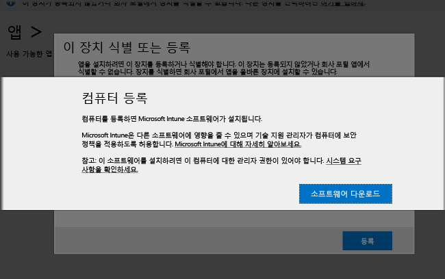

---

title: "PC 클라이언트 소프트웨어 설치 | Microsoft Intune"
description: "이 가이드를 사용하여 Microsoft Intune 클라이언트 소프트웨어에서 관리되는 Windows PC를 얻을 수 있습니다."
keywords: 
author: NathBarn
manager: arob98
ms.date: 07/19/2016
ms.topic: article
ms.prod: 
ms.service: microsoft-intune
ms.technology: 
ms.assetid: 64c11e53-8d64-41b9-9550-4b4e395e8c52
ms.reviewer: owenyen
ms.suite: ems
translationtype: Human Translation
ms.sourcegitcommit: eba2421fb929d21eb36c273eb6cb43a06ac03cb4
ms.openlocfilehash: ed92874cce2877d31d83a619ec8ffb63a57cd5c3


---

# <a name="install-the-intune-software-client-on-windows-pcs"></a>Windows PC에 Intune 소프트웨어 클라이언트 설치
Intune 클라이언트 소프트웨어를 설치하여 Windows PC를 등록할 수 있습니다. 다음 방법을 통해 Intune 클라이언트 소프트웨어를 설치할 수 있습니다.

- 수동으로 설치
- 그룹 정책을 사용하 설치
- 디스크 이미지에 포함
- 사용자가 설치

처음 다운로드하는 Intune 소프트웨어 클라이언트에는 PC를 Intune 관리에 등록하는 데 필요한 최소 소프트웨어가 포함됩니다. PC 등록 후 Intune 소프트웨어 클라이언트는 PC 관리에 필요한 전체 클라이언트 소프트웨어를 다운로드합니다.

이 일련의 다운로드는 처음에 PC를 Intune에 등록하는 데 필요한 시간을 최소화합니다. 또한 두 번째 다운로드가 완료된 후 클라이언트에서 최신 소프트웨어를 사용할 수 있도록 해줍니다.

## <a name="download-the-intune-client-software"></a>Intune 클라이언트 소프트웨어 다운로드

사용자가 직접 Intune 소프트웨어를 설치하는 방법을 제외한 모든 방법에서는 소프트웨어를 배포할 수 있도록 다운로드해야 합니다.

1.  [Microsoft Intune 관리 콘솔](https://manage.microsoft.com/)에서 **관리** &gt; **클라이언트 소프트웨어 다운로드**를 클릭합니다.

  

2.  **클라이언트 소프트웨어 다운로드** 페이지에서 **클라이언트 소프트웨어 다운로드**를 클릭합니다. 그런 다음 소프트웨어가 포함된 **Microsoft_Intune_Setup.zip** 패키지를 네트워크의 안전한 위치에 저장합니다.

    > [!NOTE]
    > Intune 클라이언트 소프트웨어 설치 패키지에는 사용자 계정에 대한 정보가 포함되어 있습니다. 권한이 없는 사용자가 설치 패키지에 대한 액세스 권한을 얻는 경우 포함된 인증서에 표시된 계정에 컴퓨터를 등록하고 회사 리소스에 대한 액세스 권한을 얻을 수 있습니다.

3.  설치 패키지의 콘텐츠를 네트워크의 안전한 위치로 추출합니다.

    > [!IMPORTANT]
    > 추출된 **ACCOUNTCERT** 파일의 이름을 바꾸거나 제거하지 마세요. 이름을 바꾸거나 제거하면 클라이언트 소프트웨어가 설치되지 않습니다.

## <a name="deploy-the-client-software-manually"></a>클라이언트 소프트웨어 수동 배포

컴퓨터에서 클라이언트 소프트웨어 설치 파일이 있는 폴더로 이동합니다. 그런 다음 **Microsoft_Intune_Setup.exe**를 실행하여 클라이언트 소프트웨어를 설치합니다.

    > [!NOTE]
    > The status of the installation is displayed when you hover over the icon in the taskbar on the client computer.

## <a name="deploy-the-client-software-by-using-group-policy"></a>그룹 정책을 사용하여 클라이언트 소프트웨어 배포

1.  **Microsoft_Intune_Setup.exe** 및 **MicrosoftIntune.accountcert** 파일이 포함된 폴더에서 다음 명령을 실행하여 32비트 및 64비트 컴퓨터용 Windows Installer 기반 설치 프로그램을 추출합니다.

    ```
    Microsoft_Intune_Setup.exe/Extract <destination folder>
    ```

2.  클라이언트 소프트웨어를 설치할 모든 컴퓨터에서 액세스할 수 있는 네트워크 위치로 **Microsoft_Intune_x86.msi** 파일, **Microsoft_Intune_x64.msi** 파일 및 **MicrosoftIntune.accountcert** 파일을 복사합니다.

    > [!IMPORTANT]
    > 파일을 서로 다른 위치에 저장하거나 파일 이름을 바꾸지 마십시오. 그렇게 하면 클라이언트 소프트웨어가 설치되지 않습니다.

3.  그룹 정책을 사용하여 네트워크의 컴퓨터에 소프트웨어를 배포합니다.

    그룹 정책을 사용하여 소프트웨어를 자동으로 배포하는 방법에 대한 자세한 내용은 Windows Server 문서를 참조하십시오.

## <a name="deploy-the-client-software-as-part-of-an-image"></a>클라이언트 소프트웨어를 이미지의 일부로 배포
다음 절차를 지침으로 사용하여 운영 체제 이미지의 일부로 Intune 클라이언트 소프트웨어를 컴퓨터에 배포할 수 있습니다.

1.  클라이언트 설치 파일, **Microsoft_Intune_Setup.exe** 및 **MicrosoftIntune.accountcert**를 참조 컴퓨터의 **%Systemdrive%\Temp\Microsoft_Intune_Setup** 폴더로 복사합니다.

2.  **SetupComplete.cmd** 스크립트에 다음 명령을 추가하여 **WindowsIntuneEnrollPending** 레지스트리 항목을 만듭니다.

    ```
    %windir%\system32\reg.exe add HKEY_LOCAL_MACHINE\Software\Microsoft\Onlinemanagement\Deployment /v
    WindowsIntuneEnrollPending /t REG_DWORD /d 1
    ```

3.  **setupcomplete.cmd**에 다음 명령을 추가하여 /PrepareEnroll 명령줄 인수로 등록 패키지를 실행합니다.

    ```
    %systemdrive%\temp\Microsoft_Intune_Setup\Microsoft_Intune_Setup.exe /PrepareEnroll
    ```
    > [!TIP]
    > **SetupComplete.cmd** 스크립트를 사용하여 Windows 설치 프로그램을 통해 사용자가 로그온하기 전에 시스템의 수정 사항을 적용할 수 있습니다. **/PrepareEnroll** 명령줄 인수는 Windows 설치 프로그램이 완료된 후 Intune에서 대상 컴퓨터를 자동으로 등록하도록 준비합니다.

4.  참조 컴퓨터의 **%Windir%\Setup\Scripts** 폴더에 **SetupComplete.cmd**를 저장합니다.

5.  참조 컴퓨터의 이미지를 캡처한 후 대상 컴퓨터에 배포합니다.

Windows 설치 프로그램 완료 시 대상 컴퓨터가 다시 시작되면 **WindowsIntuneEnrollPending** 레지스트리 키가 만들어집니다. 등록 패키지는 컴퓨터가 등록되어 있는지 여부를 확인합니다. 컴퓨터가 등록된 경우 추가 작업은 없습니다. 컴퓨터가 등록되지 않은 경우 등록 패키지는 Microsoft Intune 자동 등록 작업을 만듭니다.

다음 번 예약 시간에 자동 등록 작업이 실행될 경우 이 작업은 **WindowsIntuneEnrollPending** 레지스트리 값이 있는지 확인하고 Intune에서 대상 PC를 등록하려고 시도합니다. 어떠한 이유로든 등록에 실패하면 다음에 작업을 실행할 때 등록을 다시 시도합니다. 재시도는 한 달 동안 계속됩니다.

성공적으로 등록되거나 한 달이 지난 후(둘 중 빠른 시간)에는 Intune 자동 등록 작업인 **WindowsIntuneEnrollPending** 레지스트리 값 및 계정 인증서가 대상 컴퓨터에서 삭제됩니다.

## <a name="instruct-users-to-selfenroll"></a>사용자에게 직접 등록 지시

사용자가 [회사 포털 웹사이트](http://portal..manage.microsoft.com)로 이동하여 Intune 클라이언트 소프트웨어를 설치할 수 있습니다. 웹 포털에서 장치가 Windows PC임을 감지할 수 있으면 Intune 소프트웨어 클라이언트를 다운로드하여 PC를 등록하라는 메시지가 표시됩니다. 소프트웨어가 다운로드되면 사용자는 소프트웨어를 설치하여 PC를 관리 상태로 설정할 수 있습니다.



## <a name="monitor-and-validate-successful-client-deployment"></a>성공적인 클라이언트 배포 모니터링 및 유효성 검사
다음 절차에 따라 성공적인 클라이언트 배포를 모니터링하고 유효성을 검사할 수 있습니다.

### <a name="to-verify-the-installation-of-the-client-software-from-the-microsoft-intune-administrator-console"></a>Microsoft Intune 관리자 콘솔에서 클라이언트 소프트웨어 설치를 확인하려면

1.  [Microsoft Intune 관리 콘솔](https://manage.microsoft.com/)에서 **그룹** &gt; **모든 장치** &gt; **모든 컴퓨터**를 클릭합니다.

2.  목록에서 Intune과 통신하는 관리 컴퓨터를 찾거나, **장치 검색** 상자에 컴퓨터 이름이나 이름 중 일부를 입력하여 특정 관리 컴퓨터를 검색합니다.

3.  콘솔 맨 아래 창에 있는 컴퓨터의 상태를 확인합니다. 오류가 있으면 해결합니다.

### <a name="to-create-a-computer-inventory-report-to-display-all-enrolled-computers"></a>등록된 모든 컴퓨터를 표시하는 컴퓨터 인벤토리 보고서를 만들려면

1.  [Microsoft Intune 관리 콘솔](https://manage.microsoft.com/)에서 **보고서** &gt; **컴퓨터 인벤토리 보고서**를 클릭합니다.

2.  **새 보고서 만들기** 페이지의 모든 필드에서 기본값을 유지하고(필터를 적용하지 않는 한), **보고서 보기**를 클릭합니다.

3.  **컴퓨터 인벤토리 보고서** 페이지가 새 창에서 열리며, Intune에 등록된 모든 컴퓨터를 표시합니다.

    > [!TIP]
    > 보고서의 모든 열 제목을 클릭하여 해당 열의 콘텐츠별로 목록을 정렬합니다.


### <a name="see-also"></a>참고 항목
[Microsoft Intune으로 Windows PC 관리](manage-windows-pcs-with-microsoft-intune.md)
[클라이언트 설정 문제 해결](../troubleshoot/troubleshoot-client-setup-in-microsoft-intune.md)


<!--HONumber=Nov16_HO1-->


