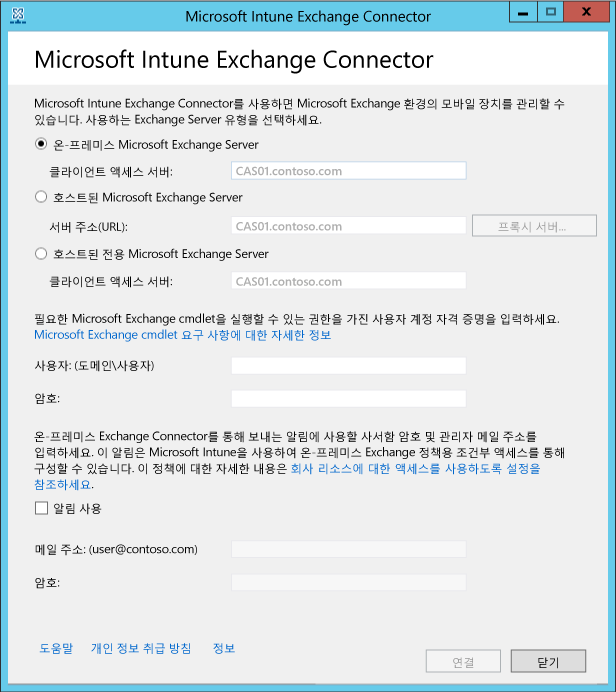

# 社内の Exchange 用の Microsoft Intune Exchange Connector のインストール

モバイル デバイスのメールボックスをホストする Exchange Server と Microsoft Intune の接続を設定するには、Intune 管理者コンソールで On-Premises Connector ツールをダウンロードし、構成する必要があります。 Intune は、サブスクリプションごとに任意の種類の Exchange Connector 接続を 1 つだけサポートします。

## On-Premises Connector の要件
On-Premises Exchange Connector をインストールするコンピューターの要件は次のとおりです。

|要件|説明|
|---------------|--------------------|
|Operating systems|Intune は、Windows Server 2008 SP2 64 ビット、Windows Server 2008 R2、Windows Server 2012、または Windows Server 2012 R2 の任意のエディションを実行しているコンピューター上の On-Premises Exchange Connector をサポートします。  Server Core インストールでは、コネクタはサポートされません。|
|Microsoft Exchange のバージョン|どの On-Premises Connector にも、Microsoft Exchange 2010 SP1 以降または従来の Exchange Online Dedicated が必要です。 Exchange Online Dedicated 環境が**新しい**構成か**従来の**構成かを確認するには、アカウント マネージャーに問い合わせてください。|
|モバイル デバイス管理機関| [モバイル デバイス管理機関を Intune に設定します](get-ready-to-enroll-devices-in-microsoft-intune.md#set-mobile-device-management-authority)。|
|ハードウェア|Connector をインストールするコンピューターには、1.6 GHz の CPU と 2 GB の RAM と 10 GB の空きディスク容量の最小ハードウェアが必要です。|
|Active Directory の同期|いずれかの Connector を使用して Intune を Exchange Server に接続するには、[Active Directory の同期をセットアップ](/intune/get-started/start-with-a-paid-subscription-to-microsoft-intune-step-3)して、ローカル ユーザーとセキュリティ グループが Azure Active Directory のインスタンスと同期されるようにする必要があります。|
|その他のソフトウェア|Connector をホストするコンピューターに、Microsoft .NET Framework 4 および Windows PowerShell 2.0 の完全インストールがインストールされている必要があります。|
|Network (ネットワーク)|コネクタをインストールするコンピューターは、Exchange Server をホストするドメインと信頼関係があるドメインに参加している必要があります。  コンピューターは、ポート 80 と 443 でファイアウォールとプロキシ サーバー経由で Intune サービスにアクセスできるように構成する必要があります。 Intune によって使用されるドメインには、manage.microsoft.com、&#42;manage.microsoft.com、および &#42;manage.microsoft.com が含まれます。|
|ホスト型 Exchange が構成済みで実行中である|詳細については、「[Exchange Server 2016](https://technet.microsoft.com/library/mt170645.aspx)」を参照してください。 |

### Exchange コマンドレットの要件

Intune Exchange Connector が使用する Active Directory ユーザー アカウントを作成する必要があります。 アカウントには、次の必須の Windows PowerShell Exchange コマンドレットを実行するための権限が必要です。

 -   Get-ActiveSyncOrganizationSettings, Set-ActiveSyncOrganizationSettings
 -   Get-CasMailbox、Set-CasMailbox
 -   Get-ActiveSyncMailboxPolicy、Set-ActiveSyncMailboxPolicy、New-ActiveSyncMailboxPolicy、Remove-ActiveSyncMailboxPolicy
 -   Get-ActiveSyncDeviceAccessRule、Set-ActiveSyncDeviceAccessRule、New-ActiveSyncDeviceAccessRule、Remove-ActiveSyncDeviceAccessRule
 -   Get-ActiveSyncDeviceStatistics
 -   Get-ActiveSyncDevice
 -   Get-ExchangeServer
 -   Get-ActiveSyncDeviceClass
 -   Get-Recipient
 -   Clear-ActiveSyncDevice、Remove-ActiveSyncDevice
 -   Set-ADServerSettings
 -   Get-Command

## On-Premises Exchange Connector ソフトウェア インストール パッケージのダウンロード

1. On-Premises Exchange Connector のサポートされている Windows Server オペレーティング システムで、Exchange Server を使用するライセンスを持つ Exchange テナント内の管理者であるユーザー アカウントを使用して、[Microsoft Intune 管理コンソール](http://manage.microsoft.com) (http://manage.microsoft.com) を開きます。

2.  ワークスペースのショートカット ウィンドウで **[管理]** を選択し、**[モバイル デバイス管理]** > **[Microsoft Exchange]****[Exchange 接続のセットアップ]** の順に選択します。

3.  **[Exchange 接続のセットアップ]** ページで **[On-Premises Connector のダウンロード]** を選びます。

4.  On-Premises Exchange Connector は、開いたり保存したりできる圧縮 (zip 形式) フォルダーに含まれています。 **[ファイルのダウンロード]** ダイアログ ボックスで **[保存]** を選んで、圧縮フォルダーを安全な場所に保存します。

> [!IMPORTANT]
> On-Premises Exchange Connector フォルダー内のファイルの名前を変更したり、移動しないでください。 フォルダーの内容を移動したり、名前を変更したりすると、インストールが中断します。

## Intune On-Premises Exchange Connector のインストールと構成
次の手順で、Intune On-Premises Connector をインストールします。 On-Premises Exchange Connector は、Intune サブスクリプション 1 つで 1 台のコンピューターに 1 回だけインストールできます。 On-Premises Exchange Connector をもう 1 つ構成しようとすると、新しい接続で元の接続が置き換えられます。

1.  On-Premises Connector のサポートされているオペレーティング システムで、**Exchange_Connector_Setup.zip** を安全な場所に抽出します。

2.  ファイルが抽出されたら、抽出されたフォルダーを開き、**Exchange_Connector_Setup.exe** をダブルクリックして、On-Premises Exchange Connector をインストールします。

    > [!IMPORTANT]
    > 抽出先のフォルダーが安全な場所にない場合は、On-Premises Connector をインストールした後で、**WindowsIntune.accountcert** という証明書ファイルを削除してください。

3.  **[Exchange Server]** フィールドで、Exchange Server 環境の種類を **[社内の Microsoft Exchange Server]** または** [ホストされた Microsoft Exchange Server]** から選択します。

  

  社内の Exchange Server の場合、**クライアント アクセス サーバー** ロールをホストする Exchange サーバーのサーバー名または完全修飾ドメイン名を指定します。

  ホスト型 Exchange Server の場合、Exchange Server のアドレスを指定します。 ホスト型 Exchange サーバーの URL を見つけるには:

      1.  Office 365 の Outlook Web App を開きます。

      2.  “?”  アイコンをクリックし、 **[バージョン情報]**を選択します。

      3.   **[POP 外部サーバー]** の値を探します。

      4.  **[プロキシ サーバー]** を選んで、ホスト型 Exchange サーバーのプロキシ サーバー設定を指定します。
        1.   **[モバイル デバイス情報を同期するときにプロキシ サーバーを使用する]**を選択します。

        2.  サーバーへのアクセスに使用する **[プロキシ サーバー名]** と **[ポート番号]** を入力します。

        3.  プロキシ サーバーにアクセスできるユーザーの資格情報を指定する必要がある場合は、[資格情報を使用してプロキシ サーバーに接続する] を選び、**ドメイン\ユーザー**と**パスワード**を入力します。

        4.  **[OK]** を選びます。

5.  Exchange Server への接続に必要な資格情報の**ユーザー (ドメイン\ユーザー)** と**パスワード**を入力します。

6.  ユーザーの Exchange メールボックスに通知を送信するために必要な管理資格情報を指定します。 これらの通知は、Intune で条件付きアクセス ポリシーにより構成できます。

    自動検出サービスと Exchange Web Services が Exchange クライアント アクセス サーバーで構成されていることを確認します。 詳細については、「 [クライアント アクセス サーバー](https://technet.microsoft.com/library/dd298114.aspx)」を参照してください。

7.  **[パスワード]** フィールドに、このアカウントで Intune から Exchange Server にアクセスするのに必要なパスワードを入力します。

8. **[接続]**を選びます。

    接続が確立されるまでに数分かかることがあります。

接続の構成中、Exchange Connector にインターネットへのアクセスに必要なプロキシの設定が保存されます。 プロキシの設定を変更した場合は、Exchange Connector で新しい設定が使用されるように、Exchange Connector を構成し直す必要があります。

Exchange Connector が接続を確立すると、Exchange Connector で管理されているユーザーに関連付けられたモバイル デバイスが自動的に同期されて、Exchange Connector に追加されます。 この同期が完了するまでに時間がかかる場合があります。

> [!NOTE]
> On-Premises Exchange Connector をインストールし、いずれかの時点で Exchange 接続を削除した場合、インストールされていたコンピューターから On-Premises Exchange Connector をアンインストールする必要があります。

## Exchange 接続の確認

Exchange Connector を正常に構成したら、接続のステータスと前回の成功した同期の試行を表示できます。 [Microsoft Intune 管理コンソール](http://manage.microsoft.com)で、**[管理]** ワークスペースを選択し、**[モバイル デバイス管理]** で **[Microsoft Exchange]** を選択して、**[Exchange の接続情報]** に表示される設定内容の詳細を確認します。

また、前回いつ同期が完了したかも確認することができます。

<!--HONumber=Jul16_HO5-->

