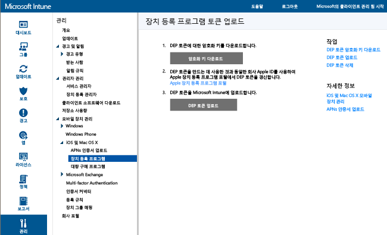

# 会社所有のデバイス登録プログラムによる iOS デバイスの登録
Microsoft Intune は、"無線" で Device Enrollment Program (DEP) を通じて購入した iOS デバイスを登録する登録プロファイルを展開できます。 登録パッケージには、デバイスのセットアップ アシスタント オプションを含めることができます。 DEP を使用して登録したデバイスの場合は、ユーザーが登録を解除することはできません。

## Microsoft Intune を使用した iOS デバイスの Apple DEP 管理
Apple の Device Enrollment Program (DEP) を使用して企業所有の iOS デバイスを管理するには、組織が Apple DEP に参加し、そのプログラムを使用してデバイスを取得する必要があります。 そのプロセスの詳細については、  [https://deploy.apple.com](https://deploy.apple.com)を参照してください。 このプログラムの利点には、各デバイスをコンピューターに USB 接続することなく、デバイスを楽に設定できる点があります。

DEP に企業所有の iOS デバイスを登録するには、Apple の DEP トークンが必要です。 このトークンにより、Intune は企業所有の DEP 参加デバイスに関する情報を同期できるようになります。 また、Intune は Apple への登録プロファイルのアップロードを実行して、デバイスをそれらのプロファイルに割り当てられるようになります。

1.  **Microsoft Intune を使用して iOS デバイス管理を開始する** iOS Device Enrollment Program (DEP) デバイスを登録する前に、まず、Intune の iOS 管理を有効にする必要があります。

2.  **暗号化キーを取得する** 管理者ユーザーとして、[Microsoft Intune の管理コンソール](http://manage.microsoft.com)を開き、**[管理]** &gt; **[モバイル デバイス管理]** &gt; **[iOS]** &gt; **[デバイス登録プログラム]** の順に移動して、**[暗号化キーのダウンロード]** をクリックします。 暗号化キー (.pem) ファイルをローカルに保存します。 .pem ファイルは、Apple Device Enrollment Program ポータルから信頼関係証明書を要求するために使用します。

      

3.  **デバイス登録プログラムのトークンを取得する** [Device Enrollment Program ポータル](https://deploy.apple.com) (https://deploy.apple.com) に移動し、会社の Apple ID でサインインします。 この Apple ID は、将来 DEP トークンを更新するために使用する必要があります。

    1.  [Device Enrollment Program ポータル](https://deploy.apple.com)で、**[Device Enrollment Program]** &gt; **[Manage Servers]** の順に移動し、**[Add MDM Server]** をクリックします。

    2.   **MDM サーバー名** を入力し、[ **Next**] をクリックします。 サーバー名は、自分が MDM サーバーを識別できるようにするための名前です。 Microsoft Intune サーバーの名前または URL ではありません。

    3.  **[Add &lt;ServerName&gt;]** ダイアログ ボックスが開きます。 **[Choose File…]** をクリックして .pem ファイルをアップロードし、**[Next]** をクリックします。

    4.  **[Add &lt;ServerName&gt;]** ダイアログ ボックスに、**[Your Server Token]** リンクが表示されます。 サーバー トークン (.p7m) ファイルをコンピューターにダウンロードしたら、[ **Done**] をクリックします。

    この証明書 (.p7m) ファイルは、Intune と Apple の Device Enrollment Program サーバーとの間に信頼関係を確立するために使用されます。

4.  **Intune に DEP トークンを追加する** [Microsoft Intune の管理コンソール](http://manage.microsoft.com)で、**[管理]** &gt; **[モバイル デバイス管理]** &gt; **[iOS]** &gt; **[デバイス登録プログラム]** の順に移動して、**[DEP トークンのアップロード]** をクリックします。 証明書 (.p7m) ファイルを**参照** し、 **Apple ID**を入力して、[ **アップロード**] をクリックします。

5.  **業務用デバイスの登録ポリシーを追加する** [Microsoft Intune 管理コンソール](http://manage.microsoft.com)で、**[ポリシー]** &gt; **[業務用デバイスの登録]** の順に移動し、**[追加]** をクリックします。

    **[名前]**、**[説明]** などの **[全般]** の各項目を入力し、プロファイルに割り当てられているデバイスにユーザー アフィニティがあるか、グループに属するかを指定します。
      - **ユーザー アフィニティを要求する**: 初回セットアップ時にデバイスをユーザーに関連付ける必要があります。その後、デバイスはそのユーザーとして企業のデータやメールにアクセスすることが許可されます。  ユーザーに属し、ポータル サイトを使用する必要がある (つまりアプリをインストールする必要がある) DEP 管理対象のデバイスの場合、**ユーザー アフィニティ**を構成することをお勧めします。
      - **ユーザー アフィニティがありません**: デバイスは、ユーザーと関連付けられません。 このデバイス関連付け情報を使用すると、ローカルのユーザー データにアクセスしなくてもタスクを実行できます。 基幹業務アプリのインストールに使用されるポータル サイト アプリなど、ユーザー アフィリエーションが必要なアプリは機能しません。

    **デバイスを次のグループに割り当てる**こともできます。 **[選択...]** をクリックすると、グループが選択されます。

    >[!Important]
    >グループの割り当てが Intune から Azure Active Directory に移動します。 [詳細情報](#changes-to-intune-group-assignments)

    次に、**[このポリシーのデバイス登録プログラムの設定を構成します]** を有効にして DEP をサポートします。

      ![[セットアップ アシスタント] ウィンドウ](../media/pol-sa-corp-enroll.png)

     次の設定を DEP 管理対象デバイスに使用できます。

     - **部門** - アクティブ化中にユーザーが [構成について] をタップすると表示されます
     - **サポート電話番号** - アクティブ化中にユーザーが **[ヘルプが必要ですか]** ボタンをクリックすると表示されます
     - **準備モード** - アクティブ化中はこの状態が設定され、デバイスの工場出荷時設定以外では変更できません
        - **監督解除済み** - 管理機能が制限されます
        - **監督下** - より多くの管理オプションが使用可能になり、既定で [アクティブ化ロック] は無効になります
     - **デバイスへの登録プロファイルのロック** - アクティブ化中はこの状態が設定され、デバイスの工場出荷時設定以外では変更できません
        - **無効** - **[設定]** メニューから管理プロファイルを削除できます
        - **有効** - (**準備モード** = **監督下**にする必要があります) 管理プロファイルの削除を許可する iOS 設定を無効にします
     - **セットアップ アシスタントのオプション** - これらの設定は省略可能であり、iOS の **[設定]** メニューで後で構成できます
        - **パスコード** - アクティブ化時にパスコードの入力を求めます。 デバイスがセキュリティで保護される場合や、他の何らかの方法 (デバイスを 1 つのアプリに制限するキオスク モードなど) でアクセスが制御されている場合を除き、パスコードは常に必須にしてください。
        - **位置情報サービス** - 有効にすると、アクティブ化時に、セットアップ アシスタントによってサービスがプロンプトされます
        - **復元** - 有効にすると、アクティブ化時に、セットアップ アシスタントによって iCloud バックアップがプロンプトされます
        - **Apple ID** - Intune でインストールされるアプリを含め、iOS App Store アプリをダウンロードする際に Apple ID が必須になります。 有効にして、Intune で ID を指定せずにアプリをインストールしようとすると、Apple ID の入力が求められます。
        - **使用条件** - 有効にすると、アクティブ化時に、セットアップ アシスタントによって Apple の使用条件に同意するように求められます
        - **タッチ ID** - 有効にすると、アクティブ化時に、セットアップ アシスタントによってこのサービスがプロンプトされます
        - **Apple Pay** - 有効にすると、アクティブ化時に、セットアップ アシスタントによってこのサービスがプロンプトされます
        - **ズーム** - 有効にすると、アクティブ化時に、セットアップ アシスタントによってこのサービスがプロンプトされます
        - **Siri** - 有効にすると、アクティブ化時に、セットアップ アシスタントによってこのサービスがプロンプトされます
        - **Apple に診断データを送信する** - 有効にすると、アクティブ化時に、セットアップ アシスタントによってこのサービスがプロンプトされます
     -  **追加の Apple Configurator の管理を有効にします** - Apple Configurator 経由で iTunes または管理とファイルが同期されないようにするには、**[許可しない]** に設定します。 Microsoft では、**[許可しない]** を使用して証明書ありまたは証明書なしの手動の展開を許可するのではなく、[許可しない] に設定して、Apple Configurator からその他の構成をエクスポートし、Intune 経由でカスタム iOS 構成プロファイルとして展開することをお勧めします。
        - **許可しない** - デバイスの USB 経由の通信を禁止します (ペアリングを無効にします)
        - **許可する** - すべての PC または Mac で USB 接続経由のデバイス通信を許可します
        - **証明書が必要** - 登録プロファイルにインポートされた証明書を使用した Mac とのペアリングを許可します

6.  **管理のために DEP デバイスを割り当てる** [Device Enrollment Program ポータル](https://deploy.apple.com) (https://deploy.apple.com) に移動し、会社の Apple ID でサインインします。 **[Deployment Program] (プログラムの展開) ** &gt; **[Device Enrollment Program] (デバイス登録プログラム)** &gt; **[Manage Devices] (デバイスの管理)** の順に移動します。  **デバイスの選択**方法を指定し、デバイス情報を入力して、デバイスの **シリアル番号**、 **注文番号**、または **CSV ファイルのアップロード**で詳細を指定します。 次に、**[Assign to Server] (サーバーに割り当てる)** を選択し、Microsoft Intune に指定した &lt;ServerName&gt; を選択して、**[OK]** をクリックします。

7.  **DEP 管理対象デバイスを同期する** 管理者ユーザーとして、[Microsoft Intune 管理コンソール](http://manage.microsoft.com)を開き、**[管理]** &gt; **[モバイル デバイス管理]** &gt; **[iOS]** &gt; **[デバイス登録プログラム]** に移動して、**[今すぐ同期]** をクリックします。 同期要求が Apple に送信されます。 同期後に DEP 管理対象デバイスを表示するには、[Microsoft Intune 管理コンソール](http://manage.microsoft.com)で、**[グループ]** &gt; **[会社が所有しているすべてのデバイス]** の順に移動します。 デバイスの電源を入れ、セットアップ アシスタントを実行して、デバイスを登録するまで、**[会社が所有しているデバイス]** ワークスペースには管理対象デバイスの **[状態]** が "未接続" と表示されます。

    許容される DEP トラフィックについての Apple の規約に準拠するため、Intune では次の制限が課せられます。
     -  完全な DEP 同期は 7 日ごとに 1 回以上実行できません。 完全同期時に、Intune は Apple が Intune に割り当てたすべてのシリアル番号を、シリアルが以前に同期されているかどうかに関係なく更新します。 前回の完全同期の 7 日以内に完全同期が試みられると、Intune は Intune にまだ一覧表示されていないシリアル番号のみを更新します。
     -  すべての同期要求は、完了までに 10 分与えられます。 この時間中または要求が成功するまで、[同期] ボタンは無効にされます。

8.  **デバイスをユーザーに配布する** これで、会社が所有するデバイスをユーザーに配布できるようになりました。 iOS デバイスの電源をオンにすると、iOS デバイスが Intune の管理対象として登録されます。

## Intune グループ割り当ての変更

9 月から、デバイス グループの管理は Azure Active Directory に移行されます。 Azure Active Directory グループに切り替えた後は、グループの割り当ては**企業の登録プロファイル**のオプションに表示されません。 この変更は数か月間にわたりロールアウトされるため、変更はすぐに表示されないことがあります。 詳細な情報は間もなく公開されます。

### 関連項目
[デバイスの登録の準備](get-ready-to-enroll-devices-in-microsoft-intune.md)

<!--HONumber=Jul16_HO1-->

