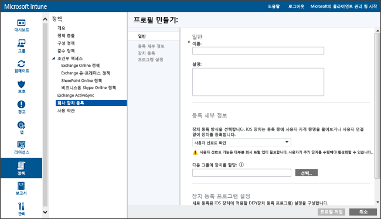

# Apple Configurator를 사용하여 iOS 장치 직접 등록
Intune은 Mac 컴퓨터에서 실행되는 [Apple Configurator](http://go.microsoft.com/fwlink/?LinkId=518017) 도구를 사용하여 회사 소유의 iOS 장치를 등록하도록 지원합니다. 이 프로세스는 장치를 초기화하지 않고 미리 정의된 정책을 사용하여 장치를 등록합니다. 이 방법은 **사용자 선호도 없음**이 지정된 장치용이며, iOS 장치를 Mac 컴퓨터에 USB로 연결하여 회사 등록을 설정해야 합니다. IOS 장치를 직접 등록하는 경우 장치의 일련 번호를 몰라도 장치를 등록할 수 있습니다. 또한 등록 중에 Intune에서 장치 이름을 확인하기 전에 식별을 위해 장치에 이름을 지정할 수도 있습니다. 직접 등록된 장치의 경우 회사 포털 앱이 지원되지 않습니다. 이 설명서는 Mac 컴퓨터에서 Apple Configurator 2.0을 사용하고 있다고 가정합니다.

1.  **장치에 대한 프로필 만들기** 장치 등록 프로필은 장치에 적용되는 설정을 정의합니다. 등록된 iOS 장치에 대한 장치 등록 프로필을 아직 만들지 않은 경우 Apple Configurator를 사용하여 만듭니다.

    1.  [Microsoft Intune](http://manage.microsoft.com) 관리 콘솔에서 **정책** &gt; **회사 장치 등록**으로 이동한 후 **추가...**를 선택합니다.

        

    2.  장치 프로필에 대한 세부 정보를 입력합니다.

        -   **이름** – 장치 등록 프로필의 이름입니다. 사용자에게는 표시되지 않습니다.

        -   **설명** – 장치 등록 프로필에 대한 설명입니다. 사용자에게는 표시되지 않습니다.

        -   **사용자 정보** – 장치의 등록 방식을 지정합니다. 직접 등록의 경우 **사용자 선호도 없음**을 선택합니다.

        -   **장치 그룹 사전 할당** – 이 프로필이 배포된 모든 장치는 처음에 이 그룹에 속합니다. 등록 후 장치를 다시 할당할 수 있습니다.

            [!INCLUDE[groups deprecated](../includes/group-deprecation.md)]

    3.  **프로필 저장**을 선택하여 프로필을 추가합니다.

5.  **iOS 장치에 배포하기 위해 프로필을 .mobileconfig 형태로 내보내기** 만든 장치 프로필을 선택합니다. **내보내기...** 선택 . **프로필 다운로드**를 선택하고 다운로드한 .mobileconfig 파일을 저장합니다.

6.  **파일 전송** 다운로드한 .mobileconfig 파일을 Mac 컴퓨터에 복사합니다.
    > [!NOTE]
    > 등록 프로필 URL은 내보낸 날부터 2주 동안 유효합니다. 2주 후에 설정 도우미를 사용하여 등록할 새 등록 프로필 URL을 내보내야 합니다.
7.  **Apple Configurator를 사용하여 장치 준비** iOS 장치는 Mac 컴퓨터에 연결되고 모바일 장치 관리를 위해 등록됩니다.

    1.  Mac 컴퓨터에서 **Apple Configurator 2.0**을 시작합니다.

    2.  USB 코드를 사용하여 iOS 장치를 Mac 컴퓨터에 연결합니다. **사진**, **iTunes** 및 장치를 검색할 때 장치에 대해 열려 있는 기타 앱을 닫습니다.

    3.  Apple Configurator에서 연결된 iOS 장치를 한 번 클릭한 다음 **추가** 단추를 선택합니다. 장치에 추가할 수 있는 옵션이 드롭다운 목록에 나타납니다. **프로필**을 선택합니다.

    4.  파일 선택기를 사용하여 Intune에서 내보낸 .mobileconfig 파일을 선택하고 **추가**를 선택합니다. 프로필이 장치에 추가됩니다.  장치가 **감독되지 않음**인 경우 장치에서 설치에 동의해야 합니다.

8.  **프로필 설치** iOS 장치에 프로필을 설치할 준비가 되었습니다. 장치가 설정 도우미를 이미 완료했으며 사용할 준비가 된 상태여야 합니다.  등록 시 앱을 배포해야 하는 경우 앱 배포 시 Apple ID로 앱 스토어에 로그인해야 하기 때문에 장치에 Apple ID가 설정되어 있어야 합니다.

    1.  iOS 장치 잠금을 해제합니다.

    2.  **관리 프로필**에 대한 **프로필 설치** 대화 상자에서 **설치**를 탭합니다.

    3.  **장치 암호** 또는 **Apple ID**를 제공합니다(필요한 경우).

    4.  **경고**를 수락하고 **설치**를 탭합니다.

    5.  **원격 경고**를 수락하고 **신뢰**를 탭합니다.

    6.  **프로필 설치됨** 상자에서 프로필이 **설치됨** 상태임을 확인하면 **완료**를 선택합니다.

9. **프로필 확인**
    iOS 장치에서 **설정**을 시작하고 **일반**&gt; **장치 관리 ** &gt; **관리 프로필** &gt;로 이동한 다음 프로필 설치가 표시되는지 확인하고 iOS 정책 제한 및 설치된 앱을 확인합니다. 정책 제한 및 앱이 장치에 표시되는 데 최대 10분 정도 걸릴 수 있습니다.

10. **장치 배포** 이제 iOS 장치가 Intune에 등록되고 관리됩니다.

<!--HONumber=Aug16_HO1-->

