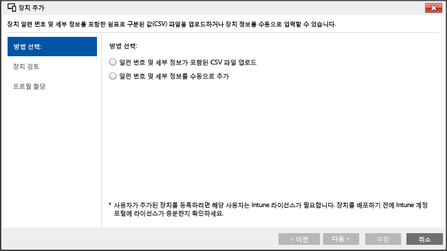

<<<<<<< HEAD
---
title: "설정 도우미를 사용하여 iOS 장치 등록 | Microsoft Intune"
description: "Apple Configurator 도구를 사용하여 회사 소유의 iOS 장치를 공장 초기화 장치에 등록하고 설정 도우미를 실행할 수 있도록 준비합니다."
keywords: 
author: NathBarn
manager: angrobe
ms.date: 07/20/2016
ms.topic: article
ms.prod: 
ms.service: microsoft-intune
ms.technology: 
ms.assetid: 46e5b027-4280-4809-b45f-651a6ab6d0cd
ms.reviewer: dagerrit
ms.suite: ems
translationtype: Human Translation
ms.sourcegitcommit: e2daff5dae435df55c866adbf602f554500d50e0
ms.openlocfilehash: 45aa4511945ab4763dc0dc35baefe47887e561bb

||||||| merged common ancestors
---
title: "설정 도우미를 사용하여 iOS 장치 등록 | Microsoft Intune"
description: "Apple Configurator 도구를 사용하여 회사 소유의 iOS 장치를 공장 초기화 장치에 등록하고 설정 도우미를 실행할 수 있도록 준비합니다."
keywords: 
author: NathBarn
manager: angrobe
ms.date: 07/20/2016
ms.topic: article
ms.prod: 
ms.service: microsoft-intune
ms.technology: 
ms.assetid: 46e5b027-4280-4809-b45f-651a6ab6d0cd
ms.reviewer: dagerrit
ms.suite: ems
translationtype: Human Translation
ms.sourcegitcommit: ecfeb73efed4a47256275120c52de232c556adfe
ms.openlocfilehash: 01d87b95d2599f75161c9a95ff4cf94375eedb60

=======
---
title: "설정 도우미를 사용하여 iOS 장치 등록 | Microsoft Intune"
description: "Apple Configurator 도구를 사용하여 회사 소유의 iOS 장치를 공장 초기화 장치에 등록하고 설정 도우미를 실행할 수 있도록 준비합니다."
keywords: 
author: NathBarn
manager: angrobe
ms.date: 07/20/2016
ms.topic: article
ms.prod: 
ms.service: microsoft-intune
ms.technology: 
ms.assetid: 46e5b027-4280-4809-b45f-651a6ab6d0cd
ms.reviewer: dagerrit
ms.suite: ems
translationtype: Human Translation
ms.sourcegitcommit: c880bd9dfb998355a18e78af898a96d4cee393f7
ms.openlocfilehash: e42c2e5db17943562ccd88ab8fe838056c67553a

>>>>>>> 359d4f486355df1be118d8fdb698694ae632df85

---

# 설정 도우미를 사용하여 Apple Configurator로 iOS 장치 등록
Intune은 Mac 컴퓨터에서 실행되는 [Apple Configurator](http://go.microsoft.com/fwlink/?LinkId=518017) 도구를 사용하여 회사 소유의 iOS 장치를 등록하도록 지원합니다. 이 프로세스는 장치를 공장-재설정하고 사전 설치된 회사의 정책을 사용하여 장치의 새 사용자로 설정 도우미를 실행할 수 있도록 준비합니다.


## Microsoft Intune을 사용한 iOS 장치용 설정 도우미 등록
Apple 구성기를 사용하면 iOS 장치를 초기화하여 장치의 새 사용자가 설정할 수 있도록 준비할 수 있습니다.  이 방법을 사용하려면 iOS 장치를 Mac 컴퓨터에 USB로 연결하여 회사 등록을 설정해야 하며 사용자가 Apple Configurator 2.0을 사용하고 있는 것으로 간주됩니다. 대부분의 시나리오는 Intune 회사 포털 앱을 활성화하기 위해 iOS 장치에 적용되는 정책에 **사용자 선호도**를 포함해야 합니다.

**필수 구성 요소**
* [APN 인증서를 설치하여](set-up-ios-and-mac-management-with-microsoft-intune.md) iOS 등록 사용
* IOS 장치에 대한 실제 액세스 - 암호 보호 없이 장치가 구성되지 않아야 함(공장 기본 설정)
* 장치 일련 번호 - [iOS 일련 번호를 가져오는 방법](https://support.apple.com/en-us/HT204308)
* USB 연결 케이블
* [Apple Configurator 2.0](https://itunes.apple.com/us/app/apple-configurator-2/id1037126344?mt=12)이 있는 Mac 컴퓨터


1.  **모바일 장치 그룹 만들기**(선택 사항) 비즈니스에서 장치 관리를 위해 모바일 장치 그룹이 필요한 경우 해당 그룹을 만듭니다. [Microsoft Intune에서 그룹을 사용하여 사용자 및 장치를 관리할 수 있습니다](use-groups-to-manage-users-and-devices-with-microsoft-intune.md).

2.  **장치에 대한 프로필 만들기** 장치 등록 프로필은 장치 그룹에 적용되는 설정을 정의합니다. 등록된 iOS 장치에 대한 장치 등록 프로필을 아직 만들지 않은 경우 Apple Configurator를 사용하여 만듭니다.

    1.  [Microsoft Intune](http://manage.microsoft.com) 관리 콘솔에서 **정책** &gt; **회사 장치 등록**으로 이동한 후 **추가...**를 선택합니다.
    

    2.  장치 프로필에 대한 세부 정보를 입력합니다.

        -   **이름** – 장치 등록 프로필의 이름입니다. 사용자에게는 표시되지 않습니다.

        -   **설명** – 장치 등록 프로필에 대한 설명입니다. 사용자에게는 표시되지 않습니다.

        -   **등록 정보** – 장치의 등록 방식을 지정합니다.

            -   **사용자 선호도 확인** - 초기 설치 작업을 진행할 때 장치에 사용자 정보를 등록해야 합니다. 그러면 해당 사용자로 회사 데이터와 메일에 액세스하도록 허용할 수 있습니다. 사용자에게 속해 있으며 회사 포털을 사용해야 하는(즉, 앱을 설치해야 하는) DEP 관리 장치에 대한 **사용자 선호도**를 구성해야 합니다.

            -   **사용자 선호도 없음** - 장치에 사용자 정보를 등록하지 않습니다. 로컬 사용자 데이터에 액세스하지 않고도 작업을 수행하는 장치에 대해 이 정보를 사용합니다. 기간 업무 앱을 설치하는 데 사용하는 회사 포털 앱 등 사용자 정보가 필요한 앱은 작동하지 않습니다.

        -   **장치 그룹 사전 할당** – 이 프로필이 배포된 모든 장치는 처음에 이 그룹에 속합니다. 등록 후 장치를 다시 할당할 수 있습니다.

            [!INCLUDE[groups deprecated](../includes/group-deprecation.md)]

          -  **장치 등록 프로그램** - Apple DEP(장치 등록 프로그램)는 설정 도우미 등록과 함께 사용할 수 없습니다. 토글이 **꺼짐**으로 설정되었는지 확인합니다.

    3.  **프로필 저장**을 선택하여 프로필을 추가합니다.

3.  **설치 도우미를 사용하여 등록할 iOS 장치 추가** [Microsoft Intune 관리 콘솔](http://manage.microsoft.com)에서 **그룹** &gt; **모든 장치** &gt; **모든 회사 소유 장치**&gt; **모든 장치**로 이동한 후 **장치 추가...**를 선택합니다. 두 가지 방법으로 장치를 추가할 수 있습니다.

    

    -   **일련 번호가 포함된 CSV 파일 업로드** – 머리글 없이 두 열로 이루어진 쉼표로 구분된 값 목록을 만듭니다. csv 파일당 장치 5,000대 또는 용량 5MB로 제한됩니다.

        |||
        |-|-|
        |&lt;직렬 # 1&gt;|&lt;장치 #1 세부 정보&gt;|
        |&lt;직렬 # 2&gt;|&lt;장치 #2 세부 정보&gt;|
        이.csv 파일을 텍스트 편집기에서 보면 다음과 같이 표시됩니다.

        ```
        0000000,PO 1234
        111111111,PO 1234
        ```

    -   **수동으로 장치 세부 정보 추가** - 최대 5개 장치에 대한 일련 번호와 장치 세부 정보를 입력합니다.

    > [!NOTE]
    > 나중에 회사 소유 장치를 Intune 관리에서 제거해야 하는 경우, **사전 등록된 회사 장치**에 있는 **iOS 일련 번호 기준** 장치 그룹에서 장치 일련 번호를 Intune에서 제거해야 할 수 있습니다.  Intune이 일련 번호가 제거될 때 또는 그 전후에 재해 복구를 수행하는 경우, 활성 장치의 일련 번호만이 해당 그룹에 존재하는지 확인해야 합니다.

    **다음**을 선택합니다.

4.  **등록할 장치 선택** 등록할 장치를 확인합니다. 이미 등록되어 있거나 다른 방식으로 등록된 일련 번호는 가져올 수 없습니다. **다음**을 선택하여 계속합니다.

5.  **프로필 할당** 사용할 수 있는 프로필 목록에서 추가된 장치에 할당할 프로필을 지정하고 **등록 프로필 세부 정보**를 검토한 후 **마침**을 선택합니다. 수동으로 추가한 장치는 모든 등록 프로필에 할당할 수 있습니다.

6.  **iOS 장치에 배포할 프로필 내보내기** [Microsoft Intune 관리 콘솔](http://manage.microsoft.com)에서 **정책** &gt; **회사 장치 등록**으로 이동한 후 모바일 장치에 배포할 장치 프로필을 선택합니다. **내보내기...** 선택 . **프로필 URL**을 복사하고 저장합니다. iOS 장치에서 사용하는 Intune 프로필을 정의하기 위해 나중에 Apple Configurator에서 업로드합니다.
    Apple Configurator 2를 지원하려면 2.0 프로필 URL을 편집해야 합니다. 바꾸기
    ```
    https://manage.microsoft.com/EnrollmentServer/Discovery.svc/iOS/ESProxy?id=
    ```
    (리디렉션

    ```
    https://appleconfigurator2.manage.microsoft.com/MDMServiceConfig?id=
    ```

   다음 절차에서는 Apple Configurator를 사용하여 Apple DEP 서비스에 이 프로필 URL을 업로드하여 iOS 장치에서 사용하는 Intune 프로필을 정의합니다.


7.  **Apple Configurator를 사용하여 장치 준비** iOS 장치는 Mac 컴퓨터에 연결되고 모바일 장치 관리를 위해 등록됩니다.

    1.  Mac 컴퓨터에서 **Apple Configurator 2**를 엽니다. 메뉴 모음에서 **Apple Configurator 2**를 선택한 후 **기본 설정**을 선택합니다.

         > [!WARNING]
         > 장치는 등록 프로세스 중에 공장 설정으로 다시 복원됩니다. 장치를 초기화하고 전원을 켜는 것이 좋습니다. 장치가 **Hello** 화면에 있을 때 장치를 연결하는 것이 좋습니다.

    2. 기본 설정 창에서 **서버**를 선택하고 왼쪽 창 아래의 "+" 기호를 선택하여 MDM 서버 마법사를 시작합니다. **다음**을 선택합니다.

    3. 위의 #6단계의 MDM 서버에 **이름** 및 **등록 URL**을 입력합니다. 등록 URL에 Intune에서 내보낸 등록 프로필 URL을 입력합니다. **다음**을 선택합니다.  

       "서버 URL이 확인되지 않음"을 알리는 경고가 수신되면 경고를 무시해도 안전합니다. 계속하려면 마법사가 완료될 때까지 **다음**을 선택합니다.

    4.  USB 어댑터를 사용하여 Apple 컴퓨터에 iOS 모바일 장치를 연결합니다.

        > [!WARNING]
        > 장치는 등록 프로세스 중에 공장 설정으로 다시 복원됩니다. 장치를 초기화하고 전원을 켜는 것이 좋습니다. 설정 도우미를 시작할 때 장치는 **Hello** 화면에 있는 것이 좋습니다.

    5.  **준비**를 선택합니다. **iOS 장치 준비** 창에서 **수동**을 선택하고 **다음**을 선택합니다.

    6. **MDM 서버에 등록** 창에서 만든 서버 이름을 선택하고 **다음**을 선택합니다.

    7. **장치 감독** 창에서 감독 수준을 선택하고 **다음**을 선택합니다.

    8. **조직 만들기** 창에서 **조직**을 선택하거나 새 조직을 만들고 **다음**을 선택합니다.

    9. **iOS 설정 도우미 구성** 창에서 사용자에게 제공되는 단계를 선택하고 **준비**를 선택합니다. 메시지가 표시되면 인증하여 신뢰 설정을 업데이트합니다.  

    10. iOS 장치 준비가 완료되면 USB 케이블 연결을 끊을 수 있습니다.  

8.  **장치 배포** 이제 장치를 회사에 등록할 준비가 되었습니다. 장치를 끈 다음 사용자에게 배포합니다. 장치를 켜면 설정 도우미가 시작됩니다.


### 참고 항목
<<<<<<< HEAD
[장치 등록 준비](get-ready-to-enroll-devices-in-microsoft-intune.md)
||||||| merged common ancestors
[장치 등록 준비](get-ready-to-enroll-devices-in-microsoft-intune.md)

=======
[장치 등록을 위한 필수 조건](prerequisites-for-enrollment.md)

>>>>>>> 359d4f486355df1be118d8fdb698694ae632df85


<<<<<<< HEAD
||||||| merged common ancestors
<!--HONumber=Jul16_HO4-->
=======
<!--HONumber=Sep16_HO4-->
>>>>>>> 359d4f486355df1be118d8fdb698694ae632df85

<!--HONumber=Sep16_HO2-->


