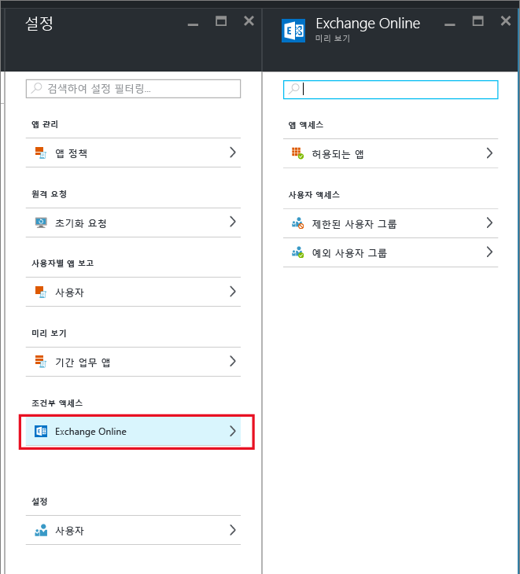
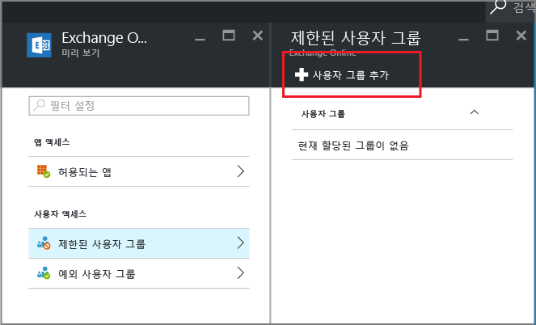

# MAM에서 지원하는 앱만 허용하도록 Exchange Online 조건부 액세스 만들기
이 항목에서는 Exchange Online에서 Intune MAM(모바일 앱 관리) 정책을 지원하는 모바일 앱만 허용하도록 조건부 액세스를 설정하는 방법에 대한 단계별 지침을 제공합니다.

## Exchange Online 정책 만들기
1.  앱 액세스 기능이 포함된 [Azure Portal](portal.azure.com)에 로그인합니다. Azure Portal을 처음 사용하는 경우 [MAM 정책용 Azure Portal](azure-portal-for-microsoft-intune-mam-policies.md) 항목을 읽어보세요.

2.  **찾아보기 > Intune > Intune 모바일 응용 프로그램 관리 블레이드 > 설정**을 선택하고 **조건부 액세스** 섹션에서 **Exchange Online**을 선택합니다.

  

3.  **허용된 앱** 블레이드에서 **Allow apps that support Intune app policies**(Intune 앱 정책을 지원하는 앱 허용) 옵션을 선택하여 Intune MAM 정책에서 지원하는 앱만 Exchange Online에 액세스할 수 있도록 합니다. 이 옵션을 선택하는 경우 지원되는 앱 목록이 표시됩니다.

  >[!NOTE]
  >iOS 및 Android에서 Exchange Online에 연결하는 기본 제공 메일 클라이언트를 비롯하여 모든 Exchange Active Sync 메일 클라이언트에서 메일을 주고받을 수 없게 됩니다. 사용자는 대신 Outlook 메일 앱을 사용해야 한다고 알리는 단일 메일을 받습니다. 
4.   사용자에게 이 정책을 적용하려면 **제한된 사용자 그룹** 블레이드를 열고 **사용자 그룹 추가**를 선택합니다. 이 정책을 받아야 하는 사용자 그룹을 하나 이상 선택하세요.

  

5.  이전 단계에서 선택한 사용자 그룹에 있는 사용자 중 일부를 이 정책에 의해 영향을 받지 않도록 할 수 있습니다. 이 경우 제외된 사용자 그룹 목록에 사용자 그룹을 추가합니다. **Exchange Online** 블레이드에서 **제외된 사용자 그룹**을 선택합니다. **사용자 그룹 추가**를 선택하여 사용자 그룹 목록을 엽니다. 이 정책에서 제외할 그룹을 선택합니다.  

## 기존 정책 수정
### 사용자 그룹 추가 또는 삭제

**제한된 사용자 그룹** 목록에서 **사용자 그룹을 삭제**하려면 **제한된 사용자 그룹** 블레이드를 열고 삭제할 사용자 그룹을 강조 표시한 다음 **줄임표 (...)**를 클릭하여 **삭제** 옵션을 표시합니다. **삭제**를 선택하여 목록에서 사용자 그룹을 제거합니다. 동일한 절차를 사용하여 **제외된 사용자 그룹** 목록에서 사용자 그룹을 제거할 수 있습니다.

## 다음 단계
[최신 인증이 없는 앱 차단](block-apps-with-no-modern-authentication.md)
### 참고 항목
[MAM 정책으로 앱 데이터 보호](protect-app-data-using-mobile-app-management-policies-with-microsoft-intune.md)

<!--HONumber=Oct16_HO2-->

