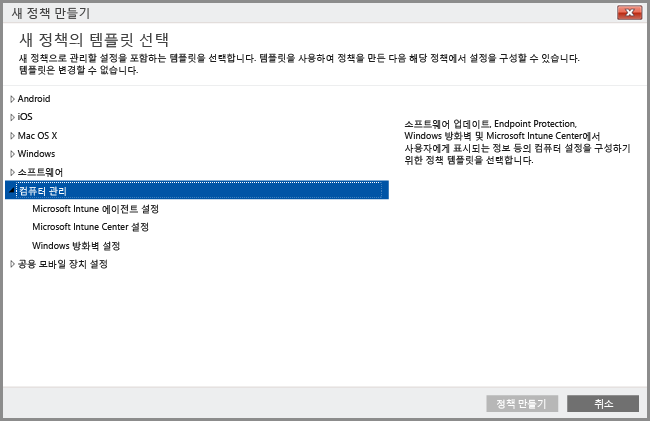

# Intune PC 클라이언트 소프트웨어를 사용하여 Windows PC 관리
[Windows PC를 모바일 장치로 등록](set-up-windows-device-management-with-microsoft-intune.md)하는 대신, Intune 클라이언트 소프트웨어를 설치하여 Windows PC를 관리할 수 있습니다.

Intune에서는 Windows Server AD DS(Active Directory 도메인 서비스) GPO(그룹 정책 개체)와 비슷한 방식으로 정책을 사용하여 컴퓨터를 관리합니다. Intune에서 Active Directory 도메인에 가입된 컴퓨터를 관리하려는 경우에는 조직에서 사용 중인 [GPO와 Intune 정책이 충돌하지 않는지를 확인](resolve-gpo-and-microsoft-intune-policy-conflicts.md)해야 합니다.

Intune 소프트웨어 클라이언트는 소프트웨어 업데이트, Windows 방화벽, Endpoint Protection을 관리함으로써 [PC를 보호하는 관리 기능](policies-to-protect-windows-pcs-in-microsoft-intune.md)을 지원하지만, Intune 소프트웨어 클라이언트를 통해 관리되는 PC는 모바일 장치 관리 관련 **Windows** 정책 설정을 비롯한 기타 Intune 정책을 사용하여 대상으로 지정될 수 없습니다.

> [!NOTE]
> Windows 8.1 이상을 실행하는 장치는 Intune 클라이언트를 사용하여 관리하거나 모바일 장치로 관리할 수 있습니다. 이 항목의 내용은 Intune 소프트웨어 클라이언트를 실행 중인 컴퓨터에 적용됩니다. Intune 클라이언트 설치 및 모바일 장치 관리 등록 작업은 지원되지 않습니다.

## Intune PC 클라이언트 관리를 위한 요구 사항

**하드웨어**: 다음은 Intune 클라이언트를 설치하기 위한 최소 하드웨어 요구 사항입니다.

|요구 사항|추가 정보|
|---------------|--------------------|
|네트워크|클라이언트를 설치하려면 PC가 인터넷에 연결되어 있어야 합니다.|
|프로세서 및 메모리|PC 운영 체제의 프로세서 및 RAM 요구 사항을 참조하세요.|
|디스크 공간|클라이언트 소프트웨어를 설치하려면 먼저 200MB의 사용 가능한 디스크 공간이 필요합니다.|

**소프트웨어**: 다음은 클라이언트를 설치하기 위한 소프트웨어 요구 사항입니다.

|요구 사항|추가 정보|
|---------------|--------------------|
|운영 체제 | Windows Vista 이상을 실행하는 Windows 장치 Home Edition 버전은 지원되지 않습니다.|
|관리자 권한|클라이언트 소프트웨어를 설치하는 계정에는 해당 장치에 대한 로컬 관리자 권한이 있어야 합니다.|
|Windows Installer 3.1|PC에 최소 Windows Installer 3.1이 설치되어 있어야 합니다.  PC의 Windows Installer 버전을 확인하려면  -   PC에서 **%windir%\System32\msiexec.exe**를 마우스 오른쪽 단추로 클릭한 다음 **속성**을 클릭합니다.  Windows Installer의 최신 버전은 Microsoft Developer Network 웹 사이트의 [Windows Installer Redistributables(Windows Installer 재배포 가능 구성 요소)](http://go.microsoft.com/fwlink/?LinkID=234258) 에서 다운로드할 수 있습니다.|
|호환되지 않는 클라이언트 소프트웨어를 제거합니다.|Intune 클라이언트 소프트웨어를 설치하기 전에 해당 PC에서 구성 관리자 또는 System Management Server 클라이언트 소프트웨어를 제거해야 합니다.|

## Intune 컴퓨터 클라이언트를 통해 컴퓨터 관리
Intune 클라이언트 소프트웨어를 설치하고 나면 [응용 프로그램 관리](deploy-apps-in-microsoft-intune.md), [실시간 모니터링 및 Endpoint Protection](help-secure-windows-pcs-with-endpoint-protection-for-microsoft-intune.md), [Windows 방화벽 설정 관리](help-protect-windows-pcs-using-windows-firewall-policies-in-microsoft-intune.md), 하드웨어 및 소프트웨어 인벤토리, 원격 지원 요청을 통한 원격 제어, [소프트웨어 업데이트 설정](keep-windows-pcs-up-to-date-with-software-updates-in-microsoft-intune.md), 준수 설정 보고 등의 관리 기능이 제공됩니다.

소프트웨어 클라이언트를 통해 관리되는 PC에서는 다음을 포함하여 모바일 장치로 관리되는 PC에 제공되는 특정 관리 옵션을 사용할 수 없습니다.

-   전체 초기화(선택적 초기화는 사용 가능함)
-   조건부 액세스
-   **컴퓨터 관리** 정책 이외의 Windows 정책

개별 컴퓨터에서 로컬로 수행되는 Intune 클라이언트 에이전트 작업 외에, 클라이언트가 설치된 Windows PC에서 Intune 관리 콘솔을 사용하여 다음과 같은 기타 [일반적인 컴퓨터 관리 작업](common-windows-pc-management-tasks-with-the-microsoft-intune-computer-client.md) 도 수행할 수 있습니다.

-   관리되는 컴퓨터에 대한 하드웨어 및 소프트웨어 인벤토리 정보 보기

-   원격으로 컴퓨터 다시 시작

-   컴퓨터를 사용 중지하고 클라이언트 소프트웨어를 제거한 다음 Intune에서 관리되지 않도록 컴퓨터 제거

-   특정 관리되는 컴퓨터에 사용자 연결

-   원격 지원 요청에 응답

Intune 클라이언트 에이전트는 보통 백그라운드에서 자동으로 실행되므로 많은 사용자 상호 작용 또는 문제 해결을 수행할 필요가 없습니다. 그러나 컴퓨터 관리 문제를 해결하는 데 도움이 필요한 경우에는 [문제 해결에 사용할 수 있는 리소스](/intune/troubleshoot/troubleshoot-client-setup-in-microsoft-intune)가 다수 제공됩니다.

<!--HONumber=Sep16_HO2-->

