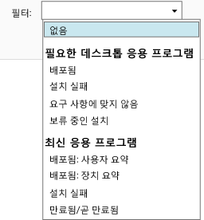

# Microsoft Intune에서 앱 배포 모니터링

## 앱 배포 모니터링
Intune 관리 콘솔에서 관리하는 앱 및 배포 상태를 확인할 수 있습니다.

### 관리 대상 앱과 해당 상태를 확인하려면
**앱** 작업 영역에서 **앱** 노드를 클릭한 다음 **앱**을 클릭합니다.

관리하는 앱의 목록이 표시됩니다. 앱을 클릭하면 콘솔 창의 아래쪽 창에 설치 상태가 표시됩니다. 이 상태를 클릭하면 세부 정보가 추가로 표시됩니다. 예를 들어 상태가 **1명의 사용자가 이 소프트웨어를 사용할 수 있음**으로 표시되는 경우 메시지를 클릭하면 사용자의 이름을 확인할 수 있습니다.

> [!TIP]
> **필터** 드롭다운 목록을 사용하면 설치하지 못한 앱 또는 정상적으로 배포된 앱 등 지정한 기준을 충족하는 앱만 표시할 수 있습니다.
> 
> 

또한 **대시보드** 작업 영역에는 앱 상태의 개요가 표시됩니다. 개요에서 아무 곳이나 클릭하면 앱 목록으로 이동합니다.

## 앱에 대한 추가 세부 정보를 보려면
앱 목록에서 앱을 선택하고 **속성 보기**를 클릭합니다.

앱의 **소프트웨어 속성** 페이지에서 다음 탭 중 하나를 클릭합니다. **일반** - 앱 및 앱의 설치 상태에 관한 일반 정보를 보여 줍니다. **장치** - 앱의 대상 배포를 성공적으로 설치한 장치를 보여 줍니다. **사용자** - 앱의 대상 배포를 성공적으로 설치한 장치의 사용자를 보여 줍니다.

앞에서 설명한 것처럼 **필터** 드롭다운 목록을 사용하여 각 탭에 표시되는 값을 구성할 수 있습니다.

<!--HONumber=Jun16_HO4-->

