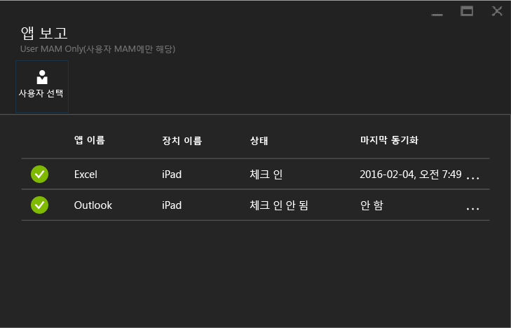

# Microsoft Intune でのモバイル アプリ管理ポリシーの監視
MAM ポリシーを構成してユーザーに適用した後は、[Azure ポータル](https://portal.azure.com)でコンプライアンスの状態を監視できます。 Azure ポータルには、ポリシーによって影響を受けるユーザー、コンプライアンスの状態、エンド ユーザーに対して発生する可能性がある問題に関する情報が含まれます。
## 概要ビュー
**[Intune モバイル アプリケーション管理]** ブレードでは、以下で説明するコンプライアンス状態の概要を確認できます。

![[Intune モバイル アプリケーション管理] ブレードの [概要] タイル](../media/mam-azure-portal-user-status-summary.png)

-   **[ユーザー]**: ポリシーに関連付けられているアプリを使用している社内ユーザーの合計数。

-   **[ポリシーによって管理されています]**: 作業コンテキストで少なくとも 1 つのアプリを使用したユーザーの数。

-   **[ポリシーなし]**: ポリシーに関連付けられたアプリを使用しているが、ポリシーの対象にはなっていないユーザーの数。  これらのユーザーをポリシーに追加することを検討できます。

- **[フラグ付きのユーザー]**: 問題が発生しているユーザーの数。 **[フラグ付きのユーザー]** では、現時点で脱獄されたデバイスを使用しているユーザーのみが報告されます。

## 詳細ビュー
**[ユーザーの状態]** タイルおよび **[フラグ付きのユーザー]** タイルをクリックすると、概要の詳細ビューを表示できます。

### ユーザーの状態
1 人のユーザーを検索し、そのユーザーのコンプライアンス状態を確認できます。 **[アプリ レポート]** ブレードには、選択したユーザーの次の情報が表示されます。
- ユーザー アカウントに関連付けられているデバイス
- デバイスのアプリと MAM ポリシー
- 状態:

  **[チェックイン済み]**: ポリシーがユーザーに展開され、アプリが 1 回以上作業コンテキストで使用されたことを意味します。

  **[チェックインされていません]**: ポリシーはユーザーに展開されましたが、それ以降にアプリが作業コンテキストで使用されていないことを意味します。

>[!NOTE]
> 検索したユーザーに MAM ポリシーが展開されていない場合は、そのユーザーがいずれのアプリ ポリシーの対象でもないことを知らせるメッセージが表示されます。

ユーザーのレポートを表示するには次のようにします。

**手順 1:** ユーザーを選択するには、[概要] タイルをクリックするか、次に示すように **[設定]** ブレードで **[ユーザーによるアプリ レポート]** オプションを選択します。

![[設定] ブレードのアプリ レポート オプション](../media/mam-azure-portal-app-reporting-by-user-settings-blade.png)

**手順 2:** **[アプリ レポート]** ブレードが開きます。 **[ユーザーの選択]** を選択して、Azure Active Directory ユーザーを検索します。

![[アプリ レポート] ブレードのユーザー選択オプション](../media/mam-azure-portal-app-reporting-select-user.png)

**手順 3:** 一覧からユーザーを選択すると、そのユーザーのコンプライアンス状態の詳細が表示されます。

### フラグ付きのユーザー
詳細ビューには、エラー メッセージ、エラー発生時にアクセスされていたアプリ、デバイスのプラットフォーム、タイムスタンプが表示されます。  

### 関連項目
[Manage data transfer between iOS apps (iOS アプリ間のデータ転送を管理する)](manage-data-transfer-between-ios-apps-with-microsoft-intune.md)

[End user experience for MAM enabled app (MAM が有効なアプリでのエンド ユーザー エクスペリエンス)](end-user-experience-for-mam-enabled-apps-with-microsoft-intune.md)

<!--HONumber=Jul16_HO4-->

