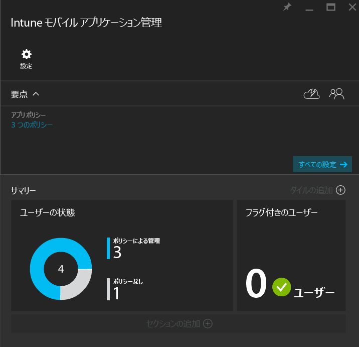
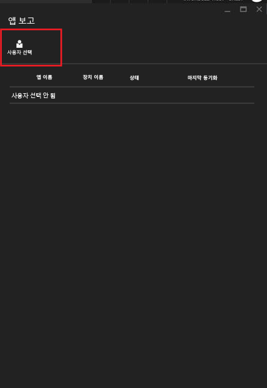

---
# required metadata

title: Microsoft Intune으로 모바일 앱 관리 정책 모니터링 | Microsoft Intune
description:
keywords:
author: karthikaraman
manager: jeffgilb
ms.date: 04/28/2016
ms.topic: article
ms.prod:
ms.service: microsoft-intune
ms.technology:
ms.assetid: d3aa6c74-6b5d-4b50-aa66-a040ec44393e

# optional metadata

#ROBOTS:
#audience:
#ms.devlang:
ms.reviewer: joglocke
ms.suite: ems
#ms.tgt_pltfrm:
#ms.custom:

---

# Microsoft Intune으로 모바일 앱 관리 정책 모니터링
MAM 정책을 구성하고 사용자에게 적용한 후에 [Azure 포털](https://portal.azure.com)에서 준수 상태를 모니터링할 수 있습니다. Azure 포털은 정책, 규정 준수 상태 및 최종 사용자에게 발생할 수 있는 문제의 영향을 받는 사용자에 대한 정보를 포함하고 있습니다.
## 요약 보기
**Intune 모바일 응용 프로그램 관리** 블레이드에서 아래 설명과 같은 준수 상태에 대한 요약을 볼 수 있습니다.

-   **사용자:** 정책과 연결된 앱을 사용 하는 회사 사용자의 총수입니다.

-   **정책으로 관리됨** - 회사 컨텍스트에서 적어도 한 개의 앱을 사용한 적이 있는 사용자 수입니다.

-   **정책 없음:** 정책과 연결된 앱을 사용하지만 정책의 대상이 아닌 사용자 수입니다.  정책에 이러한 사용자를 추가하는 것이 좋습니다.

- **플래그가 지정된 사용자:** 문제가 발생하는 사용자 수입니다. 현재 탈옥된 장치를 가진 사용자만이 **플래그가 지정된 사용자**로 표시됩니다.

## 상세 보기
**사용자 상태** 타일 및 **플래그가 지정된 사용자** 타일을 클릭하여 요약의 자세한 보기에 도달할 수 있습니다.

### 사용자 상태
단일 사용자를 검색하고 해당 사용자에 대한 준수 상태를 살펴볼 수 있습니다. **앱 보고** 블레이드는 선택한 사용자에 대한 다음 정보를 표시합니다.
- 사용자 계정에 연결된 장치
- 장치에 대한 MAM 정책이 있는 앱
- 상태:

  **선택한 상태**: 정책이 사용자에게 배포되었고, 앱이 회사 컨텍스트에서 적어도 한 번 사용되었다는 것을 나타냅니다.

  **선택하지 않은 상태**: 정책이 사용자에게 정책이 배포되었지만 그 후 회사 컨텍스트에서 앱이 사용되지 않았다는 것을 나타냅니다.

사용자에 대한 보고를 확인하려면 다음 단계를 수행합니다.

**1단계:** 사용자를 선택하려면 요약 타일을 클릭하거나 아래와 같이 **설정** 블레이드에서 **사용자별 앱 보고** 옵션을 선택합니다.

**2단계:** **앱 보고** 블레이드를 엽니다. **사용자 선택**을 사용하여 Azure Active Directory 사용자를 검색합니다.

**3단계:** 목록에서 사용자를 선택한 후 해당 사용자에 대한 준수 상태의 세부 정보를 확인합니다.

### 플래그가 지정된 사용자
상세 보기는 오류 메시지, 오류가 발생했을 때 액세스된 앱, 장치의 플랫폼 및 타임스탬프의 플랫폼을 표시합니다.  

### 참고 항목
[iOS 앱 간의 데이터 전송 관리](manage-data-transfer-between-ios-apps-with-microsoft-intune.md)

[MAM을 사용한 앱에 대한 최종 사용자 환경](end-user-experience-for-mam-enabled-apps-with-microsoft-intune.md)

<!--HONumber=Jun16_HO2-->

