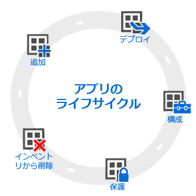

# アプリのライフサイクルの概要

Intune のアプリのライフサイクルは、アプリが追加されると開始し、削除するまで以降のフェーズに従って進行します。

## 追加

アプリ展開の最初のステップは、管理するアプリの追加と、Intune への展開です。 使用できるアプリの種類はさまざまですが、基本的な手順は同じです。 Intune では、[登録されたデバイス](add-apps-for-mobile-devices-in-microsoft-intune.md)と、[Intune クライアント ソフトウェアで管理する Windows PC](add-apps-for-windows-pcs-in-microsoft-intune.md) の両方に、アプリを追加できます。

## デプロイ

アプリを Intune に追加した後は、[管理対象のデバイスにアプリを展開](deploy-apps.md)できます。 Intune を使用すれば簡単に展開でき、アプリを展開した後は、Intune 管理コンソールから展開が[成功したことを監視](monitor-apps-in-microsoft-intune.md)できます。 さらに、[Apple](manage-ios-apps-you-purchased-through-a-volume-purchase-program-with-microsoft-intune.md) や [Windows](manage-apps-you-purchased-from-the-windows-store-for-business-with-microsoft-intune.md) アプリ ストアなどの一部のアプリ ストアでは、会社用にアプリのライセンスを一括購入できます。 Intune では、これらのストアとデータを同期して、Intune 管理コンソールからこの種のアプリのライセンスを展開して使用状況を追跡できます。

## 構成

アプリのライフサイクルの一環として、アプリの新しいバージョンが定期的にリリースされます。 Intune には、展開した[アプリを新しいバージョンに簡単に更新](update-apps-using-microsoft-intune.md)できるツールがあります。 さらに、一部のアプリでは次のような追加機能を構成できます。
- [iOS アプリ構成ポリシー](configure-ios-apps-with-mobile-app-configuration-policies-in-microsoft-intune.md)では、アプリの実行時に使用される互換性のある iOS アプリの設定を指定できます。 たとえば、アプリには特定のブランド設定や、接続するサーバーの名前が必要な場合があります。
- [管理対象ブラウザー ポリシー](manage-internet-access-using-managed-browser-policies.md)では、デバイスの既定ブラウザーを置き換えて、ユーザーがアクセスできる Web サイトを制限できる、Intune 管理ブラウザーの設定を構成できます。

## 保護

Intune では、さまざまな方法でアプリのデータを保護できます。 主な方法は次のとおりです。
- [条件付きアクセス](restrict-access-to-email-and-o365-services-with-microsoft-intune.md)では、デバイスの種類などの指定した条件に基づいて電子メールや他のサービスへのアクセスを制御したり、展開した[デバイス コンプライアンス ポリシー](introduction-to-device-compliance-policies-in-microsoft-intune.md)への準拠を制御したりできます。
- [モバイル アプリケーション管理 (MAM)](protect-app-data-using-mobile-app-management-policies-with-microsoft-intune.md)は、個々のアプリと連携して、アプリが使用する会社のデータを保護します。 たとえば、管理対象外アプリと管理対象アプリの間でのデータのコピーを制限したり、脱獄またはルート化されたデバイスでのアプリの実行を禁止したりできます。

## インベントリから削除

通常は、最終的に、展開したアプリは古くなり、削除する必要があります。 Intune では、簡単に[サービスからアプリを削除](retire-apps-using-microsoft-intune.md)できます。

<!--HONumber=Jun16_HO4-->

