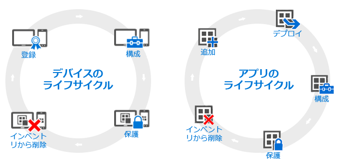

---
# required metadata

title: 장치 및 앱 수명 주기에 대한 개요 | Microsoft Intune
description:
keywords:
author: robstackmsft
manager: jeffgilb
ms.date: 04/28/2016
ms.topic: article
ms.prod:
ms.service: microsoft-intune
ms.technology:
ms.assetid: 38e08253-14a0-4cc4-87be-7b110c12a523

# optional metadata

#ROBOTS:
#audience:
#ms.devlang:
ms.reviewer: jeffgilb
ms.suite: ems
#ms.tgt_pltfrm:
#ms.custom:

---

# 장치 및 앱 수명 주기에 대한 개요

개별 조직의 필요는 다를 수 있지만 모든 조직이 다른 운영 요구가 무엇이든 수시로 실행해야 하는 특정 일반적인 단계가 있습니다. 이러한 단계를 **수명 주기**라는 두 가지 주요 범주로 그룹화할 수 있습니다. 수행하는 배포 수명 주기는 사용하려고 하는 시나리오에 따라 달라집니다. 예를 들어 장치 수명 주기, 앱 수명 주기만 필요하거나 둘 다 필요할 수 있습니다.

관리 목적을 위해 모든 장치는 처음 장치 등록에서 더 이상 필요하지 않을 때의 사용 중지까지 수명 주기를 가지고 있습니다. [장치 관리 수명 주기](overview-of-device-lifecycle-in-microsoft-intune.md)는 모든 등록 옵션, 이러한 장치를 구성하고 보호하는 방법 및 그런 다음 관리에서 장치를 제거하는 방법을 차례로 진행합니다.

마찬가지로 작업하는 앱은 Intune에 앱 추가에서 더 이상 필요 없을 때 제거할 때까지 모든 단계를 포함하는 고유 [앱 수명 주기](overview-of-app-lifecycle-in-microsoft-intune.md)를 가지고 있습니다.

<!--HONumber=May16_HO2-->

