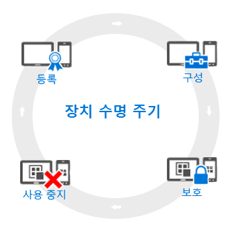

# モバイル デバイス管理 (MDM) ライフサイクルの概要

管理するすべてのデバイスに*ライフサイクル*と呼んでいるものがあります。 Intune は、登録から始まり、不要になったデバイスを最後に使用中止とするまで、ライフサイクルの管理に役立ちます。

## 登録
今日のモバイル デバイス管理 (MDM) 戦略では、さまざまな携帯電話、タブレット、PC (iOS、Android、Windows、Mac OS X) を扱っています。 デバイスを管理できる必要がある場合 (一般には企業所有デバイスの場合)、最初の手順として[デバイスの登録をセットアップ](enroll-devices-in-microsoft-intune.md)します。 Windows PC については、Intune (MDM) を使用して登録するか、または [Intune クライアント ソフトウェアをインストールする](manage-windows-pcs-with-microsoft-intune.md)ことで、管理することもできます。

## 構成
デバイスを登録することは、最初の手順にすぎません。 Intune で用意されているあらゆるサービスを利用し、デバイスがセキュリティで保護され企業の標準に準拠するように保証するには、管理対象のデバイスの動作のほぼすべての特徴を構成するためのさまざまな**ポリシー**から選択することができます。 たとえば、会社のデータが格納されているデバイスに対してユーザーはパスワードを使用する必要がありますか。 パスワードを設定できます。 企業 Wifi を備えていますか。 自動的に構成することができます。 使用できる構成オプションの種類を次に示します。

- [**構成ポリシー**](manage-settings-and-features-on-your-devices-with-microsoft-intune-policies.md) - このポリシーでは、管理するデバイスの機能をどのように動作させるかを構成することができます。 たとえば、Windows Phone でパスワードの使用を求めたり、iPhone でカメラの使用を無効にしたりすることが可能です。
- [**企業リソースのアクセス ポリシー**](enable-access-to-company-resources-with-microsoft-intune.md) - ユーザーが自分の個人用デバイスから自分の作業にアクセスできるようにする場合、これには課題が伴う場合があります。 たとえば、会社の電子メールへのアクセスを必要とするすべてのデバイスが正しく構成されていることを確認するにはどうしますか。 ユーザーが複雑になることが多い必要とされる設定を知らなくても VPN 接続を使用して社内ネットワークにアクセスできるかどうかはどのように確認できますか。 Intune では、共通の企業リソースにアクセスするように管理対象デバイスを自動的に構成することにより、この作業負荷を軽減することができます。
- [**Windows PC の管理ポリシー (Intune クライアント ソフトウェアを使用)**](common-windows-pc-management-tasks-with-the-microsoft-intune-computer-client.md) - Windows PC を Intune に登録するとほとんどのデバイス管理機能を利用できますが、Intune では引き続き Intune クライアント ソフトウェアによる Windows PC の管理をサポートします。 PC で実行できるタスクの一部について情報が必要な場合は、ここから始めてください。

## 保護
最新の IT 世界で、不正アクセスからデバイスを保護することは、実施しなければならない最も重要なタスクの 1 つです。 デバイス ライフサイクルの**構成**ステップの項目に加えて、Intune では管理対象のデバイスを不正なアクセスまたは悪意のある攻撃から保護するのに役立つ次の機能も提供します。
- [**Multi-Factor Authentication**](protect-windows-devices-with-multi-factor-authentication.md) - 追加の認証層をユーザー ログオンに追加すると、デバイスの安全性をさらに強化するのに役立ちます。 Windows、Windows Phone、および Windows Mobile デバイスでは、ユーザーがアクセスできるようになるまでに電話またはテキスト メッセージなどの第 2 レベルの認証が必要となる多要素認証を用意しています。
- [**Microsoft Passport 設定**](control-microsoft-passport-settings-on-devices-with-microsoft-intune.md) - Microsoft Passport は別のサインオン方法であり、ユーザーが*ジェスチャ* (指紋など) や Windows Hello を使用して、パスワードなしでサインオンできるようにするものです。
- [**Windows PC を保護するためのポリシー (Intune クライアント ソフトウェアを使用)**](policies-to-protect-windows-pcs-in-microsoft-intune.md) - Intune クライアント ソフトウェアを使用して Windows PC を管理する場合は、更新する PC に対する Endpoint Protection、ソフトウェア更新プログラム、および Windows ファイアウォールの設定を制御するためのポリシーを利用できます。

## インベントリから削除
デバイスを紛失したか盗まれたとき、デバイスの交換が必要なとき、またはユーザーが別の職場に移動になったとき、通常はデバイスを[インベントリから削除またはワイプ](use-remote-wipe-to-help-protect-data-using-microsoft-intune.md)します。 それを行うには、デバイスをリセットする、デバイスを管理から削除する、またはデバイス上の企業データをワイプするなど、さまざまな方法があります。

<!--HONumber=Jun16_HO4-->

