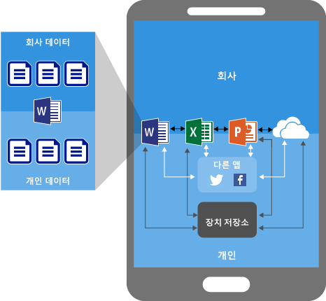
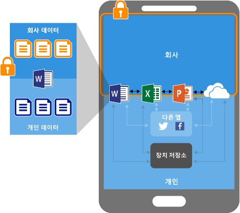
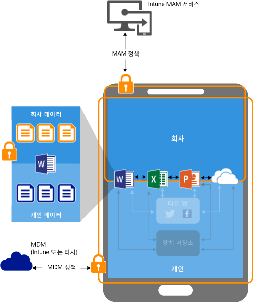
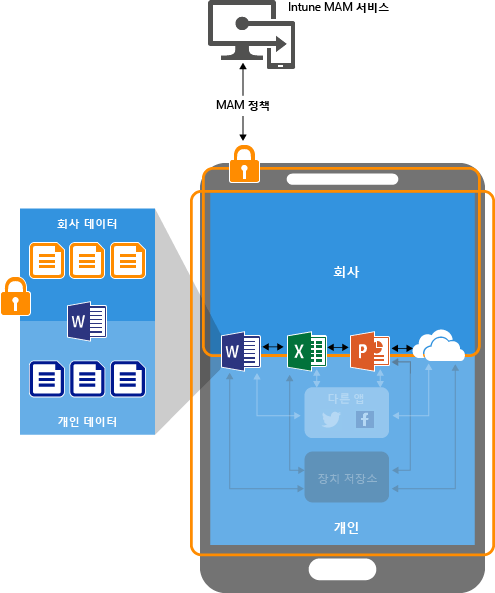

# Microsoft Intune でモバイル アプリケーション管理ポリシーを使用してデータを保護する

## アプリ データを保護する方法
従業員は個人のタスクと仕事のタスクの両方にモバイル デバイスを使用しています。  従業員の生産性を維持したまま、意図的なデータ損失や意図しないデータ損失が起こらないようにする必要があります。  また、デバイスを自分で管理していない場合でも、そのデバイスでアクセスされる会社のデータを保護する機能があれば便利です。

Intune モバイル アプリ管理 (MAM) ポリシーを使用すれば、会社データを保護できます。 Intune MAM はどのモバイル デバイス管理 (MDM) ソリューションからも独立して利用できるため、デバイスをデバイス管理ソリューションに登録するかどうかにかかわらず、会社データを保護するために使用することができます。 **アプリレベル ポリシー**を実装するだけで、会社のリソースへのアクセスを制限し、データを IT 部門の管理範囲内に保つことができます。

MAM ポリシーは、次で実行されているアプリに適用されます。
> [!IMPORTANT]
> Office 365 サービスに接続する Office モバイル アプリ向けのモバイル アプリ管理ポリシーを作成することができます。 MAM ポリシーは、オンプレミス Exchange サービスや SharePoint サービスに接続するアプリではサポートされていません。

- **Microsoft Intune で管理され、登録されているデバイス**。 この分野に属するデバイスには、通常、会社が所有するデバイスがあります。

-   **サード パーティのモバイル デバイス管理ソリューションで管理され、登録されているデバイス**。   この分野に属するデバイスには、通常、会社が所有するデバイスがあります。

  > [!NOTE]
  > モバイル アプリ管理ポリシーを、サード パーティのモバイル アプリ管理ソリューションやセキュア コンテナー ソリューションとともに使用しないでください。

-   **管理されていないデバイス**。  この分野に属するデバイスには、通常、Intune またはその他の MDM ソリューションで管理も登録もされていない社員所有のデバイスがあります。

**MAM ポリシーを使用するときの主な利点には次があります。**

-   アプリ レベルで、会社データを保護します。  モバイル アプリ管理にはデバイス管理が必要ないため、管理対象のデバイスと管理対象ではないデバイスの両方で会社データを保護することができます。 管理の中心がユーザー ID になり、デバイスを管理する必要がなくなります。

-   エンド ユーザーの生産性に影響を与えることがなく、個人のコンテキストでアプリが使用される場合にはポリシーは適用されません。  ポリシーは仕事のコンテキストでのみ適用されるため、個人データに影響を与えることなく会社データを保護することが可能になります。

MDM を MAM ポリシーとともに使用することには付加的なメリットがあります。会社は MAM を MDM ありと MDM なしの両方で同時に使用できます。 たとえば、従業員は、会社が支給する電話に加えて個人のタブレットを使用する場合があります。  この場合、会社の電話は MDM に登録され、MAM ポリシーによって保護されていますが、個人のデバイスは MAM ポリシーで保護されるだけです。

- **MDM によりデバイスの保護を実現できる**。  たとえば、デバイスへのアクセスに PIN を要求したり、デバイスに管理対象のアプリを展開したりすることができます。 また、MDM ソリューションを介してデバイスにアプリを展開することにより、アプリ管理をより制御できるようになります。

- **MAM ポリシーによりアプリ層の保護を実現できる**。 たとえば、仕事のコンテキストでアプリを開くために PIN を要求したり、アプリ間でデータを共有できるかどうかを決めたり、会社のアプリ データを個人の記憶域に保存できないようにしたりできます。

### 現在のところ、MAM ポリシーは次の OS でサポートされています。
-   iOS 8.1 以降

-   Android 4 以降

Windows デバイスは現在サポートされていません。
##  MAM ポリシーによるアプリ データ保護のしくみ

####  MAM ポリシーなしのアプリ:

アプリが制限なしで使用されている場合、会社データと個人データが混在する可能性があります。  会社データが個人の記憶域に保存されたり、管理範囲外のアプリに転送されたりして、データが損失することがあります。 図の矢印はアプリ (会社と個人) と記憶域の間の制限されたデータ移動を示しています。

### MAM ポリシーのあるデータ保護:

MAM ポリシーを使用すれば、会社のデータをデバイスのローカル ストレージに保存する行為を防止し、MAM ポリシーで保護されていない他のアプリへのデータ移動を制限できます。 MAM ポリシー設定:
- **[名前を付けて保存] を禁止する**、**切り取り、コピー、貼り付けを制限する** のようなデータ再配置ポリシー。
- **アクセスの際にシンプルな PIN を要求する**、**脱獄されたデバイスまたは root 化されたデバイスで管理対象アプリが実行されることを禁止する**のようなアクセス ポリシー設定。

### MDM ソリューションで管理されるデバイスの MAM ポリシーによるデータ保護:

**MDM ソリューションに登録されているデバイスの場合**-

上の図は、MDM と MAM ポリシーが提供する保護層を示しています。

MDM ソリューション:

-   デバイスを登録する

-   アプリをデバイスに展開する

-   継続的なデバイスのポリシー準拠と管理を提供する

**MAM ポリシーが価値を高める手段:**

-   コンシューマー アプリやサービスに会社データがリークしないように支援する

-   モバイル アプリへの制限の適用 (名前を付けて保存、クリップボード、PIN など)

-   アプリから会社データをワイプし、その際にデバイスからそのアプリを削除しない

### 登録のないデバイスに MAM ポリシーを適用するデータ保護

上の図は、MDM がない場合にアプリ レベルでデータ保護ポリシーが機能するしくみを示しています。

MDM ソリューションに登録されていない BYOD デバイスの場合、MAM ポリシーによってアプリ レベルで会社データを保護することができます。
ただし、次のようないくつかの制約があることに注意してください。

-   アプリをデバイスに展開することはできません。  アプリはエンドユーザーがストアから入手する必要があります。

-   これらのデバイスで証明書プロファイルをプロビジョニングすることはできません。

-   会社が Wi-Fi や VPN の設定をこれらのデバイスにプロビジョニングすることはできません。

## 複数の ID

複数の ID をサポートするアプリの場合、アプリが作業コンテキストで利用されているときに MAM ポリシーが適用されてれば、仕事用や個人用など、複数のアカウントを利用して同じアプリにアクセスできます。  

たとえば、エンド ユーザーが仕事用のアカウントを使用して OneDrive アプリが起動した場合、個人のストレージにファイルを移動できません。 ただし、エンド ユーザーが個人のアカウントで OneDrive を使用する場合、個人の OneDrive から制限なしでデータをコピーしたり、移動したりできます。  

MAM ポリシーに関連付けられているアプリの使用方法と、複数の ID に対応しているアプリを使用するとき、作業コンテキストでのみ MAM ポリシーを適用する方法の詳細については、「[using apps with multi-identity support (複数 ID 対応アプリの使用)](end-user-experience-for-mam-enabled-apps-with-microsoft-intune.md#using-apps-with-multi-identity-support)」をご覧ください。

すべての Office モバイル アプリは複数 ID をサポートしています。

##  次のステップ
[Get ready to configure mobile app management policies (モバイル アプリ管理ポリシーの展開)](get-ready-to-configure-mobile-app-management-policies-with-microsoft-intune.md)

[Microsoft Intune でのモバイル アプリ管理ポリシーの作成および展開](create-and-deploy-mobile-app-management-policies-with-microsoft-intune.md)

<!--HONumber=Jun16_HO4-->

