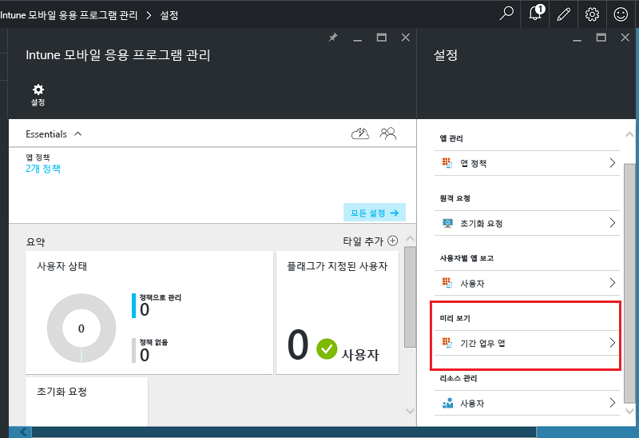
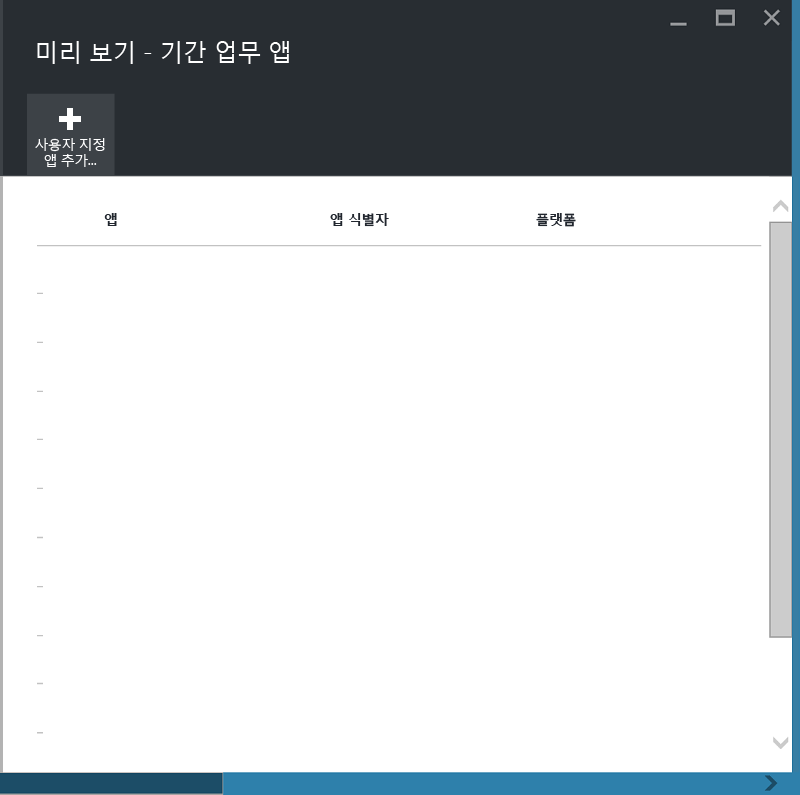
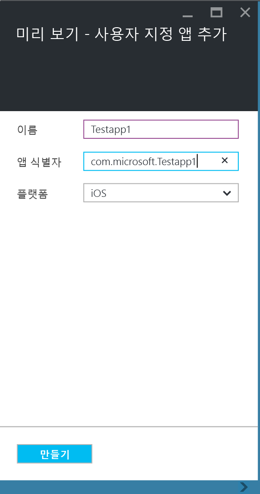
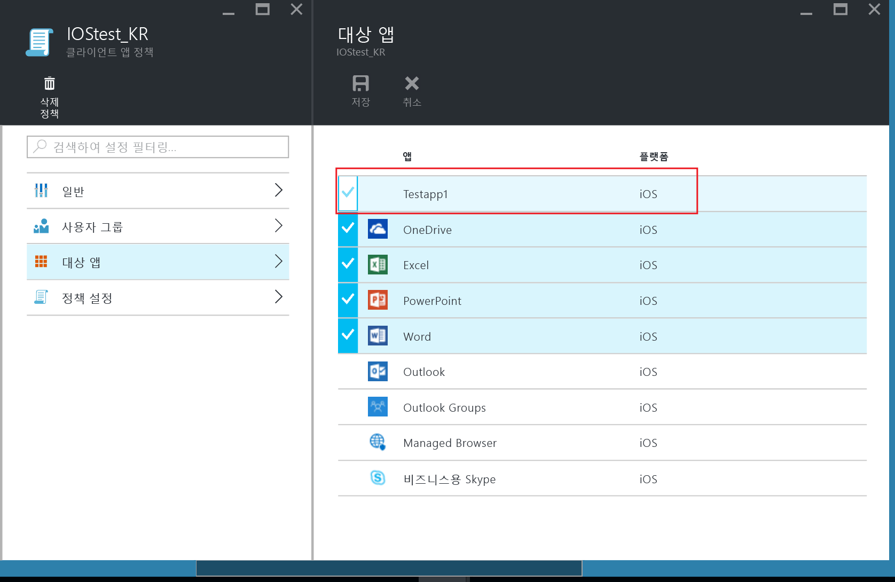
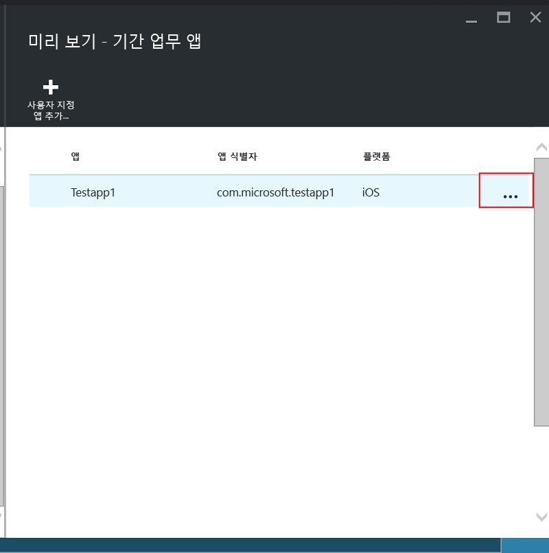
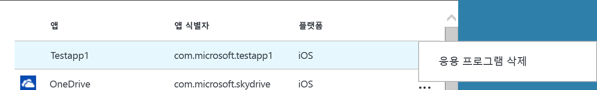

---
# required metadata

title: 등록되지 않은 장치의 LOB(기간 업무) 앱 및 데이터 보호 | Microsoft Intune
description:
keywords:
author: karthikaraman
manager: jeffgilb
ms.date: 04/28/2016
ms.topic: article
ms.prod:
ms.service:
ms.technology:
ms.assetid: 00219467-a62e-43b6-954b-3084f54c45ba

# optional metadata

#ROBOTS:
#audience:
#ms.devlang:
ms.reviewer: joglocke
ms.suite: ems
#ms.tgt_pltfrm:
#ms.custom:

---

# Microsoft Intune에 등록되지 않은 장치의 LOB(기간 업무) 앱 및 데이터 보호

MAM(모바일 앱 관리) 정책을 통해 복사 및 붙여넣기와 같은 데이터 이동을 제한하거나 사용자가 개인 위치에 회사 문서를 저장하지 못하게 하여 회사 데이터를 보호할 수 있습니다.   MAM 정책을 iOS 또는 Android LOB(기간 업무) 앱에 적용하려면 먼저 Microsoft Intune 앱 래핑 도구를 사용하여 앱을 래핑해야 합니다.  앱 래핑은 기본 응용 프로그램을 변경하지 않고도 관리 계층을 모바일 앱에 적용하는 프로세스입니다.  앱을 래핑하면 MAM 정책을 앱에 적용하고 최종 사용자에게 해당 앱을 배포할 수 있습니다.  

이 항목에서는 **관리되지 않는 직원 소유 장치** 및 **타사 MDM(모바일 장치 관리) 솔루션**으로 관리되는 장치에서 액세스하는 앱에 대해 MAM 정책을 적용하는 데 필요한 단계를 설명합니다.  **Intune에 등록된 장치**에서 실행되는 LOB(기간 업무) 앱을 준비하려면 [Microsoft Intune으로 모바일 응용 프로그램 관리용 앱을 준비하는 방법 결정](decide-how-to-prepare-apps-for-mobile-application-management-with-microsoft-intune.md) 항목을 참조하세요.
##  1단계: 앱 준비
앱에 MAM 정책을 적용하려면 먼저 Microsoft Intune 앱 래핑 도구를 사용하여 앱을 래핑해야 합니다.  앱 래핑 도구를 설치하고 사용하기 위한 지침은 다운로드에 포함되어 있습니다.  
>[!IMPORTANT]  
>Intune에 등록되지 않은 장치를 지원하는 이 버전의 앱 래퍼 도구는 이후 몇 주간 비공개 미리 보기로 사용할 수 있습니다. 참여하려는 경우 msintuneappsdk@microsoft.com으로 메일을 통해 자세한 내용을 보내주세요.

## 2단계: 앱 추가

LOB(기간 업무) 앱을 MAM 정책과 연결하려면 다음 단계를 사용하여 Intune 구독/테넌트에 앱 세부 정보를 추가해야 합니다.

1. [Azure 포털](https://portal.azure.com/)에서 **Intune 모바일 응용 프로그램 관리 > 설정**으로 이동하여 **기간 업무 앱**을 선택합니다.

  

2. **기간 업무 앱** 블레이드에서 **사용자 지정 앱 추가**를 선택합니다.

  
3.  앱 이름, 번들 식별자(앱 식별자 필드에) 및 플랫폼(iOS 또는 Android)을 지정합니다.

   이 단계에서 앱의 고유한 목록을 만들 수 있습니다.  또한 다음 단계에 설명된 대로 앱은 테넌트의 MAM 정책에 대한 대상 앱 목록에도 표시됩니다.

## 3단계: MAM 정책 적용
앱 메타데이터를 서비스에 업로드하면 앱이 앱 목록에 표시됩니다.  이제 [새 정책 또는 기존 정책을 만들어](create-and-deploy-mobile-app-management-policies-with-microsoft-intune.md) 2단계에서 추가한 LOB(기간 업무) 앱에 적용할 수 있습니다.

>[!IMPORTANT]
>래핑된 앱을 사용할 사용자에게는 MAM 정책을 지정해야 합니다.  이 정책이 배포되지 않은 사용자는 래핑된 앱을 사용할 수 없습니다.

  
## 4단계: 앱 배포
다음과 같은 방법으로 최종 사용자에게 앱을 배포할 수 있습니다.
* 타사 MDM 솔루션에 등록된 장치의 경우 MDM 솔루션을 통해 앱을 배포할 수 있습니다.
* MDM 솔루션으로 관리되지 않는 장치의 경우 사용자 지정 솔루션이 필요합니다. 최종 사용자가 자신의 장치에서 앱을 다운로드하여 설치해야 합니다.

## 메타데이터 변경
앱 이름 또는 번들 식별자와 같은 앱 세부 정보를 변경해야 하는 경우 [앱을 제거](#remove-apps)하고 새 메타데이터를 사용하여 [앱을 추가](#add-the-app)해야 합니다.

##  앱 제거
앱 목록에서 LOB(기간 업무) 앱을 제거할 수 있습니다.  그러면 목록에서 앱이 제거되고 MAM 정책과의 연결이 제거되지만, 최종 사용자의 장치에서 앱이 삭제되거나 제거되지는 않습니다.  

1.  [Azure 포털](https://portal.azure.com/)에서 **Intune 모바일 앱 관리 > 설정**으로 이동합니다.  **설정** 블레이드에서 ** LOB(기간 업무)**를 선택하여 기존 앱 목록을 엽니다.  
2.  제거하려는 앱을 선택하고, **(...) 상황에 맞는** 메뉴를 선택합니다.

  
3.  **응용 프로그램 삭제**를 선택하여 앱을 삭제합니다.

  

  그러면 기간 업무 앱 목록 및 MAM 정책의 대상 앱 목록에서 앱이 제거됩니다.

<!--HONumber=Jun16_HO2-->

