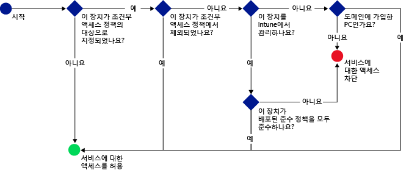

<<<<<<< HEAD
---
title: "메일 및 O365 서비스 액세스 제한 | Microsoft Intune"
description: "이 항목에서는 SharePoint Online 및 다른 서비스에서 호환 장치만 회사 전자 메일 및 회사 데이터에 액세스하도록 하는 데 조건부 방식을 사용하는 방법을 설명합니다."
keywords: 
author: karthikaraman
manager: angrobe
ms.date: 07/29/2016
ms.topic: article
ms.prod: 
ms.service: microsoft-intune
ms.technology: 
ms.assetid: c564d292-b83b-440d-bf08-3f5b299b7a5e
ms.reviewer: chrisgre
ms.suite: ems
translationtype: Human Translation
ms.sourcegitcommit: 99b01f5ca5bb389fc8a9d87e956796823fee6c0d
ms.openlocfilehash: 6e11d71265f01ae31ab3124a46aaa544ad2f453a

||||||| merged common ancestors
---
title: "메일 및 O365 서비스 액세스 제한 | Microsoft Intune"
description: "이 항목에서는 SharePoint Online 및 다른 서비스에서 호환 장치만 회사 전자 메일 및 회사 데이터에 액세스하도록 하는 데 조건부 방식을 사용하는 방법을 설명합니다."
keywords: 
author: karthikaraman
manager: angrobe
ms.date: 06/16/2016
ms.topic: article
ms.prod: 
ms.service: microsoft-intune
ms.technology: 
ms.assetid: c564d292-b83b-440d-bf08-3f5b299b7a5e
ms.reviewer: chrisgre
ms.suite: ems
translationtype: Human Translation
ms.sourcegitcommit: be1ebcdf2514e45d383dd49890e0e21acf6ede44
ms.openlocfilehash: 536d34e618efdc78b3103a3b1b36f13fb784781c

=======
---
title: "메일 및 O365 서비스 액세스 제한 | Microsoft Intune"
description: "이 항목에서는 SharePoint Online 및 다른 서비스에서 호환 장치만 회사 전자 메일 및 회사 데이터에 액세스하도록 하는 데 조건부 방식을 사용하는 방법을 설명합니다."
keywords: 
author: karthikaraman
ms.author: karaman
manager: angrobe
ms.date: 07/29/2016
ms.topic: article
ms.prod: 
ms.service: microsoft-intune
ms.technology: 
ms.assetid: c564d292-b83b-440d-bf08-3f5b299b7a5e
ms.reviewer: chrisgre
ms.suite: ems
translationtype: Human Translation
ms.sourcegitcommit: 99b01f5ca5bb389fc8a9d87e956796823fee6c0d
ms.openlocfilehash: 6e11d71265f01ae31ab3124a46aaa544ad2f453a

>>>>>>> 359d4f486355df1be118d8fdb698694ae632df85

---

# Microsoft Intune을 사용한 메일, O365 및 기타 서비스에 대한 액세스 제한
Intune의 조건부 액세스를 사용하여 회사 메일 및 O365 서비스에 대한 액세스를 제한할 수 있습니다. Intune의 조건부 액세스 기능을 사용하면 회사 메일 및 O365 서비스에 대한 액세스가 설정한 규칙을 준수하는 장치로 제한되도록 할 수 있습니다.
## 조건부 액세스는 어떻게 작동합니까?
규정 준수 정책 설정은 장치의 규정 준수를 평가하는 데 사용됩니다. 조건부 액세스 정책은 평가를 사용하여 특정 서비스에 대한 액세스를 제한 또는 허용합니다. 조건부 액세스 정책을 규정 준수 정책과 함께 사용할 경우 준수 장치만 서비스에 액세스할 수 있습니다. 준수 정책 및 조건부 액세스 정책은 사용자에게 배포됩니다. 사용자가 서비스에 액세스하는 데 사용하는 모든 장치는 정책을 준수하는지 확인됩니다.

이 장치를 사용하는 사용자는 장치가 규정 준수에 대해 평가되려면 규정 준수 정책이 배포되어 있어야 함을 유의하세요.
사용자에게 규정 준수 정책이 배포되지 않은 경우 장치는 준수하는 것으로 간주되며 액세스 제한이 적용되지 않습니다.

정책에 설정한 조건을 장치가 충족하지 않는 경우 최종 사용자는 장치를 등록하고 규격에 맞지 않는 문제를 해결하는 과정으로 안내됩니다.

조건부 액세스의 일반적인 흐름:

## 조건부 액세스를 구성하는 방법
조건부 액세스를 사용하여 Microsoft **Exchange 온-프레미스**, **Exchange Online**, **Exchange Online Dedicated**, **SharePoint Online** 및 **비즈니스용 Skype Online**에 대한 액세스를 관리합니다.

조건부 액세스를 설정하려면 장치 규정 준수 정책 및 조건부 액세스 정책을 구성합니다.

규정 준수 정책에는 암호, 암호화 및 장치가 무단 해제되는지 여부와 같은 설정이 포함됩니다. 장치가 준수되는 것으로 간주되려면 이러한 규칙을 충족해야 합니다.

다음에 따라 액세스를 제한하기 위해 조건부 액세스 정책을 설정할 수 있습니다.
- 장치 준수 상태
- 장치에서 실행 중인 플랫폼
- 서비스에 액세스하는 데 사용되는 앱의 유형

다른 Intune 정책과 달리 조건부 액세스 정책은 사용자가 배포하지 않습니다. 대신, 정책을 구성하고 해당 정책을 포함할 사용자를 선택하면 정책이 모든 대상 사용자에게 적용됩니다. 사용자가 정책의 대상인 경우 해당 사용자가 사용하는 각 장치가 규정을 준수해야 리소스에 액세스할 수 있습니다.

## 다음 단계
1. [장치 규정 준수 정책 및 작동 방식에 대해 알아보기 ](introduction-to-device-compliance-policies-in-microsoft-intune.md)

2. [규정 준수 정책 만들기](create-a-device-compliance-policy-in-microsoft-intune.md)

2.  다음 중 하나에 대한 조건부 액세스 정책을 만듭니다.
> [!div class="op_single_selector"]
  - [Exchange Online에 대해 조건부 액세스 정책 만들기](restrict-access-to-exchange-online-with-microsoft-intune.md)
  - [Exchange 온-프레미스에 대해 조건부 액세스 정책 만들기](restrict-access-to-exchange-onpremises-with-microsoft-intune.md)
  - [새 Exchange Online Dedicated에 대해 조건부 액세스 정책 만들기](restrict-access-to-exchange-online-with-microsoft-intune.md)
  - [레거시 Exchange Online Dedicated에 대해 조건부 액세스 정책 만들기](restrict-access-to-exchange-onpremises-with-microsoft-intune.md)
  - [SharePoint Online에 대한 조건부 액세스 정책 만들기](restrict-access-to-sharepoint-online-with-microsoft-intune.md)
  - [비즈니스용 Skype Online에 대한 조건부 액세스 정책 만들기](restrict-access-to-skype-for-business-online-with-microsoft-intune.md)
  - [Dynamics CRM Online에 대한 조건부 액세스 정책 만들기](restrict-access-to-dynamics-crm-online-with-microsoft-intune.md)

<<<<<<< HEAD
||||||| merged common ancestors
<!--HONumber=Jul16_HO5-->
=======
<!--HONumber=Sep16_HO3-->
>>>>>>> 359d4f486355df1be118d8fdb698694ae632df85

<!--HONumber=Sep16_HO3-->

