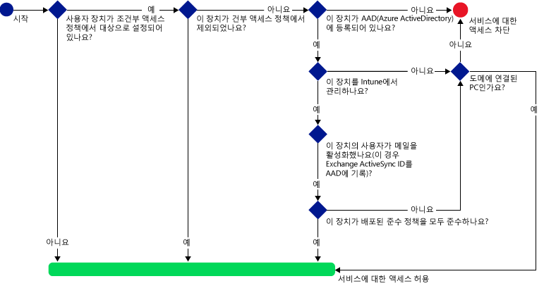
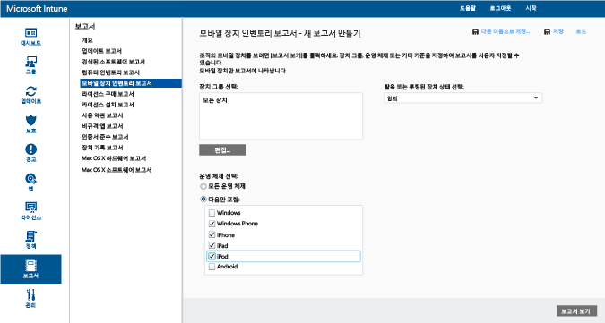
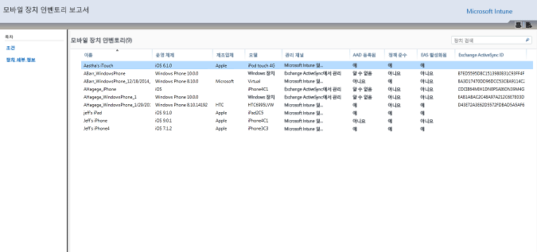
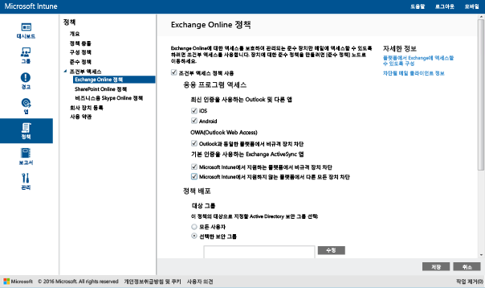
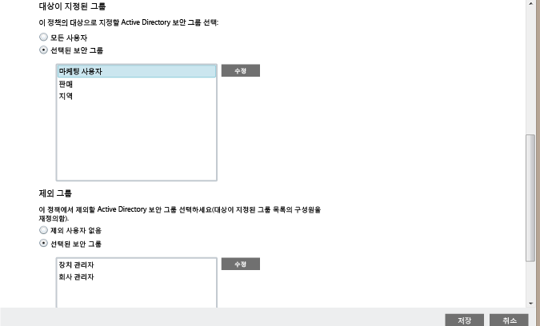
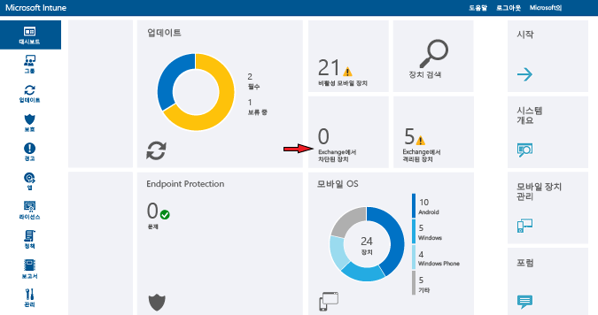

# Intune을 사용하여 Exchange Online 및 새 Exchange Online Dedicated에 대한 메일 액세스 제한

Exchange Online Dedicated 환경이 있고 신규 또는 기존 구성 상태인지를 확인해야 하는 경우 계정 관리자에게 문의하세요.

Exchange Online 또는 새 Exchange Online Dedicated 환경에 대한 메일 액세스를 제어하려면 Intune에서 Exchange Online에 대한 조건부 액세스를 구성합니다.
조건부 액세스가 어떻게 작동하는지에 대한 자세한 내용은 [메일, O365 및 기타 서비스에 대한 액세스 제한](restrict-access-to-email-and-o365-services-with-microsoft-intune.md) 문서를 읽어보세요.

조건부 액세스를 구성하기 **전에** 다음을 수행해야 합니다.

-   **Exchange Online(예: E3)을 포함하는 Office 365 구독**을 사용하고 사용자는 Exchange Online의 라이선스를 취득해야 합니다.

- **Enterprise Mobility + Security 또는 Azure Active Directory Premium 구독**을 사용하고 사용자는 EMS 또는 Azure AD의 라이선스를 취득해야 합니다. 자세한 내용은 [Enterprise Mobility 가격 책정 페이지](https://www.microsoft.com/en-us/cloud-platform/enterprise-mobility-pricing) 또는 [Azure Active Directory 가격 책정 페이지](https://azure.microsoft.com/en-us/pricing/details/active-directory/)를 참조하세요.

-  [!INCLUDE[wit_nextref](../includes/wit_nextref_md.md)]을 Microsoft Exchange Online에 연결하며 [!INCLUDE[wit_nextref](../includes/wit_nextref_md.md)] 콘솔을 통해 장치 정보를 관리할 수 있도록 하는 **Microsoft Intune 서비스 간 커넥터**(선택 사항)를 구성하는 것이 좋습니다. 커넥터는 준수 정책 또는 조건부 액세스 정책을 사용하려는 경우 필요가 없지만 조건부 액세스의 영향을 평가하는 보고서를 실행하려는 경우에는 필요합니다.

   > [!NOTE]
   > Exchange Online과 Exchange 온-프레미스에 대해 모두 조건부 액세스를 사용하려는 경우에는 서비스 간 커넥터를 구성하지 마세요.

   커넥터를 구성하는 방법에 대한 지침은 [Intune 서비스 간 커넥터](intune-service-to-service-exchange-connector.md)를 참조하세요.

조건부 액세스 정책이 구성되고 사용자를 대상으로 지정한 경우 사용자가 자신의 전자 메일에 연결하기 전에 사용하는 **장치**는 다음과 같아야 합니다.

-   [!INCLUDE[wit_nextref](../includes/wit_nextref_md.md)]에 **등록**되어 있거나 도메인에 가입된 PC이어야 합니다.

-  **Azure Active Directory에 등록**되어야 합니다. 장치가 [!INCLUDE[wit_nextref](../includes/wit_nextref_md.md)]에 등록된 경우 자동으로 이루어집니다. 또한 클라이언트 Exchange ActiveSync ID가 Azure Active Directory에 등록되어 있어야 합니다.

  Intune 및 Office 365 고객의 경우에는 AAD DRS가 자동으로 활성화됩니다. ADFS 장치 등록 서비스를 이미 배포한 고객의 온-프레미스 Active Directory에는 등록된 장치가 표시되지 않습니다.

-   해당 장치에 배포된 모든 [!INCLUDE[wit_nextref](../includes/wit_nextref_md.md)] 규정 준수 정책을 **준수**하거나 온-프레미스 도메인에 도메인 가입되어야 합니다.

조건부 액세스 정책이 충족되지 않으면 사용자가 로그인할 때 다음 메시지 중 하나가 표시됩니다.

- 장치를 [!INCLUDE[wit_nextref](../includes/wit_nextref_md.md)]에 등록하지 않았거나 Azure Active Directory에 등록하지 않은 경우, 회사 포털 앱을 설치하고 장치를 등록하며 전자 메일을 활성화하는 방법에 대한 지침이 포함된 메시지가 표시됩니다. 이 프로세스는 또한 장치의 Exchange ActiveSync ID를 Azure Active Directory의 레코드와 연결합니다.

-   장치가 규정 준수 정책 규칙을 준수하지 않는 것으로 평가되는 경우 최종 사용자는 [!INCLUDE[wit_nextref](../includes/wit_nextref_md.md)] 회사 포털 웹 사이트 또는 회사 포털 앱으로 이동되며 여기에서 문제에 대한 정보와 이를 수정하는 방법을 확인할 수 있습니다.

아래 다이어그램은 Exchange Online에 대한 조건부 액세스 정책에 사용되는 흐름을 보여 줍니다.

## 모바일 장치에 대한 지원
**Outlook** 및 기타 **최신 인증을 사용하는 앱**에서 Exchange Online 메일에 대한 액세스를 제한할 수 있습니다.

<<<<<<< HEAD
- Android 4.0 이상, Samsung Knox Standard 4.0 이상
- iOS 8.0 이상
||||||| merged common ancestors
- Android 4.0 이상, Samsung Knox Standard 4.0 이상
- iOS 7.1 이상
=======
- Android 4.0 이상, 삼성 Knox Standard 4.0 이상, Android for Work
- iOS 8.0 이상
>>>>>>> 359d4f486355df1be118d8fdb698694ae632df85
- Windows Phone 8.1 이상

**최신 인증**을 사용하는 경우 Microsoft Office 클라이언트에서 ADAL(Active Directory Authentication Library) 기반 로그인이 가능합니다.

-   ADAL 기반 인증을 사용하면 Office 클라이언트가 브라우저 기반 인증(수동 인증이라고도 함)을 수행할 수 있게 됩니다.  사용자는 인증 시 로그인 웹 페이지로 이동됩니다. 이 새 로그인 방법을 통해 **다단계 인증** 및 **인증서 기반 인증**과 같은 향상된 보안 기능을 사용할 수 있습니다.
이 [문서](https://support.office.com/en-US/article/How-modern-authentication-works-for-Office-2013-and-Office-2016-client-apps-e4c45989-4b1a-462e-a81b-2a13191cf517)에는 최신 인증의 작동 방식이 자세히 나와 있습니다.
최신 인증 이외의 인증 프로토콜을 차단하도록 ADFS 클레임 규칙을 설정해야 합니다. 자세한 지침은 시나리오 3 - [브라우저 기반 응용 프로그램을 제외한 모든 O365 액세스 차단](https://technet.microsoft.com/library/dn592182.aspx)에서 제공됩니다.

**iOS** 및 **Android** 장치의 브라우저에서 액세스할 때 Exchange Online에서 **OWA(Outlook Web Access)**에 대한 액세스를 제한할 수 있습니다.  규격 장치의 지원되는 브라우저에서만 액세스할 수 있습니다.

* Safari(iOS)
* Chrome(Android)
* 관리되는 브라우저(iOS 및 Android)

**지원되지 않는 브라우저는 차단됩니다**.

**iOS 및 Android용 OWA 앱은 최신 인증을 사용하지 않도록 수정할 수 있으며, 지원되지 않습니다.  OWA 앱에서의 액세스는 ADFS 클레임 규칙을 통해 차단되어야 합니다.**

다음 플랫폼의 기본 제공 **Exchange ActiveSync 전자 메일 클라이언트**에서 Exchange 전자 메일에 대한 액세스를 제한할 수 있습니다.

- Android 4.0 이상, Samsung Knox Standard 4.0 이상

- iOS 8.0 이상

- Windows Phone 8.1 이상

## PC 지원

다음 요구 사항을 충족하는 PC에 대해 Office 데스크톱 응용 프로그램을 사용하여 **Exchange Online** 및 **SharePoint Online** 에 액세스하는 PC용 조건부 액세스를 설정할 수 있습니다.

-   PC에서 Windows 7.0, Windows 8.1 또는 Windows 10을 실행해야 합니다.

  >[!NOTE]
  > Windows 10 PC에 조건부 액세스를 사용하려면 해당 PC를 Windows 10 1주년 업데이트로 업데이트해야 합니다.

  PC가 도메인에 가입되어 있거나 준수 정책 규칙을 따라야 합니다.

  PC가 정책을 준수하는 것으로 간주되려면 [!INCLUDE[wit_nextref](../includes/wit_nextref_md.md)]에서 PC를 등록해야 하며 정책을 준수하도록 설정해야 합니다.

  도메인에 가입된 PC의 경우 Azure Active Directory에 [장치를 자동으로 등록](https://azure.microsoft.com/documentation/articles/active-directory-conditional-access-automatic-device-registration/)하도록 설정해야 합니다.

  >[!NOTE]
    >Intune 컴퓨터 클라이언트를 실행 중인 PC에서는 조건부 액세스가 지원되지 않습니다.

-   [Office 365 최신 인증을 사용](https://support.office.com/en-US/article/Using-Office-365-modern-authentication-with-Office-clients-776c0036-66fd-41cb-8928-5495c0f9168a)하도록 설정해야 하며 최신 Office 업데이트를 모두 설치해야 합니다.

    최신 인증을 사용하는 경우 Office 2013 Windows 클라이언트에 ADAL(Active Directory Authentication Library) 기반 로그인 기능이 제공되며, **다단계 인증** 및 **인증서 기반 인증**과 같은 더욱 효율적인 보안 기능을 사용할 수 있습니다.

-   최신 인증 이외의 인증 프로토콜을 차단하도록 ADFS 클레임 규칙을 설정해야 합니다. 자세한 지침은 시나리오 3 - [브라우저 기반 응용 프로그램을 제외한 모든 O365 액세스 차단](https://technet.microsoft.com/library/dn592182.aspx)에서 제공됩니다.

## 조건부 액세스 구성
### 1단계: 준수 정책 구성 및 배포
조건부 액세스 정책을 가져올 사용자 그룹에 규정 준수 정책을 [만들고](create-a-device-compliance-policy-in-microsoft-intune.md) [배포](deploy-and-monitor-a-device-compliance-policy-in-microsoft-intune.md)해야 합니다.

> [!IMPORTANT]
> 규정 준수 정책을 배포하지 않은 경우 장치는 준수하는 것으로 간주되며 Exchange에 액세스할 수 있습니다.

### 2단계: 조건부 액세스 정책의 영향 평가
**모바일 장치 인벤토리 보고서**를 사용하여 조건부 액세스 정책을 구성한 후 Exchange 액세스가 차단될 수 있는 장치를 식별할 수 있습니다.

이를 위해 [Microsoft Intune 서비스 간 커넥터](intune-service-to-service-exchange-connector.md)를 사용하여 [!INCLUDE[wit_nextref](../includes/wit_nextref_md.md)]과 Exchange 간의 연결을 구성합니다.
1.  **보고서 -> 모바일 장치 인벤토리 보고서**로 이동합니다.

2.  보고서 매개 변수에서 평가할 [!INCLUDE[wit_nextref](../includes/wit_nextref_md.md)] 그룹을 선택하고, 필요한 경우 정책을 적용할 장치 플랫폼을 선택합니다.
3.  조직의 요구를 충족하는 조건을 선택한 후 **보고서 보기**를 선택합니다.
보고서 뷰어가 새 창에서 열립니다.

보고서를 실행한 후 다음 네 열을 검토하여 사용자가 차단될지 여부를 결정합니다.

-   **관리 채널** – 장치가 Intune, Exchange ActiveSync 또는 둘 다에 의해 관리되는지 여부를 나타냅니다.

-   **등록된 AAD** – 장치가 Azure Active directory에 등록되었는지 여부(작업 공간 연결이라 함)를 나타냅니다.

-   **규정 준수** – 장치가 배포한 모든 규정 준수 정책을 준수하는지 여부를 나타냅니다.

-   **Exchange ActiveSync ID** – iOS 및 Android 장치는 Azure Active Directory의 장치 등록 레코드와 연결된 해당 Exchange ActiveSync ID를 가지고 있어야 합니다. 사용자가 격리 메일에서 **메일 활성화** 링크를 선택하면 이 연결이 이루어집니다.

    > [!NOTE]
    > Windows Phone 장치는 항상 이 열에 값을 표시합니다.

대상 그룹의 일부인 장치는 열 값이 다음 테이블에 나열된 값과 일치하지 않으면 Exchange 액세스가 차단됩니다.

--------------------------
|관리 채널|등록된 AAD|규칙 준수|Exchange ActiveSync ID|결과 작업|
|----------------------|------------------|-------------|--------------------------|--------------------|
|**Microsoft Intune 및 Exchange ActiveSync에 의해 관리**|예|예|값이 표시됨|전자 메일 액세스 허용|
|모든 다른 값|아니요|아니요|값이 표시되지 않음|전자 메일 액세스 차단|
----------------------
보고서의 내용을 내보내고 **전자 메일 주소** 열을 사용하여 사용자에게 액세스 차단을 알릴 수 있습니다.

### 3단계: 조건부 액세스 정책에 대한 사용자 그룹 구성
조건부 액세스 정책은 서로 다른 Azure Active Directory 사용자 보안 그룹을 대상으로 지정합니다. 이 정책에서 특정 사용자 그룹을 제외할 수도 있습니다.  사용자가 정책의 대상인 경우 해당 사용자가 사용하는 각 장치가 규정을 준수해야 전자 메일에 액세스할 수 있습니다.

**Office 365 관리 센터**또는 **Intune 계정 포털**에서 이러한 그룹을 구성할 수 있습니다.

각 정책에 두 그룹 유형을 지정할 수 있습니다.

-   **대상 그룹** – 정책이 적용되는 사용자 그룹

-   **제외된 그룹** – 정책에서 제외되는 사용자 그룹(선택 사항)

사용자가 두 그룹에 모두 속한 경우에는 정책에서 제외됩니다.

조건부 액세스 정책의 대상인 그룹만이 평가됩니다.

### 4단계: 조건부 액세스 정책 구성

>[!NOTE]
> Azure AD 관리 콘솔에서 조건부 액세스 정책을 만들 수도 있습니다. Azure AD 관리 콘솔을 통해 다단계 인증과 같은 기타 조건부 액세스 정책뿐만 아니라 Intune 장치 조건부 액세스 정책(Azure AD에서는 **장치 기반 조건부 액세스 정책**이라고 함)을 만들 수 있습니다.  Azure AD에서 지원하는 Salesforce 및 Box와 같은 타사 엔터프라이즈 앱에 대해서도 조건부 액세스 정책을 설정할 수 있습니다. 자세한 내용은 [Azure Active Directory 연결 응용 프로그램의 액세스 제어를 위한 Azure Active Directory 장치 기반 조건부 액세스 정책을 설정하는 방법](https://azure.microsoft.com/en-us/documentation/articles/active-directory-conditional-access-policy-connected-applications/)을 참조하세요.

1.  [Microsoft Intune 관리 콘솔](https://manage.microsoft.com)에서 **정책** > **조건부 액세스** > **Exchange Online 정책**을 선택합니다.

2.   **Exchange Online 정책** 페이지에서 **Exchange Online에 대한 조건적 액세스 정책을 사용**을 선택합니다.

    > [!NOTE]
    > 규정 준수 정책을 배포하지 않은 경우 장치는 준수하는 것으로 간주됩니다.
    >
    > 규정 준수 상태에 관계없이, 정책의 대상으로 지정된 모든 사용자는 자신의 장치를 [!INCLUDE[wit_nextref](../includes/wit_nextref_md.md)]에 등록해야 합니다.

3.  **응용 프로그램 액세스** 아래에서 최신 인증을 사용하는 앱에 대해 정책이 적용될 플랫폼을 선택하는 두 가지 방법이 있습니다. 지원되는 플랫폼에는 Android, iOS, Windows 및 Windows Phone이 포함됩니다.

    -   **모든 플랫폼**

        이 경우 **Exchange Online**에 액세스하는 데 사용되는 모든 장치가 Intune에 등록되고 정책을 준수해야 합니다.  **최신 인증**을 사용하는 클라이언트 응용 프로그램에는 조건부 액세스 정책이 적용되며, 플랫폼이 현재 Intune에서 지원되지 않는 경우 **Exchange Online** 액세스가 차단됩니다.

        **모든 플랫폼** 옵션을 선택하면 클라이언트 응용 프로그램에서 보고하는 플랫폼에 관계없이, Azure Active Directory에서 인증된 모든 요청에 이 정책이 적용됩니다.  다음을 제외한 모든 플랫폼이 규격 상태로 등록되어야 합니다.
        *   Windows 장치는 규격 상태로 등록되어야 하며 온-프레미스 Active Directory를 통해 도메인에 연결되어야 합니다.
        * 지원되지 않는 플랫폼(예: Mac OS).  그러나 이러한 플랫폼에서 제공하는 최신 인증을 사용하는 앱은 여전히 차단됩니다.

    -   **특정 플랫폼**

         지정한 장치 플랫폼에서 **최신 인증**을 사용하는 모든 클라이언트 앱에 조건부 액세스 정책이 적용됩니다.

4. **OWA(Outlook Web Access)**에서 지원되는 브라우저[예: Safari(iOS) 및 Chrome(Android)]를 통한 Exchange Online 액세스만 허용하도록 선택할 수 있습니다. 다른 브라우저에서의 액세스는 차단됩니다. Outlook의 응용 프로그램 액세스에 대해 선택한 동일한 플랫폼 제한이 여기에도 적용됩니다.

  **Android** 장치에서 브라우저 액세스를 사용하도록 설정해야 합니다.  이를 수행하려면 최종 사용자가 등록된 장치에서 "브라우저 액세스 사용" 옵션을 다음과 같이 사용하도록 설정해야 합니다.
  1.    **회사 포털 앱**을 시작합니다.
  2.    세 개의 점(...) 또는 하드웨어 메뉴 단추에서 **설정** 페이지로 이동합니다.
  3.    **브라우저 액세스 사용** 단추를 누릅니다.
  4.    Chrome 브라우저에서 Office 365에서 로그아웃하고 Chrome을 다시 시작합니다.

  **iOS 및 Android** 플랫폼에서 서비스에 액세스하는 데 사용되는 장치를 식별할 수 있도록 하기 위해 Azure Active Directory에서 장치에 대해 TLS(전송 계층 보안) 인증서를 발급합니다.  장치는 아래 스크린샷과 같이 최종 사용자에게 인증서를 선택하라는 메시지와 함께 인증서를 표시합니다. 최종 사용자는 브라우저를 계속 사용하려면 먼저 이 인증서를 선택해야 합니다.

  **iOS**

  

  **Android**

  

5.  **Exchange ActiveSync 앱** 아래에서 비준수 장치가 Exchange Online에 액세스하는 것을 차단하도록 선택할 수 있습니다. 또한 장치가 지원되는 플랫폼에서 실행 중이지 않을 때 액세스를 허용 또는 차단할지 여부도 선택할 수 있습니다. 지원되는 플랫폼에는 Android, iOS, Windows 및 Windows Phone이 포함됩니다.

 Exchange Active Sync 앱 **Android for Work** 장치:
 -  **업무용 프로필**에서 **Gmail** 및 **Nine Work** 앱만 Android for Work에 대해 지원됩니다. 조건부 액세스가 Android for Work 장치에서 작동하려면 Gmail 또는 Nine Work 앱에 대한 메일 프로필을 배포하며, 이러한 앱을 **필수** 설치로 배포해야 합니다. 

6.  **대상 그룹**아래에서 정책을 적용할 사용자의 Active Directory 보안 그룹을 선택합니다. 모든 사용자 또는 선택한 사용자 그룹 목록을 대상으로 지정할 수 있습니다.

    > [!NOTE]
    > **대상이 지정된 그룹**에 포함된 사용자의 경우 Exchange 규칙 및 정책 대신 Intune 정책이 적용됩니다.
    >
    > Exchange는 Exchange 허용, 차단, 격리 규칙만 적용하며 다음과 같은 경우 Exchange 정책이 적용됩니다.
    >
    > -   사용자에게 Intune 사용이 허가되지 않은 경우
    > -   사용자에게 Intune 사용이 허가되었지만 사용자가 조건부 액세스 정책에서 대상으로 지정된 보안 그룹에 속하지 않는 경우

6.  **제외된 그룹**아래에서 이 정책에서 제외된 사용자의 Active Directory 보안 그룹을 선택합니다. 사용자가 대상 그룹과 제외된 그룹에 모두 속할 경우 정책에서 제외됩니다.

7.  작업이 끝나면 **저장**을 선택합니다.

-   조건부 액세스 정책을 배포할 필요는 없으며, 즉시 적용됩니다.

-   사용자가 전자 메일 계정을 만들고 나면 장치가 즉시 차단됩니다.

-   차단된 사용자가 장치를 [!INCLUDE[wit_nextref](../includes/wit_nextref_md.md)]에 등록하고 미준수 문제를 해결하는 경우 2분 내에 전자 메일 액세스 차단이 해제됩니다.

-   사용자가 장치 등록을 취소하면 약 6시간 후에 메일이 차단됩니다.

**장치 액세스를 제한하는 조건부 액세스 정책을 구성하는 방법에 대한 몇 가지 시나리오 예를 보려면 [restrict email access example scenarios](restrict-email-access-example-scenarios.md)(메일 액세스 제한 예제 시나리오) 항목을 참조하세요.**

## 준수 및 조건부 액세스 정책 모니터링

#### Exchange에서 차단된 장치를 보려면

[!INCLUDE[wit_nextref](../includes/wit_nextref_md.md)] 대시보드에서 **Exchange에서 차단된 장치** 타일을 선택하여 차단된 장치 수와 자세한 정보에 대한 링크를 표시합니다.

## 다음 단계
[SharePoint Online에 대한 액세스 제한](restrict-access-to-sharepoint-online-with-microsoft-intune.md)

[비즈니스용 Skype Online에 대한 액세스 제한](restrict-access-to-skype-for-business-online-with-microsoft-intune.md)

<<<<<<< HEAD
<!--HONumber=Sep16_HO3-->
||||||| merged common ancestors
<!--HONumber=Aug16_HO4-->
=======
<!--HONumber=Oct16_HO3-->
>>>>>>> 359d4f486355df1be118d8fdb698694ae632df85

