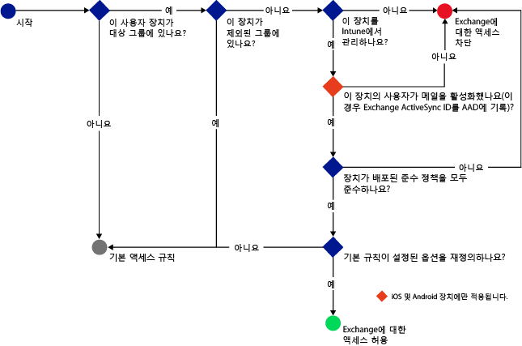
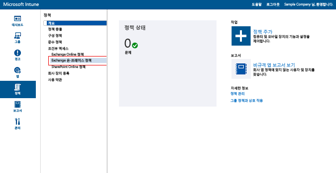
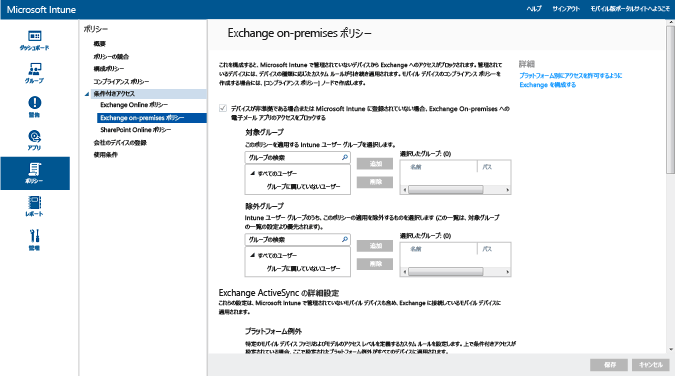

# Intune で Exchange On-premises と従来の Exchange Online Dedicated への電子メール アクセスを制限する

Exchange Online Dedicated 環境を使用していて、それが新しい構成であるか既存の構成であるかを確認する必要がある場合は、アカウント マネージャーに問い合わせてください。

Exchange On-premises または従来の Exchange Online Dedicated 環境への電子メール アクセスを制御するには、Intune で Exchange On-premises の条件付きアクセスを構成します。
条件付きアクセスの動作の詳細については、[電子メールと O365 サービスへのアクセスの制限]( restrict-access-to-email-and-o365-services-with-microsoft-intune.md)に関する記事をご覧ください。

条件付きアクセスを構成する**前に**、次のことを確認します。

-   Exchange のバージョンは、**Exchange 2010 以降**である必要があります。 Exchange Server クライアント アクセス サーバー (CAS) アレイがサポートされています。

-   [!INCLUDE[wit_nextref](../includes/wit_nextref_md.md)] を Microsoft Exchange On-premises に接続するために、**On-Premises Exchange Connector** を使用する必要があります。 これにより、[!INCLUDE[wit_nextref](../includes/wit_nextref_md.md)] コンソールでデバイスを管理できます。 コネクタの詳細については、[Intune On-Premises Exchange Connector](intune-on-premises-exchange-connector.md) に関するページをご覧ください。

    -   Intune コンソールで利用可能な On-Premises Exchange Connector は、Intune テナントに固有であり、他のテナントでは使用できません。 また、テナントの Exchange Connector は **1 台のコンピューターにのみ**インストールされるようにしてください。

        このコネクタは、Intune 管理コンソールからダウンロードする必要があります。  On-Premises Exchange Connector の構成方法に関するチュートリアルについては、[オンプレミスまたはホスト型 Exchange に対する On-Premises Exchange Connector の構成](intune-on-premises-exchange-connector.md)に関するページをご覧ください。

    -   このコネクタは、Exchange サーバーと通信できる任意のコンピューターにインストールできます。

    -   このコネクタは、**Exchange CAS 環境**をサポートします。 必要であれば、このコネクタを Exchange CAS サーバーに直接インストールすることは技術的に可能ですが、サーバーの負荷が増加するため、お勧めしません。
    コネクタを構成するときには、Exchange CAS サーバーのいずれかと通信するように設定する必要があります。

-   **Exchange ActiveSync** は、証明書ベースの認証またはユーザーの資格情報のエントリで構成する必要があります。

条件付きアクセス ポリシーを構成してユーザーに適用すると、ユーザーが電子メールに接続するには、使用する**デバイス**が以下の条件を満たさなくてはならなくなります。

-  [!INCLUDE[wit_nextref](../includes/wit_nextref_md.md)] に**登録**されているか、ドメインに参加している PC である。

-  **Azure Active Directory に登録されている**。 また、クライアントの Exchange ActiveSync ID を Azure Active Directory に登録する必要があります。

  AAD DRS は、Intune や Office 365 のお客様に対して自動的にアクティブ化されます。 ADFS Device Registration Service をデプロイ済みのお客様には、オンプレミスの Active Directory で登録されたデバイスは表示されません。 **これは、Windows PC と Windows Phone デバイスには適用されません。**

-   そのデバイスに展開されているすべての [!INCLUDE[wit_nextref](../includes/wit_nextref_md.md)] コンプライアンス ポリシーに**準拠**している。

次の図は、Exchange On-premises の条件付きアクセス ポリシーでデバイスを許可するかブロックするかを評価するフローを示しています。

 条件付きアクセス ポリシーが満たされない場合、ユーザーにはログイン時に次のいずれかのメッセージが表示されます。

- デバイスが [!INCLUDE[wit_nextref](../includes/wit_nextref_md.md)] に登録されていない、または Azure Active Directory に登録されていない場合は、メッセージが表示され、ポータル サイト アプリのインストール、デバイスの登録、および電子メールのアクティブ化の手順が示されます。 また、このプロセスによって、デバイスの Exchange ActiveSync ID が Azure Active Directory のデバイス レコードに関連付けられます。

-   デバイスがポリシーに準拠していない場合は、ユーザーを [!INCLUDE[wit_nextref](../includes/wit_nextref_md.md)] ポータル サイト Web サイトやポータル サイト アプリに導くメッセージが表示されます。このポータルで、問題とその修復方法に関する情報を確認することができます。

## モバイル デバイスのサポート
-   Windows Phone 8 以降

-   iOS のネイティブ電子メール アプリ。

-   Android 4 以降のネイティブ電子メール アプリ
> [!NOTE]
> Android と iOS の Microsoft Outlook アプリはサポートされていません。

## PC のサポート

Windows 8 以降用の**メール** アプリケーション ([!INCLUDE[wit_nextref](../includes/wit_nextref_md.md)] に登録されている場合)

##  条件付きアクセス ポリシーの構成

1.  [Microsoft Intune 管理コンソール](https://manage.microsoft.com)で、**[ポリシー]** > **[条件付きアクセス]** > **[Exchange On-premises ポリシー]** の順にクリックします。

2.  必要な設定でポリシーを構成します。

  - **[デバイスが Microsoft Intune に準拠していない場合や、登録されていない場合に、電子メール アプリから Exchange Online へのアクセスをブロックします]:** このオプションを選択すると、[!INCLUDE[wit_nextref](../includes/wit_nextref_md.md)] で管理されていないデバイスまたはコンプライアンス ポリシーに準拠していないデバイスは、Exchange サービスへのアクセスがブロックされます。

  - **[既定のルールを無視 - 登録された準拠デバイスが常に Exchange にアクセスできるようにする]:** このオプションをオンにすると、Intune に登録され、コンプライアント ポリシーに準拠しているデバイスは Exchange へのアクセスが許可されます。  
  このルールは**既定のルール**に優先します。つまり、アクセスを検疫またはブロックする**既定のルール**を設定した場合でも、登録された準拠デバイスは引き続き Exchange にアクセスできます。

  - **[対象グループ]:** Exchange にアクセスするにはデバイスを [!INCLUDE[wit_nextref](../includes/wit_nextref_md.md)] に登録する必要がある [!INCLUDE[wit_nextref](../includes/wit_nextref_md.md)] ユーザー グループを選択します。

  - **[例外グループ]:** 条件付きアクセス ポリシーから除外される [!INCLUDE[wit_nextref](../includes/wit_nextref_md.md)] ユーザー グループを選択します。 この一覧に指定されたユーザーは、同時に **[対象グループ]** の一覧に指定されている場合でも除外されます。

  - **[プラットフォーム例外]:** **[ルールの追加]** を選択して、指定したモバイル デバイスのファミリとモデルのアクセス レベルを定義するルールを構成します。 任意の種類のデバイスを使用できるので、[!INCLUDE[wit_nextref](../includes/wit_nextref_md.md)] でサポートされていないデバイスの種類を構成することもできます。

  - **[既定のルール]:** 他のどのルールにも含まれていないデバイスの場合、Exchange へのアクセスの許可、Exchange へのアクセスのブロック、検疫のいずれかを選択できます。 登録された準拠デバイスに対してアクセスを許可するルールを設定すると、iOS、Windows、および Samsung KNOX のデバイスには電子メールへのアクセス権が自動的に付与されます。 エンド ユーザーは自分の電子メールを取得するために何もプロセスを実行する必要はありません。  Samsung KNOX を実行していない Android デバイスの場合、エンド ユーザーには、電子メールにアクセスする前に、登録とコンプライアンスの確認方法に関するチュートリアルを含む検疫電子メールが送信されます。 アクセスをブロックまたは検疫するルールを設定すると、すべてのデバイスが、Intune に登録済みであるかどうかに関係なく Exchange にアクセスできなくなります。 登録および準拠デバイスがこのルールに影響されるのを防ぐためには、**[既定ルールの上書き]** をオンにします。
>[!TIP]
>電子メールへのアクセスを許可する前にすべてのデバイスをブロックする場合は、アクセスのブロックまたは検疫ルールを選択します。 既定のルールはすべてのデバイスの種類に適用されるので、プラットフォームの例外として構成されているデバイスの種類や [!INCLUDE[wit_nextref](../includes/wit_nextref_md.md)] でサポートされていないデバイスの種類も影響を受けます。

  - **[ユーザー通知]:** Exchange から送信される通知電子メールの他に、デバイスのブロック解除の手順が記載された電子メールが Intune によって送信されます。 この既定のメッセージは、ニーズに合わせてカスタマイズすることができます。 修復手順が記載されている Intune 通知電子メールはユーザーの Exchange 受信トレイに送信されるため、電子メール メッセージを受信する前にユーザーのデバイスがブロックされた場合は、ブロックされていないデバイスや、Exchange にアクセスするその他の方法を使用して、メッセージを表示できます。 これは特に**既定のルール**がブロックまたは検疫に設定されている場合に当てはまります。  この場合、エンド ユーザーはアプリ ストアに移動し、Microsoft ポータル サイト アプリをダウンロードし、デバイスを登録する必要があります。 これは iOS、Windows、および Samsung KNOX デバイスに適用されます。  Samsung KNOX を実行していないデバイスの場合、IT 管理者は連絡用電子メール アカウントに検疫電子メールを送信する必要があります。エンドユーザーはそのメールをブロックされた自分のデバイスにコピーして、登録およびコンプライアンス プロセスを完了する必要があります。
  > [!NOTE]
  > Exchange が通知電子メールを送信できるようにするには、通知電子メールの送信に使用されるアカウントを指定する必要があります。
  >
  > 詳細については、[オンプレミスまたはホスト型 Exchange に対する Exchange On-Premises Connector の構成](intune-on-premises-exchange-connector.md)に関するページをご覧ください。

3.  終了したら、**[保存]** を選択します。

-   条件付きアクセス ポリシーを展開する必要はありません。直ちに有効になります。

-   ユーザーが Exchange ActiveSync のプロファイルを設定してからデバイスがブロックされるまでに、1 ～ 3 時間かかる場合があります ([!INCLUDE[wit_nextref](../includes/wit_nextref_md.md)] で管理されていない場合)。

-   ブロックされたユーザーがデバイスを [!INCLUDE[wit_nextref](../includes/wit_nextref_md.md)] に登録し、非準拠の問題を修正すると、メールのアクセスは 2 分以内でブロック解除されます。

-   ユーザーが [!INCLUDE[wit_nextref](../includes/wit_nextref_md.md)] から登録解除した場合、デバイスがブロックされるまでに 1 ～ 3 時間かかる場合があります。

**デバイスのアクセスを制限する条件付きアクセス ポリシーの構成方法を示したシナリオの例を見るには、[電子メール アクセスの制限のシナリオ例](restrict-email-access-example-scenarios.md)をご覧ください。**

## 次のステップ
[SharePoint Online へのアクセスを制限する](restrict-access-to-sharepoint-online-with-microsoft-intune.md)

[Skype for Business Online へのアクセスを制限する](restrict-access-to-skype-for-business-online-with-microsoft-intune.md)

<!--HONumber=Jun16_HO4-->

