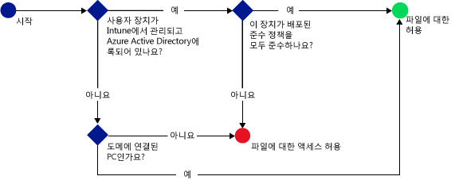

# Microsoft Intune で SharePoint Online へのアクセスを制限する
[!INCLUDE[wit_firstref](../includes/wit_firstref_md.md)] の条件付きアクセスを使用して、SharePoint Online 上にあるファイルへのアクセスを制御します。
条件付きアクセスには、2 つのコンポーネントがあります。
- デバイス コンプライアンス ポリシー。準拠したデバイスと見なされるには、このポリシーに準拠している必要があります。
- 条件付きアクセス ポリシー。デバイスがサービスにアクセスするために満たす必要のある条件を指定します。
条件付きアクセスの動作の詳細については、[電子メール、O365、およびその他のサービスへのアクセスを制限する](restrict-access-to-email-and-o365-services-with-microsoft-intune.md)に関するトピックをご覧ください。

ユーザーが、デバイスで OneDrive などのサポートされているアプリを使用してファイルに接続しようとすると、次の評価が行われます。

>[!IMPORTANT]
>先進認証を使用したアプリでの PC および Windows 10 Mobile デバイスに対する条件付きアクセスは、現在、Intune の一部のお客様だけが使用できます。 これらの機能を既に使用している場合は、何も行う必要はありません。 機能を引き続き使用できます。

>先進認証を使用したアプリでの PC および Windows 10 Mobile に対する条件付きアクセス ポリシーをまだ作成しておらず、これから作成する予定である場合は、要求を送信する必要があります。  既知の問題およびこの機能へのアクセス方法の詳細については、[Connect サイト](http://go.microsoft.com/fwlink/?LinkId=761472)をご覧ください。

SharePoint Online の条件付きアクセス ポリシーを構成する**前に**、次のことを行う必要があります。
- **SharePoint Online サブスクリプション**を取得します。ユーザーには SharePoint Online のライセンスが必要です。
- **Enterprise Mobility Suite** または **Azure Active Directory Premium** のサブスクリプションを取得します。

  必要なファイルに接続するには、デバイスが次の条件を満たしている必要があります。
-   [!INCLUDE[wit_nextref](../includes/wit_nextref_md.md)] に**登録**されているか、ドメインに参加している PC である。

-   Azure Active Directory に**デバイスが登録**されている (デバイスが [!INCLUDE[wit_nextref](../includes/wit_nextref_md.md)] に登録されている場合は、自動的に登録されます)。

-   展開されているすべての [!INCLUDE[wit_nextref](../includes/wit_nextref_md.md)] コンプライアンス ポリシーに準拠している。

デバイスの状態は、Azure Active Directory に格納され、指定した条件に基づいて、ファイルへのアクセスが許可されたりブロックされたりします。

条件が満たされない場合、ユーザーにはログイン時に以下のうちのいずれかのメッセージが表示されます。

-   デバイスが [!INCLUDE[wit_nextref](../includes/wit_nextref_md.md)] に登録されていない、または Azure Active Directory に登録されていない場合は、メッセージが表示され、ポータル サイト アプリのインストールと登録の手順が示されます。

-   デバイスがポリシーに準拠していない場合は、ユーザーを [!INCLUDE[wit_nextref](../includes/wit_nextref_md.md)] ポータル サイト Web サイトに導くメッセージが表示されます。このポータルで、問題とその修復方法に関する情報を確認することができます。

## モバイル デバイスのサポート
- iOS 7.1 以降
- Android 4.0 以降、Samsung Knox Standard 4.0 以降
- Windows Phone 8.1 以降

**iOS** と **Android** デバイス上のブラウザーからアクセスした場合、SharePoint Online へのアクセスを制限することができます。  準拠デバイスでサポートされているブラウザーからのアクセスのみが許可されます。
* Safari (iOS)
* Chrome (Android)
* 管理対象ブラウザー (iOS と Android)

**サポートされていないブラウザーはブロックされます**。

## PC のサポート
- Windows 8.1 以降 (Intune に登録されている場合)
- Windows 7.0 または Windows 8.1 (ドメインに参加している場合)

  - ドメインに参加している PC の場合、Azure Active Directory に[自動的に登録](https://azure.microsoft.com/en-us/documentation/articles/active-directory-conditional-access-automatic-device-registration/)するように設定する必要があります。
AAD DRS は、Intune や Office 365 のお客様に対して自動的にアクティブ化されます。 ADFS Device Registration Service をデプロイ済みのお客様には、オンプレミスの Active Directory で登録されたデバイスは表示されません。

  - ドメインへの参加を要求するようにポリシーを設定していて、PC がドメインに参加していない場合は、IT 管理者に連絡するようにメッセージが表示されます。

  - ドメインへの参加または準拠を要求するようにポリシーを設定していて、PC がいずれかの要件を満たしていない場合は、ポータル サイト アプリをインストールして登録する方法についての手順が示されたメッセージが表示されます。
-    [Office 365 の先進認証が有効化](https://support.office.com/en-US/article/Using-Office-365-modern-authentication-with-Office-clients-776c0036-66fd-41cb-8928-5495c0f9168a)されていて、最新の Office 更新プログラムがすべて適用されていること。

    先進認証により、Active Directory Authentication Library (ADAL) ベースのサインインが Office 2013 Windows クライアントに導入され、**多要素認証**や**証明書ベースの認証**などのより強力なセキュリティを使用できるようになります。

## SharePoint Online の条件付きアクセスの構成

### 手順 1. Active Directory セキュリティ グループを構成する
開始する前に、条件付きアクセス ポリシーの Azure Active Directory セキュリティ グループを構成します。 これらのグループは、 **Office 365 管理センター**または **Intune アカウント ポータル**で構成できます。 これらのグループは、ユーザーをポリシーの対象とするか、または除外するために使用されます。 ユーザーがポリシーの対象となる場合、ユーザーに使用される各デバイスがリソースにアクセスするには、ポリシーを遵守している必要があります。

SharePoint Online ポリシーには、次の 2 つのグループの種類を指定できます。

-   **対象グループ** – ポリシーを適用するユーザーのグループが含まれます。

-   **例外グループ** – ポリシーから除外されるユーザーのグループが含まれます。

ユーザーが両方のグループに含まれている場合は、ポリシーから除外されます。

### 手順 2. コンプライアンス ポリシーを構成し、展開する
まだ行っていない場合は、コンプライアンス ポリシーを作成し、SharePoint Online ポリシーの対象となるユーザーに対して展開します。

> [!NOTE]
> コンプライアンス ポリシーは [!INCLUDE[wit_nextref](../includes/wit_nextref_md.md)] グループに展開されますが、条件付きアクセス ポリシーは、Azure Active Directory セキュリティ グループを対象とします。

コンプライアンス ポリシーを構成する方法の詳細については、「[コンプライアンス ポリシーの作成](create-a-device-compliance-policy-in-microsoft-intune.md)」をご覧ください。

> [!IMPORTANT]
> コンプライアンス ポリシーを展開していない場合は、デバイスがポリシーに準拠しているものと見なされます。

準備ができたら、 **手順 3**に進みます。

### 手順 3. SharePoint Online ポリシーを構成する
次に、管理デバイスおよび準拠デバイスのみが SharePoint Online にアクセスできるように要求するポリシーを構成します。 このポリシーは、Azure Active Directory に格納されます。

#### 

1.  [Microsoft Intune 管理コンソール](https://manage.microsoft.com)で、**[ポリシー]** > **[条件付きアクセス]** > **[SharePoint Online ポリシー]** の順に選択します。

2.  **[SharePoint Online の条件付きアクセス ポリシーを有効にする]** をオンにします。

3.  **[アプリケーション アクセス]** で、条件付きアクセス ポリシーを適用する対象を次のように選ぶことができます。

    -   **すべてのプラットフォーム**

        **SharePoint Online** にアクセスするために使用するデバイスはすべて、Intune に登録され、またポリシーに準拠している必要があります。  **先進認証**を使用しているすべてのクライアント アプリケーションに条件付きアクセス ポリシーが適用されます。 プラットフォームが現在 Intune でサポートされていない場合、**SharePoint Online** へのアクセスはブロックされます。

        **[すべてのプラットフォーム]** オプションを選択することは、クライアント アプリケーションから報告されたプラットフォームでない限り、Azure Active Directory がこのポリシーをすべての認証要求に適用することを意味します。  次の場合を除いて、すべてのプラットフォームが登録されて準拠している必要があります。
        *   Windows デバイスが登録されて準拠している必要があるか、またはオンプレミスの Active Directory でドメインに参加している (一方または両方)
        * Mac などのサポートされていないプラットフォーム  ただし、これらのプラットフォームからの最新の認証を使用しているアプリは、それでもブロックされます。
        >[!TIP]
        >PC に対して条件付きアクセスを使用していないと、このオプションは表示されない場合があります。  その場合は、代わりに **[特定のプラットフォーム]** を使用してください。 PC の条件付きアクセスは、現在、Intune の一部のお客様だけが使用できます。   既知の問題およびこの機能へのアクセス方法の詳細については、[Microsoft Connect サイト](http://go.microsoft.com/fwlink/?LinkId=761472)をご覧ください。

    -   **特定のプラットフォーム**

         指定したプラットフォームで先進認証を使用しているすべてのクライアント アプリに条件付きアクセス ポリシーが適用されます。

     Windows PC の場合は、ドメインに参加しているか、または [!INCLUDE[wit_nextref](../includes/wit_nextref_md.md)] に登録されてポリシーに準拠している必要があります。 以下の要件を設定できます。

     -   **[デバイスはドメインに参加しているか準拠デバイスである必要があります]。** このオプションを選択した場合、PC はドメインに参加しているか、[!INCLUDE[wit_nextref](../includes/wit_nextref_md.md)] で設定されたポリシーに準拠している必要があります。 PC がどちらの要件も満たさない場合、ユーザーはデバイスを [!INCLUDE[wit_nextref](../includes/wit_nextref_md.md)] に登録するように求められます。

     -   **[デバイスはドメインに参加している必要があります]。** このオプションを選択した場合、PC は Exchange Online にアクセスするために、ドメインに参加する必要があります。 PC がドメインに参加していない場合、電子メールへのアクセスはブロックされ、ユーザーは IT 管理者に連絡するように求められます。

     -   **[デバイスは準拠デバイスである必要があります]。** このオプションを選択した場合、PC は [!INCLUDE[wit_nextref](../includes/wit_nextref_md.md)] に登録され、ポリシーに準拠している必要があります。 PC を登録していない場合は、登録する方法についての手順を示したメッセージが表示されます。

4.   SharePoint Online と OneDrive for Business への **[ブラウザー アクセス]** では、サポートされているブラウザー (Safari (iOS)、Chrome (Android)) を通じてのみ、Exchange Online へのアクセスを許可することを選択できます。 その他のブラウザーからのアクセスはブロックされます。  OneDrive のアプリケーションのアクセス用に選択した同じプラットフォームの制限が、ここにも適用されます。

  **Android** デバイスで、ユーザーはブラウザー アクセスを有効にする必要があります。  この操作を行うには、次のようにエンドユーザーが、登録されるデバイスで “ブラウザー アクセスを有効にする” オプションを有効にする必要があります。
  1.    **ポータル サイト アプリ**を起動します。
  2.    トリプル ドット (…) またはハードウェアのメニュー ボタンから **[設定]** ページに移動します。
  3.    **[ブラウザー アクセスを有効にする]** ボタンを押します。
  4.  Chrome ブラウザーで Office 365 からサインアウトして、Chrome を再起動します。

  **iOS と Android** プラットフォームで、サービスにアクセスするために使用するデバイスを識別するために、Azure Active Directory はデバイスにトランスポート層セキュリティ (TLS) 証明書を発行します。  デバイスには、次のスクリーン ショットに示すように、証明書を選択するエンドユーザーに対してプロンプトで証明書が表示されます。 エンドユーザーは、ブラウザーの使用を続けられるように、この証明書を選択する必要があります。

  **iOS**

  

  **Android**

  
5.  **[対象グループ]**で、**[変更]** を選択して、ポリシーを適用する Azure Active Directory セキュリティ グループを選択します。 すべてのユーザーを対象にすることも、選んだユーザーのグループのみを対象にすることもできます。

6.  **[例外グループ]**で、必要に応じて **[変更]** を選択して、このポリシーから除外する Azure Active Directory セキュリティ グループを選択します。

6.  終了したら、**[保存]** を選択します。

条件付きアクセス ポリシーを展開する必要はありません。直ちに有効になります。

### 手順 4. コンプライアンスと条件付きアクセス ポリシーを監視する
**[グループ]** ワークスペースで、デバイスの状態を表示できます。

モバイル デバイス グループを選択し、 **[デバイス]** タブで、次の **[フィルター]**のいずれかを選択します。

-   **AAD に登録されていないデバイス** – これらのデバイスは SharePoint Online からブロックされます。

-   **準拠していないデバイス** – これらのデバイスは SharePoint Online からブロックされます。

-   **AAD に登録され、準拠しているデバイス** – これらのデバイスは、SharePoint Online にアクセスできます。

### 関連項目
[Microsoft Intune を使用して電子メールおよび O365 サービスへのアクセスを制限する](restrict-access-to-email-and-o365-services-with-microsoft-intune.md)

<!--HONumber=Jun16_HO4-->

