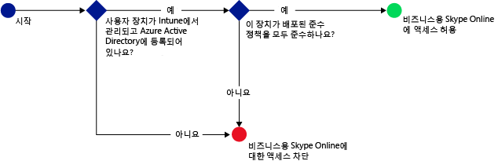
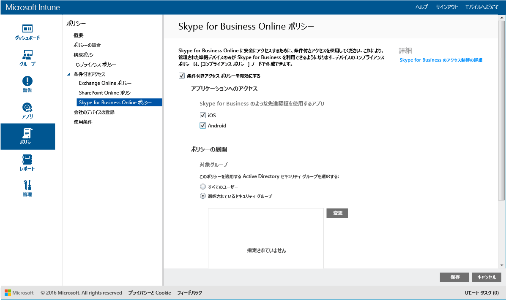

# Microsoft Intune で Skype for Business Online へのアクセスを制限する
**Skype for Business Online** の条件付きアクセス ポリシーを使用して、Skype for Business Online へのアクセスを制御します。
条件付きアクセスには、2 つのコンポーネントがあります。
- デバイス コンプライアンス ポリシー。準拠したデバイスと見なされるには、このポリシーに準拠している必要があります。
- 条件付きアクセス ポリシー。デバイスがサービスにアクセスするために満たす必要のある条件を指定します。
条件付きアクセスの動作の詳細については、[電子メールと O365 サービスへのアクセスの制限](restrict-access-to-email-and-o365-services-with-microsoft-intune.md)に関する記事をご覧ください。

対象となるユーザーがデバイスで Skype for Business Online を使用しようとすると、次の評価が行われます。

Skype for Business Online の条件付きアクセス ポリシーを構成する**前に**、次のことを行う必要があります。
- **Skype for Business Online サブスクリプション**を取得し、Skype for Business Online のライセンスをユーザーに割り当てます。
- **Enterprise Mobility Suite** または **Azure Active Directory Premium** のサブスクリプションを取得します。
-   Skype for Business Online で[先進認証を有効](https://docs.microsoft.com/en-us/intune/deploy-use/restrict-access-to-skype-for-business-online-with-microsoft-intune)にします。 
-  すべてのエンド ユーザーが **Skype for Business Online** を使用している必要があります。 展開に Skype for Business Online とオンプレミスの Skype for Business の両方が含まれる場合は、エンド ユーザーに条件付きアクセス ポリシーが適用されません。

    Skype for Business Online にアクセスするデバイスは、次の条件を満たしている必要があります。

-   **Android** デバイスまたは **iOS** デバイスである。

-   [!INCLUDE[wit_nextref](../includes/wit_nextref_md.md)] に**登録**されている。

-   展開されているすべての [!INCLUDE[wit_nextref](../includes/wit_nextref_md.md)] コンプライアンス ポリシーに**準拠**している。

デバイスの状態は Azure Active Directory に格納され、指定した条件に基づいて、アクセスが許可されたりブロックされたりします。

条件が満たされない場合、ユーザーにはログイン時に以下のうちのいずれかのメッセージが表示されます。

-   デバイスが [!INCLUDE[wit_nextref](../includes/wit_nextref_md.md)] に登録されていない、または Azure Active Directory に登録されていない場合は、メッセージが表示され、ポータル サイト アプリのインストールと登録の手順が示されます。

-   デバイスがポリシーに準拠していない場合は、ユーザーを [!INCLUDE[wit_nextref](../includes/wit_nextref_md.md)] ポータル サイト Web サイトやポータル サイト アプリに導くメッセージが表示されます。このポータルで、問題とその修復方法に関する情報を確認することができます。

## Skype for Business Online の条件付きアクセスの構成

### 手順 1. Active Directory セキュリティ グループを構成する
開始する前に、条件付きアクセス ポリシーの Azure Active Directory セキュリティ グループを構成します。 これらのグループは、**Office 365 管理センター**で構成できます。 これらのグループは、ユーザーをポリシーの対象とするか、または除外するために使用されます。 ユーザーがポリシーの対象となる場合、ユーザーに使用される各デバイスがリソースにアクセスするには、ポリシーを遵守している必要があります。

Skype for Business ポリシーに対して使用する 2 つのグループの種類を指定できます。

-   **対象グループ** – ポリシーを適用するユーザーのグループが含まれます。

-   **例外グループ** – ポリシーから除外されるユーザーのグループが含まれます。

ユーザーが両方のグループに含まれている場合は、ポリシーから除外されます。

### 手順 2. コンプライアンス ポリシーを構成し、展開する
コンプライアンス ポリシーを[作成](create-a-device-compliance-policy-in-microsoft-intune.md)し、ポリシーによって影響を受けるすべてのデバイスに[展開](deploy-and-monitor-a-device-compliance-policy-in-microsoft-intune.md)します。 これは、**対象グループ**内のユーザーによって使用されるすべてのデバイスです。

> [!NOTE] コンプライアンス ポリシーは [!INCLUDE[wit_nextref](../includes/wit_nextref_md.md)] グループに展開されますが、条件付きアクセス ポリシーは、Azure Active Directory セキュリティ グループを対象とします。

> [!IMPORTANT] コンプライアンス ポリシーを展開していない場合は、デバイスがポリシーに準拠しているものと見なされます。

準備ができたら、 **手順 3**に進みます。

### 手順 3. Skype for Business Online ポリシーを構成する
次に、管理デバイスおよび準拠デバイスのみが Skype for Business Online にアクセスできるように要求するポリシーを構成します。 このポリシーは、Azure Active Directory に格納されます。

####
1.  [Microsoft Intune 管理コンソール](https://manage.microsoft.com)で、**[ポリシー]**、**[条件付きアクセス]** > **[Skype for Business Online ポリシー]** の順にクリックします。

2.  **[条件付きアクセス ポリシーを有効にする]** をオンにします。

3.  **[アプリケーション アクセス]** で、条件付きアクセス ポリシーを適用する対象を次のように選ぶことができます。

    -   **iOS**

    -   **Android**

4.   **[対象グループ]**で、 **[変更]** をクリックして、ポリシーを適用する Azure Active Directory セキュリティ グループを選択します。 すべてのユーザーを対象にすることも、選んだユーザーのグループのみを対象にすることもできます。

5.   **[例外グループ]**で、必要に応じて **[変更]** をクリックして、このポリシーから除外する Azure Active Directory セキュリティ グループを選択します。

6.  終了したら、 **[保存]**をクリックします。

これで、Skype for Business Online の条件付きアクセスの構成が完了しました。 条件付きアクセス ポリシーを展開する必要はありません。直ちに有効になります。

## コンプライアンスと条件付きアクセス ポリシーを監視する
 **[グループ]** ワークスペースで、デバイスの条件付きアクセスの状態を表示できます。

モバイル デバイス グループを選択し、 **[デバイス]** タブで、次の **[フィルター]**のいずれかを選択します。

* **AAD に登録されていないデバイス** – これらのデバイスは Skype for Business Online からブロックされます。

* **準拠していないデバイス** – これらのデバイスは Skype for Business Online からブロックされます。

* **AAD に登録され、準拠しているデバイス** – これらのデバイスは、Skype for Business Online にアクセスできます。

<!--HONumber=Jun16_HO3-->

