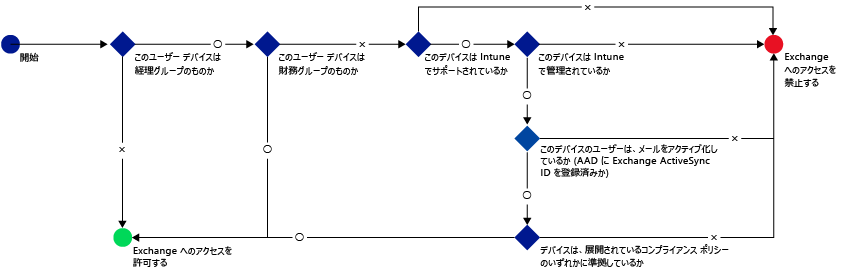
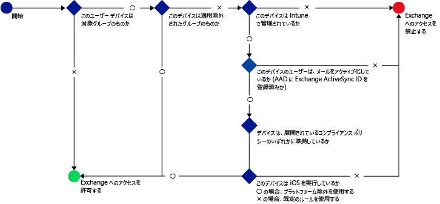
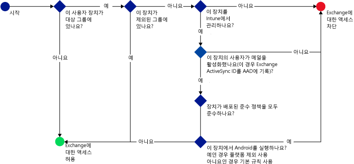

# Microsoft Intune을 사용한 전자 메일에 대한 액세스 제한: 예제 시나리오

## 비준수 장치를 사용하여 Exchange Online에 액세스하는 사용자를 차단합니다.
### 시나리오 요구 사항
- 장치가 배포된 준수 정책을 준수하지 않는 경우 **회계** Active Directory 보안 그룹의 모든 사용자가 Exchange Online에 액세스하지 못하도록 차단되어야 합니다.
- 사용자가 [!INCLUDE[wit_nextref](../includes/wit_nextref_md.md)]에서 지원되지 않는 장치를 포함한 그룹에 있는 경우 해당 장치에서 Exchange Online에 액세스하지 못하도록 차단되어야 합니다.
- **재무** Active Directory 보안 그룹 정책에 속한 모든 사용자가 **회계** 보안 그룹에도 속해 있더라도 해당 정책에서 제외되어야 합니다.

이를 위해 다음 설정으로 Exchange Online에 대한 조건부 액세스 정책을 구성합니다.

-   **조건부 액세스 정책 사용**을 선택합니다.

- 최신 인증을 사용하여 앱에서 액세스를 허용할 플랫폼을 선택합니다.
- Exchange ActiveSync 앱의 경우 **Microsoft Intune에서 지원하는 플랫폼에서 비준수 장치 차단** 및 **Microsoft Intune에서 지원하지 않는 플랫폼에서 모든 다른 장치 차단**을 선택합니다.
-   **대상 그룹** 섹션의 **선택한 보안 그룹** 아래에서 **회계** 사용자 그룹을 선택합니다.

-   **제외된 그룹** 섹션의 **선택한 보안 그룹** 아래에서 **재무** 사용자 그룹을 선택합니다.

다음 흐름을 사용하여 Exchange Online에 액세스할 수 있는 장치를 결정합니다.

## Exchange 온-프레미스에 액세스하는 모든 iOS 장치는 Intune을 통해 관리되어야 합니다.
### 시나리오 요구 사항
- iOS를 실행하는 장치만 Exchange 온-프레미스에 대한 액세스가 허용되어야 합니다.
- 장치를 Exchange에 액세스하는 데 사용할 수 있으려면 Intune에 등록해야 하며 규정 준수 정책 규칙을 충족해야 합니다.

이를 위해 다음 설정으로 Exchange 온-프레미스에 대한 다음 조건부 액세스 정책을 구성합니다.

-   **장치가 비준수이거나 Microsoft Intune에 등록되지 않은 경우 전자 메일 앱이 Exchange 온-프레미스에 액세스하지 못하도록 차단** 옵션을 선택합니다. 이 옵션을 선택하면 조건부 액세스 정책이 사용하도록 설정되며 Exchange에 액세스할 수 있으려면 모든 장치를 Microsoft Intune에 등록하고 규정 준수 정책 규칙을 충족해야 합니다.

-   고급 Exchange Active Sync 설정을 위해 다음을 만듭니다.

  -   iOS를 실행하는 장치가 Exchange에 액세스하도록 허용하는 플랫폼 예외   

  -   장치에 플랫폼 예외 규칙이 적용되지 않는 경우 Exchange 액세스를 차단하도록 지정하는 기본 규칙입니다. 이 규칙은 iOS를 실행하지 않는 장치는 Exchange 액세스를 차단하도록 합니다.

다음 흐름을 사용하여 Exchange에 액세스할 수 있는 장치를 결정합니다.

## Android 장치는 Exchange 온-프레미스에 액세스할 수 없습니다.
### 시나리오 요구 사항
- 모든 Android 장치는 Exchange 액세스가 차단됩니다.
- 지원되는 다른 모든 장치를 [!INCLUDE[wit_nextref](../includes/wit_nextref_md.md)]에서 관리하는 동안에는 Exchange에 액세스할 수 있습니다.

이를 위해 다음 설정으로 Exchange 온-프레미스에 대한 조건부 액세스 정책을 구성합니다.

-   **장치가 비준수이거나 Microsoft Intune에 등록되지 않은 경우 전자 메일 앱이 Exchange 온-프레미스에 액세스하지 못하도록 차단** 옵션을 선택합니다. 이 옵션을 선택하면 모든 장치가 Intune에 등록되고 규정 준수 정책 규칙을 충족해야 합니다.

- 고급 Exchange Active Sync 설정을 위해 다음을 만듭니다.
  -   Android를 실행하는 장치를 Exchange에 액세스하지 못하도록 차단하는 플랫폼 예외 이 규칙은 Android 장치를 Exchange에 액세스하는 데 사용할 수 없도록 합니다.

  -   장치에 다른 규칙이 적용되지 않는 경우 Exchange 액세스를 허용하도록 지정하는 기본 규칙입니다. 이 기본 규칙을 사용하면 Android 이외의 플랫폼을 실행하지만 Microsoft Intune에서 지원되는 장치를 Exchange에 액세스하는 데 사용할 수 있습니다. 그러나 Intune에 등록되고 규정 준수 정책 규칙을 충족해야 합니다.

다음 흐름을 사용하여 Exchange에 액세스할 수 있는 장치를 결정합니다.

<!--HONumber=Jul16_HO5-->

