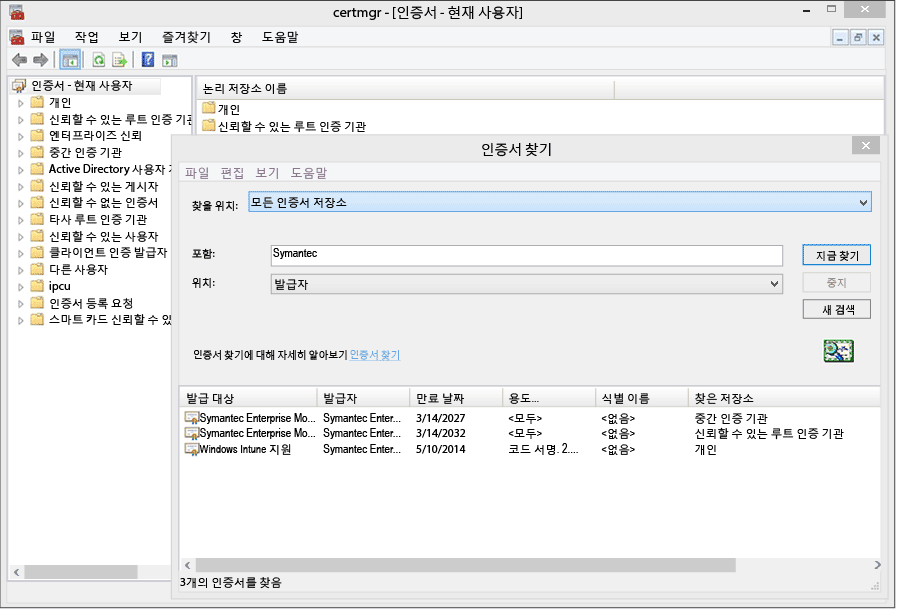
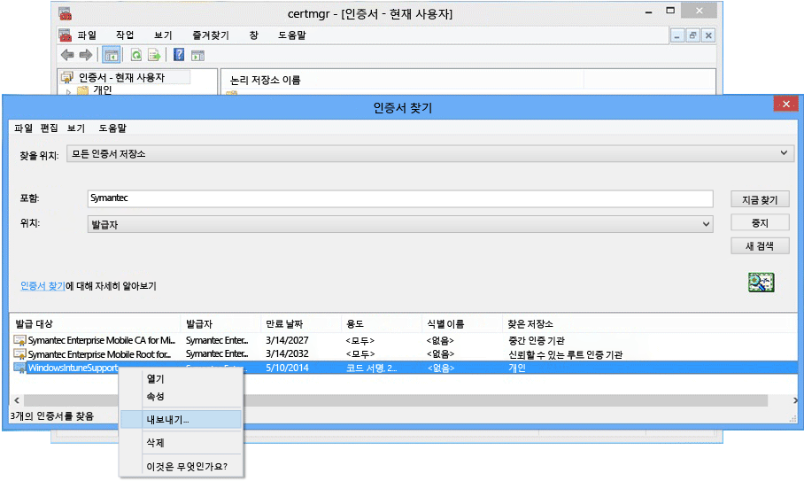

# Windows Phone 8.0 のデバイス管理のセットアップ

Windows Phone 8.0 では、Intune ポータル サイト アプリのインストールとデバイスの管理の許可に Symantec 証明書が必要です。 基幹業務アプリに署名するための証明書も必要です。 次のトピックは、Windows Phone 8.0 のみに該当します。 Windows 10 Mobile を含む Windows Phone 8.1 以降を管理するには、「[Windows Phone の登録をセットアップする](set-up-windows-phone-management-with-microsoft-intune.md)」をご覧ください。

> [!IMPORTANT]
> 2016年 9 月以降、Windows 8.0 および Windows Phone 8.0 のポータル サイト アプリはダウンロードできなくなります。

-   **Windows Phone 8** -証明書が必要
-   **Windows Phone 8.1 および Windows 10 Mobile** では、次の場合にのみ証明書が必要です。

    -   Intune を使用してポータル サイト アプリを展開する

    -   基幹業務 (別名 "サイドロード") アプリを展開する


  > [!IMPORTANT]
  > 特定の Windows および Windows Phone モバイル デバイスを管理するのに使用する Symantec 証明書は、[定期的に更新する必要があります](renew-a-symantec-code-signing-certificate.md)。

Window Phone のモバイル デバイス管理のセットアップ要件は、デバイスの管理方法によって異なります。  会社の DNS 登録で 2 つの CNAME を設定すると、ユーザーが簡単に登録できるようになります。 ユーザーがストアからポータル サイト アプリをダウンロードする場合は、DNS 設定を構成したら、必要な作業は、ポータル サイトをセットアップし、ユーザーに登録方法を通知することだけです。  ポータル サイトを Windows Phone 8.0 または Windows Phone 8.1 に展開する場合は、アプリのコード署名に Symantec 証明書が必要です。

## Windows Phone 管理を有効にするためのセットアップ要件を構成する
1.  **Intune をセットアップする** **Microsoft Intune** を[モバイル デバイス管理機関に設定](get-ready-to-enroll-devices-in-microsoft-intune.md#set-mobile-device-management-authority)して、MDM の設定を行うことにより、モバイル デバイス管理を準備します (この作業をまだ行っていない場合)。

2.  **登録サーバーのアドレスの DNS エイリアスを設定する** (オプション)

    DNS エイリアス (CNAME レコード タイプ) を設定すると、デバイスの登録時にサーバー名が自動的に入力されるため、ユーザーは簡単に登録できるようになります。

    1.  [Intune 管理コンソール](http://manage.microsoft.com)で、**[管理]** &gt; **[モバイル デバイス管理]** &gt; **[Windows Phone]** の順にクリックします。

    2.  **[検証済みドメイン名の指定]** ボックスに会社の Web サイトの検証済みドメインの URL を入力し、**[自動検出のテスト]** をクリックします。

    3.  会社のドメインの **CNAME** DNS リソース レコードを作成します。 CNAME リソース レコードには次の情報を含める必要があります。

        |ホスト名|指定先|TTL|
        |-------------|-------------|-------|
        |enterpriseenrollment.company_domain.com|enterpriseenrollment-s.manage.microsoft.com |1 時間|
        |enterpriseregistration.company_domain.com|enterpriseregistration.windows.net|1 時間|
        たとえば、会社の Web サイトが contoso.com の場合、EnterpriseEnrollment.contoso.com を manage.microsoft.com にリダイレクトする CNAME を DNS に作成します。 検証済みドメインが複数ある場合、ドメインごとに CNAME レコードを作成します。

        -   `enterpriseenrollment-s.manage.microsoft.com` – Intune サービスへのリダイレクトと電子メールのドメイン名によるドメイン認識をサポートします。

        -   `enterpriseregistration.windows.net` – モバイル デバイスの社内参加をサポートします。 また、Windows 8.1 用の条件付きアクセスもサポートします。

    

3.  **アプリ署名をサポートするための証明書管理** (Windows Phone ストアにアクセスしない、または基幹業務アプリを必要としない、あるいはその両方である Windows Phone 8.0 および Windows Phone 8.1 には必須です)。

    Windows Phone 8.0 向けのポータル サイト アプリをサポートし、Windows Phone 8.1 に会社のアプリを展開するには、 **Symantec エンタープライズ モバイル コード署名証明書**を取得する必要があります。 Symantec の証明書のみが Windows Phone デバイスによって信頼されているため、自身の証明機関が発行した証明書を使用することはできません。 この証明書は、以下の操作を行うために必要です。

    -   登録と携帯電話の管理のために、[!INCLUDE[winphone8_client_1](../includes/winphone8_client_1_md.md)] に展開するポータル サイト アプリに署名する

    -   [!INCLUDE[wit_nextref](../includes/wit_nextref_md.md)] で会社の基幹業務アプリを Windows Phone に展開できるように、そのアプリに署名する

    次の手順を実行すると、必要な証明書を取得し、ポータル サイト アプリに署名することができます。 この手順では、Windows Phone デベロッパー センター アカウントが必要です。また、Symantec 証明書を購入する必要があります。

    1.  **Windows Phone デベロッパー センターに参加する** ログイン時に企業のアカウント情報を使用して [Windows Phone デベロッパー センター](http://go.microsoft.com/fwlink/?LinkId=268442)に参加し、会社のアカウントを購入します。 コード署名証明書を受け取る前に、会社の担当者からこの要求の承認を受ける必要があります。

    2.  **会社の Symantec 証明書を取得する** [Symantec の Web サイト](http://go.microsoft.com/fwlink/?LinkId=268441)から Symantec ID を使用して証明書を購入します。 証明書を購入すると、Windows Phone デベロッパー センター アカウントで指定された会社の承認者は、証明書要求の承認を求めるメールを受信します。 Symantec 証明書の要件の詳細については、「[Why Windows Phone requires a Symantec certificate? (Windows Phone で Symantec 証明書が必要な理由)](https://technet.microsoft.com/en-us/library/dn764959.aspx#BKMK_Symantec)」 (Windows デバイスの登録に関する FAQ) をご覧ください。

    3.  **証明書をインポートする** 要求が承認されると、証明書をインポートするための手順を含む電子メールが届きます。 メールの指示に従って証明書をインポートします。

    4.  **インポートされた証明書を確認する **証明書が正しくインポートされたことを確認するには、**[証明書]** スナップインに移動し、**[証明書]** を右クリックして **[証明書の検索]** を選択します。 **[含む]** フィールドに「Symantec」と入力し、 **[今すぐ検索]**をクリックします。 インポートした証明書が検索結果に表示されます。

        

    5.  **署名証明書をエクスポートする** 証明書があることを確認したら、.pfx ファイルをエクスポートしてポータル サイトに署名できます。 **[使用目的]** が "コード署名" になっている Symantec 証明書を選択します。 そのコード署名証明書を右クリックして、**[エクスポート]** を選択します。

        

        **[証明書のエクスポート ウィザード]**が起動したら、 **[はい、秘密キーをエクスポートします]** を選択して **[次へ]**をクリックします。 **[Personal Information Exchange - PKCS #12 (.PFX)]** を選択し、**[証明のパスにある証明書を可能であればすべて含む]** チェック ボックスをオンにします。 ウィザードを完了します。 詳細については、「 [証明書を秘密キーと共にエクスポートする](http://go.microsoft.com/fwlink/?LinkID=203031)」をご覧ください。

    6.  **ポータル サイト アプリをダウンロードして署名する**

        Windows Phone の登録のサポートには、Windows Phone 8.0 ポータル サイト アプリに署名し、Intune にアップロードすることが必要です。

        1.  **ポータル サイトをダウンロードする** [Windows Phone 用 Intune ポータル サイト](http://go.microsoft.com/fwlink/?LinkId=268440)をダウンロード センターからダウンロードします。 既定のインストール場所は、 `C:\Program Files (x86)\Microsoft Corporation\Windows Intune Company Portal for Windows Phone`です。

        2.  **Windows Phone 8.0 SDK をダウンロードする** [Windows Phone SDK](http://go.microsoft.com/fwlink/?LinkId=615570) をダウンロードします。

        3.  **ポータル サイト アプリにコード署名する **SDK と一緒にダウンロードした XAPSignTool アプリで、Symantec 証明書から作成した .pfx ファイルを使用してポータル サイトに署名します。 詳細については、「 [How to sign a company app by using XapSignTool (XapSignTool を使用して Windows Phone 用の自社アプリに署名する方法)](http://go.microsoft.com/fwlink/?LinkID=280195)」をご覧ください。

    7.  **ポータル サイト アプリを Intune にアップロードする** 署名付きのポータル サイト アプリ ファイルと、コード署名証明書をアップロードして、アプリをエンド ユーザーが使用できるようにします。

        1.  [Intune 管理コンソール](http://manage.microsoft.com)で、**[管理]** &gt; **[Windows Phone]** の順にクリックします。

        2.  **[署名済みアプリ ファイルのアップロード]** をクリックし、Intune 管理者 ID でサインインします。

        3.  **[ソフトウェア セットアップ ファイルの場所の指定]** の **[ソフトウェア セットアップ]** ページで、コード署名済みポータル サイト アプリの場所 (Windows Phone 8.0 の場合は .xap、Windows Phone 8.1 の場合は .appx) を参照します。

            Intune を評価中で、試用版の Intune アカウントでコード署名されたアプリのファイルをアップロードする場合、**[サンプルの Symantec コード署名証明書で署名されているポータル サイト アプリ ファイルを使用する]** チェック ボックスをオフにします。

        4.  エクスポートした証明書 (.pfx) ファイルを **[コード署名証明書]** に追加し、証明書のパスワードを作成します。

        5.  [ **ソフトウェアの説明** ] ページでフィールドに入力します。入力した情報は、ユーザーがポータル サイトのアプリの詳細を表示すると、ユーザーのデバイスに表示されます。

        6.  ウィザードを完了します。 Windows Phone 8.0 デバイスを登録するユーザーは、登録時にポータル サイト アプリを自分のデバイスで今すぐ入手できます。 Windows Phone 8.1 ユーザーは、ストア バージョンのポータル サイトからポータル サイト アプリをインストールできます。  Windows Phone ストアから Windows Phone 8.1 デバイスがブロックされる場合、または Intune を使用してポータル サイト アプリを展開する場合、Windows Phone 8.1 ポータル サイト (SSP.appx) アプリをダウンロードして署名する必要があります。

4.  **ポータル サイトで会社のリソースにアクセスする方法をユーザーに通知する** ユーザーは自分のデバイスを登録する方法とデバイスが管理されるとどうなるかを知る必要があります。 [Microsoft Intune の使用に関するエンドユーザーへの通知内容](what-to-tell-your-end-users-about-using-microsoft-intune.md)

## Windows Phone 8.1 ポータル サイト アプリを展開する
Windows Phone ストアからインストールしなくても、Intune を使用してポータル サイト アプリを Windows Phone 8.1 デバイスに展開できます。 その場合でも、Symantec 証明書を使用して上記の手順で Windows Phone デバイスの登録を有効にする必要があります。 その後、Windows Phone 8.1 のポータル サイト アプリをダウンロードし、Symantec 証明書を使用して署名する必要があります。  この手順は、ユーザーが会社のストアを使用しないが、ポータル サイトを Windows Phone 8.1 デバイスに展開する場合のみ必要です。


1.  **ポータル サイトをダウンロードする**

    ダウンロード センターから [Windows Phone 8.1 用 Microsoft Intune ポータル サイト アプリ](http://go.microsoft.com/fwlink/?LinkId=615799)をダウンロードし、自己解凍形式 (.exe) のファイルを実行します。 このファイルには、以下の 2 つのファイルが含まれています。

    -   CompanyPortal.appx – ポータル サイトの Windows Phone 8.1 用インストール アプリ

    -   WinPhoneCompanyPortal.ps1 – ポータル サイト アプリ ファイルへの署名に使用する PowerShell スクリプト。これにより、ポータル サイト アプリを Windows Phone 8.1 デバイスに展開できます。

2.  **Windows Phone SDK をダウンロードする** [Windows Phone SDK 8.0](http://go.microsoft.com/fwlink/?LinkId=615570) (http://go.microsoft.com/fwlink/?LinkId=268439) をダウンロードし、SDK をコンピューターにインストールします。 この SDK は、アプリケーション登録トークンを生成するために必要です。

3.  **AETX ファイルを生成する** Windows Phone SDK 8.0 に含まれる AETGenerator.exe を使用して、Symantec PFX ファイルからアプリケーション登録トークン (.aetx) ファイルを生成します。 AETX ファイルの作成手順については、「 [Windows Phone 用のアプリケーション登録トークンを生成する方法](https://msdn.microsoft.com/library/windows/apps/jj735576.aspx)」をご覧ください。

4.  **Windows SDK for Windows 8.1 をダウンロードする** [Windows Phone SDK](http://go.microsoft.com/fwlink/?LinkId=613525) (http://go.microsoft.com/fwlink/?LinkId=613525) をダウンロードしてインストールします。 ポータル サイト アプリに付属の PowerShell スクリプトでは、既定のインストール場所 `${env:ProgramFiles(x86)}\Windows Kits\8.1`が使用される点に注意してください。 他の場所にインストールする場合は、コマンドレット パラメーターにその場所を含める必要があります。

5.  **PowerShell を使用してアプリにコード署名をする** Windows SDK と Symantec エンタープライズ モバイル コード署名証明書がインストールされたホスト コンピューターで、管理者として **Windows PowerShell** を開き、Sign-WinPhoneCompanyPortal.ps1 ファイルに移動してスクリプトを実行します。

    **例 1**

    ```
    .\Sign-WinPhoneCompanyPortal.ps1 -InputAppx 'C:\temp\CompanyPortal.appx' -OutputAppx 'C:\temp\CompanyPortalEnterpriseSigned.appx' -PfxFilePath 'C:\signing\cert.pfx' -PfxPassword '1234' -AetxPath 'C:\signing\cert.aetx'
    ```
    この例では、C:\temp\ にある CompanyPortal.appx に署名し、CompanyPortalEnterpriseSigned.appx を生成します。 PFX パスワード 1234 を使用して、PFX ファイルから発行者 ID を読み取ります。 同様に、cert.aetx ファイルからはエンタープライズ ID を読み取ります。

    **例 2**

    ```
    .\Sign-WinPhoneCompanyPortal.ps1 -InputAppx 'C:\temp\CompanyPortal.appx' -OutputAppx 'C:\temp\CompanyPortalEnterpriseSigned.appx' -PfxFilePath 'C:\signing\cert.pfx' -PfxPassword '1234' -PublisherId 'OID.0.9.2342.19200300.100.1.1=1000000001, CN="Test, Inc.", OU=Test 1' -EnterpriseId 1000000001
    ```
    この例では、C:\temp\ にある CompanyPortal.appx に署名し、CompanyPortalEnterpriseSigned.appx を生成します。 PFX パスワード 1234 を使用して、指定された発行者 ID を使用します。

    **パラメーター:**

    -   `-InputAppx` – 単一引用符で囲まれた、CompanyPortal.appx ファイルへのローカル パス。 たとえば、'C:\temp\CompanyPortal.appx'。

    -   `-OutputAppx` – 単一引用符で囲まれた、署名済みポータル サイト アプリのローカル パスとファイル名。 たとえば、'C:\temp\CompanyPortalEnterpriseSigned.appx'。

    -   `-PfxFilePath` – Symantec 証明書のエクスポート済み PFX ファイルのローカル パスとファイル名。 たとえば、'C:\signing\cert.pfx'。

    -   `-PfxPassword` – 単一引用符で囲まれた、PFX ファイルの署名に使用されるパスワード。 たとえば、'1234'。

    -   `-AetxPath` – 'EnterpriseId' 引数が定義されていない場合にエンタープライズ ID の読み取りに使用される .aetx ファイルへのローカル パス。 この引数と EnterpriseId のいずれかを指定する必要があります。 たとえば、'C:\signing\cert.aetx'。

    -   `-PublisherId` - エンタープライズの発行者 ID。 指定しない場合、Symantec エンタープライズ モバイル コード署名証明書の 'Subject' フィールドが使用されます。 たとえば、'OID.0.9.2342.19200300.100.1.1=1000000001, CN="Test, Inc.", OU=Test 1'。

    -   `-SdkPath` - Windows 8.1 用 Windows SDK のルート フォルダーへのパス。 この引数は省略可能で、既定値は ${env:ProgramFiles(x86)}\Windows Kits\8.1 です。

    -   `-EnterpriseId` - エンタープライズ ID。 この引数と 'AetxPath' のいずれかを指定する必要があります。 この引数が指定されていない場合、AETX ファイルからエンタープライズ ID が読み取られます。 たとえば、1000000001。

6.  Windows Phone 8.1 ポータル サイト (SSP.appx) アプリを展開する

    > [!IMPORTANT]
    > ssp.xap とストアのポータル サイトは同時にインストールできますが、ユーザーが混乱する可能性があります。 すべてのユーザーが ssp.xap を使用するようにするには、ストア バージョンのポータル サイト用がブロックされるアプリを作成します。 すべての Windows Phone 8.1 デバイスでストア バージョンのポータル サイトのみを使用するようにするには、3 つの選択肢があります。
    >
    > -   アプリをサイドロードせず、Windows Phone 8.0 をサポートする必要がない場合は、署名済みの ssp.xap をアップロードしないでください。
    > -   サイドロードされたアプリが必要で、Windows Phone 8 デバイスの登録がない場合は、作成された ssp.xap の展開は [使用可能] から [アンインストール] に自動的に変わります。
    > -   サイドロードされたアプリをインストールする必要があり、Windows Phone 8.0 デバイスで ssp.xap を登録し、受信する場合は、新しいソフトウェア展開の ssp.xap を作成し、[ **アンインストール** ] 操作で展開します。 Windows Phone 8.0 デバイスは、アプリの強制インストールまたは強制アンインストールをサポートしていないため、この展開は無視されます。 Windows Phone 8.1 デバイスはアンインストール操作をサポートしているので、ssp.xap は削除されます。


<!--HONumber=Jul16_HO4-->


