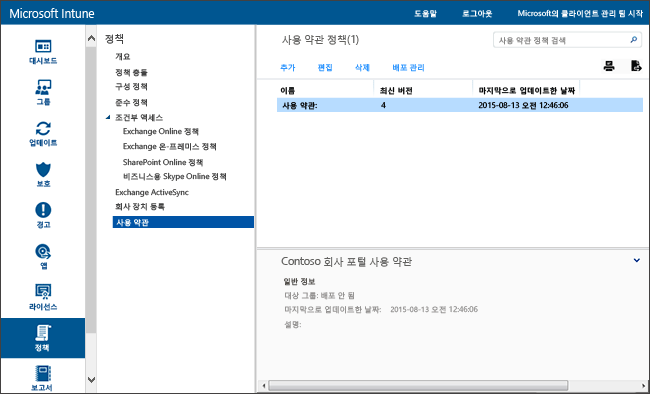

# Microsoft Intune の使用条件ポリシー設定
Intune の使用条件をユーザー グループに展開すると、登録、会社のリソースへのアクセス、ポータル サイト アプリの使用によるデバイスとユーザーへの影響を説明できます。 ユーザーは、会社のポータルを使用して登録したり作業にアクセスしたりする前に、使用条件に同意する必要があります。

さまざまな使用条件を含む複数のポリシーを作成して展開できます。 また、同じ使用条件のさまざまな言語のバージョンを作成し、適切なグループに展開することもできます。

## 使用条件ポリシーの作成

1.  [Microsoft Intune の管理コンソール](http://manage.microsoft.com)で、**[ポリシー]** &gt; **[使用条件]** の順にクリックします。

    

2.  **[追加]** をクリックし、新しい使用条件ポリシーを作成します。

    既存のポリシーを**編集**または**削除**することもできます。

3.  **[使用条件の作成]** ページで、次の情報を指定します。

    -   **[名前]** - Intune コンソールに表示される、一意のポリシー名

    -   **[説明]** - Intune コンソールでポリシーを識別するための詳細

    -   **[タイトル]** - 会社のポータルでユーザーに表示されるタイトル

    -   **[ユーザーによる同意の意味を説明するテキスト]** - ユーザーに表示される同意に関するラベル **例**: "使用条件に同意します。"

4.  操作が完了したら、**[保存]** をクリックします。 新しいポリシーが**[ポリシー]** ワークスペースの **[使用条件]** ノードに表示されます。

## 使用条件ポリシーの展開

1.  [Microsoft Intune の管理コンソール](http://manage.microsoft.com)で、**[ポリシー]** &gt; **[使用条件]** の順にクリックします。

2.  **[使用条件ポリシー]** の一覧で、展開するポリシーを選び、**[展開の管理]** をクリックします。

3.  **[展開の管理]** ダイアログ ボックスで、ポリシーを展開するユーザー グループを選び、**[OK]** をクリックします。

    対象ユーザーがポータル サイトにアクセスすると、Intune では、展開した使用条件が表示されます。 ユーザーは、これらの使用条件に同意しないと、会社のリソースへのアクセスできません。

## 使用条件ポリシーの監視

1.  [Microsoft Intune の管理コンソール](http://manage.microsoft.com)で、**[ポリシー]** &gt; **[使用条件]** の順にクリックします。

2.  **[新しいレポートの作成]** ウィンドウで、**[レポートの表示]** をクリックします。 展開した使用条件に同意したユーザーの詳細を示すレポートが開きます。

### 使用条件の更新およびバージョン管理
既存の使用条件ポリシーを編集するときは、ポリシーを展開するときの動作を選択できます。 既存の使用条件ポリシーを更新するには、次の手順に従います。

## 使用条件の複数のバージョンを使用する方法

1.  [Microsoft Intune の管理コンソール](http://manage.microsoft.com)で、**[ポリシー]** &gt; **[使用条件]** の順にクリックします。

2.  編集する使用条件ポリシーを選んで、**[編集]** をクリックします。

3.  **[使用条件の編集]** ページで、必要な編集を加えて、この新しいバージョンですべてのユーザーに使用条件への同意を求めるか、新しいユーザーのみに新しいバージョンの使用条件を表示するかを指定します。

    使用条件ポリシーに対して重要な変更を行うときは常にバージョン番号を大きくし、同意を求めることをお勧めします。 誤植の修正や書式設定の変更などを行った場合は、現在のバージョン番号をそのままにします。

### 関連項目
[Microsoft Intune ポリシーを使用してデバイスの設定と機能を管理する](manage-settings-and-features-on-your-devices-with-microsoft-intune-policies.md)

<!--HONumber=Jun16_HO4-->

