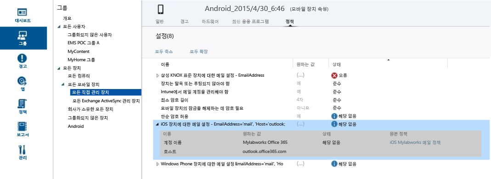

## グループの管理エクスペリエンスに対して予定されている改善点に関するお知らせ

Enterprise Mobility とセキュリティ全体でグループおよびターゲット エクスペリエンスを統一した方がよいというフィードバックに基づき、Intune のグループを Azure Active Directory ベースのセキュリティ グループに変換しています。 これにより、Intune と Azure Active Directory (Azure AD) でグループ管理が統一されます。 新しいエクスペリエンスでは、サービス間でグループを複製する必要がなく、PowerShell と Graph を使用する拡張性が提供されます。 

### 現時点での影響
現時点ではこの変更による影響はありませんが、将来的には次のような影響があります。

-   9 月には、毎月のサービス リリース後にプロビジョニングされる新しいアカウントで、Intune ユーザー グループではなく、Azure AD セキュリティ グループが使われるようになります。   
-   10 月の毎月のサービス リリース後にプロビジョニングされる新しいアカウントでは、ユーザー ベースとデバイス ベースの両方のグループが Azure AD ポータルで管理されるようになります。 既存のお客様に影響はありません。
-   11 月には、Intune 製品チームは既存顧客の新しい Azure AD ベースのグループ管理エクスペリエンスへの移行を開始します。 現在の Intune のすべてのユーザーとデバイスが、Azure AD セキュリティ グループに移行されます。 移行は 11 月から一括して行われます。 お客様の日常の業務への影響を最小限に抑え、エンド ユーザーへの影響がなくなるまで、移行は開始されません。 また、アカウント移行の前には通知をいたします。

### 新しいグループ エクスペリエンスへの移行の方法と時期
現在のお客様は時間をかけて移行されます。 移行スケジュールの確定を現在行っており、このトピックは数週間以内に詳細情報に更新されます。 移行の前には通知が送られます。 移行に問題がある場合は、移行チーム ([intunegrps@microsoft.com](intunegrps@microsoft.com)) に問い合わせてください。

### 既存のユーザー グループとデバイス グループに対する影響
 作成されているユーザー グループとデバイス グループは、Azure AD セキュリティ グループに移行されます。 既定の Intune グループ (すべてのユーザーなど) は、移行時に展開で使用されている場合にのみ移行されます。 グループによっては移行がさらに複雑になる可能性があり、移行に追加手順が必要な場合はお知らせします。

### 使用できるようになる新機能
次のような新機能が導入されます。

-    すべての種類の展開について、Azure AD セキュリティ グループが Intune でサポートされるようになります。
-    Azure AD セキュリティ グループは、ユーザーだけでなくデバイスのグループ化をサポートするようになります。
-    Azure AD セキュリティ グループは、Intune のデバイス属性での動的グループをサポートするようになります。 たとえば、iOS などのプラットフォームに基づいて動的にデバイスをグループ化できます。 つまり、組織で新しい iOS デバイスが登録されると、iOS 動的デバイス グループに自動的に追加されます。
-    Azure AD と Intune 全体で共有されるグループ管理エクスペリエンス。
- *Intune サービス管理者ロール*が Azure AD に追加され、Intune のサービス管理者が Azure AD でグループ管理タスクを実行できます。

### 使用できない Intune の機能
グループ エクスペリエンスは向上しますが、移行後に使用できなくなる Intune の機能がいくつかあります。

#### グループ管理機能

-   新しいグループを作成する時点では、メンバーまたはグループを除外できません。 ただし、Azure AD の動的グループでは、属性を使用することで、条件に基づいてメンバーを除外する高度なルールを作成できます。
-   **グループ化を解除されたユーザー**と**グループ化を解除されたデバイス**のグループはサポートされません。 これらのグループは移行されません。

#### グループの依存機能

-   サービス管理者の役割は、**グループ管理**アクセス許可を持ちません。
-   Exchange ActiveSync デバイスをグループ化することはできません。  **EAS で管理されているすべてのデバイス** グループは、グループ ビューからレポート ビューに変換されます。
-  レポートでのグループによるピボット処理は使用できません。
-  カスタム グループを対象とした通知規則は使用できません。

### この変更に対する準備
 簡単に切り替えができるように以下のことをお勧めします。

- 移行の前に、不要な Intune グループをクリーンアップします。
- グループでの除外の使用を評価して、除外を使用する必要がないようにグループの再設計を検討します。
-  Azure AD でのグループ作成権限を持たない管理者がいる場合は、Azure AD 管理者に依頼して、その管理者を **Intune サービス管理者** Azure AD の役割に追加します。

# Microsoft Intune でユーザーとデバイスを管理するためのグループを作成する

このセクションでは、Intune 管理コンソールで Intune グループを作成する方法について説明します。

グループを作成して管理するには、Microsoft Intune の管理コンソールの **[グループ]** ワークスペースを使用します。  **[グループの概要]** ページに表示された状態の概要を参照して、注意が必要な問題を特定し、優先順位を指定することができます。

-   アラート
-   ソフトウェア更新プログラム
-   Endpoint Protection
-   ポリシー
-   ソフトウェアの管理

またグループ階層には、選択されたグループのメンバーの問題を特定して解決しやすいよう、状態の概要が表示されます。

> [!TIP]
> グループを作成するときは、ポリシーを適用するしくみを考慮してください。 たとえば、デバイスのオペレーティング システムに固有のポリシーのほか、組織のさまざまなロール固有のポリシーか、Active Directory に既に定義している組織単位固有のポリシーがあるとします。 各組織のロール用のユーザー グループだけでなく、iOS、Android、Windows に固有のデバイス グループを作成すると便利になると考えられます。
>
> おそらく、すべてのグループとデバイスに適用される既定のポリシーを作成して、自分の会社の基本的なコンプライアンス要件を確立することになると思われます。 次に、デバイスの各オペレーティング システム用の電子メール ポリシーなど、ユーザーとデバイスの広範なカテゴリに個別のポリシーを作成します。
>
> 後で簡単に識別できるように、注意してポリシーに名前を付けてください。 わかりやすいポリシーの名前の例として、 **会社全体の WP 電子メール ポリシー**が挙げられます。
>
> 制限の厳しいポリシーを作成する場合は、その都度ユーザーとのやり取りが必要になります。一般的なグループとポリシーを作成した後でより小さなグループを作成する場合は、不要なやり取りを減らせるように、注意を払ってください。

## デバイス グループを作成する

1.  Intune 管理コンソールで、**[グループ]** &gt; **[概要]** &gt; **[グループの作成]** を選択します。

2.  グループの名前と必要に応じてグループの説明を入力し、デバイス グループを親グループとして選択します。 **[次へ]** を選択します。

3.   **[メンバーシップの基準の定義]** ページで、グループに含めるデバイスの種類を選択します。 グループを構成する追加のオプションは、選択したデバイスの種類によって変わります。

    -   **コンピューター:** 親グループ、追加または除外する組織単位 (OU)、追加または除外するドメインのすべてのメンバーを含めるかどうかを指定します。 コンピューターの OU とドメイン情報はインベントリから取得されます。

    -   **モバイル:** Intune で管理されているモバイル デバイスのみ、Exchange ActiveSync で管理されているモバイル デバイスのみ、またはその両方を含めることを指定します。

    -   **すべてのデバイス:** 条件に基づいて除外せず、すべてのデバイスを含めます。

4.   **[ダイレクト メンバーシップの定義]** ページで、 **[参照]**をクリックして個々のデバイスを追加または除外します。 指定した親グループに含まれていないデバイスを選択するオプションを使用する場合、そのデバイスは親グループに自動的に追加されます。

5.  **[概要]** ページで、実行する操作を確認して **[完了]** をクリックします。

新しく作成したグループは、**[グループ]** ワークスペースの **[グループ]** 一覧に、親グループの下に表示されます。 ここから、グループを編集または削除することもできます。

## ユーザー グループを作成する

1.  Intune 管理コンソールで、**[グループ]** &gt; **[概要]** &gt; **[グループの作成]** を選択します。

2.  グループの名前と必要に応じてグループの説明を入力し、ユーザー グループを親グループとして選択します。 **[次へ]** を選択します。

3.   **[メンバーシップの基準の定義]** ページで、親グループのすべてのメンバーを含めるか、空のグループから始めるかを指定します。  これで、[Office 365 管理センター](http://go.microsoft.com/fwlink/?LinkId=698854)で手動で構成した、またはローカルの Active Directory から同期したユーザーの**セキュリティ グループ** に基づいて、メンバーを追加または除外できるようになります。 セキュリティ グループのメンバーシップを変更すると、そのセキュリティ グループに基づくユーザー グループのメンバーシップも変わります。

    > [!IMPORTANT]
    > 現時点では、グループに特定のセキュリティまたはマネージャーのグループのメンバーを含み、特定のグループからメンバーの除外も行った場合、最初に含んでいたメンバーが削除されます。 追加したメンバーと除外したメンバーの両方が含まれるグループを作成する場合、最初に追加したメンバーを含む親グループを作成してから、除外したメンバーを一覧表示する子をそのグループに対して作成することをお勧めします。 これで、その子グループを Intune のポリシー、プロファイル、アプリの配信に対して適切に使用できるようになります。

    > [!NOTE]
    > Azure 管理ポータルでは、ユーザーのレポート先であるマネージャーに基づいてグループを作成できます。 グループは動的で、Azure Active Directory のそのマネージャーのチームとの間で従業員が追加または削除されるたびに変更されます。 マネージャーに基づいて Azure のグループを作成する手順については、「**“Manager” グループとしてグループを構成するには**」というセクションの「[属性を使用した高度なルールの作成](https://azure.microsoft.com/en-us/documentation/articles/active-directory-accessmanagement-groups-with-advanced-rules/)」で説明しています。

4.   **[ダイレクト メンバーシップの定義]** ページで、 **[参照]**をクリックして個々のユーザーを追加または除外します。 指定した親グループに含まれていないユーザーを選択するオプションを使用する場合、そのユーザーは親グループに自動的に追加されます。 **[メンバーの選択]** ダイアログの一番下に、ユーザーを手動で追加するオプションがあります。 これはまだ登録済みのデバイスのないユーザーを追加する場合に使用します。

5.  **[概要]** ページで、実行する操作を確認して **[完了]** をクリックします。

新しく作成したグループは、**[グループ]** ワークスペースの **[グループ]** 一覧に、親グループの下に表示されます。 ここから、グループを編集または削除することもできます。

> [!TIP]
> セキュリティ グループは、ユーザー グループの設定に役立つ優れたリソースです。 セキュリティ グループは、どのユーザーがどのリソースにアクセスできるかを定義するものであるため、Intune ユーザー グループに変換することができます。 Active Directory から Azure Active Directory に同期されたセキュリティ グループや、Office 365 管理センター、または Azure 管理ポータルで Azure Active Directory に直接作成されたセキュリティ グループはすべて、Intune でユーザー グループを作成する際に使用できます。

## 管理者役割に合わせてビューをカスタマイズする
管理者の役割に応じて表示できるビューをカスタマイズしたり、管理できるグループを IT 管理者ごとに制限したりするには、フィルター選択されたグループ ビューを使用します。 これは次のような場合に便利です。

-   IT 管理者がアイテムを配置できる対象を特定のユーザーとデバイスに制限する必要がある。

-   各 IT 管理者に、関連するグループのみが表示されるようにする必要があります。

サービス管理者用のフィルター選択されたグループ ビューは、Intune 管理コンソールで構成できます。 詳細については、「[Microsoft Intune を使い始める前に](/intune/get-started/what-to-know-before-you-start-microsoft-intune)」を参照してください。

サービス管理者用のフィルター選択されたグループ ビューを構成した場合:

-   ソフトウェアまたはポリシーを展開するときやレポートを使用するときは、指定したグループのみ表示と選択を実行できます。

-   管理者は、管理コンソールの次のページで状態情報を受け取りません。

    -   **システムの概要**

    -   **[グループの概要]**

    -   **Endpoint Protection の概要**

    -   **アラートの概要**

    -   **ソフトウェアの概要**

    -   **ポリシーの概要**

### フィルター選択されたグループ ビューを構成する

1.  Intune 管理コンソールで **[管理者]** &gt; **[管理者の管理]** &gt; **[サービス管理者]** を選択します。

2.  グループをフィルター選択するサービス管理者を選択し、 **[グループの管理]**をクリックします。

3.   **[このサービスの管理者に表示するグループの選択]** ダイアログ ボックスで、選択したサービス管理者がアクセスできるグループを追加し、 **[OK]**をクリックします。

フィルター選択されたグループ ビューを構成すると、IT 管理者は、選択されたグループのみを表示および選択できます。

## グループを管理する
グループを作成した後は、組織のニーズに合わせてグループを継続して管理します。

グループを編集して、名前と説明や、グループに属するユーザーを変更できます。

組織のニーズを満たさなくなったグループを削除できます。 グループを削除しても、そのグループに属するユーザーは削除されません。

## 次のステップ

### 設計後のチェック
グループとポリシーを設定したら、**[想定値]** と **[状態]** を見て、設計後の実際の影響をチェックします。

1. デバイス グループから任意のデバイスを選択し、画面上部の情報のカテゴリを参照します。
2.  **[ポリシー]** を選択します。 このスクリーン ショットのように Android デバイスのポリシー設定が表示されます。

各ポリシーには、 **[想定値]** と **[状態]**があります。 [想定値] は、ポリシーを割り当てるときに実現しようとした内容です。 [状態] は、ハードウェアとオペレーティング システムの制限事項と要件だけでなく、デバイスに適用されるすべてのポリシーがまとめて考慮されたときに実際に実現される内容です。  スクリーンショットには、よくわかる 2 つの例が示されています。

-   **[想定値]** 列に表示されているように、 **[単純なパスワードを使用する]**が **[はい]** に設定されていますが、その **[状態]** は **[該当なし]**になっています。 これは、Android デバイスでは単純なパスワードがサポートされていないことが原因です。

-   同様に、拡張ポリシー アイテム **[iOS デバイス用電子メールの設定]** は、このデバイスが Android デバイスであるため適用されません。

> [!NOTE]
> 制限レベルが異なる 2 つのポリシーを同じデバイスまたはユーザーに適用すると、より厳しい方のポリシーが実際に適用されます。

<!--HONumber=Aug16_HO3-->

