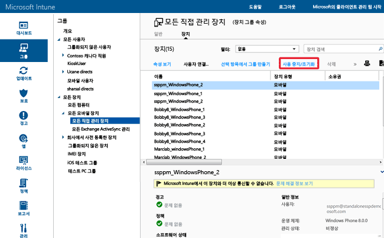

# Microsoft Intune のフル ワイプまたは選択的ワイプを使用してデータを保護する
PC やモバイル デバイスに展開されているアプリは、デバイスと同様、やがて不要となり、いずれ[使用を中止](retire-apps-using-microsoft-intune.md) (インベントリから削除) するときがきます。 デバイスに保存されている会社のデータを削除しなければならないときもあるでしょう。 そのための手段として Intune には、選択的ワイプ機能とフル ワイプ機能が備わっています。 モバイル デバイスは、会社の機密データを保存したり、多くの会社のリソースにアクセスしたりすることができます。管理者は Intune からリモート デバイス ワイプ コマンドを発行して、紛失または盗難されたデバイスをワイプできます。 ユーザーは、Intune に登録してある個人所有のデバイスの Intune からリモート デバイス ワイプ コマンドを発行することもできます。

  > [!NOTE]
  > このトピックでは、Intune によって管理されるデバイスのワイプについてのみ説明します。 [Azure プレビュー ポータル](https://portal.azure.com)を使用して、[アプリから会社のデータをワイプする](wipe-managed-company-app-data-with-microsoft-intune.md)こともできます。

## フル ワイプ

**フル ワイプ**は、デバイスを工場出荷時の既定設定に戻し、会社とユーザーのデータと設定すべてを削除します。 デバイスは Intune から削除されません。 新しいユーザーに譲渡する前や、デバイスを紛失またはデバイスが盗難されたときに、デバイスをリセットする目的でフル ワイプを利用できます。  **フル ワイプを使用するかどうかは慎重に判断してください。デバイス上のデータが復元できなくなります**。

## 選択的ワイプ

**選択的ワイプ**は、モバイル アプリ管理 (MAM) データ (該当する場合)、設定、電子メール プロファイルといった会社のデータをデバイスから削除するものです。 選択的ワイプでは、ユーザーの個人データはデバイス上にそのまま保持されます。 デバイスは Intune から削除されません。 次の表では、プラットフォームごとに、削除されるデータと、選択的ワイプの実行後にデバイスに残るデータへの影響について説明します。

**iOS**

|データ型|iOS|
|-------------|-------|
|Intune でインストールされた会社のアプリと関連するデータ。|アプリはアンインストールされます。 会社のアプリ データは削除されます。  モバイル アプリ管理を使用する Microsoft アプリからのアプリ データは削除されます。 アプリは削除されません。|
|Settings|Intune ポリシーで設定した構成は強制されなくなり、ユーザーが設定を変更できるようになります。|
|Wi-fi と VPN プロファイルの設定|削除済み|
|証明書プロファイルの設定|削除済みおよび失効済みの証明書。|
|管理エージェント|管理プロファイルは削除されます。|
|電子メール|Intune を介してプロビジョニングされている電子メール プロファイルは削除され、デバイスにキャッシュされた電子メールは削除されます。|
|Azure Active Directory (AAD) の切断|AAD のレコードの削除|
|連絡先 | アプリケーションからネイティブ アドレス帳に直接同期された連絡先が削除されます。  ネイティブ アドレス帳から別の外部ソースに同期された連絡先はワイプできません。    現時点では、Outlook アプリのみがサポートされています。

**Android**

|データ型|Android|Android Samsung KNOX|
|-------------|-----------|------------------------|
|Web リンク|削除されます。|削除済み|
|管理対象外の Google Play アプリ|アプリとデータはインストールされたままです。|アプリとデータはインストールされたままです。|
|管理対象外の基幹業務アプリ|アプリとデータはインストールされたままです。|アプリがアンインストールされ、その結果、アプリに対してローカルなデータは削除されます。 アプリ外部 (SD カードなど) のデータは削除されません。|
|管理対象の Google Play アプリ|アプリ データは削除されます。 アプリは削除されません。 MAM 暗号化によって保護されているアプリ外部 (SD カードなど) のデータは、暗号化が維持され、利用できませんが、削除されません。|アプリ データは削除されます。 アプリは削除されません。 MAM 暗号化によって保護されているアプリ外部 (SD カードなど) のデータは、暗号化が維持されますが削除されません。|
|管理対象の基幹業務アプリ|アプリ データは削除されます。 アプリは削除されません。 MAM 暗号化によって保護されているアプリ外部 (SD カードなど) のデータは、暗号化が維持され、利用できませんが、削除されません。|アプリ データは削除されます。 アプリは削除されません。 MAM 暗号化によって保護されているアプリ外部 (SD カードなど) のデータは、暗号化が維持されますが削除されません。|
|Settings|Intune ポリシーで設定した構成は強制されなくなり、ユーザーが設定を変更できるようになります。|Intune ポリシーで設定した構成は強制されなくなり、ユーザーが設定を変更できるようになります。|
|Wi-fi と VPN プロファイルの設定|削除済み|削除済み|
|証明書プロファイルの設定|失効済みで、削除されていない証明書。|削除済みおよび失効済みの証明書。|
|管理エージェント|デバイス管理者特権は無効になります。|デバイス管理者特権は無効になります。|
|電子メール|Android アプリ用の Microsoft Outlook アプリで受信された電子メールは削除されます。|Intune を介してプロビジョニングされている電子メール プロファイルは削除され、デバイスにキャッシュされた電子メールは削除されます。|
|Azure Active Directory (AAD) の切断|AAD のレコードの削除|AAD のレコードの削除|
|連絡先 | アプリケーションからネイティブ アドレス帳に直接同期された連絡先が削除されます。  ネイティブ アドレス帳から別の外部ソースに同期された連絡先はワイプできません。    現時点では、Outlook アプリのみがサポートされています。|アプリケーションからネイティブ アドレス帳に直接同期された連絡先が削除されます。  ネイティブ アドレス帳から別の外部ソースに同期された連絡先はワイプできません。    現時点では、Outlook アプリのみがサポートされています。

**Windows**

|データ型|Windows 8.1 (MDM) と Windows RT 8.1|Windows RT|Windows Phone 8 および Windows Phone 8.1|Windows 10|
|-------------|----------------------------------------------------------------|--------------|-----------------------------------------|--------|
|Intune でインストールされた会社のアプリと関連するデータ。|EFS で保護されているファイルのキーが失効すると、ユーザーはファイルを引けなくなります。|会社のアプリは削除されません。|元々ポータル サイトでインストールされたアプリはアンインストールされません。 会社のアプリ データは削除されます。|アプリケーションがアンインストールされて、サイドローディング キーが削除されます。|
|Settings|Intune ポリシーで設定した構成は強制されなくなり、ユーザーが設定を変更できるようになります。|Intune ポリシーで設定した構成は強制されなくなり、ユーザーが設定を変更できるようになります。|Intune ポリシーで設定した構成は強制されなくなり、ユーザーが設定を変更できるようになります。|Intune ポリシーで設定した構成は強制されなくなり、ユーザーが設定を変更できるようになります。|
|Wi-fi と VPN プロファイルの設定|削除済み|削除済み|サポートされていません|削除済み|
|証明書プロファイルの設定|削除済みおよび失効済みの証明書。|削除済みおよび失効済みの証明書。|サポートされていません|削除済みおよび失効済みの証明書。|
|電子メール|Windows の電子メールと添付ファイル用のメール アプリケーションを含む EFS 対応の電子メールを削除します。|サポートされていません|Intune を介してプロビジョニングされている電子メール プロファイルは削除され、デバイスにキャッシュされた電子メールは削除されます。|Windows の電子メールと添付ファイル用のメール アプリケーションを含む EFS 対応の電子メールを削除します。 Intune によってプロビジョニングされたメール アカウントを削除します。|
|Azure Active Directory (AAD) の切断|×|×|AAD のレコードの削除|該当なし。 Windows 10 では、Azure Active Directory に参加しているデバイスの選択的ワイプはサポートされません。|

### Intune 管理コンソールからデバイスをリモートでワイプする

1.  ワイプするデバイスを選択します。 デバイスはユーザー単位、またはデバイス単位のいずれかで検索できます。

    -   **ユーザー単位:**

        1.  [Intune 管理コンソール](https://manage.microsoft.com/)で、**[グループ]** &gt; **[すべてのユーザー]** の順にクリックします。

        2.  ワイプするモバイル デバイスのユーザー名を選択します。 **[プロパティの表示]** を選択します。

        3.  ユーザーの **[プロパティ]** ページで、**[デバイス]** を選択して、ワイプするモバイル デバイスの名前を選択します。 デバイスを複数選択する場合は、Ctrl キーを押しながらクリックします。

    -   **デバイス単位:**

        1.  [Intune 管理者コンソール](https://manage.microsoft.com/)で、**[グループ]** &gt; **[すべてのモバイル デバイス]** の順に選択します。

      

        2.  **[デバイス]** を選択し、ワイプするモバイル デバイスの名前を選択します。 デバイスを複数選択する場合は、Ctrl キーを押しながらクリックします。

2.  **[インベントリからの削除/ワイプ]** を選択します。

3.  インベントリからデバイスを削除するかどうかを確認するメッセージが表示されます。

    -   会社のアプリとデータのみを削除する**選択的ワイプ**を実行する場合は、**[はい]** を選択します。

    -   アプリとデータをすべて消去し、デバイスを出荷時の既定設定に戻す**フル ワイプ**を実行する場合は、**[デバイスをインベントリから削除する前にワイプする]** を選択します。 この処理は、Windows 8.1 を除くすべてのプラットフォームに適用されます。 **フル ワイプで削除されたデータを回復することはできません**。

ワイプがすべてのデバイスの種類に適用されるまでにかかる時間は 15 分未満です。

## 暗号化ファイル システム (EFS) 対応コンテンツのワイプ
EFS で暗号化されたコンテンツの選択的ワイプは、Windows 8.1 と Windows RT 8.1 でサポートされます。 EFS 対応コンテンツの選択的ワイプには次のものが適用されます。

-   Intune アカウントと同じインターネット ドメインを使用して EFS で保護されているアプリケーションとデータのみが、選択的にワイプされます。 詳細については、「[デバイス データ管理用の Windows 選択的ワイプ](http://technet.microsoft.com/library/dn486874.aspx)」を参照してください。

-   EFS に関連付けられているドメインに何らかの変更が加えられた場合、新しいドメインを使用するアプリケーションとデータが選択的にワイプできるようになるまで最大 48 時間かかります。

-   Intune に登録されている各ドメインは、ワイプされます。

EFS の選択的ワイプで現在サポートされているデータとアプリケーションは、次のとおりです。

-   Windows 用メール アプリケーション

-   作業フォルダー

-   EFS で暗号化されたファイルとフォルダー 詳細については、「[ファイル システムを暗号化するためのベスト プラクティス](http://support.microsoft.com/kb/223316)」を参照してください。

-   組織で Active Directory の ID を管理している場合は、EFS の選択的ワイプが正常に動作するように、ディレクトリ同期 (DirSync) ツールを使用して AAD に情報を同期する必要があります。  DirSync の詳細については、Azure Active Directory のドキュメントの「[ディレクトリ同期シナリオ](http://technet.microsoft.com/library/dn441212.aspx)」を参照してください。

## インベントリからの削除、ワイプ、削除の各操作の監視
インベントリから削除、ワイプ、削除されたデバイスと、その実行者のレポートを取得します。

1.  [Intune 管理コンソール](https://manage.microsoft.com/)で、**[レポート]** &gt; **[デバイス履歴のレポート]** の順に選択します。

2.  レポートの開始日と終了日を指定し、**[レポートの表示]** を選択します。

### 関連項目
[デバイスをインベントリから削除する](retire-devices-from-microsoft-intune-management.md)

[Windows のデバイス データ管理の選択的ワイプ (英語)](http://technet.microsoft.com/library/dn486874.aspx)

<!--HONumber=Jun16_HO4-->

