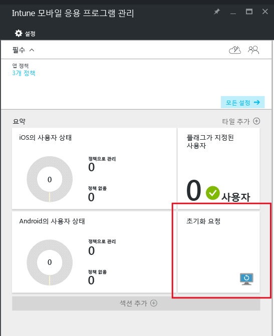
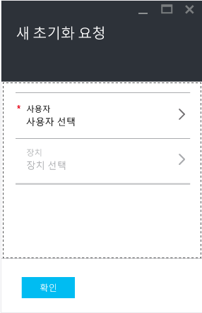
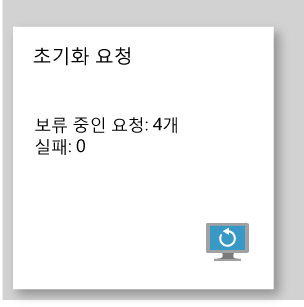

# Microsoft Intune을 사용하여 관리되는 업무용 앱 데이터 초기화
장치를 분실하거나 도난당한 경우, 또는 직원이 퇴사하는 경우, 장치에서 업무용 앱 데이터가 확실히 제거되도록 해야 합니다. 하지만, 장치에서 개인 데이터(특히, 직원 소유의 장치인 경우)는 제거하지 말아야 하는 경우가 있습니다.

업무용 앱 데이터를 선택적으로 제거하려면, 이 항목의 **초기화 요청 만들기** 섹션에 설명된 단계를 사용하여 초기화 요청을 만듭니다.  요청이 완료되고 나면, 다음 번에 장치에서 앱을 실행할 때 회사 데이터가 앱에서 제거됩니다.
>[!NOTE]
> 앱에서 기본 주소록에 직접 동기화된 연락처가 제거됩니다. 기본 주소록에서 다른 외부 소스에 동기화된 연락처는 초기화할 수 없습니다. 현재 Microsoft Outlook 앱에만 적용됩니다.

## 초기화 요청 만들기

1.  **Intune 모바일 응용 프로그램 관리** 블레이드에서 **초기화 요청** 타일을 선택합니다.

    

2.  **새 초기화 요청**을 선택합니다.

    

3.  **새 초기화 요청** 블레이드에서 **사용자**를 선택하여 **사용자** 블레이드를 열고 앱 데이터를 초기화할 사용자를 선택합니다.

4.  **장치**를 선택합니다.  그러면 **장치** 블레이드가 열리고 선택한 사용자와 관련된 모든 장치가 나열됩니다.  초기화하려는 장치를 선택합니다.

5.  이제 **새 초기화 요청** 블레이드로 전환됩니다. 초기화 요청을 수행하려면 **확인**을 클릭합니다. 서비스에서 장치의 각 보호된 앱에 대해 별도의 초기화 요청을 만들고 추적합니다.

## 초기화 요청 모니터링
**Intune 모바일 응용 프로그램 관리** 블레이드의 **초기화 요청** 타일에 요약된 보고서가 나타납니다.  여기서는 전체 상태가 표시되며 보류 중인 요청 및 오류의 수가 포함됩니다. 아래에 설명된 단계에 따라 자세한 내용을 확인할 수 있습니다.

1.  **Intune 모바일 응용 프로그램 관리** 블레이드에서 **초기화 요청** 타일을 선택하여 **초기화 요청** 블레이드를 엽니다.

2.  **초기화 요청** 블레이드에서 사용자별로 그룹화된 요청 목록을 확인할 수 있습니다.  시스템에서는 장치에서 실행 중인 각각의 보호된 앱에 대해 초기화 요청을 생성하므로 한 사용자에 대해 여러 요청이 표시될 수 있습니다.  상태를 통해 초기화 요청이 여전히 **보류 중**인지, **실패**했는지 아니면 **성공**했는지 확인할 수 있습니다.

### 참고 항목
[모바일 앱 관리 정책을 사용하여 앱 데이터 보호 ](protect-app-data-using-mobile-app-management-policies-with-microsoft-intune.md)

[Azure 포털 사용](azure-portal-for-microsoft-intune-mam-policies.md)

<!--HONumber=Jul16_HO3-->

