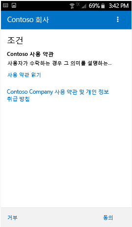
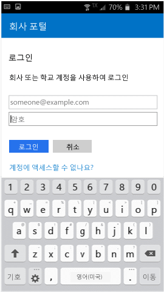

# Intune に Android デバイスを登録する

職場または学校が Microsoft Intune を使用している場合は、お使いの Android デバイスを登録して、会社の電子メール、ファイル、またその他のリソースにアクセスできます。 デバイスを登録すると、IT 部門が職場や学校のリソースを管理してそれらの安全性を保持する一方で、ユーザーは好みのデバイスを使用して作業を進めることができます。 登録の詳細については、「[ポータル サイト アプリをインストールし、Intune にデバイスを登録するとどうなるか](what-happens-if-you-install-the-Company-Portal-app-and-enroll-your-device-in-intune-android.md)」を参照してください。

これらの登録手順は Samsung Knox Android デバイスと、"ネイティブな" (Samsung Knox 以外の) Android デバイス用の手順です。 Samsung Knox デバイスがあるかどうかを判断するには、**[設定]** &gt; **[About device]** を選びます。 "KNOX version" という文字がない場合、デバイスはネイティブ Android デバイスです。

登録の前後に、デバイスの使用方法に適したカテゴリを選ぶように求められる場合があります。 IT 管理者は、このカテゴリを使用してアクセスできるアプリを判断します。

Intune にデバイスを登録している最中にエラーが表示された場合は、[IT 管理者に登録に関するエラーを送信](send-enrollment-errors-to-your-it-administrator-android.md)できます。

**Intune に Android デバイスを登録するには:**

1.  無料の Intune ポータル サイト アプリを [Google Play](http://play.google.com/store/apps/details?id=com.microsoft.windowsintune.companyportal) からインストールします。

2.  Microsoft Intune ポータル サイト アプリを開きます。

3.  ポータル サイトの** [ようこそ]** 画面で、**[サインイン]** をタップし、職場または学校アカウントを使用してサインインします。

       

4.  IT 管理者によって会社の使用条件が設定されている場合は、**[同意する]** をタップして該当する条項に同意します。

    

5.  Android 6.0 以降を使用している場合は、この手順を実行します。 使用できない場合は、次の手順に進みます。 

    IT 管理者が特定のポリシーを設定している場合は、次のメッセージが表示されることがあります。
    -   **電話での通話とその管理をポータル サイトに許可しますか?**

    

    このメッセージが表示された場合は、**[許可]** をタップします。 **Microsoft が通話や電話の管理を行うことはない**ため、[許可] をタップしても問題はありません。 このメッセージ テキストは Google が制御しているため、Microsoft ではそれを変更することができません。 アクセスの許可は、デバイスの SD カードへのデータ ログの書き込みをデバイスに許可しているに過ぎません。これにより、USB ケーブルを使用してログを移動できます。

    アクセスを拒否すると、次に会社のポータルにサインインしたときにもう一度メッセージが表示されますが、**[今後このメッセージを表示しない]** チェック ボックスをタップすると、メッセージ表示をオフにできます。  後でアクセスを許可する場合、**[設定]** &gt; **[アプリ]** &gt; **[ポータル サイト]** &gt; **[アクセス許可]** &gt; **[電話]** に移動して、アクセス許可を有効にします。

    -   **ポータル サイトに連絡先へのアクセスを許可しますか?**

    

    このメッセージが表示された場合は、**[許可]** をタップします。 **Microsoft が連絡先にアクセスすることはない**ため、[許可] をタップしても問題はありません。 このメッセージ テキストは Google が制御しているため、Microsoft ではそれを変更することができません。 アクセスを許可すると、ポータル サイト アプリに仕事用アカウントの作成、使用、管理のみを許可します。

    アクセスを拒否すると、次に **[データを送信]** をタップしたときにもう一度メッセージが表示されますが、**[今後このメッセージを表示しない]** チェック ボックスをタップすると、メッセージ表示をオフにできます。 後でアクセスを許可する場合、**[設定]** &gt; **[アプリ]** &gt; **[ポータル サイト]** &gt; **[アクセス許可]** &gt; **[ストレージ]** に移動して、アクセス許可を有効にします。

6.  職場または学校の電子メール アドレスとパスワードを使用してポータル サイト アプリにサインインし、**[サインイン]** をタップします。

    

7.  **[会社アクセスのセットアップ]** 画面で、**[開始]** をタップします。

    ![[会社アクセスのセットアップ] 画面](./media/and-enroll-4a-comp-access-setup.png)

8.  **[デバイスを登録する理由]** 画面で、デバイスを登録すると可能になる操作についての説明を確認した後、**[続行]** をタップします。

    ![[デバイスを登録する理由] 画面](./media/and-enroll-4b-why-enroll.png)

9.  IT 管理者がデバイスに関して確認できる情報と確認できない情報について確認し、**[続行]** をタップします。

    

10.  **[次に行うこと]** 画面で、登録中に行う内容を確認し、**[登録]** をタップします。

    ![[次に行うこと] 画面](./media/and-enroll-4d-what-comes-next.png)

11.  **[デバイス管理者のアクティブ化]** 画面で、**[アクティブ化]** をタップします。

    ![[デバイス管理者のアクティブ化] 画面](./media/and-enroll-5-activate.png)

12.  画面の指示に従って、PIN またはパスワードを入力します。 このデバイス上で PIN またはパスワードを既に設定している場合は、この画面は表示されず、新しい PIN またはパスワードを入力するように求められます。

    

13.  使用しているデバイスの種類 (ネイティブ Android または Samsung Knox) と一致する次の手順に従います。 Samsung Knox デバイスがあるかどうかを判断するには、**[設定]** &gt; **[About device]** を選びます。 "KNOX version" という文字がない場合、デバイスはネイティブ Android デバイスです。

    -   ネイティブ (非 Samsung Knox) : **[証明書の名前指定]** 画面で、**[OK]** をタップして既定の証明書を受け入れます。

    ![[証明書の名前指定] 画面](./media/and-enroll-7-cert-native.png)

    -   Samsung Knox デバイス: プライバシー ポリシーに同意し、**[確認]** をタップします。

    

    Intune がデバイスを登録している間、次のメッセージが画面に表示されます。

    

14. **[会社アクセスのセットアップ]** 画面が表示されたら、**[続行]** をタップします。 デバイスが対応していないことを示すメッセージが表示された場合は、問題を解決するための指示に従い、**[続行]** をタップします。

    ![[会社アクセスのセットアップ] 画面](./media/and-enroll-9-comp-access-setup.png)  

11. **[会社アクセスのセットアップが完了しました]** の画面で、**[完了]** をタップします。 これでデバイスが登録されました。

    ![[会社アクセスのセットアップが完了しました] 画面](./media/and-enroll-10-comp-access-setup-complete.png)

会社のアプリをインストールするには、最初に **[設定]** &gt; **[セキュリティ]** を選び、**[不明なソース]** をオンにします。 アプリをインストールする前にこのオプションをオンにしない場合、次のメッセージが表示されます。[インストールがブロックされました。 セキュリティ上の理由から、デバイスは不明のソースから取得したアプリのインストールをブロックするように設定されています。] エラー ダイアログの **[設定]** をタップすると、**[不明なソース]** オプションを表示できます。

サポートが必要な場合は、 IT 管理者にお問い合わせください。 連絡先情報については、[ポータル サイト Web サイト](http://portal.manage.microsoft.com)をご確認ください。

### 関連項目
[Android デバイスを Intune で使用する](using-your-android-device-with-intune.md)

<!--HONumber=Jun16_HO4-->

