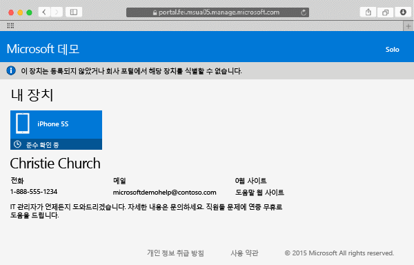

# Intune에서 Mac OS X 장치 등록

Intune에서 Mac OS X 장치를 등록하면 회사의 네트워크에 액세스하고, 업무용 메일, 작업 파일을 사용할 수 있습니다. 또한 업무용 앱을 가져올 수도 있습니다. 장치를 등록하면 발생하는 상황에 대한 자세한 내용은 [Intune에서 회사 포털 앱을 설치하고 장치를 등록하면 어떻게 되나요?](what-happens-if-you-install-the-company-portal-app-and-enroll-your-device-in-intune-ios.md)를 참조하세요.

iOS 장치를 등록하려는 경우 [Intune에서 iOS 장치 등록](enroll-your-device-in-intune-ios.md)을 참조하세요.

Mac OS X 장치를 등록하려면

1.  Safari 브라우저를 사용하여 [회사 포털 웹 사이트](https://portal.manage.microsoft.com)를 열고 알림 표시줄을 탭합니다.

2.  **이 장치는 등록되지 않았거나 회사 포털에서 해당 장치를 식별할 수 없습니다.**를 탭합니다.

    

3.  **설치**를 탭하여 장치 등록을 시작합니다.

    

4.  **관리 프로필 설치** 대화 상자에서 **설치**를 탭합니다. 자격 증명을 입력하라는 대화 상자가 나타나면 사용자 이름 및 암호를 입력한 다음 **계속** &gt; **설치**를 탭합니다.

    

    등록이 끝나면 프로필이 확인되었음을 보여 주는 **관리 프로필** 페이지가 표시됩니다.

    

여전히 도움이 필요하세요? IT 관리자에게 문의하세요. IT 관리자의 연락처 정보는 [회사 포털 웹 사이트](http://portal.manage.microsoft.com)를 참조하세요.

<!--HONumber=Oct16_HO2-->

