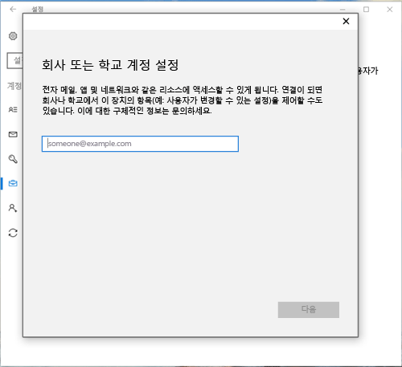
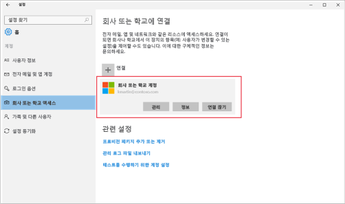

# Intune에서 Windows 10 Mobile 또는 Windows 10 Desktop 장치 등록

회사 또는 학교에서 Microsoft Intune을 사용하는 경우 장치를 등록하여 회사 전자 메일, 파일 및 기타 리소스에 액세스 권한을 얻을 수 있습니다. 장치를 등록하면 조직에서 회사 데이터 보안을 유지할 수 있습니다. 등록에 대해 자세히 알아보려면 [Intune에서 회사 포털 앱을 설치하고 장치를 등록하면 어떻게 되나요?](what-happens-if-you-install-the-company-portal-app-and-enroll-your-device-in-intune-windows.md) 및 [IT 관리자가 장치에서 할 수 있는 일과 할 수 없는 일](what-can-your-it-administrator-see-when-you-enroll-your-device-in-intune-windows.md)을 참조하세요.

Windows 10 Mobile 또는 Windows 10 Desktop 장치를 등록하려면:

1.  Windows **설정**으로 이동하여 **계정**을 탭합니다.

    

2.  다음의 두 화면 중에서 장치에 표시되는 것과 비슷한 화면을 찾습니다. 장치에 표시되는 화면의 지침을 따릅니다.

    이 화면이 표시되면 [회사 또는 학교 액세스가 표시되는 경우 따라야 하는 절차](#steps-to-follow-if-you-see-access-work-or-school)의 지침을 따릅니다.

    

    이 화면이 표시되면 [내 계정이 표시되는 경우 따라야 하는 절차](#steps-to-follow-if-you-see-your-account)의 단계를 수행합니다.

    

## 회사 또는 학교 액세스가 표시되는 경우 따라야 하는 절차

1.  **회사 또는 학교 액세스**, **연결**을 차례로 탭합니다.

    

2.  회사 또는 학교 전자 메일 주소를 입력하고 **다음**을 탭합니다.

    

3. 회사 또는 학교 계정을 사용하여 Intune에 로그인합니다.

    

    회사 또는 학교에서 내 장치를 등록하고 있다는 메시지가 표시됩니다.

4. **모두 설정되었습니다.** 화면에서 **닫기**를 탭합니다. 작업을 완료했습니다.

  

5. 연결이 올바르게 되었는지 다시 확인하고 싶은 경우 **설정**으로 돌아가면 이제 회사 또는 학교 계정이 나열되어 있는 것을 볼 수 있습니다.

    

위의 단계를 수행해도 여전히 회사 또는 학교 전자 메일 계정 및 파일에 액세스할 수 없는 경우 [회사 또는 학교 액세스가 표시되는 경우 따라야 하는 문제 해결 절차](troubleshoot-your-windows-10-device-windows.md#troubleshooting-steps-to-follow-if-you-see-access-work-or-school)의 단계를 수행합니다.

## 내 계정이 표시되는 경우 따라야 하는 절차

1.  Windows **설정**으로 이동하여 **계정**을 탭합니다.

    

2.  **계정**을 탭합니다.

    

3.  **회사 또는 학교 계정 추가**를 탭합니다.

    

4.  회사 또는 학교 자격 증명으로 로그인합니다.

    

위의 단계를 수행해도 회사 또는 학교 전자 메일 주소, 파일 또는 기타 데이터에 액세스할 수 없는 경우 [내 계정이 표시되는 경우 따라야 하는 문제 해결 절차](troubleshoot-your-windows-10-device-windows.md#troubleshooting-steps-to-follow-if-you-see-your-account)의 지침을 시도합니다.

또한 사용자 및 사용자의 역할과 관련된 회사 앱을 쉽게 식별하고 가져올 수 있으므로 회사 포털 앱을 설치하는 것이 좋습니다. 회사에서 Intune을 구성한 방식에 따라 회사 포털 앱이 등록 프로세스의 일부로 설치되었을 수 있습니다.

앱이 있는지 확인하려면 앱 목록에서 **회사 포털**을 찾습니다. 앱 목록에 회사 포털이 표시되지 않으면 다음 단계를 따라 설치합니다.

1.  **시작** &gt; **스토어**를 탭합니다.

2.  **검색**을 탭하고 **회사 포털**을 입력합니다.

3.  결과 목록에서 **회사 포털** &gt; **설치**를 탭합니다.

4.  **설치** 또는 **무료** 중 하나를 탭합니다. 표시되는 옵션은 회사에서 앱을 구성한 방법에 따라 달라집니다.

여전히 도움이 필요하세요? IT 관리자에게 문의하세요. IT 관리자의 연락처 정보는 [회사 포털 웹 사이트](http://portal.manage.microsoft.com)를 참조하세요.

<!--HONumber=Oct16_HO1-->

