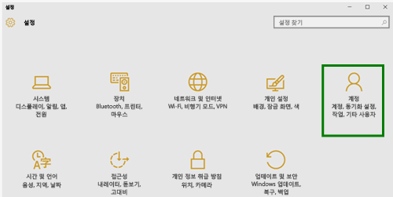
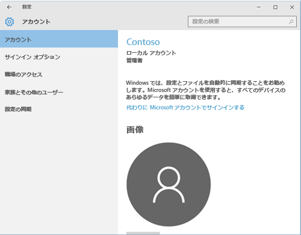
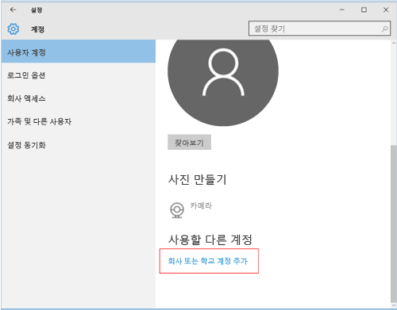
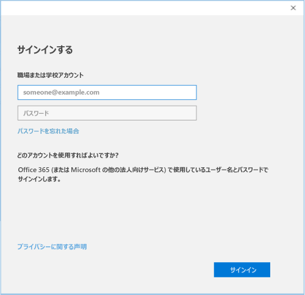

# Intune に Windows 10 Mobile または Windows 10 デスクトップ デバイスを登録する

職場または学校が Microsoft Intune を使用している場合は、お使いのデバイスを登録して、会社の電子メール、ファイル、またその他のリソースにアクセスできます。 デバイスを登録すると、組織は企業データをセキュリティで保護することができます。 登録の詳細については、「[ポータル サイト アプリをインストールし、Intune にデバイスを登録するとどうなるか](what-happens-if-you-install-the-company-portal-app-and-enroll-your-device-in-intune-windows.md)」と「[What your IT administrator can and can't see on your device](what-can-your-it-administrator-see-when-you-enroll-your-device-in-intune-windows.md)」 (IT 管理者がお客様のデバイスに関して確認できる情報と確認できない情報) を参照してください。

Windows 10 Mobile または Windows 10 デスクトップ デバイスを登録するには、次の手順を実行します。

1.  Windows の **[設定]** に移動し、**[アカウント]** をタップします。

    

2.  **[お使いのアカウント]** をタップします。

    

3.  **[職場または学校アカウントを追加]** をタップします。

    

4.  職場または学校の資格情報でサインインします。

    

上記の手順を実行しても、職場または学校の電子メールやファイルなどのデータにアクセスできない場合は、**[アカウント]** に戻り、**[職場のアクセス]** をタップします。

-   職場または学校のアカウントが表示された場合は、正常に 接続されています。

-   職場または学校のアカウントが表示されない場合は、**[接続]** をタップしてから、職場または学校の資格情報でサインインします。

さらに、ポータル サイト アプリをインストールすることもお勧めします。これにより、自分や自分の役割に関連する会社のアプリを簡単に識別して、取得できます。 会社での Intune の構成方法に応じて、ポータル サイト アプリが登録プロセスの一部としてインストールされていることもあります。 アプリがあるかどうかを確認するには、アプリ一覧で、**[ポータル サイト]** を検索します。 アプリの一覧で、[ポータル サイト] が表示されない場合は、次の手順に従ってインストールします。

1.  **[スタート]** &gt; **[ストア]** をタップします。

2.  **[検索]** をタップし、「**ポータル サイト**」と入力します。

3.  結果の一覧で、**[ポータル サイト]** &gt; **[インストール]** の順にタップします。

4.  **[インストール]** または **[無料]** をタップします。 表示されるオプションは、会社がどのようにアプリを構成したかによって異なります。

サポートが必要な場合は、 IT 管理者にお問い合わせください。 連絡先情報については、[ポータル サイト Web サイト](http://portal.manage.microsoft.com)をご確認ください。

### 関連項目
[Intune に Windows デバイスを登録する](enroll-your-device-in-intune-windows.md) 
[Windows デバイスを Intune で使用する](using-your-windows-device-with-intune.md)

<!--HONumber=Aug16_HO1-->

