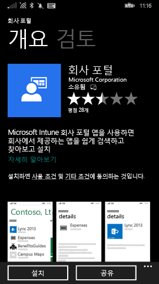
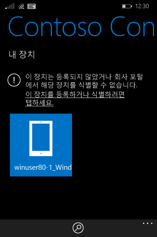
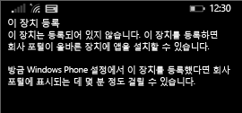

# Intune에서 Windows Phone 8.1 장치 등록

회사 또는 학교에서 Microsoft Intune을 사용하는 경우 장치를 등록하여 회사 전자 메일, 파일 및 기타 리소스에 액세스 권한을 얻을 수 있습니다. 장치를 등록하면 조직에서 회사 데이터 보안을 유지할 수 있습니다. 등록에 대해 자세히 알아보려면 [Intune에서 회사 포털 앱을 설치하고 장치를 등록하면 어떻게 되나요?](what-happens-if-you-install-the-company-portal-app-and-enroll-your-device-in-intune-windows.md) 및 [IT 관리자가 장치에서 할 수 있는 일과 할 수 없는 일](what-can-your-it-administrator-see-when-you-enroll-your-device-in-intune-windows.md)을 참조하세요.

Intune에 Phone 8.1 장치를 등록하려면 회사에 적용되는 지침을 따릅니다.

-   [회사에서 Windows 스토어의 회사 포털 사용을 허용하는 경우](#if-your-company-lets-you-use-the-company-portal-from-the-windows-store)

-   [Windows Phone에서 Windows 스토어에 액세스할 수 없거나 Microsoft 계정이 없는 경우](#if-you-are-not-allowed-to-access-the-windows-store-from-your-windows-phone-or-if-you-do-not-have-a-microsoft-account)

## 회사에서 Windows 스토어의 회사 포털 사용을 허용하는 경우
장치에 회사 포털 앱을 설치합니다.

1.  **시작** &gt; **스토어**를 탭합니다.

2.  **검색**을 탭하고 **회사 포털**을 입력합니다.

3.  결과 목록에서 **회사 포털**을 탭합니다.

    

4.  **회사 포털** &gt; **설치**를 탭합니다.

    

장치 등록:

1.  장치에서 **Microsoft Intune 회사 포털** 앱을 엽니다.

2.  자격 증명을 제공합니다. 해당하는 경우 회사의 계약조건을 수락하라는 요청받을 수 있습니다.

3.  **내 장치**를 살짝 밉니다.

4.  **이 장치를 등록하거나 식별하려면 탭하세요.**를 탭합니다.

    

5.  **이 장치 등록**을 탭합니다.

    

6.  **계정 추가**를 탭합니다.

    

7.  요청에 따라 추가 정보를 입력한 다음 **로그인**을 탭하여 등록을 완료합니다. 이제 **설정** &gt; **회사** 페이지에 나열된 회사 계정이 표시됩니다.

    

## Windows Phone에서 Windows 스토어에 액세스할 수 없거나 Microsoft 계정이 없는 경우

1.  **설정** &gt; **회사**를 탭합니다.

2.  **계정 추가**를 탭한 다음 회사 계정을 사용하여 로그인합니다.

3.  요청에 따라 추가 정보를 입력한 다음 **로그인**을 탭하여 등록을 완료합니다.

4.  회사 앱 또는 허브 설치를 묻는 메시지가 표시되면 관련 확인란을 선택했는지 확인한 다음 **완료**를 탭합니다.

IT 관리자가 등록 중에 회사 포털이 설치되도록 설정한 경우에는 앱 목록에 회사 포털이 표시됩니다.

여전히 도움이 필요하세요? IT 관리자에게 문의하세요. IT 관리자의 연락처 정보는 [회사 포털 웹 사이트](http://portal.manage.microsoft.com)를 참조하세요.

<!--HONumber=Nov16_HO1-->

