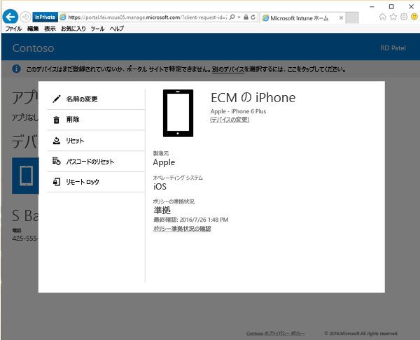

# ポータル サイト Web サイトからデバイスをリモートでロックする

デバイスを紛失した、またはデバイスが盗難にあった場合、[ポータル サイト Web サイト](http://portal.manage.microsoft.com)のリモート ロック オプションを使用してデバイスをロックすることができます。 リモート ロックは、次の種類のデバイスで機能します。

プラットフォーム  |サポートの詳細  
---------|---------
Android | サポート       
iOS | サポート
[Windows] 10 Mobile | 電話でパスコードが設定されている場合のみサポート     
[Windows] 10 Desktop | サポートされていません  
Windows Phone 8。1 | 電話でパスコードが設定されている場合のみサポート
Windows Phone 8。0 | サポートされていません
PC (Windows 8.0 以前) | サポートされていません       
PC (Windows 8.1) | サポートされていません

 
リモート ロックを使用してデバイスをロックするには:

1.  [ポータル サイト Web サイト](http://portal.manage.microsoft.com)で、ロックするデバイスの名前をタップします。

2.  **[リモート ロック]** をタップします。

    

3.  デバイスをロックしようとしていることを示す警告メッセージを確認した後、**[リモート ロック]** をタップすると、ポータル Web サイトがデバイスのロックを試みます。

    **[リモート ロック]** をタップすると、“リモート ロック保留中“ 状態が表示されます。  リモート ロックが成功した場合、状態が ”リモート ロック成功” に変わります。

    リモート ロックの状態は次の 3 つの場所に表示されます。

    * Web サイトの通知領域。
    * デバイスの [詳細] ページ。
    * ページの [デバイス] セクションのデバイス名を表示するタイル。

    ”リモート ロックに失敗しました” の通知が表示される場合は、数分待ってから、もう一度デバイスのロックを試みてください。 タップして再試行すると、状態が ”リモート ロック保留中” に戻ります。

    再試行できない場合は、IT 管理者に問い合わせてください。 デバイスが見つかった場合は、パスコードを入力するだけでリモート ロックしたデバイスのロックを解除できます。

サポートが必要な場合は、 IT 管理者にお問い合わせください。 連絡先情報については、[ポータル サイト Web サイト](http://portal.manage.microsoft.com)をご確認ください。

### 関連項目
[Intune ポータル サイト Web サイトの使用](using-the-intune-company-portal-website.md)

<!--HONumber=Jul16_HO4-->

