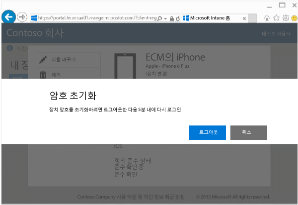
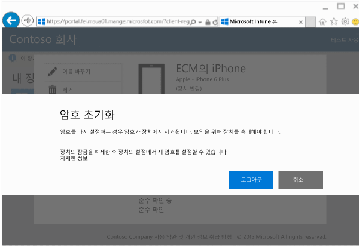

---
# required metadata

title: 회사 포털 웹 사이트에서 장치 암호 재설정 | Microsoft Intune
description:
keywords:
author: Staciebarker
manager: jeffgilb
ms.date: 04/28/2016
ms.topic: article
ms.prod:
ms.service: microsoft-intune
ms.technology:
ms.assetid: 4fa3255b-9d1e-42d5-bd8b-70963dcf2d86

# optional metadata

#ROBOTS:
#audience:
#ms.devlang:
ms.reviewer: jeffgilb
ms.suite: ems
#ms.tgt_pltfrm:
#ms.custom:

---

# 회사 포털 웹 사이트에서 장치 암호 재설정

Intune에서 등록한 장치의 장치 PIN 또는 암호를 분실할 경우 [회사 포털 웹 사이트](http://portal.manage.microsoft.com)를 사용하여 암호를 재설정할 수 있습니다. 회사 포털 웹 사이트는 Intune에 등록한 컴퓨터 및 장치를 관리하는 데 사용할 수 있는 웹 페이지로, 회사 포털 앱을 사용할 때 수행할 수 있는 동일한 작업을 대부분 수행할 수 있습니다.

> [!NOTE] 
> IT 관리자가 Intune을 구성한 방법에 따라 회사 포털 웹 사이트에 암호 재설정 단추가 표시되지 않을 수도 있습니다. Windows 8.1 및 Windows RT 장치에서는 암호 재설정이 지원되지 않습니다.

암호를 재설정하려면

1.  [회사 포털 웹 사이트](http://portal.manage.microsoft.com)를 열고 암호를 재설정하려는 장치를 탭합니다.

2.  **암호 재설정**을 탭합니다..

    

3.  **로그아웃**을 탭하고 회사 또는 학교 자격 증명을 사용하여 다시 로그인합니다. 5분 내에 다시 로그인해야 합니다.

    

4.  **암호 재설정**을 탭합니다..

    

    장치에서 암호 재설정이 작동하는 방식을 보려면 표를 확인하세요.

    |플랫폼|Support(Áö¿ø)|
    |------------|-----------|
    |Android|새로운 임시 영숫자 암호를 만듭니다.|
    |iOS|장치에서 암호를 제거하고 새로운 임시 암호를 만들지 않습니다. Touch ID를 사용하는 경우 암호를 재설정할 때 제거되기 때문에 장치에서 다시 설정해야 합니다.|
    |Windows 10(모바일 장치에만 해당)|새로운 임시 영숫자 암호를 만듭니다. Windows Hello는 지원되지 않습니다.|
    |Windows Phone 8.1|새로운 임시 숫자 암호를 만듭니다.|
    장치의 잠금을 해제한 후 장치의 **설정**으로 이동하여 새 암호를 설정할 수 있습니다.

5.  장치의 잠금을 해제한 후 장치의 **설정**으로 이동하여 새 암호를 설정하거나 임시 암호를 변경합니다.

    암호가 재설정되었는지 확인하는 알림을 보려면 회사 포털 웹 사이트의 오른쪽 맨 위에 있는 알림 플래그를 클릭합니다.

### 참고 항목
[Intune 회사 포털 웹 사이트 사용](using-the-intune-company-portal-website.md)

<!--HONumber=May16_HO1-->

