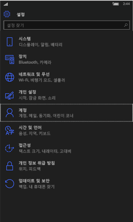
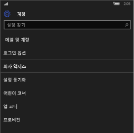
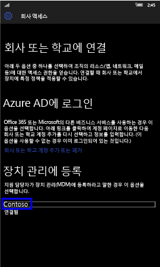
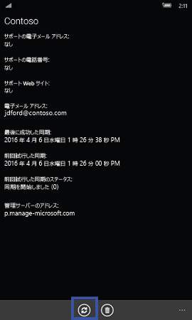
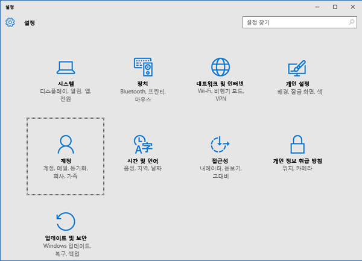
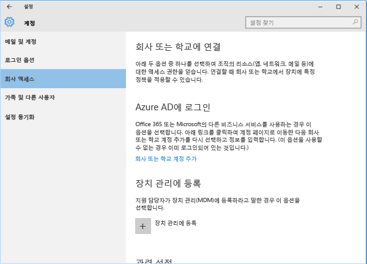
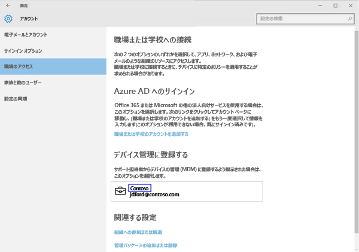
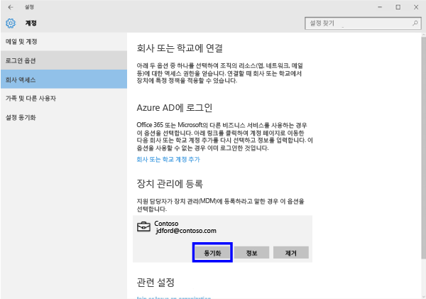
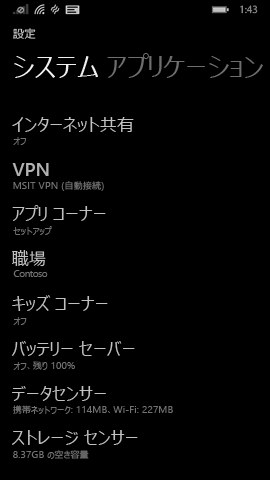
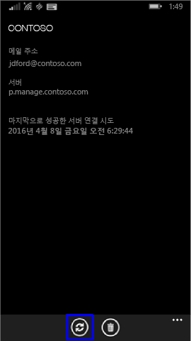

# デバイスを手動で同期する
アプリのインストールに時間がかかりすぎる場合は、次の手順に従って Windows デバイスを手動で同期すると、インストールの高速化に役立つことがあります。 一覧にあるバージョンのみがサポートされています。 お使いのデバイスの種類に対応する、上記「この記事の内容」セクションに示されているリンクを使用してください。

* [[Windows] 10 Mobile](#windows-10-mobile)
* [[Windows] 10 Desktop](#windows-10-desktop)
* [Windows Phone 8.1](#windows-phone-8-1)

## [Windows] 10 Mobile
アプリのインストールを高速化するために Windows 10 Mobile デバイスを手動で同期するには:

1. **[すべてのアプリ]** > **[設定]** > **[アカウント]** の順にタップします。

    
    
2. **[職場のアクセス]** をタップします。

    
    
3. **[デバイス管理に登録する]** で、次に示すように会社名をタップします。

    
    
4. **[同期]** アイコンをタップします。

    
    
    画面の上部に、"アカウントを同期中" というメッセージが表示されます。 同期が完了するまで、[同期] ボタンは灰色表示になります。

## Windows 10 Desktop
アプリのインストールを高速化するために Windows 10 Desktop デバイスを手動で同期するには:

1. 次に示す **[スタート]** ボタンをクリックし、**[設定]** をクリックします。

    
    
2. **[設定]** ページで、**[アカウント]** をクリックします。
 
    
    
3. **[アカウント]** ページで、**[職場のアクセス]** をクリックします。
    
    
    
4. **[デバイス管理に登録する]** セクションで、会社の名前をクリックします (次の図で青色の枠で示された部分)。
    
    
   
5. **[同期]** ボタンをクリックします。
    
    
   
   同期が完了するまで、このボタンは灰色表示になります。

## Windows Phone 8.1
アプリのインストールを高速化するために Windows Phone 8.1 デバイスを手動で同期するには:

1. **[すべてのアプリ]** > **[設定]** > **[会社アカウント]** の順にタップします。

    
    
2. 会社の名前をタップします (次の図で青色の枠で示された部分)。

    
   
3. **[同期]** アイコンをタップします。

    
    
   デバイスで同期が完了するまでの間、画面の上部に、"アカウントを同期中" というメッセージが表示されます。

サポートが必要な場合は、 IT 管理者にお問い合わせください。 連絡先情報については、[ポータル サイト Web サイト](http://portal.manage.microsoft.com)をご確認ください。

### 関連項目
[Windows デバイスを Intune で使用する](using-your-windows-device-with-intune.md)

<!--HONumber=Jun16_HO4-->

