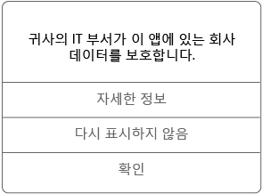

# iOS 장치에서 관리되는 앱 사용

관리되는 앱은 해당 앱에서 액세스할 수 있는 회사 데이터를 보호하기 위해 IT 관리자가 구성할 수 있는 앱입니다. iOS 장치의 관리되는 앱에서 회사 데이터에 액세스할 경우 앱이 예상과 약간 다르게 작동하는 것을 확인할 수 있습니다. 예를 들어 보호된 회사 데이터를 복사하고 붙여넣을 수 없거나, 해당 데이터를 특정 위치에 저장할 수 없습니다.

또한 여러 개의 관리되는 앱이 장치에서 함께 작동하여 회사 데이터를 보호된 상태로 유지하는 동시에 일상적인 작업을 허용할 수도 있습니다. 예를 들어 관리되는 앱에서 회사 파일을 열고 해당 파일을 보기 위해 다른 관리되는 앱이 필요한 경우 파일을 볼 수 있는 관리되는 앱이 자동으로 열립니다. 필수 앱을 사용할 수 없는 경우 문서 열기 또는 관리되는 문서 내에서 웹 링크 액세스와 같은 특정 작업을 사용하지 못할 수도 있습니다.

관리되는 앱에서 회사 데이터에 액세스하면 아래와 같은 메시지가 표시되어 여는 앱이 관리되고 있음을 알려줍니다.

### 관리되는 앱을 가져오려면 어떻게 하나요?
관리되는 앱을 가져오는 방법에는 몇 가지가 있습니다.

-   장치가 Microsoft Intune에 등록된 경우 회사 포털 앱 또는 회사 포털 웹 사이트에서 앱을 설치하거나, IT 관리자가 장치에 설치할 수 있습니다. 등록에 대해 알아보려면 [Intune에서 iOS 장치 등록](enroll-your-device-in-intune-ios.md) 또는 [Intune에서 Mac OS X 장치 등록](enroll-your-device-in-intune-mac-os-x.md)을 참조하세요.

-   앱 스토어에서 앱을 설치하고 Intune으로 관리되는 회사 사용자 계정을 사용하여 로그인합니다.

### IT 관리자가 앱에서 무엇을 관리할 수 있나요?
IT 관리자가 앱에서 관리할 수 있고, 장치에서 회사 데이터 조작에 영향을 줄 수 있는 옵션의 몇 가지 예는 다음과 같습니다.

-   특정 웹사이트에 대 한 액세스

-   응용 프로그램 간에 데이터를 전송

-   파일 저장

-   복사 및 붙여넣기 작업

-   PIN 액세스 요구 사항

-   회사 자격 증명을 사용하는 로그인

-   클라우드로 백업하는 기능

-   스크린샷을 만드는 기능

-   데이터 암호화 요구 사항

장치에서 관리되는 앱에 대한 자세한 내용은 IT 관리자에게 문의하세요. IT 관리자의 연락처 정보는 [회사 포털 웹 사이트](http://portal.manage.microsoft.com)를 참조하세요.

<!--HONumber=Aug16_HO5-->

