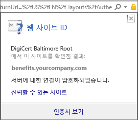
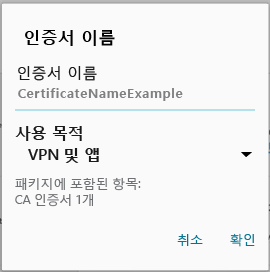

# デバイスに必要な証明書がない

## 通常は電話にインストールされている証明書がデバイスにない
Android デバイスが Intune に登録されておらず、電話に通常インストールされる証明書がない場合は、Android ポータル サイト アプリにサインインすることはできません。 サインインしようとすると、次のメッセージが表示されます。

この問題を解決し、必要な証明書を取得するには:

1.  ブラウザーで、この [Digicert 証明書ページ](https://www.digicert.com/digicert-root-certificates.htm)に移動します。

2.  Baltimore CyberTrust Root 証明書を検索してダウンロードします (https://www.digicert.com/CACerts/BaltimoreCyberTrustRoot.crt)。

3.  上から下へドラッグして、通知を開き、通知の一覧で **[BaltimoreCyberTrustRoot.crt]** をタップします。

4.  **[証明書の名前指定]** ダイアログで、既定の証明書名を受け入れます。

5. **[認証情報の使用]** が **[VPN とアプリ]** に設定されていることを確認し、**[OK]** をタップします。

    

6. Web ブラウザーと会社のポータル アプリを閉じます。

7. 会社のポータル アプリをもう一度開きます。 これで、会社のポータル アプリにサインインできるようになりました。 サポートが必要な場合は、IT 管理者に問い合わせてください。

## デバイスには、IT 管理者が必要とする証明書がありません
Android デバイスが Intune に登録されておらず、IT 管理者が必要とする特定の証明書がない場合は、Android ポータル サイト アプリにサインインすることはできません。 サインインしようとすると、次のメッセージが表示されます。

>[!NOTE]
> すでに「証明書が見つかりません」というメッセージが 1 つ表示され、[「通常は電話にインストールされている証明書がデバイスにない」](#your-device-is-missing-a-certificate-that-usually-comes-installed-on-your-phone)に記載の手順に従っている場合は問題ありません。 それはこのメッセージと証明書とは別のものです。そのため、欠落している証明書を取得するには、このセクションの手順に従ってください。

この問題を解決し、必要な証明書を取得するために、次の 2 つの主な手順を行う必要があります。

- 会社または学校の PC を確認し、欠落している証明書を特定します。
- デバイスを使用して、欠落している証明書をインターネットからダウンロードします。

### 欠落している証明書を会社または学校の PC で確認し、特定する

1. PC で、Internet Explorer を開きます。 この目的に使用する PC をお持ちでない場合は、IT 管理者に問い合わせてください。 IT 管理者の連絡先情報については、[ポータル サイト Web サイト](http://portal.manage.microsoft.com)をご確認ください。

2. [ポータル サイト Web サイト](http://portal.manage.microsoft.com)に移動して、職場や学校の資格情報を使用してサインインします。

3. ブラウザーのアドレス バーの右端で、下に示す南京錠のような記号をクリックします。 南京錠の記号が表示されない場合は作業を停止し、IT 管理者に問い合わせてください。 このロックは、安全にサインインされていることを意味するため、その記号が表示されるまで作業を続行しないでください。

    

4. **[View certificates]** (証明書の表示) をクリックします。

    

5. **[証明書]** ダイアログで **[Certification path]** (証明パス) タブをクリックして、インターネットから取得する必要がある証明書を特定します。 必要な証明書の名前は、上記の例のスクリーン ショットで強調表示されている場所と同じ位置にあります。

### Android モバイル デバイスで欠落している証明書をダウンロードしてインストールする

1. Bing や Google のような検索エンジンを使用して、前のセクションで特定した、欠落している証明書の名前を検索します。 証明書の「拡張子」は、それぞれ ".crt" または ".pem" などのように異なる可能性があります。

2. ルート証明書を Web サイトからダウンロードします。

3. 証明書をダウンロードした後、デバイスの上部から下にドラッグして通知を開き、通知の一覧にある証明書の名前をタップします。

4. 下に示された **[Name the Certificate]** (証明書の名前指定) ダイアログで、既定の証明書名を受け入れます。

5. **[認証情報の使用]** が **[VPN とアプリ]** に設定されていることを確認し、**[OK]** をタップします。

    

6. 会社のポータル アプリを閉じます。

7. 会社のポータル アプリをもう一度開きます。 これで、会社のポータル アプリにサインインできるようになりました。 サポートが必要な場合は、IT 管理者に問い合わせてください。

上に示されたのと同じ「証明書が見つかりません」というメッセージが表示され、かつ上述の手順を実行済みの場合は、インストールするために IT 管理者によるサポートが必要な証明書がまだある可能性が高いことを意味します。 IT 管理者に連絡し、問題の解決に役立つ手順が含まれるこの[リンク](/intune/troubleshoot/troubleshoot-device-enrollment-in-intune#android-certificate-issues)を渡してください。

### 関連項目
[Windows デバイスを Intune で使用する](using-your-windows-device-with-intune.md)

<!--HONumber=Jul16_HO4-->

