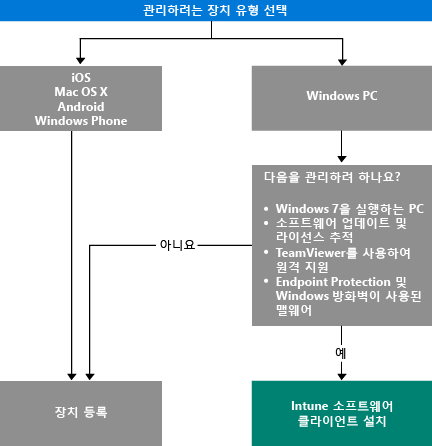

# 장치를 관리하는 방법 선택

앱 배포와 같이 Intune에서 제공하는 다양한 기능을 활용하고 장치 설정을 제어하려면 장치를 *관리*해야 합니다. 장치를 관리하는 방법은 사용하려는 Intune 기능에 따라 달라집니다.
이 항목에서는 요구 사항에 맞는 방법을 선택하는 데 도움이 되는 정보를 제공합니다.

iOS, Mac OS X, Android 또는 Windows Phone을 실행하는 장치를 관리하려면 해당 장치를 *등록*해야 합니다.

Windows PC를 관리하려는 경우 두 가지 옵션 중에서 선택할 수 있습니다.

1. 장치 등록 **또는**
2. *Intune 소프트웨어 클라이언트* 설치

## 사용할 방법 결정
이 의사 결정 흐름을 참조하여 장치를 관리 상태로 설정할 방법을 결정합니다.

기능을 최대한 많이 사용하려면 Windows PC를 등록합니다. 그러나 다음과 같은 경우에는 Intune 소프트웨어 클라이언트를 설치하는 것이 더 적합할 수도 있습니다.

- PC에서 Windows 7을 실행하는 경우
- Windows 소프트웨어 업데이트 및 라이선스 사용 현황을 관리하려는 경우
- Endpoint Protection 및 Windows 방화벽을 사용하여 맬웨어를 관리하려는 경우
- TeamViewer 소프트웨어를 통해 사용자에게 원격 지원을 제공하려는 경우

각 방법에서 제공되는 관리 기능의 자세한 목록은 [모바일 장치 관리 기능](mobile-device-management-capabilities-in-microsoft-intune.md) 및 [Intune PC 소프트웨어 클라이언트 기능](windows-pc-management-capabilities-in-microsoft-intune.md)을 참조하세요.
Intune에서 지원하는 장치와 PC에 대한 자세한 내용은 [지원되는 모바일 장치 및 컴퓨터](/intune/get-started/supported-mobile-devices-and-computers)를 참조하세요.

## Exchange ActiveSync 관리
장치를 등록하거나 Intune 소프트웨어 클라이언트를 설치하는 방법 외에 [Exchange ActiveSync를 사용](/intune/deploy-use/mobile-device-management-with-exchange-activesync-and-microsoft-intune)하여 장치를 관리할 수도 있습니다. 이 방법을 사용하려면 온-프레미스 커넥터를 설치하거나 기본 제공 서비스 간 커넥터를 사용하여 Exchange Server에 연결해야 합니다.
이 방법은 장치를 관리하는 세 번째 옵션이기는 하지만 다른 방법에 비해 제한적인 관리 기능 집합만을 제공합니다.

## 다음 단계

- [모바일 장치를 등록하는 방법 선택](/intune/get-started/choose-how-to-enroll-devices1)
- [Intune PC 클라이언트 소프트웨어를 사용하여 Windows PC 관리](/intune/deploy-use/manage-windows-pcs-with-microsoft-intune)

- [Microsoft Intune을 사용한 Exchange ActiveSync 모바일 장치 관리](/intune/deploy-use/mobile-device-management-with-exchange-activesync-and-microsoft-intune).

<!--HONumber=Aug16_HO5-->

